

  

## 
Universidad Peruana de Ciencias Aplicadas

Ingeniería de Software

Periodo 2610

1ASI0657 | Fundamentos de Arquitectura de Software - Virtual

<strong>Sección:</strong> 7940

<strong>Docente:</strong> Daniel Enrique Mori Yzaguirre

# 
Informe del Trabajo Final

<strong>Startup:</strong> GigU

<strong>Producto:</strong> GigU

### Integrantes

| Código     | Nombres y Apellidos            |
| ---------- | ------------------------------ |
| U202310222 | Oblitas Davila, Mariano Moises |
| U20201B298 | Ybañez Esquerre, Miguel Angel  |
| U202218531 | Mio Mejia, Andy Alejandro      |

<strong>Abril 2026</strong>

# Registro de versiones del informe

| Versión | Fecha      | Autores                                        | Descripción                                                                                                                                                                                                     |
| :------ | :--------- | :--------------------------------------------- | :-------------------------------------------------------------------------------------------------------------------------------------------------------------------------------------------------------------- |
| TB1     | 17/04/2026 | Mariano Oblitas, Miguel Ybañez, Andy Mio Mejia | Carátula, registro de versiones, tabla de contenidos actualizada, Student Outcome reiniciado, Capítulo I completo y estructura base de los capítulos II, III, IV, V, conclusiones, referencias, anexos y links. |

# Tabla de Contenidos

* [Capítulo I: Introducción](#capítulo-i-introducción)

  * [1.1. Startup Profile](#11-startup-profile)

    * [1.1.1. Descripción de la Startup](#111-descripción-de-la-startup)
    * [1.1.2. Perfiles de integrantes del equipo](#112-perfiles-de-integrantes-del-equipo)
  * [1.2. Solution Profile](#12-solution-profile)

    * [1.2.1. Nombre del producto](#121-nombre-del-producto)
    * [1.2.2. Antecedentes y problemática](#122-antecedentes-y-problemática)
    * [1.2.3. Lean UX Process](#123-lean-ux-process)

      * [1.2.3.1. Lean UX Problem Statement](#1231-lean-ux-problem-statement)
      * [1.2.3.2. Lean UX Assumptions](#1232-lean-ux-assumptions)
      * [1.2.3.3. Lean UX Hypothesis Statements](#1233-lean-ux-hypothesis-statements)
      * [1.2.3.4. Lean UX Canvas](#1234-lean-ux-canvas)
  * [1.3. Segmentos objetivo](#13-segmentos-objetivo)

* [Capítulo II: Requirements & Analysis](#capítulo-ii-requirements--analysis)

  * [2.1. Competidores](#21-competidores)

    * [2.1.1. Análisis competitivo](#211-análisis-competitivo)
    * [2.1.2. Estrategias y tácticas frente a competidores](#212-estrategias-y-tácticas-frente-a-competidores)
  * [2.2. Entrevistas](#22-entrevistas)

    * [2.2.1. Diseño de entrevistas](#221-diseño-de-entrevistas)
    * [2.2.2. Registro de entrevistas](#222-registro-de-entrevistas)
    * [2.2.3. Análisis de entrevistas](#223-análisis-de-entrevistas)
  * [2.3. Needfinding](#23-needfinding)

    * [2.3.1. User Personas](#231-user-personas)
    * [2.3.2. User Task Matrix](#232-user-task-matrix)
    * [2.3.3. Empathy Maps](#233-empathy-maps)
    * [2.3.4. As-Is Scenario Mapping](#234-as-is-scenario-mapping)

* [Capítulo III: Requirements Specification](#capítulo-iii-requirements-specification)

  * [3.1. To-Be Scenario Mapping](#31-to-be-scenario-mapping)
  * [3.2. User Stories](#32-user-stories)
  * [3.3. Impact Map](#33-impact-map)
  * [3.4. Product Backlog](#34-product-backlog)

* [Capítulo IV: Product Architecture Design](#capítulo-iv-product-architecture-design)

  * [4.1. Design Concepts, ViewPoints & ER Diagrams](#41-design-concepts-viewpoints--er-diagrams)
  * [4.2. Principles Statements](#42-principles-statements)
  * [4.3. Approaches Statements](#43-approaches-statements)
  * [4.4. Architectural Styles & Patterns](#44-architectural-styles--patterns)
  * [4.5. Context Diagram](#45-context-diagram)
  * [4.6. Approach Driven ViewPoints Diagrams](#46-approach-driven-viewpoints-diagrams)
  * [4.7. Relational/Non Relational Database Diagram](#47-relationalnon-relational-database-diagram)
  * [4.8. Design Patterns](#48-design-patterns)
  * [4.9. Tactics](#49-tactics)
  * [4.10. Architectural Drivers](#410-architectural-drivers)

    * [4.10.1. Design Purpose](#4101-design-purpose)
    * [4.10.2. Primary Functionality (Primary User Stories)](#4102-primary-functionality-primary-user-stories)
    * [4.10.3. Quality Attribute Scenarios](#4103-quality-attribute-scenarios)
    * [4.10.4. Constraints](#4104-constraints)
    * [4.10.5. Architectural Concerns](#4105-architectural-concerns)
  * [4.11. ADD Iterations](#411-add-iterations)

    * [4.11.1. Iteration 1](#4111-iteration-1)

      * [4.11.1.1. Architectural Design Backlog 1](#41111-architectural-design-backlog-1)
      * [4.11.1.2. Establish Iteration Goal by Selecting Drivers](#41112-establish-iteration-goal-by-selecting-drivers)
      * [4.11.1.3. Choose One or More Elements of the System to Refine](#41113-choose-one-or-more-elements-of-the-system-to-refine)
      * [4.11.1.4. Choose One or More Design Concepts That Satisfy the Selected Drivers](#41114-choose-one-or-more-design-concepts-that-satisfy-the-selected-drivers)
      * [4.11.1.5. Instantiate Architectural Elements, Allocate Responsibilities, and Define Interfaces](#41115-instantiate-architectural-elements-allocate-responsibilities-and-define-interfaces)
      * [4.11.1.6. Sketch Views (C4 & UML) and Record Design Decisions](#41116-sketch-views-c4--uml-and-record-design-decisions)
      * [4.11.1.7. Analysis of Current Design and Review Iteration Goal](#41117-analysis-of-current-design-and-review-iteration-goal)

* [Capítulo V: Product Implementation, Validation & Deployment](#capítulo-v-product-implementation-validation--deployment)

  * [5.1. Testing Suites & General Patterns](#51-testing-suites--general-patterns)

    * [5.1.1. Backend Application Core Testing Suite](#511-backend-application-core-testing-suite)
    * [5.1.2. Pattern Based Backend Application(s)](#512-pattern-based-backend-applications)
    * [5.1.3. Pattern Based Custom Software Library](#513-pattern-based-custom-software-library)
    * [5.1.4. Framework Pattern Driven Refactoring Report](#514-framework-pattern-driven-refactoring-report)
  * [5.2. Software Configuration Management](#52-software-configuration-management)

    * [5.2.1. Software Development Environment Configuration](#521-software-development-environment-configuration)
    * [5.2.2. Source Code Management](#522-source-code-management)
    * [5.2.3. Source Code Style Guide & Conventions](#523-source-code-style-guide--conventions)
    * [5.2.4. Software Deployment Configuration](#524-software-deployment-configuration)
  * [5.3. Microservices Implementation](#53-microservices-implementation)

    * [5.3.1. Sprint 1](#531-sprint-1)

      * [5.3.1.1. Sprint Backlog 1](#5311-sprint-backlog-1)
      * [5.3.1.2. Development Evidence for Sprint Review](#5312-development-evidence-for-sprint-review)
      * [5.3.1.3. Testing Suite Evidence for Sprint Review](#5313-testing-suite-evidence-for-sprint-review)
      * [5.3.1.4. Execution Evidence for Sprint Review](#5314-execution-evidence-for-sprint-review)
      * [5.3.1.5. Microservices Documentation Evidence for Sprint Review](#5315-microservices-documentation-evidence-for-sprint-review)
      * [5.3.1.6. Software Deployment Evidence for Sprint Review](#5316-software-deployment-evidence-for-sprint-review)
      * [5.3.1.7. Team Collaboration Insights during Sprint](#5317-team-collaboration-insights-during-sprint)
      * [5.3.1.8. Kanban Board](#5318-kanban-board)
    * [5.3.2. Sprint 2](#532-sprint-2)

      * [5.3.2.1. Sprint Backlog 2](#5321-sprint-backlog-2)
      * [5.3.2.2. Development Evidence for Sprint Review](#5322-development-evidence-for-sprint-review)
      * [5.3.2.3. Testing Suite Evidence for Sprint Review](#5323-testing-suite-evidence-for-sprint-review)
      * [5.3.2.4. Execution Evidence for Sprint Review](#5324-execution-evidence-for-sprint-review)
      * [5.3.2.5. Microservices Documentation Evidence for Sprint Review](#5325-microservices-documentation-evidence-for-sprint-review)
      * [5.3.2.6. Software Deployment Evidence for Sprint Review](#5326-software-deployment-evidence-for-sprint-review)
      * [5.3.2.7. Team Collaboration Insights during Sprint](#5327-team-collaboration-insights-during-sprint)
      * [5.3.2.8. Kanban Board](#5328-kanban-board)
    * [5.3.3. Sprint 3](#533-sprint-3)

      * [5.3.3.1. Sprint Backlog 3](#5331-sprint-backlog-3)
      * [5.3.3.2. Development Evidence for Sprint Review](#5332-development-evidence-for-sprint-review)
      * [5.3.3.3. Testing Suite Evidence for Sprint Review](#5333-testing-suite-evidence-for-sprint-review)
      * [5.3.3.4. Execution Evidence for Sprint Review](#5334-execution-evidence-for-sprint-review)
      * [5.3.3.5. Microservices Documentation Evidence for Sprint Review](#5335-microservices-documentation-evidence-for-sprint-review)
      * [5.3.3.6. Software Deployment Evidence for Sprint Review](#5336-software-deployment-evidence-for-sprint-review)
      * [5.3.3.7. Team Collaboration Insights during Sprint](#5337-team-collaboration-insights-during-sprint)
      * [5.3.3.8. Kanban Board](#5338-kanban-board)
    * [5.3.4. Sprint 4](#534-sprint-4)

      * [5.3.4.1. Sprint Backlog 4](#5341-sprint-backlog-4)
      * [5.3.4.2. Development Evidence for Sprint Review](#5342-development-evidence-for-sprint-review)
      * [5.3.4.3. Testing Suite Evidence for Sprint Review](#5343-testing-suite-evidence-for-sprint-review)
      * [5.3.4.4. Execution Evidence for Sprint Review](#5344-execution-evidence-for-sprint-review)
      * [5.3.4.5. Microservices Documentation Evidence for Sprint Review](#5345-microservices-documentation-evidence-for-sprint-review)
      * [5.3.4.6. Software Deployment Evidence for Sprint Review](#5346-software-deployment-evidence-for-sprint-review)
      * [5.3.4.7. Team Collaboration Insights during Sprint](#5347-team-collaboration-insights-during-sprint)
      * [5.3.4.8. Kanban Board](#5348-kanban-board)
  * [5.4. Microservices Deployment](#54-microservices-deployment)

    * [5.4.1. Cloud Architecture Diagram](#541-cloud-architecture-diagram)
    * [5.4.2. Cloud Architecture Deployment](#542-cloud-architecture-deployment)

* [Conclusiones y recomendaciones](#conclusiones-y-recomendaciones)

* [Video About-The-Team](#video-about-the-team)

* [Referencias bibliográficas](#referencias-bibliográficas)

* [Anexos](#anexos)

* [Links](#links)

# Student Outcome

ABET – EAC - Student Outcome 7: Aprendizaje Continuo y Autónomo.

**Criterio:** La capacidad de adquirir y aplicar nuevos conocimientos según sea necesario, utilizando estrategias de aprendizaje apropiadas.

| Criterio específico                                                                                                                         | Acciones realizadas                                                                                                                                                                                                                                                                                                                                                                                                                                                                                                                                                                                                                                                                                                                                                                                                                | Conclusiones                                                                                                                                                                                                                                                                                                                                           |
| ------------------------------------------------------------------------------------------------------------------------------------------- | ---------------------------------------------------------------------------------------------------------------------------------------------------------------------------------------------------------------------------------------------------------------------------------------------------------------------------------------------------------------------------------------------------------------------------------------------------------------------------------------------------------------------------------------------------------------------------------------------------------------------------------------------------------------------------------------------------------------------------------------------------------------------------------------------------------------------------------- | ------------------------------------------------------------------------------------------------------------------------------------------------------------------------------------------------------------------------------------------------------------------------------------------------------------------------------------------------------ |
| **Actualiza conceptos y conocimientos necesarios para su desarrollo profesional y en especial para su proyecto en soluciones de software.** | **Oblitas Davila, Mariano Moises** **TB1:** Elaboré la carátula del informe y desarrollé el Capítulo I, adaptando la estructura previa del proyecto GigU al nuevo curso de Fundamentos de Arquitectura de Software y reorganizando la información inicial de la startup, la solución y los segmentos objetivo.  **Ybañez Esquerre, Miguel Angel** **TB1:** Desarrollé la estructura base del Capítulo II, alineando los apartados de Competidores, Entrevistas y Needfinding con la guía del nuevo curso para preparar la siguiente fase de análisis del producto.  **Mio Mejia, Andy Alejandro** **TB1:** Desarrollé la estructura base del Capítulo III, organizando las secciones de To-Be Scenario Mapping, User Stories, Impact Map y Product Backlog conforme a los requerimientos del curso.                    | En esta primera entrega, el equipo actualizó la estructura del proyecto para alinearlo con el enfoque de arquitectura de software del nuevo curso. Se reorganizó el informe según la guía oficial y se establecieron bases claras para continuar el desarrollo de los capítulos de análisis, especificación y arquitectura en las siguientes entregas. |
| **Reconoce la necesidad del aprendizaje permanente para el desempeño profesional y el desarrollo de proyectos en soluciones de software.**  | **Oblitas Davila, Mariano Moises** **TB1:** Reconocí la necesidad de revisar y adaptar el trabajo previo a una nueva estructura académica orientada a arquitectura, lo que implicó reforzar conceptos de formulación del problema, Lean UX y organización formal de entregables.  **Ybañez Esquerre, Miguel Angel** **TB1:** Identifiqué la importancia de seguir aprendiendo sobre técnicas de análisis de competidores, entrevistas y needfinding para sustentar correctamente la fase de levantamiento y análisis de requisitos del proyecto.  **Mio Mejia, Andy Alejandro** **TB1:** Reconocí la necesidad de profundizar en la especificación de requisitos, especialmente en la construcción de artefactos como User Stories, Impact Map y Product Backlog, para adaptar el proyecto a las exigencias del curso. | El equipo evidenció desde la primera entrega que continuar el mismo producto en un nuevo curso exige aprendizaje permanente, reorganización técnica y comprensión de nuevos enfoques de arquitectura. Esta adaptación permitió establecer una base más sólida para el desarrollo progresivo del trabajo final.                                         |

# Capítulo I: Introducción

## 1.1. Startup Profile

### 1.1.1. Descripción de la Startup

Somos GigU, un equipo de estudiantes de la Universidad Peruana de Ciencias Aplicadas comprometidos con la innovación tecnológica y la creación de oportunidades para nuestra comunidad universitaria.

Nuestra misión es ofrecer una plataforma que permita a los estudiantes universitarios ofrecer sus habilidades y conocimientos a través de servicios freelance, generando ingresos adicionales mientras desarrollan experiencia profesional en su campo.

Nuestra visión es convertirnos en la principal plataforma de trabajo freelance para estudiantes en Perú y Latinoamérica, facilitando la conexión entre talento joven y clientes que buscan soluciones creativas y eficientes en múltiples áreas como desarrollo de software, diseño, tutorías, gestión empresarial, entre otros.

Nuestro producto principal es GigU, una plataforma que conecta a estudiantes con clientes interesados en servicios freelance. Los freelancers pueden publicar sus servicios, definir tarifas y cotizar precios de manera inteligente con base en factores como el tiempo estimado de trabajo, la complejidad del servicio y las tarifas del mercado. La plataforma también proporciona comunicación con clientes y procesamiento seguro de pagos.

GigU no solo ayuda a los estudiantes a generar ingresos mientras estudian, sino que también les permite desarrollar habilidades clave como la gestión del tiempo, la negociación, la resolución de problemas y el trato con clientes reales, preparándose así para la vida profesional.

Además, con GigU, los estudiantes tienen una forma flexible, accesible y efectiva de adquirir experiencia laboral y construir una red de clientes y contactos profesionales desde el inicio de su carrera.

### 1.1.2. Perfiles de integrantes del equipo

| Nombre                             | Detalle                                                                                                                                                                                                                                                                                                                                                       |
| Nombre: Ybañez Esquerre, Miguel Angel |  |
| :------------------------------------------------------------------------------------------------------------------------------------------------------------------------------------------- | :---------------------------- |
| **Código:** U20201B298|                               |
| **Carrera:** Ingeniería de Software    |                               |
| **Habilidades:** Miguel Ángel Ybañez Esquerre – Estudiante de 23 años de Ingeniería de Software en la UPC. Me caracterizo por mi creatividad, capacidad analítica y enfoque práctico para resolver problemas. Apasionado por el desarrollo web y los agentes de inteligencia artificial, con experiencia en desarrollo de videojuegos en Unity y realidad virtual con Meta Quest. Siempre en búsqueda de explorar nuevas tecnologías y llevar las ideas a soluciones reales. |                               |

| Nombre: Oblitas Davila, Mariano Moises |  |
| :------------------------------------------------------------------------------------------------------------------------------------------------------------------------------------------- | :---------------------------- |
| **Código:** U202310222  |                               |
| **Carrera:** Ingeniería de Software |                               |
| **Habilidades:** Estudiante de 20 años de Ingeniería de Software en la UPC. Me caracterizo por mi creatividad, eficacia y capacidad para resolver problemas de manera racional. Apasionado por la programación y el desarrollo de software, busco constantemente innovar y aprender nuevas tecnologías. |          |

| Nombre: Mio Mejia, Andy Alejandro |  |
| :------------------------------------------------------------------------------------------------------------------------------------------------------------------------------------------- | :---------------------------- |
| **Código:** U202218531  |                               |
| **Carrera:** Ingeniería de Software |                               |
| **Habilidades:** Soy estudiante de 7mo ciclo de Ingeniería de Software con sólidos fundamentos en programación, desarrollo web y análisis de datos. Apasionado por la Inteligencia Artificial, desarrollo Web Robusto, sistemas inteligentes y soluciones tecnológicas escalables. Poseo capacidad para aprender rápidamente y trabajar en entornos ágiles (Scrum). Me gustaría aplicar mis conocimientos técnicos en Python (avanzado), C++ y frameworks modernos para contribuir al desarrollo de software robusto y de alta usabilidad. |          |

## 1.2. Solution Profile

### 1.2.1. Nombre del producto

GigU

### 1.2.2. Antecedentes y problemática

##### **¿Cuál es el problema?**

Muchos estudiantes universitarios enfrentan serias dificultades para generar ingresos y adquirir experiencia profesional mientras cursan sus estudios. Esta carencia de oportunidades laborales adecuadas no solo limita su independencia económica, sino también el desarrollo temprano de habilidades prácticas y su inserción competitiva en el mercado laboral. Según datos del Ministerio de Educación del Perú, una parte importante de los estudiantes universitarios combina estudios y trabajo de manera simultánea, reflejando que la necesidad de generar ingresos aparece incluso antes del egreso. Sin embargo, a pesar de contar con talentos y conocimientos valiosos, la mayoría no dispone de una plataforma accesible, segura y adaptada que les permita ofrecer sus servicios de forma organizada y profesional, especialmente bajo la modalidad freelance.

##### **¿Cuándo ocurre el problema?**

El problema se presenta a lo largo de toda la etapa universitaria, con mayor énfasis a partir del segundo o tercer año de carrera, cuando los estudiantes ya han adquirido capacidades técnicas, académicas o creativas que podrían ser aplicadas en el ámbito laboral. La necesidad de generar ingresos se intensifica en periodos críticos como matrículas, proyectos finales o gastos personales, momentos en los que la presión financiera se convierte en un factor determinante para su permanencia y rendimiento académico.

##### **¿Dónde ocurre el problema?**

Esta problemática es evidente en el contexto universitario peruano y latinoamericano, especialmente en instituciones donde las políticas de empleabilidad son limitadas o inexistentes, y donde los programas de prácticas preprofesionales o los vínculos con el mercado freelance son insuficientes o inaccesibles. Asimismo, en el entorno digital persiste la falta de una plataforma centralizada y especializada que facilite a los estudiantes la oferta de servicios freelance de manera organizada, validada y segura.

##### **¿A quién afecta el problema?**

El problema impacta directamente a estudiantes universitarios que buscan generar ingresos, adquirir experiencia laboral temprana y construir un portafolio real antes de egresar. Esta situación también afecta a microempresas, emprendedores y particulares que requieren servicios profesionales accesibles, confiables y de calidad, y que a menudo no logran encontrar talento joven disponible y verificado en su entorno inmediato.

##### **¿Por qué sucede el problema?**

El problema radica en la falta de plataformas diseñadas específicamente para conectar estudiantes con clientes potenciales, considerando sus limitaciones de tiempo, experiencia y recursos. Las plataformas freelance tradicionales imponen barreras de entrada significativas, como comisiones elevadas, competencia global desproporcionada y escasa validación académica de perfiles, lo que desalienta la participación de estudiantes y perpetúa su informalidad laboral.

##### **¿Cómo sucede el problema?**

En ausencia de alternativas formales y especializadas, los estudiantes optan por ofrecer sus servicios a través de redes sociales, contactos personales o plataformas genéricas que no garantizan seguridad, visibilidad ni condiciones laborales justas. Esta informalidad expone a los estudiantes a malas prácticas, incumplimientos de pago, sobreexplotación de tiempo y escaso reconocimiento de sus capacidades, lo que frecuentemente deriva en frustración, desmotivación y experiencias laborales negativas.

##### **¿Cuán grande es el impacto de este problema?**

El impacto es considerable tanto en el plano individual como en el social. En el Perú, una alta proporción de jóvenes trabaja en condiciones de informalidad, lo que evidencia una fuerte precarización del empleo juvenil y una limitada protección social. Además, la tasa de desempleo juvenil supera al promedio nacional, posicionando a este grupo como uno de los más vulnerables del mercado laboral. Esta realidad afecta directamente su desarrollo personal y profesional, retrasa su independencia económica y limita su proyección laboral futura.

### 1.2.3. Lean UX Process

#### 1.2.3.1. Lean UX Problem Statement

En el contexto universitario peruano, los estudiantes enfrentan grandes desafíos para insertarse en el mercado laboral mientras cursan sus estudios. La mayoría se enfrenta a condiciones de informalidad o desempleo, lo cual limita su desarrollo profesional desde una etapa temprana.

Hemos observado que no existen plataformas efectivas y especializadas que conecten directamente a estudiantes universitarios con oportunidades laborales formales, flexibles y alineadas a sus carreras, lo cual perpetúa la falta de experiencia profesional al egresar.

¿Cómo podemos ayudar a los estudiantes universitarios en el Perú a insertarse en el mercado laboral de forma formal, flexible y segura durante su etapa académica, permitiéndoles desarrollar habilidades prácticas, generar ingresos y mejorar su empleabilidad desde los primeros ciclos?

#### 1.2.3.2. Lean UX Assumptions

**¿Quién es el usuario?**
Estudiantes universitarios peruanos, principalmente entre los 17 y 24 años, que buscan generar ingresos y experiencia profesional compatible con sus horarios académicos.

**¿Dónde encaja nuestro producto en su vida?**
GigU se integra como una herramienta esencial para complementar su formación académica con experiencia laboral real, generar ingresos y conectarse con profesionales, clientes o mentores, sin sacrificar su rendimiento académico.

**¿Qué problemas tiene nuestro producto y cómo se pueden resolver?**

* Posible desconfianza hacia la formalidad de las oportunidades.
  Solución: verificación de empleadores o clientes y contratos inteligentes.

* Dificultad para encontrar tareas relacionadas a su carrera.
  Solución: sistema de categorización inteligente por carreras y habilidades.

* Baja retención o uso esporádico.
  Solución: gamificación, badges y recompensas por participación activa.

**¿Cómo y cuándo es usado nuestro producto?**
El producto es usado principalmente durante los tiempos libres o entre clases. Los estudiantes lo utilizan para buscar encargos, postular a proyectos freelance, recibir feedback y conectarse con mentores o empresas pequeñas que necesitan apoyo técnico o creativo.

**¿Qué características son importantes?**

* Perfiles profesionales con historial académico y de proyectos.
* Oportunidades freelance o part time verificadas.
* Inteligencia artificial para emparejar tareas con habilidades.
* Retroalimentación entre estudiantes y clientes.
* Panel de seguimiento de experiencia acumulada.
* Integración con LinkedIn y portafolios.
* Sistema de reputación y badges.
* Chat seguro entre clientes y postulantes.
* Acceso a microcursos gratuitos recomendados según proyectos.

**¿Cómo debe verse nuestro producto y cómo comportarse?**
Debe tener un diseño moderno, amigable y responsivo. Su comportamiento debe ser fluido, con tiempos de carga bajos y navegación clara. La experiencia de usuario debe motivar la interacción constante, con notificaciones relevantes y recomendaciones que generen valor real para el usuario.

#### 1.2.3.3. Lean UX Hypothesis Statements

* Creemos que al conectar estudiantes universitarios con oportunidades laborales compatibles con sus carreras y horarios, lograremos que desarrollen experiencia profesional antes de egresar.
  Sabremos que hemos tenido éxito cuando más del 50% de los usuarios activos complete al menos una tarea remunerada en su primer mes.

* Creemos que implementar un sistema de reputación y gamificación aumentará la participación y compromiso con la plataforma.
  Sabremos que hemos tenido éxito cuando el tiempo promedio de uso semanal supere los 45 minutos por usuario activo.

* Creemos que ofrecer oportunidades relacionadas a sus habilidades y carrera aumentará su satisfacción y fidelización.
  Sabremos que hemos tenido éxito cuando al menos el 70% de los usuarios califique la relevancia de las recomendaciones como alta o muy alta.

#### 1.2.3.4. Lean UX Canvas

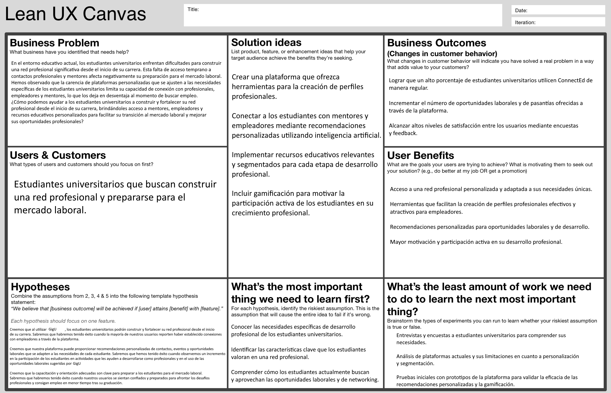

## 1.3. Segmentos objetivo

#### **Estudiantes Universitarios Freelancers**

Estudiantes de cualquier ciclo universitario que buscan ofrecer sus servicios de manera independiente para adquirir experiencia laboral, generar ingresos y construir una red de clientes. Estos estudiantes pueden pertenecer a diversas especialidades como diseño gráfico, programación, marketing digital, redacción, tutorías académicas, entre otros.

**Características:**

* Buscan oportunidades de trabajo flexible que les permitan combinar sus estudios con el trabajo freelance.
* Necesitan herramientas que los ayuden a promocionar sus habilidades y construir una cartera de clientes.
* Valoran la facilidad de pago y la seguridad en la gestión de contratos.

#### **Personas y Emprendimientos que buscan contratar servicios freelance**

Individuos o empresas que requieren servicios especializados sin la necesidad de contratar empleados a tiempo completo. Esto incluye emprendedores, startups, pequeñas empresas y particulares que buscan soluciones rápidas y accesibles para sus proyectos.

**Características:**

* Buscan talento accesible y de calidad para tareas específicas.
* Prefieren plataformas que garanticen la seguridad en la contratación y el cumplimiento del trabajo.
* Valoran las recomendaciones y validaciones de otros clientes para elegir freelancers confiables.

# Capítulo II: Requirements & Analysis

## 2.1. Competidores

En el mercado freelance existen múltiples plataformas consolidadas, pero ninguna está 100% orientada al talento universitario. Por ello, los competidores identificados para GigU son plataformas freelance generalistas que, aunque comparten funcionalidades similares, no cubren a profundidad las necesidades específicas de los estudiantes universitarios que buscan dar sus primeros pasos profesionales.

### 2.1.1. Análisis competitivo

A continuación se presenta el análisis competitivo comparando a GigU con las principales alternativas del mercado freelance. Se evalúan dimensiones como perfil estratégico, segmento objetivo, propuesta de valor, canales, relaciones con el cliente y ventajas competitivas.

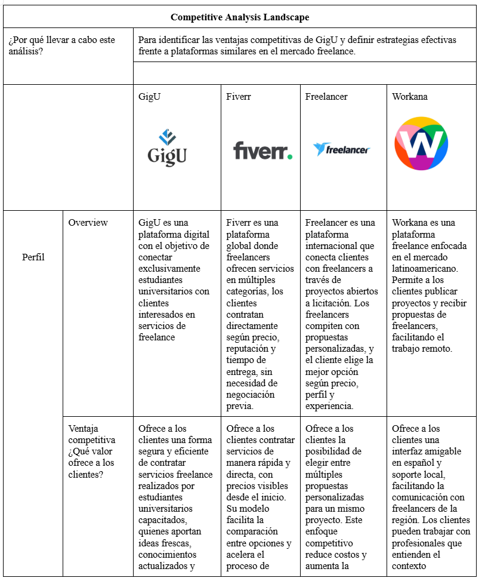
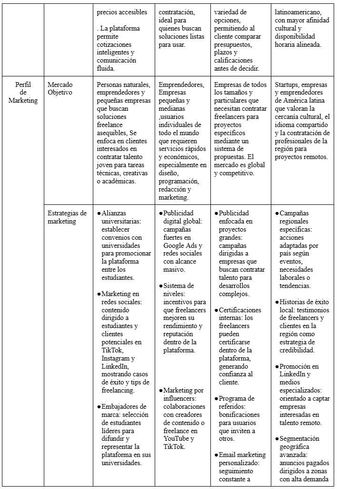
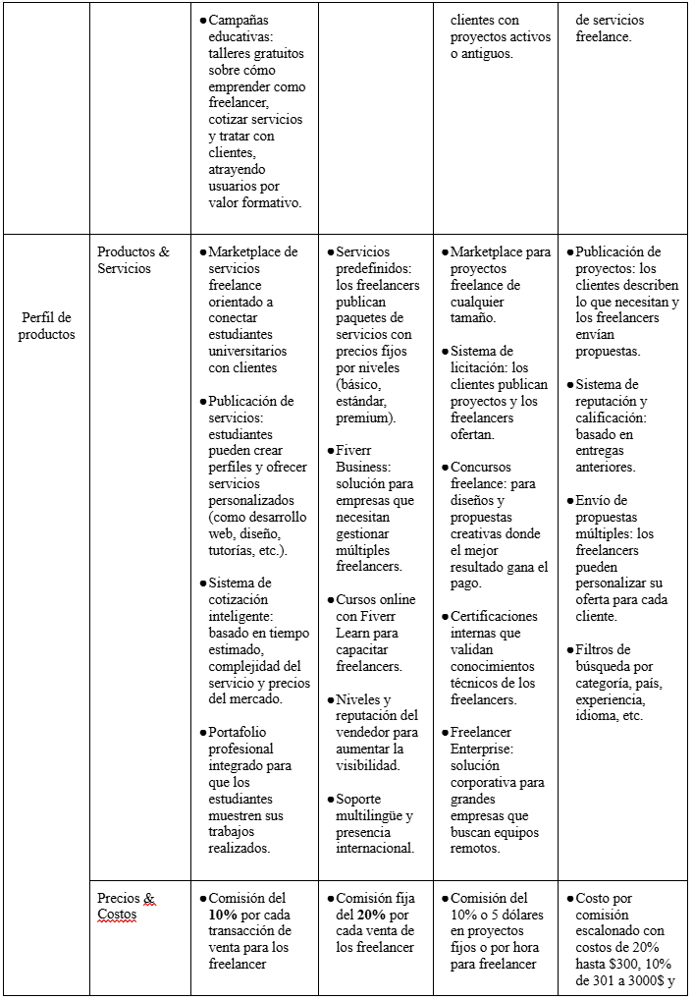
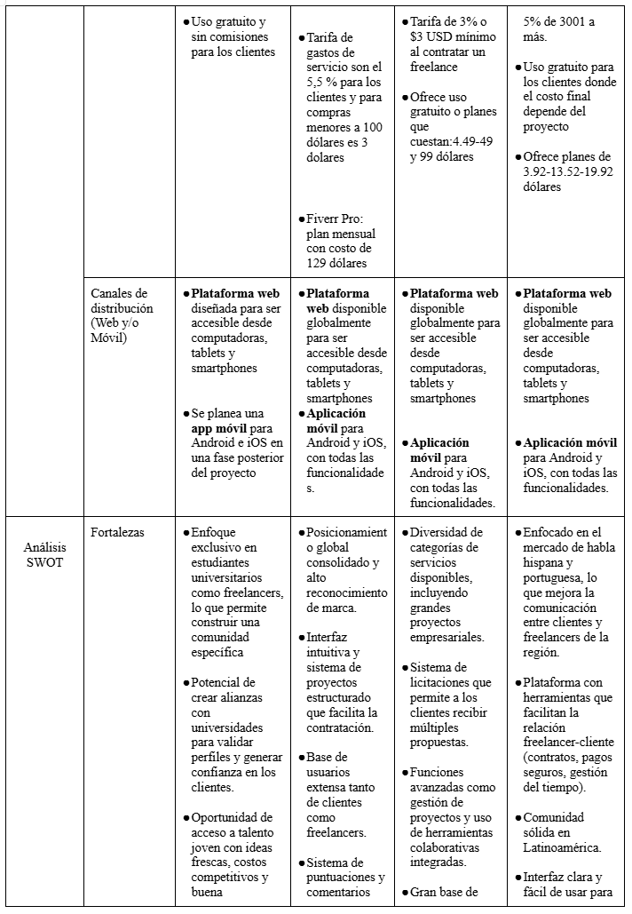
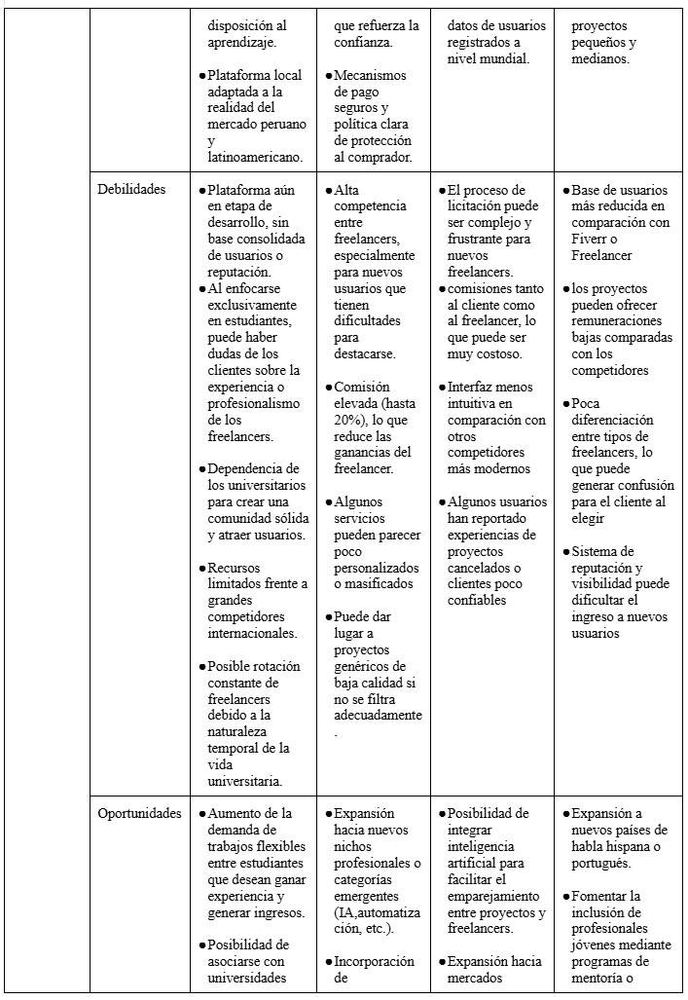
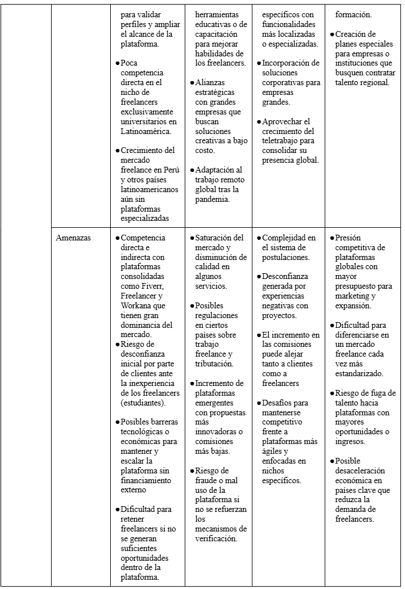

### 2.1.2. Estrategias y tácticas frente a competidores

GigU adopta una estrategia de **diferenciación centrada en el talento universitario**, apoyándose en un enfoque educativo, precios accesibles y alianzas con instituciones académicas. A diferencia de los grandes actores del mercado freelance global, nuestra plataforma se posiciona como una alternativa confiable y de propósito social que conecta clientes con estudiantes verificados académicamente.

Las tácticas principales son:

* **Verificación académica:** Validar que los freelancers sean estudiantes activos para transmitir confianza al cliente.
* **Soporte regional y en español:** Aprovechar la debilidad de plataformas globales con soporte limitado o genérico.
* **Personalización:** Recomendaciones de proyectos basadas en carrera, habilidades y disponibilidad del estudiante.
* **Garantías y filtros de calidad:** Mitigar la percepción de “poca experiencia” con reseñas reales, portafolios y calificaciones.
* **Pagos seguros y automatizados:** Reducir la fricción e inseguridad de métodos informales (Yape, transferencias directas).

En conjunto, la estrategia busca capitalizar las debilidades de los competidores (poca personalización, fuerte competencia global, comisiones elevadas) y convertirlas en ventajas competitivas para GigU.

## 2.2. Entrevistas

### 2.2.1. Diseño de entrevistas

Para el proceso de *needfinding* se diseñaron dos guías de entrevista, una por cada segmento objetivo. El objetivo fue identificar motivaciones, dificultades actuales, comportamientos de búsqueda de trabajo/contratación y requisitos ideales de una plataforma freelance universitaria.

**Segmento objetivo 1: Estudiantes Universitarios Freelancers**

* ¿Cuál es tu nombre completo?
* ¿Cuál es tu edad?
* ¿Dónde vives?
* ¿Has ofrecido tus servicios como freelancer alguna vez? ¿En qué área?
* ¿Qué te motivó a ofrecer tus servicios de manera independiente?
* ¿Dónde sueles buscar oportunidades freelance (redes, plataformas, conocidos, etc.)?
* ¿Qué dificultades has encontrado al intentar conseguir clientes como estudiante?
* ¿Qué características debería tener una plataforma ideal para ayudarte a encontrar clientes?
* ¿Qué métodos usas actualmente para cobrar tus servicios? ¿Has tenido problemas con eso?
* ¿Cuánto tiempo a la semana podrías dedicarle a trabajos freelance?
* ¿Crees que sería útil tener una app que te sugiera proyectos freelance según tu perfil y habilidades?
* ¿Qué tan importante es para ti tener una forma segura y automática de cobrar por tu trabajo freelance?

**Segmento objetivo 2: Personas y Emprendimientos que buscan contratar servicios freelance**

* ¿Cuál es tu nombre completo?
* ¿Cuál es tu edad?
* ¿Dónde vives?
* ¿Alguna vez has contratado a un freelancer para un proyecto? ¿Cómo fue tu experiencia?
* ¿Qué tipo de tareas sueles tercerizar o te gustaría tercerizar?
* ¿Qué canales usas actualmente para encontrar freelancers (plataformas, conocidos, redes)?
* ¿Qué te haría confiar en un estudiante universitario como freelancer?
* ¿Qué tan importante es para ti poder ver recomendaciones o validaciones de otros clientes?
* ¿Te gustaría una plataforma que se encargue de gestionar los pagos y acuerdos con el freelancer, o prefieres hacerlo tú directamente con la persona?
* ¿Qué haría que descartes a un freelancer incluso si su precio es atractivo?
* ¿Qué funcionalidades te gustaría ver en una plataforma para contratar freelancers?
* ¿Qué tan importante es para ti poder negociar el precio antes de contratar un servicio freelance? ¿Preferirías un precio fijo o la opción de llegar a un acuerdo con el freelancer?
* ¿Qué factores tomas en cuenta al elegir a un freelancer: precio, portafolio, tiempo de entrega, reputación, otro? ¿Cuál de ellos pesa más para ti al decidir?

### 2.2.2. Registro de entrevistas

**Segmento objetivo #1: Estudiantes Universitarios Freelancers**

**Entrevistado N°1: Bruno Sebastián Gamarra Torres**

* Sexo: Masculino
* Edad: 23
* Ubicación: Surco
* Instante de inicio: 0:03 min · Duración: 3:44

**Resumen:** Bruno ofrece servicios de diseño gráfico y edición de video desde hace algunos meses, motivado por la necesidad económica y por ganar experiencia. Consigue clientes sobre todo vía Instagram y TikTok, pero lidia con la desconfianza hacia estudiantes. Cobra por Yape, Plin y transferencias, y a veces sufre retrasos. Una plataforma ideal, según él, debería permitir reseñas reales, chat integrado y contratos.

**Entrevistado N°2: Werner Lang**

* Sexo: Masculino
* Edad: 20
* Ubicación: San Isidro
* Instante de inicio: 3:45 min · Duración: 9:57 min

**Resumen:** Werner trabaja en diseño gráfico y desarrollo web como freelancer para aplicar lo aprendido y ganar experiencia antes de egresar. Consigue clientes por conocidos, redes sociales y Workana, pero siente que no lo toman en serio por ser estudiante; además carece de un portafolio sólido. Cobra por Yape o transferencia, con demoras ocasionales. Dedica 8–12 horas semanales. Considera que una plataforma ideal debe facilitar mostrar habilidades, cotizar, asegurar pagos y permitir comunicación fluida, además de sugerirle proyectos alineados a su perfil.

**Entrevistado N°3: Mario André Cacho Seminario**

* Sexo: Masculino
* Edad: 21
* Ubicación: Surco
* Link: [YouTube](https://youtu.be/hSg2bZ3Jgbc) · Instante de inicio: 0:10 · Duración: 3:26

**Resumen:** Mario crea videos de marketing para pequeñas empresas. Le motiva ampliar su perspectiva profesional, pero le resulta difícil conseguir clientes porque priorizan la experiencia. Consigue oportunidades por redes sociales y contactos cercanos, y cobra por transferencia bancaria. Dedica 6–8 horas semanales. Valora que una plataforma muestre a perfiles de todos los niveles, sugiera proyectos por habilidades, exhiba un historial de trabajos y cuente con un sistema de cobros seguro.

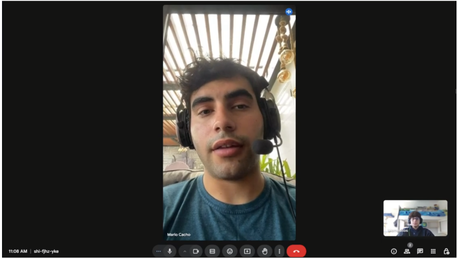

**Segmento objetivo #2: Personas y Emprendimientos que buscan contratar servicios freelance**

**Entrevistada N°1: Yulia Estephania Martinez Martinez**

* Sexo: Femenino
* Edad: 19
* Ubicación: Surco
* Link: [YouTube](https://youtu.be/MFs44DHr8_Q) · Instante de inicio: 0:01 · Duración: 5:46

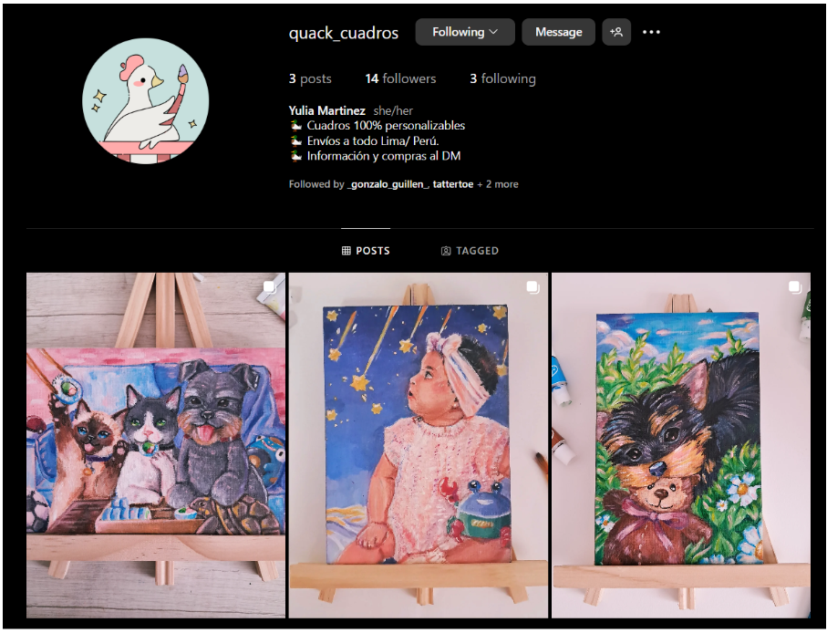

**Resumen:** Yulia tiene un emprendimiento de cuadros personalizados (*Quack_cuadros*). Aún no ha contratado freelancers pero está interesada en tercerizar marketing digital (reels) y diseño web. Actualmente busca talento por Instagram y contactos, lo cual considera poco confiable.

* **Criterios para confiar:** portafolio visual para trabajos creativos; CV para otros; valora recomendaciones y validaciones.
* **Pagos:** prefiere que la plataforma gestione pagos y acuerdos.
* **Motivos de descarte:** mala calidad, falta de responsabilidad, poca puntualidad.
* **Funciones deseadas:** perfiles detallados, herramientas de negociación, reuniones dentro de la plataforma, chats y acuerdos formales.
* **Factores de decisión:** el portafolio es lo más determinante, seguido del precio; un trabajo que impacte positivamente la vuelve flexible en el pago.

**Entrevistado N°2: Fabrizio Morales**

* Sexo: Masculino
* Edad: 22
* Ubicación: La Molina
* Instante de inicio: 25:32 min · Duración: 31:17 min

**Resumen:** Fabrizio dirige un negocio de venta de vapes y contrata freelancers para marketing y ventas, principalmente por Facebook y LinkedIn, apoyándose también en recomendaciones cercanas.

* **Criterios para confiar:** portafolio visual o ejemplos previos para trabajos creativos; CV para otros; testimonios de antiguos clientes.
* **Pagos:** prefiere que la plataforma gestione acuerdos y pagos para evitar negociaciones directas.
* **Motivos de descarte:** trabajo deficiente, falta de responsabilidad, retrasos en entregas.
* **Funciones deseadas:** perfiles completos, herramientas de negociación, reuniones dentro de la plataforma, chats formales con acuerdos visibles.
* **Factores de decisión:** el portafolio visual es lo más determinante; si un resultado impacta positivamente, acepta pagar más de lo previsto.

Link de entrevista: [SharePoint UPC](https://upcedupe-my.sharepoint.com/:v:/g/personal/u202213241_upc_edu_pe/ERWRYYotMDNKrb9UZXiaV90BczcuHnygJ1UOZNQE1nmmxQ?nav=eyJyZWZlcnJhbEluZm8iOnsicmVmZXJyYWxBcHAiOiJPbmVEcml2ZUZvckJ1c2luZXNzIiwicmVmZXJyYWxBcHBQbGF0Zm9ybSI6IldlYiIsInJlZmVycmFsTW9kZSI6InZpZXciLCJyZWZlcnJhbFZpZXciOiJNeUZpbGVzTGlua0NvcHkifX0&e=v3wSIJ)

### 2.2.3. Análisis de entrevistas

**Segmento 1 — Estudiantes Universitarios Freelancers.** Los tres entrevistados (Bruno, Werner y Mario) coinciden en que la principal motivación es generar ingresos mientras ganan experiencia profesional, y que la mayor barrera es la **desconfianza del cliente hacia los estudiantes**. El insight central es que, más que su nivel de experiencia, el obstáculo real es la percepción del mercado; esto evidencia la necesidad de **mecanismos de validación**: reseñas, calificaciones y contratos formales dentro de la plataforma.

Usan redes sociales y plataformas como Workana, pero obtienen poca visibilidad. Surge así un segundo insight: los freelancers quieren ser emparejados por **habilidades**, no únicamente por historial previo, lo que abre espacio a un sistema de recomendaciones por competencias. En cuanto a pagos, todos usan Yape y transferencias y han sufrido retrasos, lo que refuerza la necesidad de un **sistema de cobros seguro y automatizado**. Además del ingreso, valoran construir reputación profesional y recibir retroalimentación, señal de que la plataforma también debe actuar como un espacio de **desarrollo de carrera**.

**Segmento 2 — Personas y Emprendimientos que buscan freelancers.** Yulia y Fabrizio priorizan **calidad y responsabilidad** por encima del precio. El insight clave es que el **portafolio visual pesa más que el costo**: si un trabajo impacta positivamente, están dispuestos a pagar más. Ambos muestran desconfianza hacia perfiles sin referencias, por lo que las **recomendaciones, testimonios y perfiles detallados** son elementos indispensables.

En la gestión de acuerdos y pagos ambos prefieren no tratar directamente con el freelancer, lo que revela una necesidad de **automatizar negociación, acuerdos y pagos dentro de la plataforma**. Finalmente, el impacto emocional del resultado influye en la disposición a pagar más, lo que asigna un rol estratégico a la **presentación del trabajo** (antes y después de la entrega).

**Conclusión transversal.** Ambos segmentos convergen en la necesidad de una plataforma que ofrezca: (i) perfiles verificados y portafolios, (ii) emparejamiento inteligente por habilidades, (iii) acuerdos y pagos seguros gestionados por la plataforma, (iv) reseñas y reputación, y (v) comunicación fluida dentro del entorno. Estos hallazgos alimentan directamente los *User Personas*, la *User Task Matrix* y los *Empathy Maps* del siguiente apartado.

## 2.3. Needfinding

En esta sección se presentan los artefactos derivados del análisis de la información recolectada en las entrevistas, sintetizando motivaciones, problemas y requisitos para cada segmento objetivo.

**Segmento objetivo #1: Estudiantes Universitarios Freelancers**

* **Motivaciones principales:**
  * Desarrollo profesional y aplicación de lo aprendido en la universidad.
  * Ganar experiencia real antes de egresar.
  * Explorar distintas áreas del mercado y ampliar su perspectiva profesional.
* **Problemas identificados:**
  * Dificultad para conseguir clientes por el prejuicio hacia su condición de estudiante.
  * Poca visibilidad en plataformas tradicionales y baja confianza hacia perfiles jóvenes.
  * Problemas con los pagos: demoras, renegociaciones y falta de sistemas seguros.
* **Requisitos para una plataforma ideal:**
  * Permitir mostrar habilidades y portafolio aun con experiencia limitada.
  * Sugerencias de proyectos basadas en habilidades y perfil.
  * Herramientas de cotización automática y segura.
  * Historial de trabajos realizados.
  * Cobros seguros y automatizados.
  * Comunicación fluida dentro de la plataforma.

**Segmento objetivo #2: Personas y Emprendimientos que buscan contratar servicios freelance**

* **Motivaciones principales:**
  * Externalizar tareas específicas (diseño, marketing, desarrollo web).
  * Falta de tiempo o conocimiento técnico para tareas clave del negocio.
  * Necesidad de soluciones rápidas y flexibles sin contratar personal fijo.
* **Problemas identificados:**
  * Desconfianza al contratar freelancers sin referencias.
  * Miedo a mala calidad, incumplimiento o falta de responsabilidad.
  * Inseguridad para negociar precios o gestionar pagos.
* **Requisitos para una plataforma ideal:**
  * Perfiles detallados con muestras de trabajo previas.
  * Sistema de calificaciones y opiniones verificadas.
  * Gestión clara de pagos y acuerdos dentro de la plataforma.
  * Chat interno, reuniones virtuales y acuerdos escritos.
  * Negociación dentro de rangos sugeridos.
  * Visualización clara del costo total del proyecto.

### 2.3.1. User Personas

A partir del análisis anterior se construyeron dos *User Personas* que representan arquetípicamente a cada segmento. Estos perfiles orientarán las decisiones de diseño y priorización del Product Backlog.

User Persona del Usuario Estudiante Freelancer:
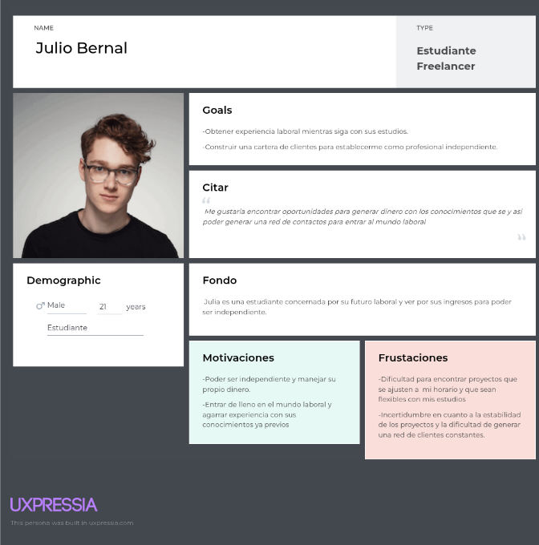

User Persona del Usuario Persona o Emprendimiento:
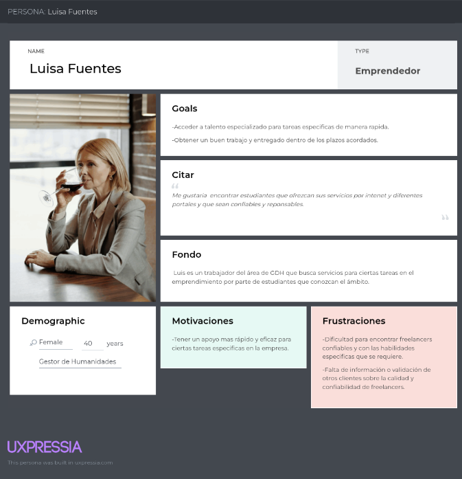

### 2.3.2. User Task Matrix

La *User Task Matrix* cruza las tareas clave identificadas con la frecuencia e importancia que cada *User Persona* les asigna. Este artefacto nos permite priorizar funcionalidades en las fases de arquitectura e implementación.

| USER TASK                                         | Julio Bernal (Freelancer) |            | Luisa Fuentes (Cliente) |            |
| :------------------------------------------------ | :-----------------------: | :--------: | :---------------------: | :--------: |
|                                                   |         Frequency         | Importance |        Frequency        | Importance |
| Publicar servicios y mostrar habilidades          |           Often           |    High    |        Sometimes        |    High    |
| Cotizar precios fácilmente según tipo de trabajo  |         Sometimes         |    High    |          Often          |    High    |
| Encontrar oportunidades mediante una app central  |         Sometimes         |    High    |          Often          |   Medium   |
| Procesar pagos seguros a través de la plataforma  |           Always          |    High    |          Always         |    High    |
| Mostrar historial de trabajos realizados          |         Sometimes         |   Medium   |          Often          |   Medium   |
| Negociar precios dentro de un rango flexible      |         Sometimes         |   Medium   |          Always         |    High    |
| Establecer acuerdos y comunicación en la plataforma |         Often           |    High    |          Always         |    High    |

### 2.3.3. Empathy Maps

Los *Empathy Maps* permiten construir una comprensión profunda de la perspectiva y experiencia de cada *User Persona*. Para cada perfil se describe lo que el usuario **ve, escucha, dice, hace y siente**, así como sus *pains* y *gains*, lo que habilita decisiones de diseño centradas en el usuario.

Empathy Map del Estudiante Freelancer:
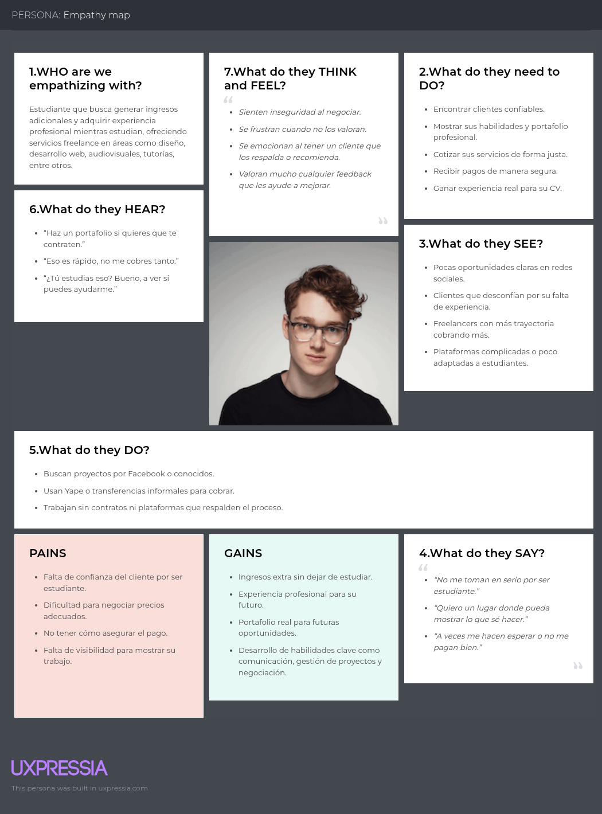

Empathy Map de Persona o Empresa:
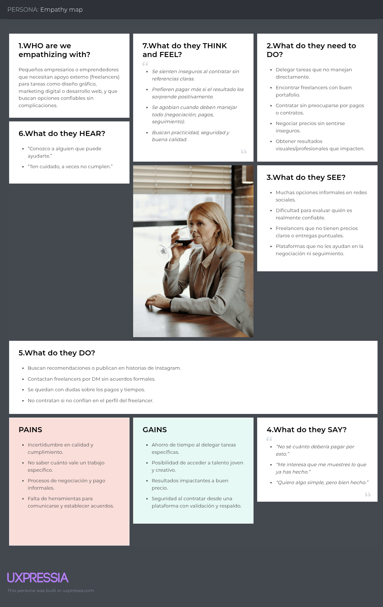

### 2.3.4. As-Is Scenario Mapping

El *As-Is Scenario Mapping* refleja el estado actual de la experiencia de cada segmento **antes** de utilizar GigU. Recorre las fases típicas —desde la búsqueda de oportunidades o de talento, pasando por la contratación, ejecución y cobro— e identifica emociones, acciones y puntos de dolor en cada paso. Este artefacto es la línea base sobre la que, en el Capítulo III, se diseñará el *To-Be Scenario*.

As-Is del Estudiante Freelancer (búsqueda de clientes, negociación informal y cobro mediante Yape/transferencias):
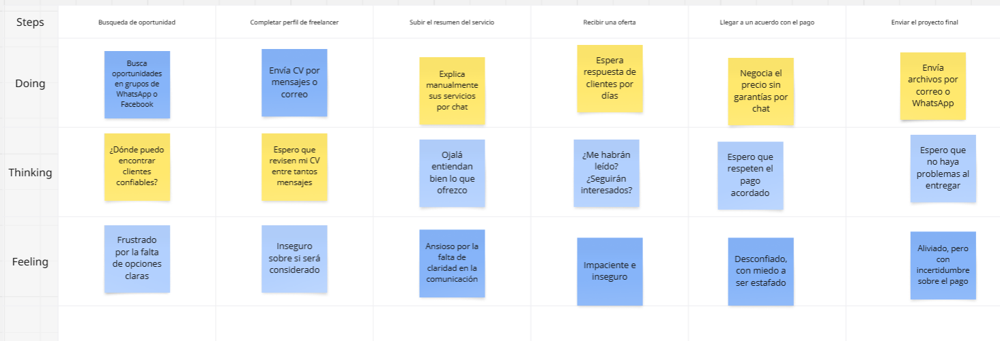

As-Is de Persona o Emprendimiento (búsqueda de freelancers vía redes, contratación sin contratos formales y coordinación manual de pagos):
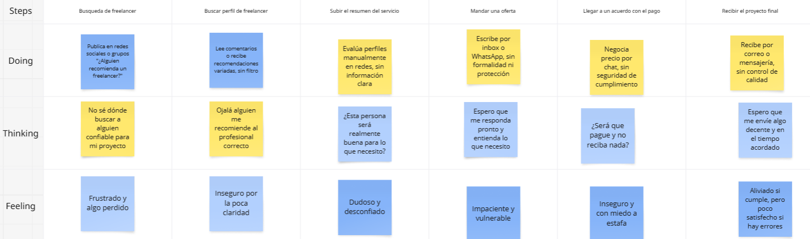

# Capítulo III: Requirements Specification

## 3.1. To-Be Scenario Mapping

## 3.2. User Stories

* EPICS
Las epics definidas para el proyecto GigU están orientadas a cubrir las necesidades principales tanto de los estudiantes de la UPC como de los usuarios que buscan contratar servicios freelance. Estas epics abordan funcionalidades esenciales para el funcionamiento de la plataforma, asegurando una experiencia fluida y efectiva desde la publicación de habilidades por parte de los estudiantes hasta la contratación por parte de clientes o emprendimientos. Desde la interfaz de la landing page, donde los usuarios conocen la propuesta de valor de GigU, hasta la gestión técnica del backend, frontend y servicios web, las epics actúan como una guía estructurada que facilita el desarrollo progresivo y coherente del sistema, alineándose con los objetivos académicos y de empleabilidad del proyecto.

| Epic / Story ID | Título | Descripción |
| :---: | ----- | ----- |
| EP01 | Navegación en Landing Page | Como visitante de GigU, deseo poder navegar de forma intuitiva por la landing page para conocer los beneficios de contratar o publicar servicios. |
| EP02 | Autenticación y Registro de Usuarios | Como usuario nuevo, deseo registrarme e iniciar sesión utilizando correo o redes sociales para acceder a mi cuenta de manera rápida y segura. |
| EP03 | Recuperación de Contraseña | Como usuario registrado, deseo recuperar mi contraseña fácilmente para poder acceder nuevamente en caso de olvidarla. |
| EP04 | Visualización de Servicios y Beneficios | Como visitante, deseo conocer los tipos de servicios disponibles y cómo funciona GigU para saber cómo puede ayudarme a contratar o ser contratado. |
| EP05 | Soporte y FAQ | Como visitante, deseo acceder a una sección de preguntas frecuentes y soporte para resolver mis dudas de forma autónoma y rápida. |
| EP06 | Gestión de Perfil Freelance | Como estudiante, deseo crear y editar mi perfil público con información, habilidades y precios para que posibles clientes conozcan mis servicios. |
| EP07 | Publicación y Edición de Servicios | Como estudiante, deseo publicar servicios personalizados con precios, plazos y descripciones claras para atraer clientes interesados. |
| EP08 | Búsqueda y Filtro de Freelancers | Como cliente, deseo buscar freelancers y filtrar por habilidades, precio o disponibilidad para encontrar al más adecuado para mi proyecto. |
| EP09 | Sistema de Contratación Directa | Como cliente, deseo contratar directamente a un freelancer desde su perfil para simplificar el proceso de contratación. |
| EP10 | Gestión de Proyectos y Solicitudes | Como freelancer, deseo gestionar las solicitudes recibidas y proyectos activos para poder organizar mejor mi trabajo y tiempos. |
| EP11 | Calificaciones y Opiniones | Como usuario, deseo dejar y ver calificaciones y comentarios sobre los freelancers para tomar decisiones más informadas. |
| EP12 | Sistema de Mensajería Interna | Como usuario, deseo comunicarme directamente dentro de la plataforma con el otro usuario para coordinar detalles antes o durante un proyecto. |
| EP13 | Cálculo Inteligente de Precio del Servicio | Como usuario, deseo que la plataforma sugiera un precio justo basado en la propuesta del freelancer, la oferta del cliente, el tipo y tamaño del servicio, y la experiencia del freelancer, para facilitar acuerdos equilibrados entre ambas partes. |

* User Stories

| Story ID                | User                                                                                                                                                                                                                                                                                                                  | Priority | Epic |
| :---------------------- | :-------------------------------------------------------------------------------------------------------------------------------------------------------------------------------------------------------------------------------------------------------------------------------------------------------------------- | :------- | :--- |
| US01                    | Visitante de GigU                                                                                                                                                                                                                                                                                                     | Alta     | EP01 |
| **Title**               | Navegar de forma intuitiva en la landing page                                                                                                                                                                                                                                                                         |          |      |
| **Description**         | Como visitante de GigU, deseo que la landing page tenga una barra de navegación clara y accesible para encontrar fácilmente las secciones importantes.                                                                                                                                                                |          |      |
|                         |                                                                                                                                                                                                                                                                                                                       |          |      |
| **Acceptance Criteria** | **Escenario 01:** Dado que un visitante está en la landing page, cuando consulta el menú de navegación, entonces el sistema muestra las secciones principales del sitio.  **Escenario 02:** Dado que un visitante navega por la página, cuando cambia de sección, entonces el sistema indica la sección activa. |          |      |

| Story ID                | User                                                                                                                                                                                                                                                                                                                                                                  | Priority | Epic |
| :---------------------- | :-------------------------------------------------------------------------------------------------------------------------------------------------------------------------------------------------------------------------------------------------------------------------------------------------------------------------------------------------------------------- | :------- | :--- |
| US02                    | Visitante                                                                                                                                                                                                                                                                                                                                                             | Alta     | EP01 |
| **Title**               | Acceder rápidamente a funcionalidades clave                                                                                                                                                                                                                                                                                                                           |          |      |
| **Description**         | Como visitante, deseo acceder desde la landing page a secciones clave como publicar proyecto o registrarme para actuar rápidamente.                                                                                                                                                                                                                                   |          |      |
|                         |                                                                                                                                                                                                                                                                                                                                                                       |          |      |
| **Acceptance Criteria** | **Escenario 01:** Dado que un visitante está en la landing page, cuando busca acciones principales, entonces el sistema muestra accesos visibles a funcionalidades clave.  **Escenario 02:** Dado que un visitante selecciona una acción principal, cuando solicita registrarse o publicar un proyecto, entonces el sistema lo dirige al flujo correspondiente. |          |      |

| Story ID                | User                                                                                                                                                                                                                                                                                                                                               | Priority | Epic |
| :---------------------- | :------------------------------------------------------------------------------------------------------------------------------------------------------------------------------------------------------------------------------------------------------------------------------------------------------------------------------------------------- | :------- | :--- |
| US03                    | Visitante de GigU                                                                                                                                                                                                                                                                                                                                  | Alta     | EP01 |
| **Title**               | Navegar por la landing page con menú claro                                                                                                                                                                                                                                                                                                         |          |      |
| **Description**         | Como visitante de GigU, deseo que la landing page tenga una barra de navegación clara para encontrar fácilmente las secciones importantes.                                                                                                                                                                                                         |          |      |
|                         |                                                                                                                                                                                                                                                                                                                                                    |          |      |
| **Acceptance Criteria** | **Escenario 01:** Dado que un visitante accede a la landing page, cuando consulta el menú, entonces el sistema presenta las secciones relevantes de forma estructurada.  **Escenario 02:** Dado que un visitante navega entre secciones, cuando usa el menú, entonces el sistema mantiene coherencia en el orden y nombres de las secciones. |          |      |

| Story ID                | User                                                                                                                                                                                                                                                                                                                              | Priority | Epic |
| :---------------------- | :-------------------------------------------------------------------------------------------------------------------------------------------------------------------------------------------------------------------------------------------------------------------------------------------------------------------------------- | :------- | :--- |
| US04                    | Usuario registrado                                                                                                                                                                                                                                                                                                                | Alta     | EP02 |
| **Title**               | Iniciar sesión como freelancer o cliente                                                                                                                                                                                                                                                                                          |          |      |
| **Description**         | Como usuario registrado, deseo poder iniciar sesión para acceder a mi cuenta y funcionalidades específicas según mi rol.                                                                                                                                                                                                          |          |      |
|                         |                                                                                                                                                                                                                                                                                                                                   |          |      |
| **Acceptance Criteria** | **Escenario 01:** Dado que un usuario proporciona credenciales válidas, cuando el sistema procesa el inicio de sesión, entonces habilita las funcionalidades según su rol.  **Escenario 02:** Dado que un usuario proporciona credenciales incorrectas, cuando intenta autenticarse, entonces el sistema rechaza el acceso. |          |      |

| Story ID                | User                                                                                                                                                                                                                                                                                                                                     | Priority | Epic |
| :---------------------- | :--------------------------------------------------------------------------------------------------------------------------------------------------------------------------------------------------------------------------------------------------------------------------------------------------------------------------------------- | :------- | :--- |
| US05                    | Visitante                                                                                                                                                                                                                                                                                                                                | Alta     | EP02 |
| **Title**               | Registrarse con cuenta de Google                                                                                                                                                                                                                                                                                                         |          |      |
| **Description**         | Como visitante, deseo registrarme con Google para agilizar el proceso de creación de cuenta.                                                                                                                                                                                                                                             |          |      |
|                         |                                                                                                                                                                                                                                                                                                                                          |          |      |
| **Acceptance Criteria** | **Escenario 01:** Dado que un visitante elige registrarse con Google, cuando autoriza el uso de sus datos básicos, entonces el sistema crea su cuenta.  **Escenario 02:** Dado que una cuenta de Google ya está registrada, cuando intenta registrarse nuevamente, entonces el sistema notifica que ya existe una cuenta asociada. |          |      |

| Story ID                | User                                                                                                                                                                                                                                                                                                                              | Priority | Epic |
| :---------------------- | :-------------------------------------------------------------------------------------------------------------------------------------------------------------------------------------------------------------------------------------------------------------------------------------------------------------------------------- | :------- | :--- |
| US06                    | Usuario                                                                                                                                                                                                                                                                                                                           | Alta     | EP03 |
| **Title**               | Solicitar recuperación de contraseña                                                                                                                                                                                                                                                                                              |          |      |
| **Description**         | Como usuario, deseo solicitar la recuperación de mi contraseña para volver a acceder si la olvido.                                                                                                                                                                                                                                |          |      |
|                         |                                                                                                                                                                                                                                                                                                                                   |          |      |
| **Acceptance Criteria** | **Escenario 01:** Dado que un usuario olvidó su contraseña, cuando proporciona un correo registrado, entonces el sistema genera un mecanismo seguro de recuperación.  **Escenario 02:** Dado que ingresa un correo no registrado, cuando solicita recuperar, entonces el sistema informa que no existe una cuenta asociada. |          |      |

| Story ID                | User                                                                                                                                                                                                                                                                    | Priority | Epic |
| :---------------------- | :---------------------------------------------------------------------------------------------------------------------------------------------------------------------------------------------------------------------------------------------------------------------- | :------- | :--- |
| US07                    | Usuario                                                                                                                                                                                                                                                                 | Alta     | EP03 |
| **Title**               | Restablecer contraseña mediante enlace seguro                                                                                                                                                                                                                           |          |      |
| **Description**         | Como usuario, deseo restablecer mi contraseña usando un enlace enviado a mi correo.                                                                                                                                                                                     |          |      |
|                         |                                                                                                                                                                                                                                                                         |          |      |
| **Acceptance Criteria** | **Escenario 01:** Dado que un usuario recibe un enlace válido, cuando accede a él, entonces puede crear una nueva contraseña.  **Escenario 02:** Dado que ingresa una contraseña inválida, cuando intenta registrarla, entonces el sistema notifica la invalidez. |          |      |

| Story ID                | User                                                                                                                                                                                                                                                                                                                      | Priority | Epic |
| :---------------------- | :------------------------------------------------------------------------------------------------------------------------------------------------------------------------------------------------------------------------------------------------------------------------------------------------------------------------ | :------- | :--- |
| US08                    | Visitante                                                                                                                                                                                                                                                                                                                 | Media    | EP04 |
| **Title**               | Conocer los beneficios de GigU                                                                                                                                                                                                                                                                                            |          |      |
| **Description**         | Como visitante, deseo conocer los beneficios de usar GigU para entender por qué debería utilizar la plataforma.                                                                                                                                                                                                           |          |      |
|                         |                                                                                                                                                                                                                                                                                                                           |          |      |
| **Acceptance Criteria** | **Escenario 01:** Dado que un visitante accede a la sección de información, cuando consulta los beneficios, entonces el sistema presenta los principales beneficios de la plataforma.  **Escenario 02:** Dado que selecciona un beneficio, cuando solicita ampliación, entonces recibe más información explicativa. |          |      |

| Story ID                | User                                                                                                                                                                                                                                                                                                                           | Priority | Epic |
| :---------------------- | :----------------------------------------------------------------------------------------------------------------------------------------------------------------------------------------------------------------------------------------------------------------------------------------------------------------------------- | :------- | :--- |
| US09                    | Visitante                                                                                                                                                                                                                                                                                                                      | Media    | EP04 |
| **Title**               | Conocer diferencias entre roles                                                                                                                                                                                                                                                                                                |          |      |
| **Description**         | Como visitante, deseo saber las diferencias entre registrarme como freelancer o cliente para elegir el rol adecuado.                                                                                                                                                                                                           |          |      |
|                         |                                                                                                                                                                                                                                                                                                                                |          |      |
| **Acceptance Criteria** | **Escenario 01:** Dado que un visitante revisa la sección de roles, cuando consulta la información, entonces el sistema muestra comparaciones claras.  **Escenario 02:** Dado que el visitante selecciona un rol, cuando consulta más detalles, entonces el sistema muestra información específica del flujo de ese rol. |          |      |

| Story ID                | User                                                                                                                                                                                                                                                                                                                 | Priority | Epic |
| :---------------------- | :------------------------------------------------------------------------------------------------------------------------------------------------------------------------------------------------------------------------------------------------------------------------------------------------------------------- | :------- | :--- |
| US10                    | Visitante                                                                                                                                                                                                                                                                                                            | Media    | EP04 |
| **Title**               | Ver experiencias de otros usuarios                                                                                                                                                                                                                                                                                   |          |      |
| **Description**         | Como visitante, deseo ver testimonios de usuarios anteriores para confiar en la plataforma.                                                                                                                                                                                                                          |          |      |
|                         |                                                                                                                                                                                                                                                                                                                      |          |      |
| **Acceptance Criteria** | **Escenario 01:** Dado que un visitante accede a la sección de experiencias, cuando visualiza testimonios, entonces el sistema muestra nombre, rol y comentario.  **Escenario 02:** Dado que solicita ver más testimonios, cuando el sistema detecta la acción, entonces muestra más experiencias registradas. |          |      |

| Story ID                | User                                                                                                                                                                                                                                                                                                | Priority | Epic |
| :---------------------- | :-------------------------------------------------------------------------------------------------------------------------------------------------------------------------------------------------------------------------------------------------------------------------------------------------- | :------- | :--- |
| US11                    | Visitante                                                                                                                                                                                                                                                                                           | Media    | EP04 |
| **Title**               | Conocer tipos de servicios disponibles                                                                                                                                                                                                                                                              |          |      |
| **Description**         | Como visitante, deseo conocer los tipos de servicios que puedo contratar o brindar en GigU.                                                                                                                                                                                                         |          |      |
|                         |                                                                                                                                                                                                                                                                                                     |          |      |
| **Acceptance Criteria** | **Escenario 01:** Dado que un visitante consulta la sección de tipos de servicios, cuando selecciona uno, entonces el sistema muestra su descripción.  **Escenario 02:** Dado que desea más información, cuando selecciona detalles, entonces el sistema presenta casos prácticos y ejemplos. |          |      |

| Story ID                | User                                                                                                                                                                                                                                                                                                                  | Priority | Epic |
| :---------------------- | :-------------------------------------------------------------------------------------------------------------------------------------------------------------------------------------------------------------------------------------------------------------------------------------------------------------------- | :------- | :--- |
| US12                    | Visitante                                                                                                                                                                                                                                                                                                             | Media    | EP05 |
| **Title**               | Acceder a preguntas frecuentes                                                                                                                                                                                                                                                                                        |          |      |
| **Description**         | Como visitante, deseo ver una sección de preguntas frecuentes para resolver dudas comunes sin ayuda externa.                                                                                                                                                                                                          |          |      |
|                         |                                                                                                                                                                                                                                                                                                                       |          |      |
| **Acceptance Criteria** | **Escenario 01:** Dado que un visitante accede a FAQ, cuando consulta las preguntas, entonces el sistema muestra un listado con respuestas.  **Escenario 02:** Dado que selecciona una pregunta, cuando visualiza o cierra la respuesta, entonces el sistema muestra u oculta la información según corresponda. |          |      |

| Story ID                | User                                                                                                                                                                                                                                                                                                              | Priority | Epic |
| :---------------------- | :---------------------------------------------------------------------------------------------------------------------------------------------------------------------------------------------------------------------------------------------------------------------------------------------------------------- | :------- | :--- |
| US13                    | Usuario                                                                                                                                                                                                                                                                                                           | Media    | EP05 |
| **Title**               | Buscar información dentro de preguntas frecuentes                                                                                                                                                                                                                                                                 |          |      |
| **Description**         | Como usuario, deseo buscar palabras clave en la sección de FAQ para encontrar respuestas más rápido.                                                                                                                                                                                                              |          |      |
|                         |                                                                                                                                                                                                                                                                                                                   |          |      |
| **Acceptance Criteria** | **Escenario 01:** Dado que un usuario busca información, cuando ingresa una palabra clave, entonces el sistema muestra las preguntas relacionadas.  **Escenario 02:** Dado que la búsqueda no tiene coincidencias, cuando el sistema procesa el término, entonces informa que no se encontraron resultados. |          |      |

| Story ID                | User                                                                                                                                                                                                                                                                                                                      | Priority | Epic |
| :---------------------- | :------------------------------------------------------------------------------------------------------------------------------------------------------------------------------------------------------------------------------------------------------------------------------------------------------------------------ | :------- | :--- |
| US14                    | Usuario                                                                                                                                                                                                                                                                                                                   | Media    | EP05 |
| **Title**               | Enviar un ticket de soporte                                                                                                                                                                                                                                                                                               |          |      |
| **Description**         | Como usuario, deseo enviar un mensaje de soporte si no encuentro mi duda en la FAQ para recibir asistencia personalizada.                                                                                                                                                                                                 |          |      |
|                         |                                                                                                                                                                                                                                                                                                                           |          |      |
| **Acceptance Criteria** | **Escenario 01:** Dado que un usuario no encuentra solución, cuando proporciona la información necesaria, entonces el sistema registra el ticket.  **Escenario 02:** Dado que los datos están incompletos, cuando intenta registrar el ticket, entonces el sistema rechaza el envío e informa los campos faltantes. |          |      |

| Story ID                | User                                                                                                                                                                                                                                                                                                                                                                | Priority | Epic |
| :---------------------- | :------------------------------------------------------------------------------------------------------------------------------------------------------------------------------------------------------------------------------------------------------------------------------------------------------------------------------------------------------------------ | :------- | :--- |
| US15                    | Estudiante                                                                                                                                                                                                                                                                                                                                                          | Alta     | EP06 |
| **Title**               | Crear perfil freelance                                                                                                                                                                                                                                                                                                                                              |          |      |
| **Description**         | Como estudiante, deseo crear mi perfil freelance con mi nombre, carrera y universidad para que los clientes conozcan mi identidad profesional.                                                                                                                                                                                                                      |          |      |
|                         |                                                                                                                                                                                                                                                                                                                                                                     |          |      |
| **Acceptance Criteria** | **Escenario 01:** Dado que un estudiante accede a la creación de perfil, cuando proporciona información válida como nombre, carrera y universidad, entonces el sistema registra el perfil y lo deja disponible.  **Escenario 02:** Dado que el estudiante completa el registro, cuando el sistema valida los datos, entonces confirma la creación del perfil. |          |      |

| Story ID                | User                                                                                                                                                                                                                                                                                                                        | Priority | Epic |
| :---------------------- | :-------------------------------------------------------------------------------------------------------------------------------------------------------------------------------------------------------------------------------------------------------------------------------------------------------------------------- | :------- | :--- |
| US16                    | Freelancer                                                                                                                                                                                                                                                                                                                  | Alta     | EP06 |
| **Title**               | Añadir habilidades y descripción personal                                                                                                                                                                                                                                                                                   |          |      |
| **Description**         | Como freelancer, deseo añadir habilidades y una descripción personal para destacar mis fortalezas.                                                                                                                                                                                                                          |          |      |
|                         |                                                                                                                                                                                                                                                                                                                             |          |      |
| **Acceptance Criteria** | **Escenario 01:** Dado que un freelancer edita su perfil, cuando añade habilidades y descripción válida, entonces el sistema almacena la información.  **Escenario 02:** Dado que el freelancer actualiza sus habilidades, cuando consulta su perfil público, entonces el sistema muestra la información actualizada. |          |      |

| Story ID                | User                                                                                                                                                                                                                                                                                                                                        | Priority | Epic |
| :---------------------- | :------------------------------------------------------------------------------------------------------------------------------------------------------------------------------------------------------------------------------------------------------------------------------------------------------------------------------------------ | :------- | :--- |
| US17                    | Freelancer                                                                                                                                                                                                                                                                                                                                  | Alta     | EP06 |
| **Title**               | Establecer tarifas por servicio                                                                                                                                                                                                                                                                                                             |          |      |
| **Description**         | Como freelancer, deseo establecer mis tarifas por tipo de servicio para que los clientes conozcan mis precios.                                                                                                                                                                                                                              |          |      |
|                         |                                                                                                                                                                                                                                                                                                                                             |          |      |
| **Acceptance Criteria** | **Escenario 01:** Dado que un freelancer asigna una tarifa válida, cuando el sistema valida el valor ingresado, entonces registra el precio y lo muestra públicamente.  **Escenario 02:** Dado que el freelancer ingresa un valor fuera de rango, cuando intenta guardarlo, entonces el sistema rechaza la tarifa e informa el error. |          |      |

| Story ID                | User                                                                                                                                                                                                                                                                                                                          | Priority | Epic |
| :---------------------- | :---------------------------------------------------------------------------------------------------------------------------------------------------------------------------------------------------------------------------------------------------------------------------------------------------------------------------- | :------- | :--- |
| US18                    | Freelancer                                                                                                                                                                                                                                                                                                                    | Media    | EP06 |
| **Title**               | Subir portafolio de proyectos                                                                                                                                                                                                                                                                                                 |          |      |
| **Description**         | Como freelancer, deseo subir muestras de trabajos anteriores para demostrar mi experiencia a los clientes.                                                                                                                                                                                                                    |          |      |
|                         |                                                                                                                                                                                                                                                                                                                               |          |      |
| **Acceptance Criteria** | **Escenario 01:** Dado que un freelancer proporciona archivos o enlaces válidos, cuando el sistema valida el contenido, entonces lo almacena y muestra en su perfil.  **Escenario 02:** Dado que intenta subir un archivo no permitido, cuando el sistema valida el tipo, entonces rechaza la carga e informa el error. |          |      |

| Story ID                | User                                                                                                                                                                                                                                                                                                    | Priority | Epic |
| :---------------------- | :------------------------------------------------------------------------------------------------------------------------------------------------------------------------------------------------------------------------------------------------------------------------------------------------------ | :------- | :--- |
| US19                    | Freelancer                                                                                                                                                                                                                                                                                              | Alta     | EP06 |
| **Title**               | Actualizar perfil freelance                                                                                                                                                                                                                                                                             |          |      |
| **Description**         | Como freelancer, deseo poder actualizar mi perfil cuando quiera para mantener mi información al día.                                                                                                                                                                                                    |          |      |
|                         |                                                                                                                                                                                                                                                                                                         |          |      |
| **Acceptance Criteria** | **Escenario 01:** Dado que un freelancer modifica datos válidos, cuando el sistema los valida, entonces actualiza la información públicamente.  **Escenario 02:** Dado que el perfil es actualizado, cuando consulta su vista pública, entonces los cambios se muestran sin procesos adicionales. |          |      |

| Story ID                | User                                                                                                                                                                                                                                                                                | Priority | Epic |
| :---------------------- | :---------------------------------------------------------------------------------------------------------------------------------------------------------------------------------------------------------------------------------------------------------------------------------- | :------- | :--- |
| US20                    | Freelancer                                                                                                                                                                                                                                                                          | Alta     | EP07 |
| **Title**               | Publicar un servicio personalizado                                                                                                                                                                                                                                                  |          |      |
| **Description**         | Como freelancer, deseo publicar un servicio con título, descripción y precio para ofrecerlo a potenciales clientes.                                                                                                                                                                 |          |      |
|                         |                                                                                                                                                                                                                                                                                     |          |      |
| **Acceptance Criteria** | **Escenario 01:** Dado que un freelancer completa los datos del servicio, cuando el sistema los valida, entonces registra la publicación.  **Escenario 02:** Dado que falta un campo obligatorio, cuando intenta guardar, entonces el sistema indica la información faltante. |          |      |

| Story ID                | User                                                                                                                                                                                                                                                                       | Priority | Epic |
| :---------------------- | :------------------------------------------------------------------------------------------------------------------------------------------------------------------------------------------------------------------------------------------------------------------------- | :------- | :--- |
| US21                    | Freelancer                                                                                                                                                                                                                                                                 | Media    | EP07 |
| **Title**               | Establecer plazos de entrega                                                                                                                                                                                                                                               |          |      |
| **Description**         | Como freelancer, deseo definir el tiempo de entrega estimado para que el cliente tenga expectativas claras.                                                                                                                                                                |          |      |
|                         |                                                                                                                                                                                                                                                                            |          |      |
| **Acceptance Criteria** | **Escenario 01:** Dado que un freelancer define un plazo, cuando el sistema valida el valor, entonces lo registra y muestra públicamente.  **Escenario 02:** Dado que el plazo está registrado, cuando el servicio se consulta, entonces incluye los días estimados. |          |      |

| Story ID                | User                                                                                                                                                                                                                                                                                 | Priority | Epic |
| :---------------------- | :----------------------------------------------------------------------------------------------------------------------------------------------------------------------------------------------------------------------------------------------------------------------------------- | :------- | :--- |
| US22                    | Freelancer                                                                                                                                                                                                                                                                           | Media    | EP07 |
| **Title**               | Editar servicios publicados                                                                                                                                                                                                                                                          |          |      |
| **Description**         | Como freelancer, deseo editar mis servicios publicados para corregir errores o actualizar precios.                                                                                                                                                                                   |          |      |
|                         |                                                                                                                                                                                                                                                                                      |          |      |
| **Acceptance Criteria** | **Escenario 01:** Dado que un freelancer modifica la información de un servicio, cuando el sistema la valida, entonces actualiza la publicación.  **Escenario 02:** Dado que el servicio es editado, cuando un usuario lo consulta, entonces visualiza la versión actualizada. |          |      |

| Story ID                | User                                                                                                                                                                                                                                                                                                                      | Priority | Epic |
| :---------------------- | :------------------------------------------------------------------------------------------------------------------------------------------------------------------------------------------------------------------------------------------------------------------------------------------------------------------------ | :------- | :--- |
| US23                    | Freelancer                                                                                                                                                                                                                                                                                                                | Media    | EP07 |
| **Title**               | Pausar o eliminar servicios publicados                                                                                                                                                                                                                                                                                    |          |      |
| **Description**         | Como freelancer, deseo pausar o eliminar mis servicios cuando ya no desee ofrecerlos.                                                                                                                                                                                                                                     |          |      |
|                         |                                                                                                                                                                                                                                                                                                                           |          |      |
| **Acceptance Criteria** | **Escenario 01:** Dado que un freelancer decide pausar o eliminar un servicio, cuando el sistema procesa la acción, entonces lo retira de la vista pública.  **Escenario 02:** Dado que el servicio está pausado o eliminado, cuando el freelancer revisa su listado, entonces el sistema muestra su estado actual. |          |      |

| Story ID                | User                                                                                                                                                                                                                                                                                                       | Priority | Epic |
| :---------------------- | :--------------------------------------------------------------------------------------------------------------------------------------------------------------------------------------------------------------------------------------------------------------------------------------------------------- | :------- | :--- |
| US24                    | Freelancer                                                                                                                                                                                                                                                                                                 | Media    | EP07 |
| **Title**               | Añadir imágenes o archivos al servicio                                                                                                                                                                                                                                                                     |          |      |
| **Description**         | Como freelancer, deseo subir imágenes o archivos a mis servicios para facilitar la comprensión del cliente.                                                                                                                                                                                                |          |      |
|                         |                                                                                                                                                                                                                                                                                                            |          |      |
| **Acceptance Criteria** | **Escenario 01:** Dado que un freelancer sube archivos permitidos, cuando el sistema valida el contenido, entonces los muestra asociados al servicio.  **Escenario 02:** Dado que sube múltiples imágenes, cuando el servicio se visualiza, entonces el sistema permite recorrerlas secuencialmente. |          |      |

| Story ID                | User                                                                                                                                                                                                                                                                                                 | Priority | Epic |
| :---------------------- | :--------------------------------------------------------------------------------------------------------------------------------------------------------------------------------------------------------------------------------------------------------------------------------------------------- | :------- | :--- |
| US25                    | Cliente                                                                                                                                                                                                                                                                                              | Alta     | EP08 |
| **Title**               | Buscar freelancers por palabra clave                                                                                                                                                                                                                                                                 |          |      |
| **Description**         | Como cliente, deseo buscar freelancers usando palabras clave para encontrar rápidamente lo que necesito.                                                                                                                                                                                             |          |      |
|                         |                                                                                                                                                                                                                                                                                                      |          |      |
| **Acceptance Criteria** | **Escenario 01:** Dado que un cliente ingresa una palabra clave, cuando el sistema procesa la búsqueda, entonces muestra freelancers relacionados.  **Escenario 02:** Dado que ingresa múltiples palabras, cuando el sistema filtra, entonces muestra coincidencias con al menos una de ellas. |          |      |

| Story ID                | User                                                                                                                                                                                                                                                                                                                 | Priority | Epic |
| :---------------------- | :------------------------------------------------------------------------------------------------------------------------------------------------------------------------------------------------------------------------------------------------------------------------------------------------------------------- | :------- | :--- |
| US26                    | Cliente                                                                                                                                                                                                                                                                                                              | Alta     | EP08 |
| **Title**               | Filtrar freelancers por habilidad                                                                                                                                                                                                                                                                                    |          |      |
| **Description**         | Como cliente, deseo filtrar freelancers según sus habilidades para encontrar al más apto para mi proyecto.                                                                                                                                                                                                           |          |      |
|                         |                                                                                                                                                                                                                                                                                                                      |          |      |
| **Acceptance Criteria** | **Escenario 01:** Dado que el cliente selecciona una habilidad, cuando el sistema filtra, entonces muestra solo freelancers que la tengan registrada.  **Escenario 02:** Dado que selecciona varias habilidades, cuando el sistema filtra, entonces muestra freelancers que cumplan con al menos una de ellas. |          |      |

| Story ID                | User                                                                                                                                                                                                                                                                              | Priority | Epic |
| :---------------------- | :-------------------------------------------------------------------------------------------------------------------------------------------------------------------------------------------------------------------------------------------------------------------------------- | :------- | :--- |
| US27                    | Cliente                                                                                                                                                                                                                                                                           | Media    | EP08 |
| **Title**               | Filtrar por rango de precios                                                                                                                                                                                                                                                      |          |      |
| **Description**         | Como cliente, deseo establecer un rango de precios para ver freelancers dentro de mi presupuesto.                                                                                                                                                                                 |          |      |
|                         |                                                                                                                                                                                                                                                                                   |          |      |
| **Acceptance Criteria** | **Escenario 01:** Dado que el cliente define un rango, cuando el sistema filtra, entonces muestra freelancers dentro del presupuesto.  **Escenario 02:** Dado que no existen coincidencias, cuando el sistema completa el filtrado, entonces informa que no hay resultados. |          |      |

| Story ID                | User                                                                                                                                                                                                                                                                                                                    | Priority | Epic |
| :---------------------- | :---------------------------------------------------------------------------------------------------------------------------------------------------------------------------------------------------------------------------------------------------------------------------------------------------------------------- | :------- | :--- |
| US28                    | Cliente                                                                                                                                                                                                                                                                                                                 | Media    | EP08 |
| **Title**               | Filtrar freelancers por experiencia                                                                                                                                                                                                                                                                                     |          |      |
| **Description**         | Como cliente, deseo filtrar freelancers según su nivel de experiencia para elegir al adecuado.                                                                                                                                                                                                                          |          |      |
|                         |                                                                                                                                                                                                                                                                                                                         |          |      |
| **Acceptance Criteria** | **Escenario 01:** Dado que un cliente selecciona un nivel, cuando el sistema procesa el filtro, entonces muestra freelancers con dicho nivel.  **Escenario 02:** Dado que el freelancer tiene nivel registrado, cuando aparece en los resultados, entonces el sistema muestra su nivel en la tarjeta informativa. |          |      |

| Story ID                | User                                                                                                                                                                                                                                                                                     | Priority | Epic |
| :---------------------- | :--------------------------------------------------------------------------------------------------------------------------------------------------------------------------------------------------------------------------------------------------------------------------------------- | :------- | :--- |
| US29                    | Cliente                                                                                                                                                                                                                                                                                  | Media    | EP08 |
| **Title**               | Ordenar resultados de búsqueda                                                                                                                                                                                                                                                           |          |      |
| **Description**         | Como cliente, deseo ordenar resultados por relevancia o calificación para comparar perfiles.                                                                                                                                                                                             |          |      |
|                         |                                                                                                                                                                                                                                                                                          |          |      |
| **Acceptance Criteria** | **Escenario 01:** Dado que un cliente elige un criterio de ordenamiento, cuando el sistema procesa la solicitud, entonces reordena los resultados.  **Escenario 02:** Dado que cambia el criterio, cuando se muestran los resultados, entonces se mantienen los filtros aplicados. |          |      |

| Story ID                | User                                                                                                                                                                                                                                                                                                            | Priority | Epic |
| :---------------------- | :-------------------------------------------------------------------------------------------------------------------------------------------------------------------------------------------------------------------------------------------------------------------------------------------------------------- | :------- | :--- |
| US30                    | Cliente                                                                                                                                                                                                                                                                                                         | Alta     | EP09 |
| **Title**               | Contratar desde el perfil del freelancer                                                                                                                                                                                                                                                                        |          |      |
| **Description**         | Como cliente, deseo contratar a un freelancer directamente desde su perfil para ahorrar tiempo al iniciar una negociación.                                                                                                                                                                                      |          |      |
|                         |                                                                                                                                                                                                                                                                                                                 |          |      |
| **Acceptance Criteria** | **Escenario 01:** Dado que un cliente consulta el perfil del freelancer, cuando envía una solicitud de contratación, entonces el sistema registra la solicitud.  **Escenario 02:** Dado que la contratación fue iniciada, cuando el sistema la procesa, entonces se registra en el historial del cliente. |          |      |

| Story ID                | User                                                                                                                                                                                                                                                                                                           | Priority | Epic |
| :---------------------- | :------------------------------------------------------------------------------------------------------------------------------------------------------------------------------------------------------------------------------------------------------------------------------------------------------------- | :------- | :--- |
| US31                    | Cliente                                                                                                                                                                                                                                                                                                        | Media    | EP09 |
| **Title**               | Confirmación de contratación exitosa                                                                                                                                                                                                                                                                           |          |      |
| **Description**         | Como cliente, deseo recibir confirmación del sistema y por correo al contratar a un freelancer.                                                                                                                                                                                                                |          |      |
|                         |                                                                                                                                                                                                                                                                                                                |          |      |
| **Acceptance Criteria** | **Escenario 01:** Dado que la contratación es procesada, cuando el sistema finaliza el registro, entonces muestra una confirmación en pantalla.  **Escenario 02:** Dado que la contratación fue exitosa, cuando el sistema envía la notificación, entonces el cliente recibe un correo con los detalles. |          |      |

| Story ID                | User                                                                                                                                                                                                                                                                                 | Priority | Epic |
| :---------------------- | :----------------------------------------------------------------------------------------------------------------------------------------------------------------------------------------------------------------------------------------------------------------------------------- | :------- | :--- |
| US32                    | Freelancer                                                                                                                                                                                                                                                                           | Media    | EP09 |
| **Title**               | Aceptar o rechazar solicitud de contrato                                                                                                                                                                                                                                             |          |      |
| **Description**         | Como freelancer, deseo aceptar o rechazar solicitudes de contratación para gestionar mi disponibilidad.                                                                                                                                                                              |          |      |
|                         |                                                                                                                                                                                                                                                                                      |          |      |
| **Acceptance Criteria** | **Escenario 01:** Dado que un freelancer recibe una solicitud, cuando consulta los detalles, entonces puede aceptarla o rechazarla.  **Escenario 02:** Dado que rechaza una solicitud, cuando registra la acción, entonces el sistema almacena el motivo si fue proporcionado. |          |      |

| Story ID                | User                                                                                                                                                                                                                                                                                                | Priority | Epic |
| :---------------------- | :-------------------------------------------------------------------------------------------------------------------------------------------------------------------------------------------------------------------------------------------------------------------------------------------------- | :------- | :--- |
| US33                    | Cliente                                                                                                                                                                                                                                                                                             | Media    | EP09 |
| **Title**               | Ver historial de contrataciones                                                                                                                                                                                                                                                                     |          |      |
| **Description**         | Como cliente, deseo ver un historial de mis contrataciones para tener un registro de mis actividades.                                                                                                                                                                                               |          |      |
|                         |                                                                                                                                                                                                                                                                                                     |          |      |
| **Acceptance Criteria** | **Escenario 01:** Dado que el cliente ha realizado contrataciones, cuando accede al historial, entonces el sistema muestra la lista con fechas y estados.  **Escenario 02:** Dado que selecciona una contratación, cuando solicita más información, entonces el sistema muestra los detalles. |          |      |

| Story ID                | User                                                                                                                                                                                                                                                                                                                                           | Priority | Epic |
| :---------------------- | :--------------------------------------------------------------------------------------------------------------------------------------------------------------------------------------------------------------------------------------------------------------------------------------------------------------------------------------------- | :------- | :--- |
| US34                    | Freelancer                                                                                                                                                                                                                                                                                                                                     | Alta     | EP10 |
| **Title**               | Visualizar proyectos activos                                                                                                                                                                                                                                                                                                                   |          |      |
| **Description**         | Como freelancer, deseo ver una lista de mis proyectos activos para organizar mi trabajo.                                                                                                                                                                                                                                                       |          |      |
|                         |                                                                                                                                                                                                                                                                                                                                                |          |      |
| **Acceptance Criteria** | **Escenario 01:** Dado que existen proyectos activos, cuando el freelancer accede al listado, entonces el sistema muestra los proyectos con su información relevante.  **Escenario 02:** Dado que existen múltiples proyectos, cuando el freelancer solicita ordenarlos, entonces el sistema permite ordenarlos por criterios definidos. |          |      |

| Story ID                | User                                                                                                                                                                                                                                                                                            | Priority | Epic |
| :---------------------- | :---------------------------------------------------------------------------------------------------------------------------------------------------------------------------------------------------------------------------------------------------------------------------------------------- | :------- | :--- |
| US35                    | Freelancer                                                                                                                                                                                                                                                                                      | Alta     | EP10 |
| **Title**               | Gestionar solicitudes recibidas                                                                                                                                                                                                                                                                 |          |      |
| **Description**         | Como freelancer, deseo revisar y gestionar solicitudes de nuevos proyectos para aceptar las que se ajusten a mi disponibilidad.                                                                                                                                                                 |          |      |
|                         |                                                                                                                                                                                                                                                                                                 |          |      |
| **Acceptance Criteria** | **Escenario 01:** Dado que el freelancer tiene solicitudes pendientes, cuando accede al panel, entonces el sistema muestra los detalles de cada solicitud.  **Escenario 02:** Dado que acepta o rechaza una solicitud, cuando el sistema procesa la acción, entonces actualiza su estado. |          |      |

| Story ID                | User                                                                                                                                                                                                                                                                             | Priority | Epic |
| :---------------------- | :------------------------------------------------------------------------------------------------------------------------------------------------------------------------------------------------------------------------------------------------------------------------------- | :------- | :--- |
| US36                    | Freelancer                                                                                                                                                                                                                                                                       | Media    | EP10 |
| **Title**               | Marcar proyecto como finalizado                                                                                                                                                                                                                                                  |          |      |
| **Description**         | Como freelancer, deseo marcar un proyecto como finalizado para indicar que mi trabajo fue completado.                                                                                                                                                                            |          |      |
|                         |                                                                                                                                                                                                                                                                                  |          |      |
| **Acceptance Criteria** | **Escenario 01:** Dado que un freelancer concluye un proyecto, cuando lo marca como finalizado, entonces el sistema actualiza su estado.  **Escenario 02:** Dado que un proyecto está finalizado, cuando el cliente lo consulta, entonces visualiza su estado actualizado. |          |      |

| Story ID                | User                                                                                                                                                                                                                                                                                                | Priority | Epic |
| :---------------------- | :-------------------------------------------------------------------------------------------------------------------------------------------------------------------------------------------------------------------------------------------------------------------------------------------------- | :------- | :--- |
| US37                    | Cliente                                                                                                                                                                                                                                                                                             | Media    | EP10 |
| **Title**               | Ver estado del proyecto                                                                                                                                                                                                                                                                             |          |      |
| **Description**         | Como cliente, deseo ver el estado de mis proyectos en curso para saber si están en espera, en proceso o finalizados.                                                                                                                                                                                |          |      |
|                         |                                                                                                                                                                                                                                                                                                     |          |      |
| **Acceptance Criteria** | **Escenario 01:** Dado que el cliente consulta sus proyectos, cuando accede al listado, entonces el sistema muestra su estado actual.  **Escenario 02:** Dado que un proyecto cambia de estado, cuando el cliente consulta su historial, entonces el sistema muestra los cambios registrados. |          |      |

| Story ID                | User                                                                                                                                                                                                                                                                          | Priority | Epic |
| :---------------------- | :---------------------------------------------------------------------------------------------------------------------------------------------------------------------------------------------------------------------------------------------------------------------------- | :------- | :--- |
| US38                    | Cliente                                                                                                                                                                                                                                                                       | Media    | EP11 |
| **Title**               | Calificar al freelancer                                                                                                                                                                                                                                                       |          |      |
| **Description**         | Como cliente, deseo calificar al freelancer al finalizar un proyecto para compartir mi experiencia.                                                                                                                                                                           |          |      |
|                         |                                                                                                                                                                                                                                                                               |          |      |
| **Acceptance Criteria** | **Escenario 01:** Dado que un proyecto finalizó, cuando el cliente registra una calificación con comentario, entonces el sistema guarda la reseña.  **Escenario 02:** Dado que ya calificó, cuando consulta el proyecto, entonces visualiza la calificación registrada. |          |      |

| Story ID                | User                                                                                                                                                                                                                                                                                                                             | Priority | Epic |
| :---------------------- | :------------------------------------------------------------------------------------------------------------------------------------------------------------------------------------------------------------------------------------------------------------------------------------------------------------------------------- | :------- | :--- |
| US39                    | Cliente                                                                                                                                                                                                                                                                                                                          | Media    | EP11 |
| **Title**               | Ver calificaciones del freelancer                                                                                                                                                                                                                                                                                                |          |      |
| **Description**         | Como cliente, deseo ver las calificaciones que otros usuarios han dejado a un freelancer antes de contratarlo.                                                                                                                                                                                                                   |          |      |
|                         |                                                                                                                                                                                                                                                                                                                                  |          |      |
| **Acceptance Criteria** | **Escenario 01:** Dado que un cliente visita un perfil, cuando consulta la sección de calificaciones, entonces visualiza el promedio y comentarios existentes.  **Escenario 02:** Dado que un comentario tiene más contenido, cuando el cliente solicita verlo completo, entonces el sistema muestra la versión extendida. |          |      |

| Story ID                | User                                                                                                                                                                                                                                                                                                               | Priority | Epic |
| :---------------------- | :----------------------------------------------------------------------------------------------------------------------------------------------------------------------------------------------------------------------------------------------------------------------------------------------------------------- | :------- | :--- |
| US40                    | Cliente                                                                                                                                                                                                                                                                                                            | Baja     | EP11 |
| **Title**               | Editar calificación después de un proyecto                                                                                                                                                                                                                                                                         |          |      |
| **Description**         | Como cliente, deseo editar una calificación si cometí un error o si el freelancer mejoró tras retroalimentación.                                                                                                                                                                                                   |          |      |
|                         |                                                                                                                                                                                                                                                                                                                    |          |      |
| **Acceptance Criteria** | **Escenario 01:** Dado que el cliente escribió una reseña, cuando solicita editarla, entonces el sistema permite cambiar puntuación y comentario.  **Escenario 02:** Dado que la reseña es modificada, cuando otros usuarios la visualizan, entonces el sistema muestra que fue editada y registra la fecha. |          |      |

| Story ID                | User                                                                                                                                                                                                                                                                                                            | Priority | Epic |
| :---------------------- | :-------------------------------------------------------------------------------------------------------------------------------------------------------------------------------------------------------------------------------------------------------------------------------------------------------------- | :------- | :--- |
| US41                    | Freelancer                                                                                                                                                                                                                                                                                                      | Media    | EP11 |
| **Title**               | Calificar al cliente                                                                                                                                                                                                                                                                                            |          |      |
| **Description**         | Como freelancer, deseo calificar al cliente luego de terminar un proyecto para informar a otros freelancers sobre su comportamiento.                                                                                                                                                                            |          |      |
|                         |                                                                                                                                                                                                                                                                                                                 |          |      |
| **Acceptance Criteria** | **Escenario 01:** Dado que un proyecto terminó, cuando el freelancer registra una calificación y comentario, entonces el sistema guarda la reseña.  **Escenario 02:** Dado que la calificación fue registrada, cuando el freelancer revisa su historial, entonces visualiza que ya calificó ese proyecto. |          |      |

| Story ID                | User                                                                                                                                                                                                                                                                                       | Priority | Epic |
| :---------------------- | :----------------------------------------------------------------------------------------------------------------------------------------------------------------------------------------------------------------------------------------------------------------------------------------- | :------- | :--- |
| US42                    | Usuario                                                                                                                                                                                                                                                                                    | Alta     | EP12 |
| **Title**               | Enviar mensaje a usuario desde perfil                                                                                                                                                                                                                                                      |          |      |
| **Description**         | Como usuario, deseo enviar un mensaje a otro usuario desde su perfil para coordinar detalles.                                                                                                                                                                                              |          |      |
|                         |                                                                                                                                                                                                                                                                                            |          |      |
| **Acceptance Criteria** | **Escenario 01:** Dado que un usuario accede al perfil de otro, cuando inicia una conversación, entonces el sistema crea el canal de mensajería.  **Escenario 02:** Dado que se recibe un mensaje, cuando el sistema registra la llegada, entonces notifica dentro de la plataforma. |          |      |

| Story ID                | User                                                                                                                                                                                                                                                                                                        | Priority | Epic |
| :---------------------- | :---------------------------------------------------------------------------------------------------------------------------------------------------------------------------------------------------------------------------------------------------------------------------------------------------------- | :------- | :--- |
| US43                    | Usuario                                                                                                                                                                                                                                                                                                     | Media    | EP12 |
| **Title**               | Ver historial de conversaciones                                                                                                                                                                                                                                                                             |          |      |
| **Description**         | Como usuario, deseo ver mi historial de conversaciones previas para recordar acuerdos importantes.                                                                                                                                                                                                          |          |      |
|                         |                                                                                                                                                                                                                                                                                                             |          |      |
| **Acceptance Criteria** | **Escenario 01:** Dado que el usuario tiene conversaciones previas, cuando accede a la sección de mensajes, entonces el sistema muestra la lista de chats recientes.  **Escenario 02:** Dado que revisa un chat antiguo, cuando navega hacia arriba, entonces el sistema carga el historial completo. |          |      |

| Story ID                | User                                                                                                                                                                                                                                                                          | Priority | Epic |
| :---------------------- | :---------------------------------------------------------------------------------------------------------------------------------------------------------------------------------------------------------------------------------------------------------------------------- | :------- | :--- |
| US44                    | Usuario                                                                                                                                                                                                                                                                       | Media    | EP12 |
| **Title**               | Recibir notificación de nuevo mensaje                                                                                                                                                                                                                                         |          |      |
| **Description**         | Como usuario, deseo recibir una notificación cuando me envíen un nuevo mensaje para no perder comunicación importante.                                                                                                                                                        |          |      |
|                         |                                                                                                                                                                                                                                                                               |          |      |
| **Acceptance Criteria** | **Escenario 01:** Dado que se recibe un mensaje, cuando el sistema lo registra, entonces genera una notificación visible.  **Escenario 02:** Dado que el usuario está dentro del chat, cuando se envía un mensaje nuevo, entonces aparece automáticamente sin recargar. |          |      |

| Story ID                | User                                                                                                                                                                                                                                                                        | Priority | Epic |
| :---------------------- | :-------------------------------------------------------------------------------------------------------------------------------------------------------------------------------------------------------------------------------------------------------------------------- | :------- | :--- |
| US45                    | Usuario                                                                                                                                                                                                                                                                     | Media    | EP12 |
| **Title**               | Bloquear o reportar usuario desde el chat                                                                                                                                                                                                                                   |          |      |
| **Description**         | Como usuario, deseo bloquear o reportar a otra persona si recibo mensajes inapropiados o spam.                                                                                                                                                                              |          |      |
|                         |                                                                                                                                                                                                                                                                             |          |      |
| **Acceptance Criteria** | **Escenario 01:** Dado que un usuario reporta a otro, cuando especifica un motivo válido, entonces el sistema registra el reporte.  **Escenario 02:** Dado que un usuario bloquea a otro, cuando el sistema procesa la acción, entonces impide futuras interacciones. |          |      |

| Story ID                | User                                                                                                                                                                                                                                                                                                     | Priority | Epic |
| :---------------------- | :------------------------------------------------------------------------------------------------------------------------------------------------------------------------------------------------------------------------------------------------------------------------------------------------------- | :------- | :--- |
| US46                    | Usuario                                                                                                                                                                                                                                                                                                  | Alta     | EP13 |
| **Title**               | Recibir sugerencia automática de precio                                                                                                                                                                                                                                                                  |          |      |
| **Description**         | Como usuario, deseo recibir una sugerencia automática de precio basada en variables del servicio.                                                                                                                                                                                                        |          |      |
|                         |                                                                                                                                                                                                                                                                                                          |          |      |
| **Acceptance Criteria** | **Escenario 01:** Dado que el usuario especifica tipo de servicio y nivel de experiencia, cuando el sistema procesa los datos, entonces genera una sugerencia automática.  **Escenario 02:** Dado que el usuario cambia parámetros, cuando el sistema recalcula, entonces actualiza la sugerencia. |          |      |

| Story ID                | User                                                                                                                                                                                                                                                                                                                      | Priority | Epic |
| :---------------------- | :------------------------------------------------------------------------------------------------------------------------------------------------------------------------------------------------------------------------------------------------------------------------------------------------------------------------ | :------- | :--- |
| US47                    | Usuario                                                                                                                                                                                                                                                                                                                   | Media    | EP13 |
| **Title**               | Ajustar manualmente el precio sugerido                                                                                                                                                                                                                                                                                    |          |      |
| **Description**         | Como usuario, deseo modificar manualmente el precio sugerido para adaptarlo a mis condiciones.                                                                                                                                                                                                                            |          |      |
|                         |                                                                                                                                                                                                                                                                                                                           |          |      |
| **Acceptance Criteria** | **Escenario 01:** Dado que existe una sugerencia, cuando el usuario ingresa un nuevo valor, entonces el sistema lo registra sin afectar la lógica base.  **Escenario 02:** Dado que el usuario ya modificó el precio, cuando consulta nuevamente la sección, entonces el sistema muestra el valor manual ingresado. |          |      |

| Story ID                | User                                                                                                                                                                                                                                                                                                  | Priority | Epic |
| :---------------------- | :---------------------------------------------------------------------------------------------------------------------------------------------------------------------------------------------------------------------------------------------------------------------------------------------------- | :------- | :--- |
| US48                    | Usuario                                                                                                                                                                                                                                                                                               | Baja     | EP13 |
| **Title**               | Ver detalle del cálculo del precio                                                                                                                                                                                                                                                                    |          |      |
| **Description**         | Como usuario, deseo ver una explicación breve de cómo se calculó el precio sugerido.                                                                                                                                                                                                                  |          |      |
|                         |                                                                                                                                                                                                                                                                                                       |          |      |
| **Acceptance Criteria** | **Escenario 01:** Dado que existe una sugerencia, cuando el usuario solicita ver detalles, entonces el sistema muestra los factores utilizados.  **Escenario 02:** Dado que se muestran factores, cuando el usuario solicita más información de uno, entonces el sistema explica su influencia. |          |      |

| Story ID                | User                                                                                                                                                                                                                                                                                                                | Priority | Epic |
| :---------------------- | :------------------------------------------------------------------------------------------------------------------------------------------------------------------------------------------------------------------------------------------------------------------------------------------------------------------ | :------- | :--- |
| US49                    | Usuario                                                                                                                                                                                                                                                                                                             | Media    | EP13 |
| **Title**               | Comparar propuesta y oferta                                                                                                                                                                                                                                                                                         |          |      |
| **Description**         | Como usuario, deseo comparar mi propuesta y la oferta de la otra parte para facilitar un acuerdo.                                                                                                                                                                                                                   |          |      |
|                         |                                                                                                                                                                                                                                                                                                                     |          |      |
| **Acceptance Criteria** | **Escenario 01:** Dado que ambas partes ingresan valores, cuando el usuario solicita compararlos, entonces el sistema muestra una tabla comparativa.  **Escenario 02:** Dado que hay diferencia significativa, cuando el sistema analiza los datos, entonces sugiere continuar negociación o ajustar valores. |          |      |

| Story ID                | User                                                                                                                                                                                                                                                                                                                  | Priority | Epic |
| :---------------------- | :-------------------------------------------------------------------------------------------------------------------------------------------------------------------------------------------------------------------------------------------------------------------------------------------------------------------- | :------- | :--- |
| US50                    | Usuario                                                                                                                                                                                                                                                                                                               | Baja     | EP13 |
| **Title**               | Consultar historial de precios similares                                                                                                                                                                                                                                                                              |          |      |
| **Description**         | Como usuario, deseo ver precios históricos de servicios similares para tomar decisiones informadas.                                                                                                                                                                                                                   |          |      |
|                         |                                                                                                                                                                                                                                                                                                                       |          |      |
| **Acceptance Criteria** | **Escenario 01:** Dado que existen datos históricos, cuando el usuario solicita verlos, entonces el sistema muestra un listado o gráfico.  **Escenario 02:** Dado que el usuario cambia de categoría, cuando el sistema actualiza los datos, entonces muestra información correspondiente a la nueva categoría. |          |      |

| Story ID                | User                                                                                                                                                                                                                                                                                      | Priority | Epic |
| :---------------------- | :---------------------------------------------------------------------------------------------------------------------------------------------------------------------------------------------------------------------------------------------------------------------------------------- | :------- | :--- |
| SP01                    | Equipo de desarrollo                                                                                                                                                                                                                                                                      | Media    | EP02 |
| **Title**               | Investigación de autenticación con Google                                                                                                                                                                                                                                                 |          |      |
| **Description**         | Como equipo de desarrollo, deseo investigar cómo integrar Google OAuth 2.0 para permitir registro e inicio de sesión seguro.                                                                                                                                                              |          |      |
|                         |                                                                                                                                                                                                                                                                                           |          |      |
| **Acceptance Criteria** | **Escenario 01:** Dado que se revisa la documentación, cuando se analizan los requisitos, entonces se documentan los pasos de integración.  **Escenario 02:** Dado que se desarrolla un prototipo, cuando se completa el flujo, entonces se valida que el token generado es seguro. |          |      |

| Story ID                | User                                                                                                                                                                                                                                                                                                 | Priority | Epic |
| :---------------------- | :--------------------------------------------------------------------------------------------------------------------------------------------------------------------------------------------------------------------------------------------------------------------------------------------------- | :------- | :--- |
| SP02                    | Equipo de desarrollo                                                                                                                                                                                                                                                                                 | Media    | EP03 |
| **Title**               | Recuperación segura de contraseña                                                                                                                                                                                                                                                                    |          |      |
| **Description**         | Como equipo de desarrollo, deseo investigar mecanismos seguros de recuperación de contraseña mediante enlaces temporales.                                                                                                                                                                            |          |      |
|                         |                                                                                                                                                                                                                                                                                                      |          |      |
| **Acceptance Criteria** | **Escenario 01:** Dado que se revisan buenas prácticas, cuando se analiza la documentación, entonces se define la estrategia recomendada.  **Escenario 02:** Dado que se genera un prototipo de envío de correo, cuando el usuario recibe el enlace, entonces este expira según configuración. |          |      |

| Story ID                | User                                                                                                                                                                                                                                                                            | Priority | Epic |
| :---------------------- | :------------------------------------------------------------------------------------------------------------------------------------------------------------------------------------------------------------------------------------------------------------------------------ | :------- | :--- |
| SP03                    | Equipo de desarrollo                                                                                                                                                                                                                                                            | Media    | EP08 |
| **Title**               | Investigación de motores de búsqueda y filtros                                                                                                                                                                                                                                  |          |      |
| **Description**         | Como equipo de desarrollo, deseo investigar motores de búsqueda eficientes para mejorar la experiencia de encontrar freelancers.                                                                                                                                                |          |      |
|                         |                                                                                                                                                                                                                                                                                 |          |      |
| **Acceptance Criteria** | **Escenario 01:** Dado que se revisan alternativas, cuando se documentan pros y contras, entonces se incluye una recomendación técnica.  **Escenario 02:** Dado que se desarrolla un prototipo, cuando se ejecuta en un dataset, entonces se mide el tiempo de respuesta. |          |      |

| Story ID                | User                                                                                                                                                                                                                                                                             | Priority | Epic |
| :---------------------- | :------------------------------------------------------------------------------------------------------------------------------------------------------------------------------------------------------------------------------------------------------------------------------- | :------- | :--- |
| SP04                    | Equipo de desarrollo                                                                                                                                                                                                                                                             | Media    | EP12 |
| **Title**               | Investigación de mensajería en tiempo real                                                                                                                                                                                                                                       |          |      |
| **Description**         | Como equipo de desarrollo, deseo investigar opciones para implementar mensajería en tiempo real.                                                                                                                                                                                 |          |      |
|                         |                                                                                                                                                                                                                                                                                  |          |      |
| **Acceptance Criteria** | **Escenario 01:** Dado que se revisan tecnologías, cuando se comparan, entonces el informe incluye la mejor opción.  **Escenario 02:** Dado que se crea un prototipo básico, cuando dos usuarios intercambian mensajes, entonces estos se reciben sin refrescar la página. |          |      |

| Story ID                | User                                                                                                                                                                                                                                                                               | Priority | Epic |
| :---------------------- | :--------------------------------------------------------------------------------------------------------------------------------------------------------------------------------------------------------------------------------------------------------------------------------- | :------- | :--- |
| SP05                    | Equipo de desarrollo                                                                                                                                                                                                                                                               | Media    | EP13 |
| **Title**               | Investigación para cálculo inteligente de precios                                                                                                                                                                                                                                  |          |      |
| **Description**         | Como equipo de desarrollo, deseo investigar modelos para sugerir precios justos evaluando variables y reglas.                                                                                                                                                                      |          |      |
|                         |                                                                                                                                                                                                                                                                                    |          |      |
| **Acceptance Criteria** | **Escenario 01:** Dado que se analizan variables, cuando se desarrolla un prototipo, entonces devuelve un precio sugerido.  **Escenario 02:** Dado que se documenta la investigación, cuando se presentan resultados, entonces se incluye complejidad y enfoque recomendado. |          |      |

| Story ID                | User                                                                                                                                                                                                                                                                                             | Priority | Epic |
| :---------------------- | :----------------------------------------------------------------------------------------------------------------------------------------------------------------------------------------------------------------------------------------------------------------------------------------------- | :------- | :--- |
| SP06                    | Equipo de desarrollo                                                                                                                                                                                                                                                                             | Media    | EP06 |
| **Title**               | Gestión de archivos y portafolio                                                                                                                                                                                                                                                                 |          |      |
| **Description**         | Como equipo de desarrollo, deseo investigar almacenamiento seguro de imágenes y archivos para portafolios multimedia.                                                                                                                                                                            |          |      |
|                         |                                                                                                                                                                                                                                                                                                  |          |      |
| **Acceptance Criteria** | **Escenario 01:** Dado que se evalúan proveedores de nube, cuando se documentan costos y seguridad, entonces se elige la opción más viable.  **Escenario 02:** Dado que se construye un prototipo, cuando un usuario carga una imagen, entonces esta es accesible mediante una URL segura. |          |      |

| Story ID                | User                                                                                                                                                                                                                                                                  | Priority | Epic |
| :---------------------- | :-------------------------------------------------------------------------------------------------------------------------------------------------------------------------------------------------------------------------------------------------------------------- | :------- | :--- |
| SP07                    | Equipo de desarrollo                                                                                                                                                                                                                                                  | Alta     | EP09 |
| **Title**               | Contratación directa y pagos                                                                                                                                                                                                                                          |          |      |
| **Description**         | Como equipo de desarrollo, deseo investigar opciones de integración de pagos para habilitar contrataciones directas.                                                                                                                                                  |          |      |
|                         |                                                                                                                                                                                                                                                                       |          |      |
| **Acceptance Criteria** | **Escenario 01:** Dado que se revisan APIs de pago, cuando se comparan, entonces se documentan dependencias y requisitos legales.  **Escenario 02:** Dado que se desarrolla un prototipo, cuando el cliente confirma, entonces se genera un registro de prueba. |          |      |

| Story ID                | User                                                                                                                                                                                                                                                                                             | Priority | Epic |
| :---------------------- | :----------------------------------------------------------------------------------------------------------------------------------------------------------------------------------------------------------------------------------------------------------------------------------------------- | :------- | :--- |
| SP08                    | Equipo de desarrollo                                                                                                                                                                                                                                                                             | Media    | EP11 |
| **Title**               | Sistema de calificaciones y opiniones                                                                                                                                                                                                                                                            |          |      |
| **Description**         | Como equipo de desarrollo, deseo investigar formas seguras y eficientes de almacenar calificaciones evitando fraudes.                                                                                                                                                                            |          |      |
|                         |                                                                                                                                                                                                                                                                                                  |          |      |
| **Acceptance Criteria** | **Escenario 01:** Dado que se diseña un esquema de BD, cuando se prueba, entonces soporta calificaciones con comentarios vinculados a proyectos finalizados.  **Escenario 02:** Dado que se documentan riesgos, cuando se presenta el informe, entonces se incluyen medidas de mitigación. |          |      |

## 3.3. Impact Map

## 3.4. Product Backlog

# Capítulo IV: Product Architecture Design

## 4.1. Design Concepts, ViewPoints & ER Diagrams

## 4.2. Principles Statements

## 4.3. Approaches Statements

## 4.4. Architectural Styles & Patterns

## 4.5. Context Diagram

## 4.6. Approach Driven ViewPoints Diagrams

## 4.7. Relational/Non Relational Database Diagram

## 4.8. Design Patterns

## 4.9. Tactics

## 4.10. Architectural Drivers

### 4.10.1. Design Purpose

### 4.10.2. Primary Functionality (Primary User Stories)

### 4.10.3. Quality Attribute Scenarios

### 4.10.4. Constraints

### 4.10.5. Architectural Concerns

## 4.11. ADD Iterations

### 4.11.1. Iteration 1

#### 4.11.1.1. Architectural Design Backlog 1

#### 4.11.1.2. Establish Iteration Goal by Selecting Drivers

#### 4.11.1.3. Choose One or More Elements of the System to Refine

#### 4.11.1.4. Choose One or More Design Concepts That Satisfy the Selected Drivers

#### 4.11.1.5. Instantiate Architectural Elements, Allocate Responsibilities, and Define Interfaces

#### 4.11.1.6. Sketch Views (C4 & UML) and Record Design Decisions

#### 4.11.1.7. Analysis of Current Design and Review Iteration Goal

# Capítulo V: Product Implementation, Validation & Deployment

## 5.1. Testing Suites & General Patterns

### 5.1.1. Backend Application Core Testing Suite

### 5.1.2. Pattern Based Backend Application(s)

### 5.1.3. Pattern Based Custom Software Library

### 5.1.4. Framework Pattern Driven Refactoring Report

## 5.2. Software Configuration Management

### 5.2.1. Software Development Environment Configuration

### 5.2.2. Source Code Management

### 5.2.3. Source Code Style Guide & Conventions

### 5.2.4. Software Deployment Configuration

## 5.3. Microservices Implementation

### 5.3.1. Sprint 1

#### 5.3.1.1. Sprint Backlog 1

#### 5.3.1.2. Development Evidence for Sprint Review

#### 5.3.1.3. Testing Suite Evidence for Sprint Review

#### 5.3.1.4. Execution Evidence for Sprint Review

#### 5.3.1.5. Microservices Documentation Evidence for Sprint Review

#### 5.3.1.6. Software Deployment Evidence for Sprint Review

#### 5.3.1.7. Team Collaboration Insights during Sprint

#### 5.3.1.8. Kanban Board

### 5.3.2. Sprint 2

#### 5.3.2.1. Sprint Backlog 2

#### 5.3.2.2. Development Evidence for Sprint Review

#### 5.3.2.3. Testing Suite Evidence for Sprint Review

#### 5.3.2.4. Execution Evidence for Sprint Review

#### 5.3.2.5. Microservices Documentation Evidence for Sprint Review

#### 5.3.2.6. Software Deployment Evidence for Sprint Review

#### 5.3.2.7. Team Collaboration Insights during Sprint

#### 5.3.2.8. Kanban Board

### 5.3.3. Sprint 3

#### 5.3.3.1. Sprint Backlog 3

#### 5.3.3.2. Development Evidence for Sprint Review

#### 5.3.3.3. Testing Suite Evidence for Sprint Review

#### 5.3.3.4. Execution Evidence for Sprint Review

#### 5.3.3.5. Microservices Documentation Evidence for Sprint Review

#### 5.3.3.6. Software Deployment Evidence for Sprint Review

#### 5.3.3.7. Team Collaboration Insights during Sprint

#### 5.3.3.8. Kanban Board

### 5.3.4. Sprint 4

#### 5.3.4.1. Sprint Backlog 4

#### 5.3.4.2. Development Evidence for Sprint Review

#### 5.3.4.3. Testing Suite Evidence for Sprint Review

#### 5.3.4.4. Execution Evidence for Sprint Review

#### 5.3.4.5. Microservices Documentation Evidence for Sprint Review

#### 5.3.4.6. Software Deployment Evidence for Sprint Review

#### 5.3.4.7. Team Collaboration Insights during Sprint

#### 5.3.4.8. Kanban Board

## 5.4. Microservices Deployment

### 5.4.1. Cloud Architecture Diagram

### 5.4.2. Cloud Architecture Deployment

# Conclusiones y recomendaciones

# Video About-The-Team

# Referencias bibliográficas

# Anexos

# Links
