<div style="margin-top: 140px;"></div>

<div align="center">
  
</div>

## <p align="center">Universidad Peruana de Ciencias Aplicadas</p>

<p align="center">Ingeniería de Software</p>
<p align="center">Periodo 2610</p>
<p align="center">1ASI0657 | Fundamentos de Arquitectura de Software - Virtual</p>
<p align="center"><strong>Sección:</strong> 7940</p>
<p align="center"><strong>Docente:</strong> Daniel Enrique Mori Yzaguirre</p>

# <p align="center">Informe del Trabajo Final</p>

<p align="center"><strong>Startup:</strong> GigU</p>
<p align="center"><strong>Producto:</strong> GigU</p>

### Integrantes

| Código     | Nombres y Apellidos            |
| ---------- | ------------------------------ |
| U202310222 | Oblitas Davila, Mariano Moises |
| U20201B298 | Ybañez Esquerre, Miguel Angel  |
| U202218531 | Mio Mejia, Andy Alejandro      |

<p align="center"><strong>Abril 2026</strong></p>

<div style="page-break-before: always;"></div>

# Registro de versiones del informe

| Versión | Fecha | Autores | Descripción |
| :------ | :--------- | :----------------------------------------------------------------------------------------------------------------------------------- | :------------------------------------------------------------------------------------------------------------------------------------------------------------------------------------------------------------------------------------------------------------------------------------------------------------------------------------------------------------------------------------------------------------------------------------------------------------------------------------------------------------------------------------------ |
| AV1 | 17/04/2026 | Oblitas Davila, Mariano Moises; Ybañez Esquerre, Miguel Angel; Mio Mejia, Andy Alejandro | Se elaboró la primera versión del informe del Trabajo Final de GigU para el curso de Fundamentos de Arquitectura de Software. Se desarrolló la carátula, el registro inicial de versiones, la tabla de contenidos, el Student Outcome, el Capítulo I de introducción, el Capítulo II de Requirements & Analysis y el Capítulo III de Requirements Specification, incluyendo entrevistas, needfinding, User Personas, User Stories, Impact Map y Product Backlog. |
| AV2 | 04/05/2026 | Oblitas Davila, Mariano Moises; Ybañez Esquerre, Miguel Angel; Mio Mejia, Andy Alejandro | Se actualizó el informe con el Capítulo IV: Product Architecture Design. Se definieron los principios de diseño, estilos y patrones arquitectónicos, diagramas de contexto, contenedores, componentes, base de datos, tácticas, architectural drivers, quality attribute scenarios, restricciones y concerns. Además, se desarrollaron las iteraciones ADD para `PullEngagementService` y `GigMarketplaceService`, incluyendo backlogs arquitectónicos, selección de drivers, elementos a refinar, conceptos de diseño, responsabilidades, interfaces, eventos, vistas C4/UML, ADRs y análisis Kanban. Finalmente, se corrigió la trazabilidad entre Primary User Stories y User Stories, integrando el portafolio dentro de la gestión del perfil freelancer para evitar redundancias. |
| TB1 | 14/05/2026 | Oblitas Davila, Mariano Moises; Ybañez Esquerre, Miguel Angel; Mio Mejia, Andy Alejandro | Se actualizó el informe con el Capítulo V: Product Implementation, Validation & Deployment. Se desarrollaron las secciones de Testing Suites & General Patterns, Software Configuration Management (configuración del entorno de desarrollo, Source Code Management con GitFlow, convenciones de estilo y configuración de despliegue) y la implementación de microservicios para el Sprint 1, incluyendo Sprint Backlog, evidencias de desarrollo, testing, ejecución, documentación OpenAPI y despliegue en Google Cloud Run y Vercel, junto con el tablero Kanban y los insights de colaboración del equipo. Se incluyeron además las Conclusiones y recomendaciones del proyecto. |
| AV3 | 06/06/2026 | Oblitas Davila, Mariano Moises; Ybañez Esquerre, Miguel Angel; Mio Mejia, Andy Alejandro | Se actualizó el informe con el Sprint 2 (sección 5.3.2 del Capítulo V): se implementó y desplegó la mensajería asíncrona y la comunicación en tiempo real de GigU —notificaciones en tiempo real y base del chat por eventos— usando Google Cloud Pub/Sub (entrega push por webhook), WebSocket + STOMP (Spring Boot) y un webhook interno entre PullEngagementService y ChatNotificationService. Se corrigió además el botón de envío de solicitudes (Send Request) del portal del cliente. Se documentaron el Sprint Backlog 2, las evidencias de desarrollo, testing, ejecución, documentación OpenAPI y despliegue (Cloud Run, Pub/Sub y Vercel), los insights de colaboración del equipo y el tablero Kanban, cerrando todas las tarjetas pendientes del Sprint 1. Se actualizó el Student Outcome con las acciones de aprendizaje del Sprint 2. |
<div style="page-break-before: always;"></div>

# Tabla de Contenidos

* [Student Outcome](#student-outcome)

* [Capítulo I: Introducción](#capítulo-i-introducción)

  * [1.1. Startup Profile](#11-startup-profile)

    * [1.1.1. Descripción de la Startup](#111-descripción-de-la-startup)
    * [1.1.2. Perfiles de integrantes del equipo](#112-perfiles-de-integrantes-del-equipo)

  * [1.2. Solution Profile](#12-solution-profile)

    * [1.2.1. Nombre del producto](#121-nombre-del-producto)
    * [1.2.2. Antecedentes y problemática](#122-antecedentes-y-problemática)
    * [1.2.3. Lean UX Process](#123-lean-ux-process)

      * [1.2.3.1. Lean UX Problem Statement](#1231-lean-ux-problem-statement)
      * [1.2.3.2. Lean UX Assumptions](#1232-lean-ux-assumptions)
      * [1.2.3.3. Lean UX Hypothesis Statements](#1233-lean-ux-hypothesis-statements)
      * [1.2.3.4. Lean UX Canvas](#1234-lean-ux-canvas)

  * [1.3. Segmentos objetivo](#13-segmentos-objetivo)

* [Capítulo II: Requirements & Analysis](#capítulo-ii-requirements--analysis)

  * [2.1. Competidores](#21-competidores)

    * [2.1.1. Análisis competitivo](#211-análisis-competitivo)
    * [2.1.2. Estrategias y tácticas frente a competidores](#212-estrategias-y-tácticas-frente-a-competidores)

  * [2.2. Entrevistas](#22-entrevistas)

    * [2.2.1. Diseño de entrevistas](#221-diseño-de-entrevistas)
    * [2.2.2. Registro de entrevistas](#222-registro-de-entrevistas)
    * [2.2.3. Análisis de entrevistas](#223-análisis-de-entrevistas)

  * [2.3. Needfinding](#23-needfinding)

    * [2.3.1. User Personas](#231-user-personas)
    * [2.3.2. User Task Matrix](#232-user-task-matrix)
    * [2.3.3. Empathy Maps](#233-empathy-maps)
    * [2.3.4. As-Is Scenario Mapping](#234-as-is-scenario-mapping)

* [Capítulo III: Requirements Specification](#capítulo-iii-requirements-specification)

  * [3.1. To-Be Scenario Mapping](#31-to-be-scenario-mapping)
  * [3.2. User Stories](#32-user-stories)
  * [3.3. Impact Map](#33-impact-map)
  * [3.4. Product Backlog](#34-product-backlog)

* [Capítulo IV: Product Architecture Design](#capítulo-iv-product-architecture-design)

  * [4.1. Design Concepts, ViewPoints & ER Diagrams](#41-design-concepts-viewpoints--er-diagrams)

    * [4.1.1. Principles Statements](#411-principles-statements)
    * [4.1.2. Approaches Statements: Architectural Styles & Patterns](#412-approaches-statements-architectural-styles--patterns)
    * [4.1.3. Context Diagram](#413-context-diagram)
    * [4.1.4. Approach-driven ViewPoints Diagrams](#414-approach-driven-viewpoints-diagrams)
    * [4.1.5. Relational/Non-Relational Database Diagram](#415-relationalnon-relational-database-diagram)
    * [4.1.6. Design Patterns](#416-design-patterns)
    * [4.1.7. Tactics](#417-tactics)

  * [4.2. Architectural Drivers](#42-architectural-drivers)

    * [4.2.1. Design Purpose](#421-design-purpose)
    * [4.2.2. Primary Functionality: Primary User Stories](#422-primary-functionality-primary-user-stories)
    * [4.2.3. Quality Attribute Scenarios](#423-quality-attribute-scenarios)
    * [4.2.4. Constraints](#424-constraints)
    * [4.2.5. Architectural Concerns](#425-architectural-concerns)

  * [4.3. ADD Iterations](#43-add-iterations)

    * [4.3.1. Iteration 1: PullEngagementService — Transactional Core](#431-iteration-1-pullengagementservice--transactional-core)

      * [4.3.1.1. Architectural Design Backlog 1](#4311-architectural-design-backlog-1)
      * [4.3.1.2. Establish Iteration Goal by Selecting Drivers](#4312-establish-iteration-goal-by-selecting-drivers)
      * [4.3.1.3. Choose One or More Elements of the System to Refine](#4313-choose-one-or-more-elements-of-the-system-to-refine)
      * [4.3.1.4. Choose One or More Design Concepts That Satisfy the Selected Drivers](#4314-choose-one-or-more-design-concepts-that-satisfy-the-selected-drivers)
      * [4.3.1.5. Instantiate Architectural Elements, Allocate Responsibilities, and Define Interfaces](#4315-instantiate-architectural-elements-allocate-responsibilities-and-define-interfaces)
      * [4.3.1.6. Sketch Views: C4 & UML, and Record Design Decisions](#4316-sketch-views-c4--uml-and-record-design-decisions)
      * [4.3.1.7. Analysis of Current Design and Review Iteration Goal: Kanban Board](#4317-analysis-of-current-design-and-review-iteration-goal-kanban-board)

    * [4.3.2. Iteration 2: GigMarketplaceService — Catalog & Discovery](#432-iteration-2-gigmarketplaceservice--catalog--discovery)

      * [4.3.2.1. Architectural Design Backlog 2](#4321-architectural-design-backlog-2)
      * [4.3.2.2. Establish Iteration Goal by Selecting Drivers](#4322-establish-iteration-goal-by-selecting-drivers)
      * [4.3.2.3. Choose One or More Elements of the System to Refine](#4323-choose-one-or-more-elements-of-the-system-to-refine)
      * [4.3.2.4. Choose One or More Design Concepts That Satisfy the Selected Drivers](#4324-choose-one-or-more-design-concepts-that-satisfy-the-selected-drivers)
      * [4.3.2.5. Instantiate Architectural Elements, Allocate Responsibilities, and Define Interfaces](#4325-instantiate-architectural-elements-allocate-responsibilities-and-define-interfaces)
      * [4.3.2.6. Sketch Views: C4 & UML, and Record Design Decisions](#4326-sketch-views-c4--uml-and-record-design-decisions)
      * [4.3.2.7. Analysis of Current Design and Review Iteration Goal: Kanban Board](#4327-analysis-of-current-design-and-review-iteration-goal-kanban-board)

* [Capítulo V: Product Implementation, Validation & Deployment](#capítulo-v-product-implementation-validation--deployment)

  * [5.1. Testing Suites & General Patterns](#51-testing-suites--general-patterns)

    * [5.1.1. Backend Application Core Testing Suite](#511-backend-application-core-testing-suite)
    * [5.1.2. Pattern Based Backend Application(s)](#512-pattern-based-backend-applications)
    * [5.1.3. Pattern Based Custom Software Library](#513-pattern-based-custom-software-library)
    * [5.1.4. Framework Pattern Driven Refactoring Report](#514-framework-pattern-driven-refactoring-report)

  * [5.2. Software Configuration Management](#52-software-configuration-management)

    * [5.2.1. Software Development Environment Configuration](#521-software-development-environment-configuration)
    * [5.2.2. Source Code Management](#522-source-code-management)
    * [5.2.3. Source Code Style Guide & Conventions](#523-source-code-style-guide--conventions)
    * [5.2.4. Software Deployment Configuration](#524-software-deployment-configuration)

  * [5.3. Microservices Implementation](#53-microservices-implementation)

    * [5.3.1. Sprint 1](#531-sprint-1)

      * [5.3.1.1. Sprint Backlog 1](#5311-sprint-backlog-1)
      * [5.3.1.2. Development Evidence for Sprint Review](#5312-development-evidence-for-sprint-review)
      * [5.3.1.3. Testing Suite Evidence for Sprint Review](#5313-testing-suite-evidence-for-sprint-review)
      * [5.3.1.4. Execution Evidence for Sprint Review](#5314-execution-evidence-for-sprint-review)
      * [5.3.1.5. Microservices Documentation Evidence for Sprint Review](#5315-microservices-documentation-evidence-for-sprint-review)
      * [5.3.1.6. Software Deployment Evidence for Sprint Review](#5316-software-deployment-evidence-for-sprint-review)
      * [5.3.1.7. Team Collaboration Insights during Sprint](#5317-team-collaboration-insights-during-sprint)
      * [5.3.1.8. Kanban Board](#5318-kanban-board)

    * [5.3.2. Sprint 2](#532-sprint-2)

      * [5.3.2.1. Sprint Backlog 2](#5321-sprint-backlog-2)
      * [5.3.2.2. Development Evidence for Sprint Review](#5322-development-evidence-for-sprint-review)
      * [5.3.2.3. Testing Suite Evidence for Sprint Review](#5323-testing-suite-evidence-for-sprint-review)
      * [5.3.2.4. Execution Evidence for Sprint Review](#5324-execution-evidence-for-sprint-review)
      * [5.3.2.5. Microservices Documentation Evidence for Sprint Review](#5325-microservices-documentation-evidence-for-sprint-review)
      * [5.3.2.6. Software Deployment Evidence for Sprint Review](#5326-software-deployment-evidence-for-sprint-review)
      * [5.3.2.7. Team Collaboration Insights during Sprint](#5327-team-collaboration-insights-during-sprint)
      * [5.3.2.8. Kanban Board](#5328-kanban-board)

    * [5.3.3. Sprint 3](#533-sprint-3)

      * [5.3.3.1. Sprint Backlog 3](#5331-sprint-backlog-3)
      * [5.3.3.2. Development Evidence for Sprint Review](#5332-development-evidence-for-sprint-review)
      * [5.3.3.3. Testing Suite Evidence for Sprint Review](#5333-testing-suite-evidence-for-sprint-review)
      * [5.3.3.4. Execution Evidence for Sprint Review](#5334-execution-evidence-for-sprint-review)
      * [5.3.3.5. Microservices Documentation Evidence for Sprint Review](#5335-microservices-documentation-evidence-for-sprint-review)
      * [5.3.3.6. Software Deployment Evidence for Sprint Review](#5336-software-deployment-evidence-for-sprint-review)
      * [5.3.3.7. Team Collaboration Insights during Sprint](#5337-team-collaboration-insights-during-sprint)
      * [5.3.3.8. Kanban Board](#5338-kanban-board)

  * [5.4. Microservices Deployment](#54-microservices-deployment)

    * [5.4.1. Cloud Architecture Diagram](#541-cloud-architecture-diagram)
    * [5.4.2. Cloud Architecture Deployment](#542-cloud-architecture-deployment)

* [Conclusiones y recomendaciones](#conclusiones-y-recomendaciones)

* [Video About-The-Team](#video-about-the-team)

* [Referencias bibliográficas](#referencias-bibliográficas)

* [Anexos](#anexos)

* [Links](#links)

# Student Outcome

ABET – EAC - Student Outcome 7: Aprendizaje Continuo y Autónomo.

**Criterio:** La capacidad de adquirir y aplicar nuevos conocimientos según sea necesario, utilizando estrategias de aprendizaje apropiadas.

| Criterio específico                                                                                                                         | Acciones realizadas                                                                                                                                                                                                                                                                                                                                                                                                                                                                                                                                                                                                                                                                                                                                                                                                                                                                                                                                                                                                                                                                                                                                                                                                                                                                                                                                                                                                                                                                                                                                                                                                                                                                                                                                                                                                                                                                                                                         | Conclusiones                                                                                                                                                                                                                                                                                                                                                                                                                                                                                                                                                                                                                                                                                           |
| ------------------------------------------------------------------------------------------------------------------------------------------- | -------------------------------------------------------------------------------------------------------------------------------------------------------------------------------------------------------------------------------------------------------------------------------------------------------------------------------------------------------------------------------------------------------------------------------------------------------------------------------------------------------------------------------------------------------------------------------------------------------------------------------------------------------------------------------------------------------------------------------------------------------------------------------------------------------------------------------------------------------------------------------------------------------------------------------------------------------------------------------------------------------------------------------------------------------------------------------------------------------------------------------------------------------------------------------------------------------------------------------------------------------------------------------------------------------------------------------------------------------------------------------------------------------------------------------------------------------------------------------------------------------------------------------------------------------------------------------------------------------------------------------------------------------------------------------------------------------------------------------------------------------------------------------------------------------------------------------------------------------------------------------------------------------------------------------------------- | ------------------------------------------------------------------------------------------------------------------------------------------------------------------------------------------------------------------------------------------------------------------------------------------------------------------------------------------------------------------------------------------------------------------------------------------------------------------------------------------------------------------------------------------------------------------------------------------------------------------------------------------------------------------------------------------------------ |
| **Actualiza conceptos y conocimientos necesarios para su desarrollo profesional y en especial para su proyecto en soluciones de software.** | **Oblitas Davila, Mariano Moises** **AV1:** Elaboré la carátula del informe y desarrollé el Capítulo I, adaptando la estructura previa del proyecto GigU al nuevo curso de Fundamentos de Arquitectura de Software y reorganizando la información inicial de la startup, la solución y los segmentos objetivo.<br><br>**Oblitas Davila, Mariano Moises** **AV2:** Desarrollé y revisé secciones del Capítulo IV relacionadas con Product Architecture Design, incluyendo principios de diseño, enfoques arquitectónicos, diagramas, architectural drivers, restricciones, concerns, trazabilidad entre Primary User Stories y User Stories, y coherencia entre las iteraciones ADD, los microservicios, los endpoints y los eventos de dominio.<br><br>**Ybañez Esquerre, Miguel Angel** **AV1:** Desarrollé la estructura base del Capítulo II, alineando los apartados de Competidores, Entrevistas y Needfinding con la guía del nuevo curso para preparar la siguiente fase de análisis del producto.<br><br>**Ybañez Esquerre, Miguel Angel** **AV2:** Completé y refiné el Capítulo IV, consolidando las iteraciones ADD, la organización de los Epics de producto, la trazabilidad entre Primary User Stories y User Stories reales del Product Backlog, y el ajuste del alcance del portafolio dentro de la gestión del perfil freelancer para evitar redundancias funcionales.<br><br>**Mio Mejia, Andy Alejandro** **AV1:** Desarrollé la estructura base del Capítulo III, organizando las secciones de To-Be Scenario Mapping, User Stories, Impact Map y Product Backlog conforme a los requerimientos del curso.<br><br>**Mio Mejia, Andy Alejandro** **AV2:** Desarrollé contenido de ADD Iteration 1 para `PullEngagementService`, incluyendo backlog arquitectónico, selección de drivers, refinamiento de elementos, conceptos de diseño, asignación de responsabilidades, definición de interfaces y relación entre atributos de calidad y decisiones arquitectónicas.<br><br>**Oblitas Davila, Mariano Moises** **TB1:** Implementé los cuatro microservicios del backend en Spring Boot con Clean Architecture y desarrollé las evidencias de implementación, ejecución y despliegue del Sprint 1, aplicando nuevos conocimientos de Google Cloud Run, contenedores y despliegue serverless.<br><br>**Ybañez Esquerre, Miguel Angel** **TB1:** Desarrollé el Capítulo V en sus secciones de Software Configuration Management y configuración de despliegue, integrando el frontend con los microservicios y configurando la publicación en Vercel y GitHub Actions, lo que implicó aprender sobre GitFlow, CI/CD y Vercel Rewrites.<br><br>**Mio Mejia, Andy Alejandro** **TB1:** Elaboré el Sprint Backlog 1 y el tablero Kanban en Notion, las evidencias de testing y la documentación de los servicios, aplicando nuevos conocimientos sobre suites de pruebas (JUnit, Testcontainers) y documentación de APIs con OpenAPI/Swagger.<br><br>**Oblitas Davila, Mariano Moises** **AV3:** Implementé la comunicación en tiempo real del Sprint 2 (WebSocket + STOMP en Spring Boot), el endpoint de recepción de eventos por Google Cloud Pub/Sub push y el webhook interno de notificaciones entre `PullEngagementService` y `ChatNotificationService`, aplicando nuevos conocimientos de mensajería asíncrona y comunicación bidireccional.<br><br>**Ybañez Esquerre, Miguel Angel** **AV3:** Integré el frontend con el WebSocket de notificaciones y chat en tiempo real, corregí el botón *Send Request* del portal del cliente y configuré los Vercel Rewrites y la variable `VITE_CHAT_WS_URL`, aprendiendo sobre clientes STOMP/WebSocket y enrutamiento de tiempo real.<br><br>**Mio Mejia, Andy Alejandro** **AV3:** Configuré el topic y la suscripción push de Google Cloud Pub/Sub, redesplegué el servicio de chat en Cloud Run con su trigger y verifiqué el flujo de extremo a extremo, aplicando nuevos conocimientos sobre Pub/Sub y entrega push por webhook. | En AV1, el equipo actualizó la estructura del proyecto para alinearlo con el enfoque de arquitectura de software del nuevo curso. Se reorganizó el informe según la guía oficial y se establecieron bases claras para continuar el desarrollo de los capítulos de análisis, especificación y arquitectura.<br><br>En AV2, el equipo aplicó nuevos conocimientos de arquitectura de software para desarrollar el Capítulo IV, conectando requisitos funcionales, atributos de calidad, restricciones, microservicios, bounded contexts, ADD, vistas C4/UML y decisiones arquitectónicas. Esta entrega permitió fortalecer la coherencia técnica del informe y mantener trazabilidad entre el Product Backlog y el diseño arquitectónico propuesto.<br><br>En TB1, el equipo aplicó conocimientos nuevos de implementación, configuración y despliegue de software para desarrollar el Capítulo V, llevando la arquitectura diseñada a un producto desplegado y validado: cuatro microservicios en Google Cloud Run, frontend y landing en Vercel, con evidencias de desarrollo, testing, ejecución y documentación para el Sprint 1.<br><br>En AV3 (Sprint 2), el equipo aplicó aprendizaje continuo al incorporar mensajería asíncrona y comunicación en tiempo real —Google Cloud Pub/Sub con entrega push, WebSocket + STOMP y un webhook interno entre microservicios—, cerrando los work-items que dependían de la mensajería y dejando la solución con notificaciones y chat en tiempo real desplegados y verificados. |
| **Reconoce la necesidad del aprendizaje permanente para el desempeño profesional y el desarrollo de proyectos en soluciones de software.**  | **Oblitas Davila, Mariano Moises** **AV1:** Reconocí la necesidad de revisar y adaptar el trabajo previo a una nueva estructura académica orientada a arquitectura, lo que implicó reforzar conceptos de formulación del problema, Lean UX y organización formal de entregables.<br><br>**Oblitas Davila, Mariano Moises** **AV2:** Reconocí la necesidad de revisar documentación previa, detectar inconsistencias entre capítulos y actualizar el diseño arquitectónico conforme avanzaban las decisiones del equipo, especialmente en la relación entre Product Backlog, Primary User Stories, architectural drivers, microservicios e iteraciones ADD.<br><br>**Ybañez Esquerre, Miguel Angel** **AV1:** Identifiqué la importancia de seguir aprendiendo sobre técnicas de análisis de competidores, entrevistas y needfinding para sustentar correctamente la fase de levantamiento y análisis de requisitos del proyecto.<br><br>**Ybañez Esquerre, Miguel Angel** **AV2:** Reconocí la importancia de profundizar en ADD, bounded contexts, trazabilidad PUS-US y refinamiento de Epics para adaptar la arquitectura del producto a las exigencias del curso y evitar duplicidades funcionales en el informe.<br><br>**Mio Mejia, Andy Alejandro** **AV1:** Reconocí la necesidad de profundizar en la especificación de requisitos, especialmente en la construcción de artefactos como User Stories, Impact Map y Product Backlog, para adaptar el proyecto a las exigencias del curso.<br><br>**Mio Mejia, Andy Alejandro** **AV2:** Reconocí la necesidad de profundizar en métodos de diseño arquitectónico, especialmente ADD, para transformar requisitos funcionales y atributos de calidad en componentes, responsabilidades, interfaces y decisiones justificadas dentro de una arquitectura basada en microservicios.<br><br>**Oblitas Davila, Mariano Moises** **TB1:** Reconocí la necesidad de profundizar en despliegue en la nube, contenedores y configuración de servicios administrados para llevar los microservicios diseñados a un entorno productivo real.<br><br>**Ybañez Esquerre, Miguel Angel** **TB1:** Reconocí la importancia de dominar prácticas de Software Configuration Management —GitFlow, Conventional Commits, semantic versioning y automatización de despliegue— para mantener consistencia durante el ciclo de vida del producto.<br><br>**Mio Mejia, Andy Alejandro** **TB1:** Reconocí la necesidad de aprender sobre estrategias de testing automatizado y documentación de APIs para sustentar la calidad y la trazabilidad de los servicios implementados.<br><br>**Oblitas Davila, Mariano Moises** **AV3:** Reconocí la necesidad de profundizar en patrones de mensajería asíncrona y comunicación en tiempo real (Pub/Sub, WebSocket/STOMP y webhooks) para desacoplar las notificaciones del flujo principal sin comprometer la disponibilidad.<br><br>**Ybañez Esquerre, Miguel Angel** **AV3:** Reconocí la importancia de aprender sobre integración de WebSocket en el frontend y enrutamiento de tiempo real, así como sobre diagnóstico de defectos en producción para corregir el flujo de solicitudes del cliente.<br><br>**Mio Mejia, Andy Alejandro** **AV3:** Reconocí la necesidad de profundizar en la configuración de servicios de mensajería administrados (Google Cloud Pub/Sub) y triggers push para sostener un flujo de eventos confiable entre microservicios. | El equipo evidenció desde AV1 que continuar el mismo producto en un nuevo curso exige aprendizaje permanente, reorganización técnica y comprensión de nuevos enfoques de arquitectura. Esta adaptación permitió establecer una base más sólida para el desarrollo progresivo del trabajo final.<br><br>En AV2, el equipo demostró aprendizaje continuo al aplicar conceptos arquitectónicos más avanzados, como ADD, DDD, bounded contexts, microservicios, quality attribute scenarios, tácticas, patrones, eventos de dominio y decisiones arquitectónicas. Esto permitió que el informe evolucione desde una especificación funcional hacia una propuesta arquitectónica más coherente, trazable y defendible.<br><br>En TB1, el equipo demostró aprendizaje continuo al incorporar prácticas de implementación, configuración y despliegue —Clean Architecture aplicada, GitFlow, CI/CD, despliegue en la nube, testing automatizado y documentación OpenAPI—, completando el ciclo desde la especificación y el diseño hasta un producto desplegado, probado y documentado.<br><br>En AV3 (Sprint 2), el equipo reforzó el aprendizaje continuo al adoptar mensajería asíncrona y comunicación en tiempo real —Google Cloud Pub/Sub, WebSocket + STOMP y webhooks internos entre microservicios—, cerrando las tarjetas pendientes del Sprint 1 y consolidando un producto con notificaciones y chat en tiempo real operando en la nube. |

<div style="page-break-before: always;"></div>

# Capítulo I: Introducción

## 1.1. Startup Profile

### 1.1.1. Descripción de la Startup

Somos GigU, un equipo de estudiantes de la Universidad Peruana de Ciencias Aplicadas comprometidos con la innovación tecnológica y la creación de oportunidades para nuestra comunidad universitaria.

Nuestra misión es ofrecer una plataforma que permita a los estudiantes universitarios ofrecer sus habilidades y conocimientos a través de servicios freelance, generando ingresos adicionales mientras desarrollan experiencia profesional en su campo.

Nuestra visión es convertirnos en la principal plataforma de trabajo freelance para estudiantes en Perú y Latinoamérica, facilitando la conexión entre talento joven y clientes que buscan soluciones creativas y eficientes en múltiples áreas como desarrollo de software, diseño, tutorías, gestión empresarial, entre otros.

Nuestro producto principal es GigU, una plataforma que conecta a estudiantes con clientes interesados en servicios freelance. Los freelancers pueden publicar sus servicios, definir tarifas y cotizar precios de manera inteligente con base en factores como el tiempo estimado de trabajo, la complejidad del servicio y las tarifas del mercado. La plataforma también proporciona comunicación con clientes y procesamiento seguro de pagos.

GigU no solo ayuda a los estudiantes a generar ingresos mientras estudian, sino que también les permite desarrollar habilidades clave como la gestión del tiempo, la negociación, la resolución de problemas y el trato con clientes reales, preparándose así para la vida profesional.

Además, con GigU, los estudiantes tienen una forma flexible, accesible y efectiva de adquirir experiencia laboral y construir una red de clientes y contactos profesionales desde el inicio de su carrera.


### 1.1.2. Perfiles de integrantes del equipo

| Nombre                             | Detalle                                                                                                                                                                                                                                                                                                                                                       |
| Nombre: Ybañez Esquerre, Miguel Angel |  |
| :------------------------------------------------------------------------------------------------------------------------------------------------------------------------------------------- | :---------------------------- |
| **Código:** U20201B298|                               |
| **Carrera:** Ingeniería de Software    |                               |
| **Habilidades:** Miguel Ángel Ybañez Esquerre – Estudiante de 23 años de Ingeniería de Software en la UPC. Me caracterizo por mi creatividad, capacidad analítica y enfoque práctico para resolver problemas. Apasionado por el desarrollo web y los agentes de inteligencia artificial, con experiencia en desarrollo de videojuegos en Unity y realidad virtual con Meta Quest. Siempre en búsqueda de explorar nuevas tecnologías y llevar las ideas a soluciones reales. |                               |

| Nombre: Oblitas Davila, Mariano Moises |  |
| :------------------------------------------------------------------------------------------------------------------------------------------------------------------------------------------- | :---------------------------- |
| **Código:** U202310222  |                               |
| **Carrera:** Ingeniería de Software |                               |
| **Habilidades:** Estudiante de 20 años de Ingeniería de Software en la UPC. Me caracterizo por mi creatividad, eficacia y capacidad para resolver problemas de manera racional. Apasionado por la programación y el desarrollo de software, busco constantemente innovar y aprender nuevas tecnologías. |          |

| Nombre: Mio Mejia, Andy Alejandro |  |
| :------------------------------------------------------------------------------------------------------------------------------------------------------------------------------------------- | :---------------------------- |
| **Código:** U202218531  |                               |
| **Carrera:** Ingeniería de Software |                               |
| **Habilidades:** Soy estudiante de 7mo ciclo de Ingeniería de Software con sólidos fundamentos en programación, desarrollo web y análisis de datos. Apasionado por la Inteligencia Artificial, desarrollo Web Robusto, sistemas inteligentes y soluciones tecnológicas escalables. Poseo capacidad para aprender rápidamente y trabajar en entornos ágiles (Scrum). Me gustaría aplicar mis conocimientos técnicos en Python (avanzado), C++ y frameworks modernos para contribuir al desarrollo de software robusto y de alta usabilidad. |          |

## 1.2. Solution Profile

### 1.2.1. Nombre del producto
GigU

### 1.2.2. Antecedentes y problemática

##### **¿Cuál es el problema?**

Muchos estudiantes universitarios enfrentan serias dificultades para generar ingresos y adquirir experiencia profesional mientras cursan sus estudios. Esta carencia de oportunidades laborales adecuadas no solo limita su independencia económica, sino también el desarrollo temprano de habilidades prácticas y su inserción competitiva en el mercado laboral. Según datos del Ministerio de Educación del Perú, una parte importante de los estudiantes universitarios combina estudios y trabajo de manera simultánea, reflejando que la necesidad de generar ingresos aparece incluso antes del egreso. Sin embargo, a pesar de contar con talentos y conocimientos valiosos, la mayoría no dispone de una plataforma accesible, segura y adaptada que les permita ofrecer sus servicios de forma organizada y profesional, especialmente bajo la modalidad freelance.

Como antecedente, el Ministerio de Educación aplicó la Encuesta Nacional de Estudiantes de Educación Superior Universitaria 2019 a 63,412 estudiantes de 18 universidades públicas. En dicha encuesta, el 28.5% de los estudiantes que interrumpieron sus estudios señaló como razón principal la falta de recursos económicos, lo que evidencia que la presión financiera puede afectar directamente la continuidad académica (Ministerio de Educación del Perú, 2021).

Además, el sistema universitario peruano concentra una población joven altamente expuesta a esta problemática. El Ministerio de Educación reporta que el 65% de los estudiantes universitarios tiene entre 18 y 25 años, y que el 24% pertenece a hogares en situación de pobreza o pobreza extrema. Por ello, la necesidad de generar ingresos durante la etapa universitaria no es un caso aislado, sino una condición relevante para una parte importante de la población estudiantil (Ministerio de Educación del Perú, 2023).

##### **¿Cuándo ocurre el problema?**

El problema se presenta a lo largo de toda la etapa universitaria, con mayor énfasis a partir del 2.º o 3.º año de carrera, cuando los estudiantes ya han adquirido capacidades técnicas, académicas o creativas que podrían ser aplicadas en el ámbito laboral. La necesidad de generar ingresos se intensifica en periodos críticos como matrículas, proyectos finales o gastos personales, momentos en los que la presión financiera se convierte en un factor determinante para su permanencia y rendimiento académico.

Este problema también se vuelve más evidente en la transición entre la formación académica y la empleabilidad temprana. La universidad peruana exige progresivamente que los estudiantes desarrollen competencias profesionales, portafolios, prácticas y experiencia demostrable; sin embargo, el acceso a oportunidades compatibles con horarios académicos sigue siendo limitado. Aunque la Ley Universitaria reconoce mecanismos orientados a mejorar la formación y empleabilidad, como bolsas de trabajo y promoción de iniciativas estudiantiles, estos mecanismos suelen estar más orientados al egreso, las prácticas o la empleabilidad institucional, no necesariamente a servicios freelance flexibles durante la etapa formativa (Ministerio de Educación del Perú, 2024).

##### **¿Dónde ocurre el problema?**

Esta problemática es evidente en el contexto universitario peruano y latinoamericano, especialmente en instituciones donde las políticas de empleabilidad son limitadas o inexistentes, y donde los programas de prácticas preprofesionales o los vínculos con el mercado freelance son insuficientes o inaccesibles. Asimismo, en el entorno digital persiste la falta de una plataforma centralizada y especializada que facilite a los estudiantes la oferta de servicios freelance de manera organizada, validada y segura.

En América Latina y el Caribe, la Organización Internacional del Trabajo advierte que las personas jóvenes enfrentan tasas de desocupación 3 veces superiores a las de los adultos, y que la informalidad afecta al 60% de los jóvenes que trabajan. Este contexto regional refuerza la necesidad de soluciones que no solo conecten oferta y demanda, sino que también reduzcan la informalidad, aumenten la confianza entre estudiantes y clientes, y permitan que el trabajo independiente se realice bajo condiciones más transparentes (Organización Internacional del Trabajo, 2025).

##### **¿A quién afecta el problema?**

El problema impacta directamente a estudiantes universitarios que buscan generar ingresos, adquirir experiencia laboral temprana y construir un portafolio real antes de egresar. Esta situación también afecta a microempresas, emprendedores y particulares que requieren servicios profesionales accesibles, confiables y de calidad, y que a menudo no logran encontrar talento joven disponible y verificado en su entorno inmediato.

El impacto sobre los estudiantes es especialmente relevante porque se trata de una población que combina necesidades económicas, restricciones de horario y baja experiencia laboral acumulada. Al mismo tiempo, las microempresas y emprendimientos suelen requerir servicios puntuales de diseño, desarrollo web, edición, marketing, traducción, soporte tecnológico, asistencia académica o producción de contenido, pero no siempre cuentan con presupuesto para contratar agencias o personal permanente. El Banco Mundial señala que las plataformas de trabajo digital pueden facilitar la conexión entre trabajadores independientes y empresas que requieren servicios específicos, aunque también advierte que estos mercados necesitan mecanismos de confianza, acceso y protección para ser sostenibles (Banco Mundial, 2023).

##### **¿Por qué sucede el problema?**

El problema radica en la falta de plataformas diseñadas específicamente para conectar estudiantes con clientes potenciales, considerando sus limitaciones de tiempo, experiencia y recursos. Las plataformas freelance tradicionales imponen barreras de entrada significativas, como comisiones elevadas, competencia global desproporcionada y escasa validación académica de perfiles, lo que desalienta la participación de estudiantes y perpetúa su informalidad laboral.

Las plataformas globales de trabajo independiente permiten acceder a mercados amplios, pero no siempre son adecuadas para estudiantes que recién comienzan. El Banco Mundial identifica que las plataformas locales o regionales pueden reducir barreras para jóvenes y trabajadores primerizos, debido a una menor competencia global, mayor cercanía con clientes locales y menor dependencia de idiomas extranjeros. También advierte que las plataformas globales pueden generar barreras de entrada más altas para nuevos trabajadores. Por ello, una solución especializada para universitarios puede aportar valor si incorpora validación académica, reputación inicial, categorías alineadas a carreras, pagos seguros y reglas claras de contratación (Banco Mundial, 2024).

##### **¿Cómo sucede el problema?**

En ausencia de alternativas formales y especializadas, los estudiantes optan por ofrecer sus servicios a través de redes sociales, contactos personales o plataformas genéricas que no garantizan seguridad, visibilidad ni condiciones laborales justas. Esta informalidad expone a los estudiantes a malas prácticas, incumplimientos de pago, sobreexplotación de tiempo y escaso reconocimiento de sus capacidades, lo que frecuentemente deriva en frustración, desmotivación y experiencias laborales negativas.

Este proceso ocurre porque el estudiante suele iniciar su búsqueda laboral desde redes informales, sin mecanismos claros de verificación, contratos simples, protección frente a incumplimientos, gestión de entregables o calificación del cliente. La Organización Internacional del Trabajo señala que el trabajo mediante plataformas digitales puede ampliar oportunidades, pero también plantea riesgos vinculados a condiciones de trabajo, ingresos variables y ausencia de protección suficiente si no existen reglas claras. En el mismo sentido, el Banco Mundial advierte que el trabajo digital puede ofrecer flexibilidad, pero también generar tareas esporádicas, dificultad para progresar profesionalmente y altos tiempos de búsqueda de encargos (Organización Internacional del Trabajo, 2021; Banco Mundial, 2023).

##### **¿Cuán grande es el impacto de este problema?**

El impacto es considerable tanto en el plano individual como en el social. En el Perú, una alta proporción de jóvenes trabaja en condiciones de informalidad, lo que evidencia una fuerte precarización del empleo juvenil y una limitada protección social. Además, la tasa de desempleo juvenil supera al promedio nacional, posicionando a este grupo como uno de los más vulnerables del mercado laboral. Esta realidad afecta directamente su desarrollo personal y profesional, retrasa su independencia económica y limita su proyección laboral futura.

Los indicadores laborales recientes refuerzan esta situación. Según el Instituto Nacional de Estadística e Informática, en el 1.er trimestre de 2025 la tasa de desempleo nacional fue de 5.5%, mientras que en jóvenes de 14 a 24 años alcanzó 11.3%. En el mismo periodo, el desempleo afectó al 8.0% de la población con educación superior universitaria, y el subempleo afectó al 58.2% de la población económicamente activa ocupada joven (Instituto Nacional de Estadística e Informática, 2025a).

En el 2.º trimestre de 2025, el INEI reportó que la tasa de desempleo nacional fue de 5.9%, mientras que en jóvenes de 14 a 24 años alcanzó 13.0%. Además, la tasa de desempleo entre personas con educación superior universitaria fue de 7.0%. Estos datos no corresponden exclusivamente a estudiantes universitarios, pero sí describen el entorno laboral del grupo etario y educativo al que pertenece gran parte de ellos (Instituto Nacional de Estadística e Informática, 2025b).

### 1.2.3. Lean UX Process


#### 1.2.3.1. Lean UX Problem Statement

En el contexto universitario peruano, los estudiantes enfrentan grandes desafíos para insertarse en el mercado laboral mientras cursan sus estudios. Esta situación se relaciona con factores económicos, académicos y laborales: el 65% de los estudiantes universitarios tiene entre 18 y 25 años, el 24% pertenece a hogares en situación de pobreza o pobreza extrema, y la falta de recursos económicos aparece como una causa relevante de interrupción de estudios universitarios (Ministerio de Educación del Perú, 2023).

Hemos observado que no existen plataformas efectivas y especializadas que conecten directamente a estudiantes universitarios con oportunidades laborales formales, flexibles y alineadas a sus carreras, lo cual perpetúa la falta de experiencia profesional al egresar. Aunque existen plataformas freelance globales, estas no resuelven completamente el problema para estudiantes que recién comienzan, debido a barreras como alta competencia, dificultad para construir reputación inicial, posibles comisiones, baja validación académica y menor adaptación al mercado local (Banco Mundial, 2024).

Este problema afecta principalmente a estudiantes universitarios que necesitan generar ingresos, adquirir experiencia práctica y construir un portafolio profesional antes de egresar. También afecta a emprendedores, microempresas y particulares que requieren servicios accesibles y confiables, pero no cuentan con un canal especializado para encontrar talento universitario verificado.

¿Cómo podemos ayudar a los estudiantes universitarios en el Perú a insertarse en el mercado laboral de forma formal, flexible y segura durante su etapa académica, permitiéndoles desarrollar habilidades prácticas, generar ingresos y mejorar su empleabilidad desde los primeros ciclos?

#### 1.2.3.2. Lean UX Assumptions

**¿Quién es el usuario?**
Estudiantes universitarios peruanos, principalmente entre los 17 y 24 años, que buscan generar ingresos y experiencia profesional compatible con sus horarios académicos.

**¿Dónde encaja nuestro producto en su vida?**
GigU se integra como una herramienta esencial para complementar su formación académica con experiencia laboral real, generar ingresos y conectarse con profesionales, clientes o mentores, sin sacrificar su rendimiento académico.

**¿Qué problemas tiene nuestro producto y cómo se pueden resolver?**

* Posible desconfianza hacia la formalidad de las oportunidades.
  Solución: verificación de empleadores o clientes y contratos inteligentes.

* Dificultad para encontrar tareas relacionadas a su carrera.
  Solución: sistema de categorización inteligente por carreras y habilidades.

* Baja retención o uso esporádico.
  Solución: gamificación, badges y recompensas por participación activa.

**¿Cómo y cuándo es usado nuestro producto?**
El producto es usado principalmente durante los tiempos libres o entre clases. Los estudiantes lo utilizan para buscar encargos, postular a proyectos freelance, recibir feedback y conectarse con mentores o empresas pequeñas que necesitan apoyo técnico o creativo.

**¿Qué características son importantes?**

* Perfiles profesionales con historial académico y de proyectos.
* Oportunidades freelance o part time verificadas.
* Inteligencia artificial para emparejar tareas con habilidades.
* Retroalimentación entre estudiantes y clientes.
* Panel de seguimiento de experiencia acumulada.
* Integración con LinkedIn y portafolios.
* Sistema de reputación y badges.
* Chat seguro entre clientes y postulantes.
* Acceso a microcursos gratuitos recomendados según proyectos.

**¿Cómo debe verse nuestro producto y cómo comportarse?**
Debe tener un diseño moderno, amigable y responsivo. Su comportamiento debe ser fluido, con tiempos de carga bajos y navegación clara. La experiencia de usuario debe motivar la interacción constante, con notificaciones relevantes y recomendaciones que generen valor real para el usuario.

#### 1.2.3.3. Lean UX Hypothesis Statements

* Creemos que al conectar estudiantes universitarios con oportunidades laborales compatibles con sus carreras y horarios, lograremos que desarrollen experiencia profesional antes de egresar.
  Sabremos que hemos tenido éxito cuando más del 50% de los usuarios activos complete al menos una tarea remunerada en su primer mes.

* Creemos que implementar un sistema de reputación y gamificación aumentará la participación y compromiso con la plataforma.
  Sabremos que hemos tenido éxito cuando el tiempo promedio de uso semanal supere los 45 minutos por usuario activo.

* Creemos que ofrecer oportunidades relacionadas a sus habilidades y carrera aumentará su satisfacción y fidelización.
  Sabremos que hemos tenido éxito cuando al menos el 70% de los usuarios califique la relevancia de las recomendaciones como alta o muy alta.

#### 1.2.3.4. Lean UX Canvas

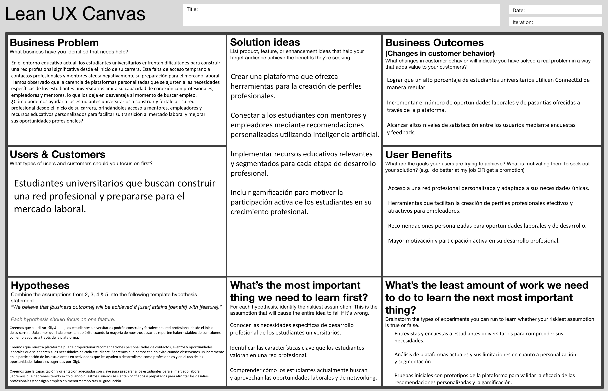

## 1.3. Segmentos objetivo

#### **Estudiantes Universitarios Freelancers**

Estudiantes de cualquier ciclo universitario que buscan ofrecer sus servicios de manera independiente para adquirir experiencia laboral, generar ingresos y construir una red de clientes. Estos estudiantes pueden pertenecer a diversas especialidades como diseño gráfico, programación, marketing digital, redacción, tutorías académicas, entre otros.

**Características:**

* Buscan oportunidades de trabajo flexible que les permitan combinar sus estudios con el trabajo freelance.
* Necesitan herramientas que los ayuden a promocionar sus habilidades y construir una cartera de clientes.
* Valoran la facilidad de pago y la seguridad en la gestión de contratos.

#### **Personas y Emprendimientos que buscan contratar servicios freelance**

Individuos o empresas que requieren servicios especializados sin la necesidad de contratar empleados a tiempo completo. Esto incluye emprendedores, startups, pequeñas empresas y particulares que buscan soluciones rápidas y accesibles para sus proyectos.

**Características:**

* Buscan talento accesible y de calidad para tareas específicas.
* Prefieren plataformas que garanticen la seguridad en la contratación y el cumplimiento del trabajo.
* Valoran las recomendaciones y validaciones de otros clientes para elegir freelancers confiables.

<div style="page-break-before: always;"></div>

# Capítulo II: Requirements & Analysis

## 2.1. Competidores

En el mercado freelance existen múltiples plataformas consolidadas, pero ninguna está 100% orientada al talento universitario. Por ello, los competidores identificados para GigU son plataformas freelance generalistas que, aunque comparten funcionalidades similares, no cubren a profundidad las necesidades específicas de los estudiantes universitarios que buscan dar sus primeros pasos profesionales.

### 2.1.1. Análisis competitivo

A continuación se presenta el análisis competitivo comparando a GigU con las principales alternativas del mercado freelance. Se evalúan dimensiones como perfil estratégico, segmento objetivo, propuesta de valor, canales, relaciones con el cliente y ventajas competitivas.

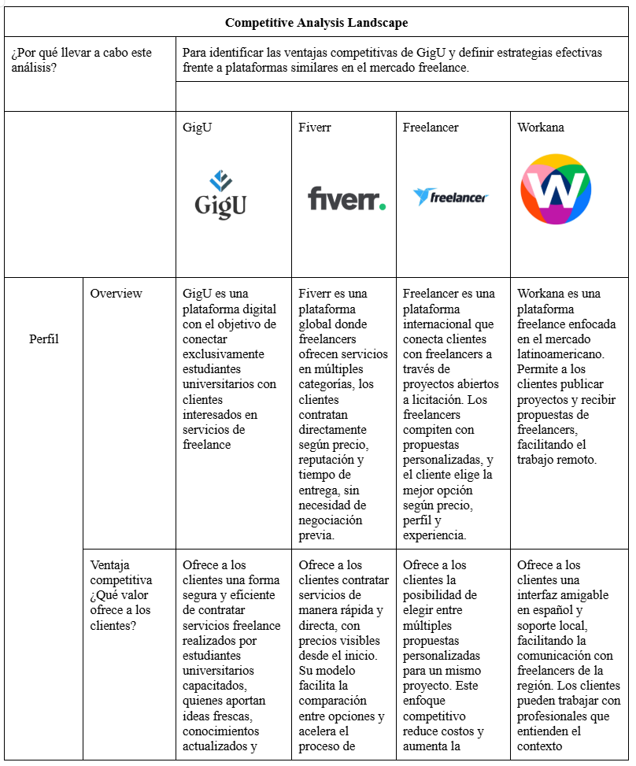
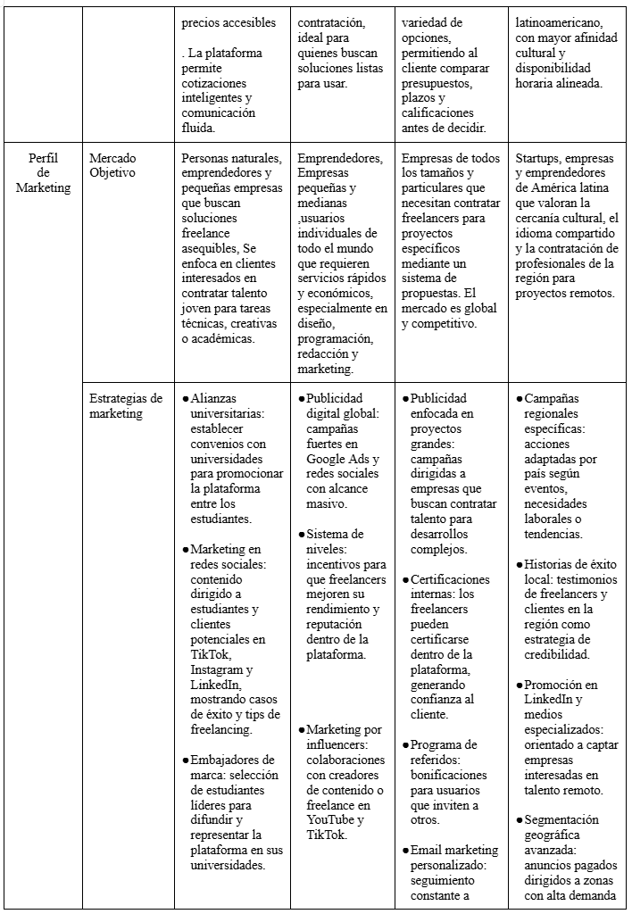
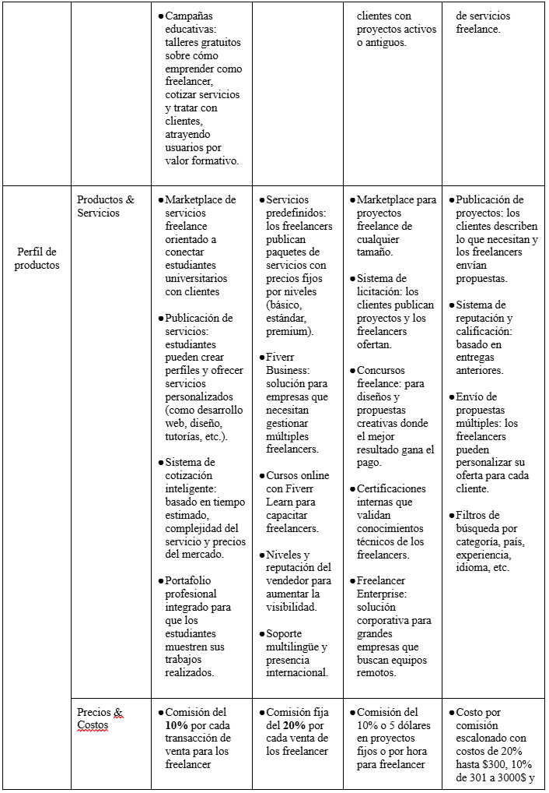
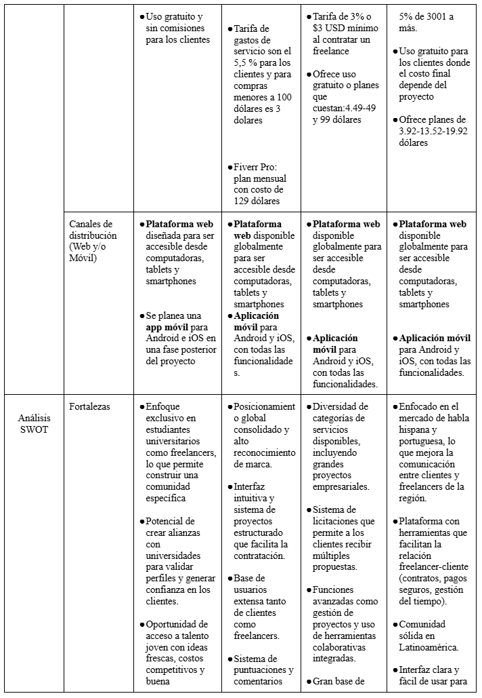
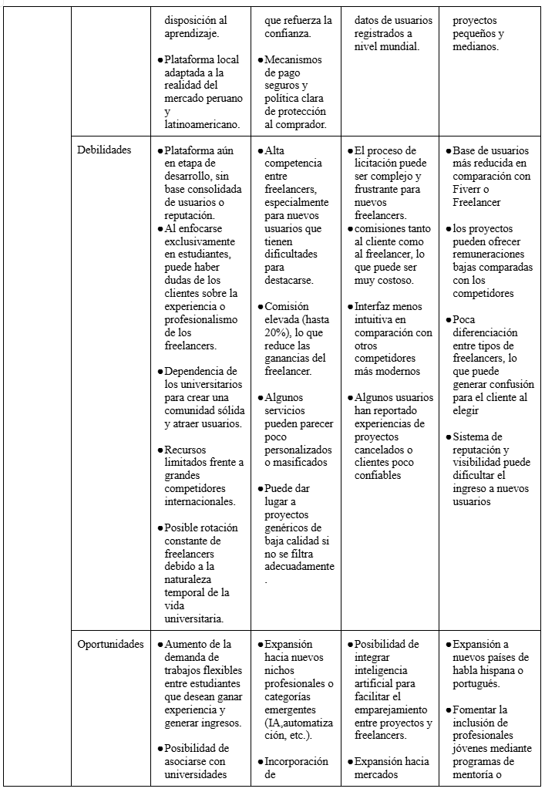
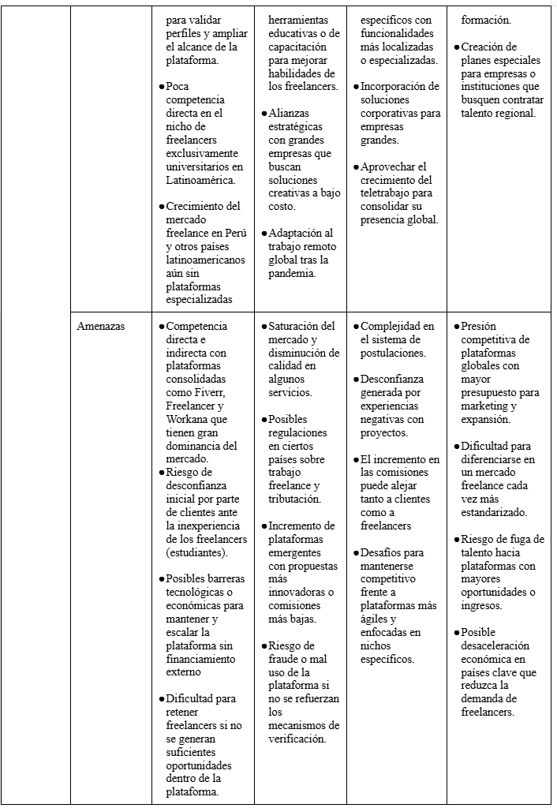

### 2.1.2. Estrategias y tácticas frente a competidores

GigU adopta una estrategia de **diferenciación centrada en el talento universitario**, apoyándose en un enfoque educativo, precios accesibles y alianzas con instituciones académicas. A diferencia de los grandes actores del mercado freelance global, nuestra plataforma se posiciona como una alternativa confiable y de propósito social que conecta clientes con estudiantes verificados académicamente.

Las tácticas principales son:

* **Verificación académica:** Validar que los freelancers sean estudiantes activos para transmitir confianza al cliente.
* **Soporte regional y en español:** Aprovechar la debilidad de plataformas globales con soporte limitado o genérico.
* **Personalización:** Recomendaciones de proyectos basadas en carrera, habilidades y disponibilidad del estudiante.
* **Garantías y filtros de calidad:** Mitigar la percepción de “poca experiencia” con reseñas reales, portafolios y calificaciones.
* **Pagos seguros y automatizados:** Reducir la fricción e inseguridad de métodos informales (Yape, transferencias directas).

En conjunto, la estrategia busca capitalizar las debilidades de los competidores (poca personalización, fuerte competencia global, comisiones elevadas) y convertirlas en ventajas competitivas para GigU.

## 2.2. Entrevistas

### 2.2.1. Diseño de entrevistas

Para el proceso de *needfinding* se diseñaron dos guías de entrevista, una por cada segmento objetivo. El objetivo fue identificar motivaciones, dificultades actuales, comportamientos de búsqueda de trabajo/contratación y requisitos ideales de una plataforma freelance universitaria.

**Segmento objetivo 1: Estudiantes Universitarios Freelancers**

* ¿Cuál es tu nombre completo?
* ¿Cuál es tu edad?
* ¿Dónde vives?
* ¿Has ofrecido tus servicios como freelancer alguna vez? ¿En qué área?
* ¿Qué te motivó a ofrecer tus servicios de manera independiente?
* ¿Dónde sueles buscar oportunidades freelance (redes, plataformas, conocidos, etc.)?
* ¿Qué dificultades has encontrado al intentar conseguir clientes como estudiante?
* ¿Qué características debería tener una plataforma ideal para ayudarte a encontrar clientes?
* ¿Qué métodos usas actualmente para cobrar tus servicios? ¿Has tenido problemas con eso?
* ¿Cuánto tiempo a la semana podrías dedicarle a trabajos freelance?
* ¿Crees que sería útil tener una app que te sugiera proyectos freelance según tu perfil y habilidades?
* ¿Qué tan importante es para ti tener una forma segura y automática de cobrar por tu trabajo freelance?

**Segmento objetivo 2: Personas y Emprendimientos que buscan contratar servicios freelance**

* ¿Cuál es tu nombre completo?
* ¿Cuál es tu edad?
* ¿Dónde vives?
* ¿Alguna vez has contratado a un freelancer para un proyecto? ¿Cómo fue tu experiencia?
* ¿Qué tipo de tareas sueles tercerizar o te gustaría tercerizar?
* ¿Qué canales usas actualmente para encontrar freelancers (plataformas, conocidos, redes)?
* ¿Qué te haría confiar en un estudiante universitario como freelancer?
* ¿Qué tan importante es para ti poder ver recomendaciones o validaciones de otros clientes?
* ¿Te gustaría una plataforma que se encargue de gestionar los pagos y acuerdos con el freelancer, o prefieres hacerlo tú directamente con la persona?
* ¿Qué haría que descartes a un freelancer incluso si su precio es atractivo?
* ¿Qué funcionalidades te gustaría ver en una plataforma para contratar freelancers?
* ¿Qué tan importante es para ti poder negociar el precio antes de contratar un servicio freelance? ¿Preferirías un precio fijo o la opción de llegar a un acuerdo con el freelancer?
* ¿Qué factores tomas en cuenta al elegir a un freelancer: precio, portafolio, tiempo de entrega, reputación, otro? ¿Cuál de ellos pesa más para ti al decidir?

### 2.2.2. Registro de entrevistas

**Segmento objetivo #1: Estudiantes Universitarios Freelancers**

**Entrevistado N°1: Bruno Sebastián Gamarra Torres**

* Sexo: Masculino
* Edad: 23
* Ubicación: Surco
* Instante de inicio: 0:03 min · Duración: 3:44

**Resumen:** Bruno ofrece servicios de diseño gráfico y edición de video desde hace algunos meses, motivado por la necesidad económica y por ganar experiencia. Consigue clientes sobre todo vía Instagram y TikTok, pero lidia con la desconfianza hacia estudiantes. Cobra por Yape, Plin y transferencias, y a veces sufre retrasos. Una plataforma ideal, según él, debería permitir reseñas reales, chat integrado y contratos.


**Entrevistado N°2: Werner Lang**

* Sexo: Masculino
* Edad: 20
* Ubicación: San Isidro
* Instante de inicio: 3:45 min · Duración: 9:57 min

**Resumen:** Werner trabaja en diseño gráfico y desarrollo web como freelancer para aplicar lo aprendido y ganar experiencia antes de egresar. Consigue clientes por conocidos, redes sociales y Workana, pero siente que no lo toman en serio por ser estudiante; además carece de un portafolio sólido. Cobra por Yape o transferencia, con demoras ocasionales. Dedica 8–12 horas semanales. Considera que una plataforma ideal debe facilitar mostrar habilidades, cotizar, asegurar pagos y permitir comunicación fluida, además de sugerirle proyectos alineados a su perfil.


**Entrevistado N°3: Mario André Cacho Seminario**

* Sexo: Masculino
* Edad: 21
* Ubicación: Surco
* Link: [YouTube](https://youtu.be/hSg2bZ3Jgbc) · Instante de inicio: 0:10 · Duración: 3:26

**Resumen:** Mario crea videos de marketing para pequeñas empresas. Le motiva ampliar su perspectiva profesional, pero le resulta difícil conseguir clientes porque priorizan la experiencia. Consigue oportunidades por redes sociales y contactos cercanos, y cobra por transferencia bancaria. Dedica 6–8 horas semanales. Valora que una plataforma muestre a perfiles de todos los niveles, sugiera proyectos por habilidades, exhiba un historial de trabajos y cuente con un sistema de cobros seguro.

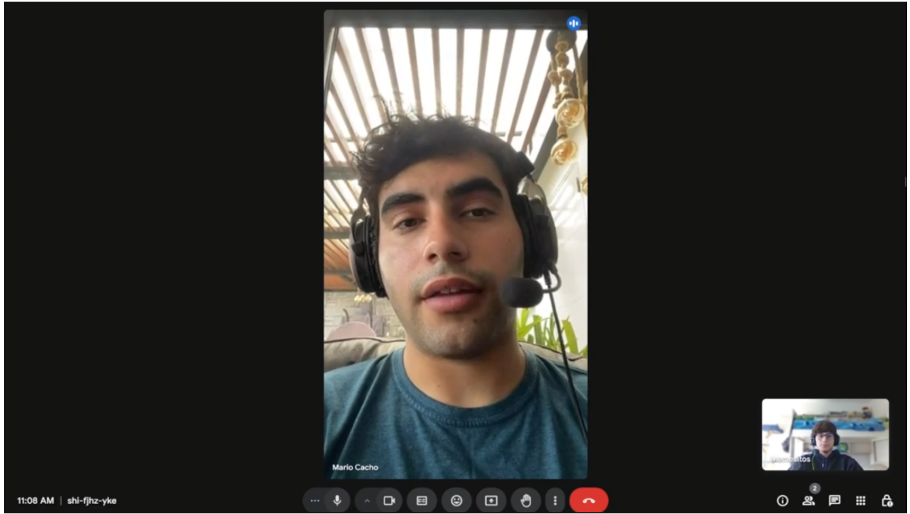

**Segmento objetivo #2: Personas y Emprendimientos que buscan contratar servicios freelance**

**Entrevistada N°1: Yulia Estephania Martinez Martinez**

* Sexo: Femenino
* Edad: 19
* Ubicación: Surco
* Link: [YouTube](https://youtu.be/MFs44DHr8_Q) · Instante de inicio: 0:01 · Duración: 5:46


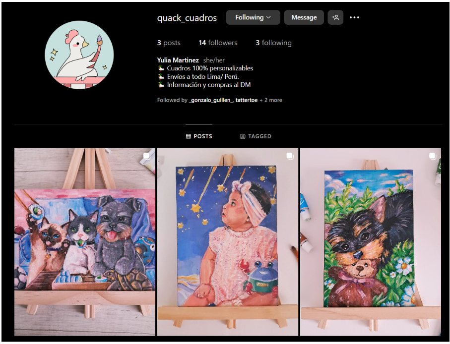

**Resumen:** Yulia tiene un emprendimiento de cuadros personalizados (*Quack_cuadros*). Aún no ha contratado freelancers pero está interesada en tercerizar marketing digital (reels) y diseño web. Actualmente busca talento por Instagram y contactos, lo cual considera poco confiable.

* **Criterios para confiar:** portafolio visual para trabajos creativos; CV para otros; valora recomendaciones y validaciones.
* **Pagos:** prefiere que la plataforma gestione pagos y acuerdos.
* **Motivos de descarte:** mala calidad, falta de responsabilidad, poca puntualidad.
* **Funciones deseadas:** perfiles detallados, herramientas de negociación, reuniones dentro de la plataforma, chats y acuerdos formales.
* **Factores de decisión:** el portafolio es lo más determinante, seguido del precio; un trabajo que impacte positivamente la vuelve flexible en el pago.

**Entrevistado N°2: Fabrizio Morales**

* Sexo: Masculino
* Edad: 22
* Ubicación: La Molina
* Instante de inicio: 25:32 min · Duración: 31:17 min


**Resumen:** Fabrizio dirige un negocio de venta de vapes y contrata freelancers para marketing y ventas, principalmente por Facebook y LinkedIn, apoyándose también en recomendaciones cercanas.

* **Criterios para confiar:** portafolio visual o ejemplos previos para trabajos creativos; CV para otros; testimonios de antiguos clientes.
* **Pagos:** prefiere que la plataforma gestione acuerdos y pagos para evitar negociaciones directas.
* **Motivos de descarte:** trabajo deficiente, falta de responsabilidad, retrasos en entregas.
* **Funciones deseadas:** perfiles completos, herramientas de negociación, reuniones dentro de la plataforma, chats formales con acuerdos visibles.
* **Factores de decisión:** el portafolio visual es lo más determinante; si un resultado impacta positivamente, acepta pagar más de lo previsto.

Link de entrevista: [SharePoint UPC](https://upcedupe-my.sharepoint.com/:v:/g/personal/u202213241_upc_edu_pe/ERWRYYotMDNKrb9UZXiaV90BczcuHnygJ1UOZNQE1nmmxQ?nav=eyJyZWZlcnJhbEluZm8iOnsicmVmZXJyYWxBcHAiOiJPbmVEcml2ZUZvckJ1c2luZXNzIiwicmVmZXJyYWxBcHBQbGF0Zm9ybSI6IldlYiIsInJlZmVycmFsTW9kZSI6InZpZXciLCJyZWZlcnJhbFZpZXciOiJNeUZpbGVzTGlua0NvcHkifX0&e=v3wSIJ)

### 2.2.3. Análisis de entrevistas

**Segmento 1 — Estudiantes Universitarios Freelancers.** Los tres entrevistados (Bruno, Werner y Mario) coinciden en que la principal motivación es generar ingresos mientras ganan experiencia profesional, y que la mayor barrera es la **desconfianza del cliente hacia los estudiantes**. El insight central es que, más que su nivel de experiencia, el obstáculo real es la percepción del mercado; esto evidencia la necesidad de **mecanismos de validación**: reseñas, calificaciones y contratos formales dentro de la plataforma.

Usan redes sociales y plataformas como Workana, pero obtienen poca visibilidad. Surge así un segundo insight: los freelancers quieren ser emparejados por **habilidades**, no únicamente por historial previo, lo que abre espacio a un sistema de recomendaciones por competencias. En cuanto a pagos, todos usan Yape y transferencias y han sufrido retrasos, lo que refuerza la necesidad de un **sistema de cobros seguro y automatizado**. Además del ingreso, valoran construir reputación profesional y recibir retroalimentación, señal de que la plataforma también debe actuar como un espacio de **desarrollo de carrera**.

**Segmento 2 — Personas y Emprendimientos que buscan freelancers.** Yulia y Fabrizio priorizan **calidad y responsabilidad** por encima del precio. El insight clave es que el **portafolio visual pesa más que el costo**: si un trabajo impacta positivamente, están dispuestos a pagar más. Ambos muestran desconfianza hacia perfiles sin referencias, por lo que las **recomendaciones, testimonios y perfiles detallados** son elementos indispensables.

En la gestión de acuerdos y pagos ambos prefieren no tratar directamente con el freelancer, lo que revela una necesidad de **automatizar negociación, acuerdos y pagos dentro de la plataforma**. Finalmente, el impacto emocional del resultado influye en la disposición a pagar más, lo que asigna un rol estratégico a la **presentación del trabajo** (antes y después de la entrega).

**Conclusión transversal.** Ambos segmentos convergen en la necesidad de una plataforma que ofrezca: (i) perfiles verificados y portafolios, (ii) emparejamiento inteligente por habilidades, (iii) acuerdos y pagos seguros gestionados por la plataforma, (iv) reseñas y reputación, y (v) comunicación fluida dentro del entorno. Estos hallazgos alimentan directamente los *User Personas*, la *User Task Matrix* y los *Empathy Maps* del siguiente apartado.

## 2.3. Needfinding

En esta sección se presentan los artefactos derivados del análisis de la información recolectada en las entrevistas, sintetizando motivaciones, problemas y requisitos para cada segmento objetivo.

**Segmento objetivo #1: Estudiantes Universitarios Freelancers**

* **Motivaciones principales:**
  * Desarrollo profesional y aplicación de lo aprendido en la universidad.
  * Ganar experiencia real antes de egresar.
  * Explorar distintas áreas del mercado y ampliar su perspectiva profesional.
* **Problemas identificados:**
  * Dificultad para conseguir clientes por el prejuicio hacia su condición de estudiante.
  * Poca visibilidad en plataformas tradicionales y baja confianza hacia perfiles jóvenes.
  * Problemas con los pagos: demoras, renegociaciones y falta de sistemas seguros.
* **Requisitos para una plataforma ideal:**
  * Permitir mostrar habilidades y portafolio aun con experiencia limitada.
  * Sugerencias de proyectos basadas en habilidades y perfil.
  * Herramientas de cotización automática y segura.
  * Historial de trabajos realizados.
  * Cobros seguros y automatizados.
  * Comunicación fluida dentro de la plataforma.

**Segmento objetivo #2: Personas y Emprendimientos que buscan contratar servicios freelance**

* **Motivaciones principales:**
  * Externalizar tareas específicas (diseño, marketing, desarrollo web).
  * Falta de tiempo o conocimiento técnico para tareas clave del negocio.
  * Necesidad de soluciones rápidas y flexibles sin contratar personal fijo.
* **Problemas identificados:**
  * Desconfianza al contratar freelancers sin referencias.
  * Miedo a mala calidad, incumplimiento o falta de responsabilidad.
  * Inseguridad para negociar precios o gestionar pagos.
* **Requisitos para una plataforma ideal:**
  * Perfiles detallados con muestras de trabajo previas.
  * Sistema de calificaciones y opiniones verificadas.
  * Gestión clara de pagos y acuerdos dentro de la plataforma.
  * Chat interno, reuniones virtuales y acuerdos escritos.
  * Negociación dentro de rangos sugeridos.
  * Visualización clara del costo total del proyecto.

### 2.3.1. User Personas

A partir del análisis anterior se construyeron dos *User Personas* que representan arquetípicamente a cada segmento. Estos perfiles orientarán las decisiones de diseño y priorización del Product Backlog.

User Persona del Usuario Estudiante Freelancer:
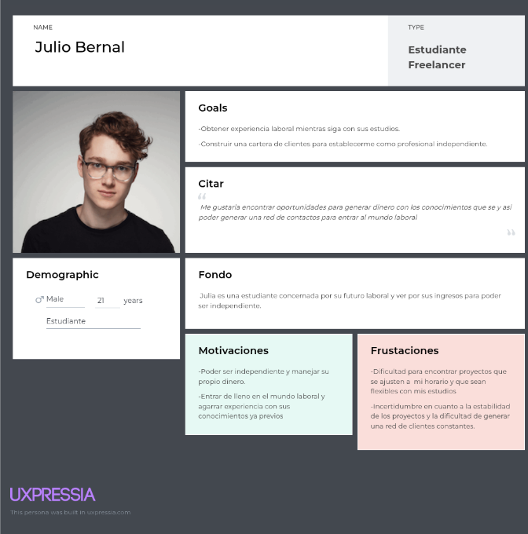

User Persona del Usuario Persona o Emprendimiento:
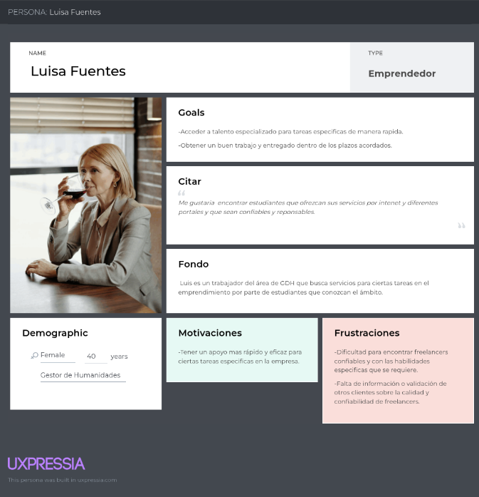

### 2.3.2. User Task Matrix

La *User Task Matrix* cruza las tareas clave identificadas con la frecuencia e importancia que cada *User Persona* les asigna. Este artefacto nos permite priorizar funcionalidades en las fases de arquitectura e implementación.

| USER TASK                                         | Julio Bernal (Freelancer) |            | Luisa Fuentes (Cliente) |            |
| :------------------------------------------------ | :-----------------------: | :--------: | :---------------------: | :--------: |
|                                                   |         Frequency         | Importance |        Frequency        | Importance |
| Publicar servicios y mostrar habilidades          |           Often           |    High    |        Sometimes        |    High    |
| Cotizar precios fácilmente según tipo de trabajo  |         Sometimes         |    High    |          Often          |    High    |
| Encontrar oportunidades mediante una app central  |         Sometimes         |    High    |          Often          |   Medium   |
| Procesar pagos seguros a través de la plataforma  |           Always          |    High    |          Always         |    High    |
| Mostrar historial de trabajos realizados          |         Sometimes         |   Medium   |          Often          |   Medium   |
| Negociar precios dentro de un rango flexible      |         Sometimes         |   Medium   |          Always         |    High    |
| Establecer acuerdos y comunicación en la plataforma |         Often           |    High    |          Always         |    High    |

### 2.3.3. Empathy Maps

Los *Empathy Maps* permiten construir una comprensión profunda de la perspectiva y experiencia de cada *User Persona*. Para cada perfil se describe lo que el usuario **ve, escucha, dice, hace y siente**, así como sus *pains* y *gains*, lo que habilita decisiones de diseño centradas en el usuario.

Empathy Map del Estudiante Freelancer:
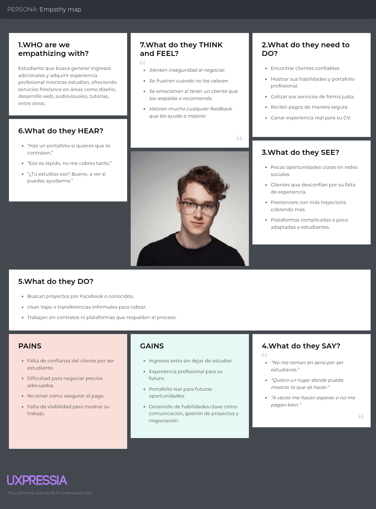

Empathy Map de Persona o Empresa:
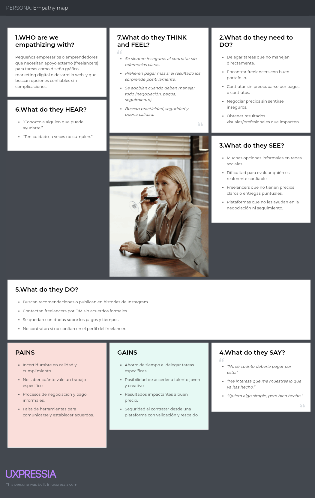

### 2.3.4. As-Is Scenario Mapping

El *As-Is Scenario Mapping* refleja el estado actual de la experiencia de cada segmento **antes** de utilizar GigU. Recorre las fases típicas —desde la búsqueda de oportunidades o de talento, pasando por la contratación, ejecución y cobro— e identifica emociones, acciones y puntos de dolor en cada paso. Este artefacto es la línea base sobre la que, en el Capítulo III, se diseñará el *To-Be Scenario*.

As-Is del Estudiante Freelancer (búsqueda de clientes, negociación informal y cobro mediante Yape/transferencias):
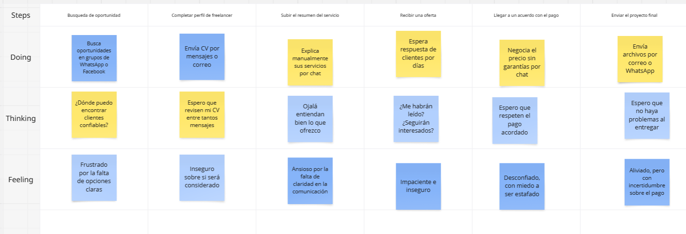

As-Is de Persona o Emprendimiento (búsqueda de freelancers vía redes, contratación sin contratos formales y coordinación manual de pagos):
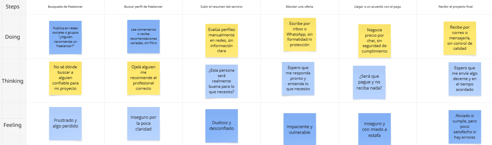

<div style="page-break-before: always;"></div>

# Capítulo III: Requirements Specification

## 3.1. To-Be Scenario Mapping

Se realizaron los siguientes cuadros en la herramienta Miro, el link original puede ser observado aquí: 

[LINK TO-BE](https://miro.com/app/board/uXjVIFvzuZo=/?share_link_id=785027992176)

* To-Be Scenario Mapping para Estudiantes Universitarios Freelancers
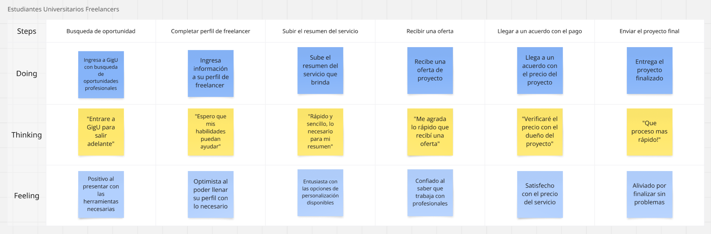

* To-Be Scenario Mapping para Personas y Emprendimientos que buscan contratar servicios Freelance

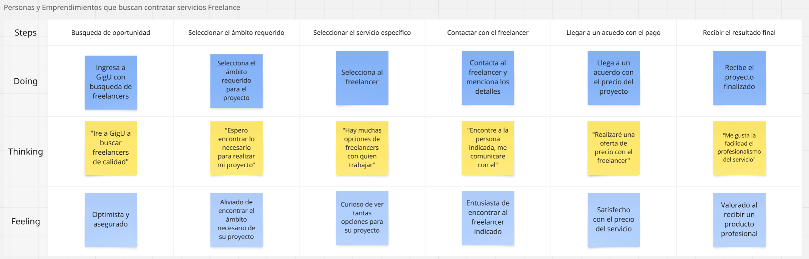

## 3.2. User Stories

* EPICS
Las epics definidas para el proyecto GigU están orientadas a cubrir las necesidades principales tanto de los estudiantes de la UPC como de los usuarios que buscan contratar servicios freelance. Estas epics abordan funcionalidades esenciales para el funcionamiento de la plataforma, asegurando una experiencia fluida y efectiva desde la publicación de habilidades por parte de los estudiantes hasta la contratación por parte de clientes o emprendimientos. Desde la interfaz de la landing page, donde los usuarios conocen la propuesta de valor de GigU, hasta la gestión técnica del backend, frontend y servicios web, las epics actúan como una guía estructurada que facilita el desarrollo progresivo y coherente del sistema, alineándose con los objetivos académicos y de empleabilidad del proyecto.

| Epic ID | Título | Descripción |
| :---: | ----- | ----- |
| EP01 | Onboarding del Visitante | Como visitante, deseo navegar la landing page, conocer los beneficios y modelo de uso de GigU, y consultar preguntas frecuentes para decidir si registrarme. |
| EP02 | Autenticación y Gestión de Cuenta | Como usuario, deseo registrarme, iniciar sesión y recuperar mi acceso de forma segura para proteger mi información y operar bajo mi identidad. |
| EP03 | Perfil Profesional del Freelancer | Como freelancer, deseo crear y mantener un perfil público con habilidades, experiencia y descripción personal para presentar mi propuesta profesional a clientes potenciales. |
| EP04 | Portafolio y Evidencias del Freelancer | Como freelancer, deseo publicar evidencias de trabajos previos en mi portafolio para respaldar mi experiencia y generar confianza ante clientes potenciales. |
| EP05 | Publicación y Mantenimiento de Servicios | Como freelancer, deseo publicar, editar, pausar y retirar servicios con descripción, tarifa y plazo para ofrecerlos en el catálogo de GigU. |
| EP06 | Descubrimiento del Catálogo | Como cliente, deseo explorar el catálogo de servicios mediante búsqueda, filtros y ordenamiento para encontrar la oferta que mejor se ajuste a mi necesidad. |
| EP07 | Reputación y Reseñas Públicas | Como cliente y freelancer, deseo registrar y consultar calificaciones y comentarios sobre servicios entregados para sustentar la confianza pública entre las partes. |
| EP08 | Solicitud y Acuerdo de Contratación | Como cliente y freelancer, deseo enviar, recibir, aceptar o rechazar solicitudes de contratación para formalizar el inicio de un proyecto en condiciones acordadas. |
| EP09 | Gestión del Ciclo de Vida del Proyecto | Como cliente y freelancer, deseo dar seguimiento a los proyectos activos, registrar avances y formalizar la entrega para coordinar el trabajo de forma transparente. |
| EP10 | Sugerencia de Precio Asistida | Como freelancer, deseo recibir una sugerencia de precio basada en complejidad, tiempo y categoría del servicio para cotizar de forma consistente y justa. |
| EP11 | Mensajería Coordinada Cliente-Freelancer | Como cliente y freelancer, deseo intercambiar mensajes y notificaciones dentro de la plataforma para coordinar detalles del servicio antes y durante el proyecto. |
| EP12 | Reportes, Moderación y Soporte | Como usuario y administrador, deseo reportar comportamientos indebidos, bloquear interacciones no deseadas y abrir tickets de soporte para mantener un entorno seguro y atendido. |

* User Stories


| Story ID                | User                                                                                                                                                                                                                                                                                                                  | Priority | Epic |
| :---------------------- | :-------------------------------------------------------------------------------------------------------------------------------------------------------------------------------------------------------------------------------------------------------------------------------------------------------------------- | :------- | :--- |
| US01                    | Visitante de GigU                                                                                                                                                                                                                                                                                                     | Alta     | EP01 |
| **Title**               | Navegar de forma intuitiva en la landing page                                                                                                                                                                                                                                                                         |          |      |
| **Description**         | Como visitante de GigU, deseo que la landing page tenga una barra de navegación clara y accesible para encontrar fácilmente las secciones importantes.                                                                                                                                                                |          |      |
|                         |                                                                                                                                                                                                                                                                                                                       |          |      |
| **Acceptance Criteria** | **Escenario 01:** Dado que un visitante está en la landing page, cuando consulta el menú de navegación, entonces el sistema muestra las secciones principales del sitio.<br><br>**Escenario 02:** Dado que un visitante navega por la página, cuando cambia de sección, entonces el sistema indica la sección activa. |          |      |


| Story ID                | User                                                                                                                                                                                                                                                                                                                                                                  | Priority | Epic |
| :---------------------- | :-------------------------------------------------------------------------------------------------------------------------------------------------------------------------------------------------------------------------------------------------------------------------------------------------------------------------------------------------------------------- | :------- | :--- |
| US02                    | Visitante                                                                                                                                                                                                                                                                                                                                                             | Alta     | EP01 |
| **Title**               | Acceder rápidamente a funcionalidades clave                                                                                                                                                                                                                                                                                                                           |          |      |
| **Description**         | Como visitante, deseo acceder desde la landing page a secciones clave como publicar proyecto o registrarme para actuar rápidamente.                                                                                                                                                                                                                                   |          |      |
|                         |                                                                                                                                                                                                                                                                                                                                                                       |          |      |
| **Acceptance Criteria** | **Escenario 01:** Dado que un visitante está en la landing page, cuando busca acciones principales, entonces el sistema muestra accesos visibles a funcionalidades clave.<br><br>**Escenario 02:** Dado que un visitante selecciona una acción principal, cuando solicita registrarse o publicar un proyecto, entonces el sistema lo dirige al flujo correspondiente. |          |      |


| Story ID                | User                                                                                                                                                                                                                                                                                                                                               | Priority | Epic |
| :---------------------- | :------------------------------------------------------------------------------------------------------------------------------------------------------------------------------------------------------------------------------------------------------------------------------------------------------------------------------------------------- | :------- | :--- |
| US03                    | Visitante de GigU                                                                                                                                                                                                                                                                                                                                  | Alta     | EP01 |
| **Title**               | Navegar por la landing page con menú claro                                                                                                                                                                                                                                                                                                         |          |      |
| **Description**         | Como visitante de GigU, deseo que la landing page tenga una barra de navegación clara para encontrar fácilmente las secciones importantes.                                                                                                                                                                                                         |          |      |
|                         |                                                                                                                                                                                                                                                                                                                                                    |          |      |
| **Acceptance Criteria** | **Escenario 01:** Dado que un visitante accede a la landing page, cuando consulta el menú, entonces el sistema presenta las secciones relevantes de forma estructurada.<br><br>**Escenario 02:** Dado que un visitante navega entre secciones, cuando usa el menú, entonces el sistema mantiene coherencia en el orden y nombres de las secciones. |          |      |


| Story ID                | User                                                                                                                                                                                                                                                                                                                              | Priority | Epic |
| :---------------------- | :-------------------------------------------------------------------------------------------------------------------------------------------------------------------------------------------------------------------------------------------------------------------------------------------------------------------------------- | :------- | :--- |
| US04                    | Usuario registrado                                                                                                                                                                                                                                                                                                                | Alta     | EP02 |
| **Title**               | Iniciar sesión como freelancer o cliente                                                                                                                                                                                                                                                                                          |          |      |
| **Description**         | Como usuario registrado, deseo poder iniciar sesión para acceder a mi cuenta y funcionalidades específicas según mi rol.                                                                                                                                                                                                          |          |      |
|                         |                                                                                                                                                                                                                                                                                                                                   |          |      |
| **Acceptance Criteria** | **Escenario 01:** Dado que un usuario proporciona credenciales válidas, cuando el sistema procesa el inicio de sesión, entonces habilita las funcionalidades según su rol.<br><br>**Escenario 02:** Dado que un usuario proporciona credenciales incorrectas, cuando intenta autenticarse, entonces el sistema rechaza el acceso. |          |      |


| Story ID                | User                                                                                                                                                                                                                                                                                                                                     | Priority | Epic |
| :---------------------- | :--------------------------------------------------------------------------------------------------------------------------------------------------------------------------------------------------------------------------------------------------------------------------------------------------------------------------------------- | :------- | :--- |
| US05                    | Visitante                                                                                                                                                                                                                                                                                                                                | Alta     | EP02 |
| **Title**               | Registrarse con cuenta de Google                                                                                                                                                                                                                                                                                                         |          |      |
| **Description**         | Como visitante, deseo registrarme con Google para agilizar el proceso de creación de cuenta.                                                                                                                                                                                                                                             |          |      |
|                         |                                                                                                                                                                                                                                                                                                                                          |          |      |
| **Acceptance Criteria** | **Escenario 01:** Dado que un visitante elige registrarse con Google, cuando autoriza el uso de sus datos básicos, entonces el sistema crea su cuenta.<br><br>**Escenario 02:** Dado que una cuenta de Google ya está registrada, cuando intenta registrarse nuevamente, entonces el sistema notifica que ya existe una cuenta asociada. |          |      |


| Story ID                | User                                                                                                                                                                                                                                                                                                                              | Priority | Epic |
| :---------------------- | :-------------------------------------------------------------------------------------------------------------------------------------------------------------------------------------------------------------------------------------------------------------------------------------------------------------------------------- | :------- | :--- |
| US06                    | Usuario                                                                                                                                                                                                                                                                                                                           | Alta     | EP02 |
| **Title**               | Solicitar recuperación de contraseña                                                                                                                                                                                                                                                                                              |          |      |
| **Description**         | Como usuario, deseo solicitar la recuperación de mi contraseña para volver a acceder si la olvido.                                                                                                                                                                                                                                |          |      |
|                         |                                                                                                                                                                                                                                                                                                                                   |          |      |
| **Acceptance Criteria** | **Escenario 01:** Dado que un usuario olvidó su contraseña, cuando proporciona un correo registrado, entonces el sistema genera un mecanismo seguro de recuperación.<br><br>**Escenario 02:** Dado que ingresa un correo no registrado, cuando solicita recuperar, entonces el sistema informa que no existe una cuenta asociada. |          |      |


| Story ID                | User                                                                                                                                                                                                                                                                    | Priority | Epic |
| :---------------------- | :---------------------------------------------------------------------------------------------------------------------------------------------------------------------------------------------------------------------------------------------------------------------- | :------- | :--- |
| US07                    | Usuario                                                                                                                                                                                                                                                                 | Alta     | EP02 |
| **Title**               | Restablecer contraseña mediante enlace seguro                                                                                                                                                                                                                           |          |      |
| **Description**         | Como usuario, deseo restablecer mi contraseña usando un enlace enviado a mi correo.                                                                                                                                                                                     |          |      |
|                         |                                                                                                                                                                                                                                                                         |          |      |
| **Acceptance Criteria** | **Escenario 01:** Dado que un usuario recibe un enlace válido, cuando accede a él, entonces puede crear una nueva contraseña.<br><br>**Escenario 02:** Dado que ingresa una contraseña inválida, cuando intenta registrarla, entonces el sistema notifica la invalidez. |          |      |


| Story ID                | User                                                                                                                                                                                                                                                                                                                      | Priority | Epic |
| :---------------------- | :------------------------------------------------------------------------------------------------------------------------------------------------------------------------------------------------------------------------------------------------------------------------------------------------------------------------ | :------- | :--- |
| US08                    | Visitante                                                                                                                                                                                                                                                                                                                 | Media    | EP01 |
| **Title**               | Conocer los beneficios de GigU                                                                                                                                                                                                                                                                                            |          |      |
| **Description**         | Como visitante, deseo conocer los beneficios de usar GigU para entender por qué debería utilizar la plataforma.                                                                                                                                                                                                           |          |      |
|                         |                                                                                                                                                                                                                                                                                                                           |          |      |
| **Acceptance Criteria** | **Escenario 01:** Dado que un visitante accede a la sección de información, cuando consulta los beneficios, entonces el sistema presenta los principales beneficios de la plataforma.<br><br>**Escenario 02:** Dado que selecciona un beneficio, cuando solicita ampliación, entonces recibe más información explicativa. |          |      |


| Story ID                | User                                                                                                                                                                                                                                                                                                                           | Priority | Epic |
| :---------------------- | :----------------------------------------------------------------------------------------------------------------------------------------------------------------------------------------------------------------------------------------------------------------------------------------------------------------------------- | :------- | :--- |
| US09                    | Visitante                                                                                                                                                                                                                                                                                                                      | Media    | EP01 |
| **Title**               | Conocer diferencias entre roles                                                                                                                                                                                                                                                                                                |          |      |
| **Description**         | Como visitante, deseo saber las diferencias entre registrarme como freelancer o cliente para elegir el rol adecuado.                                                                                                                                                                                                           |          |      |
|                         |                                                                                                                                                                                                                                                                                                                                |          |      |
| **Acceptance Criteria** | **Escenario 01:** Dado que un visitante revisa la sección de roles, cuando consulta la información, entonces el sistema muestra comparaciones claras.<br><br>**Escenario 02:** Dado que el visitante selecciona un rol, cuando consulta más detalles, entonces el sistema muestra información específica del flujo de ese rol. |          |      |


| Story ID                | User                                                                                                                                                                                                                                                                                                                 | Priority | Epic |
| :---------------------- | :------------------------------------------------------------------------------------------------------------------------------------------------------------------------------------------------------------------------------------------------------------------------------------------------------------------- | :------- | :--- |
| US10                    | Visitante                                                                                                                                                                                                                                                                                                            | Media    | EP01 |
| **Title**               | Ver experiencias de otros usuarios                                                                                                                                                                                                                                                                                   |          |      |
| **Description**         | Como visitante, deseo ver testimonios de usuarios anteriores para confiar en la plataforma.                                                                                                                                                                                                                          |          |      |
|                         |                                                                                                                                                                                                                                                                                                                      |          |      |
| **Acceptance Criteria** | **Escenario 01:** Dado que un visitante accede a la sección de experiencias, cuando visualiza testimonios, entonces el sistema muestra nombre, rol y comentario.<br><br>**Escenario 02:** Dado que solicita ver más testimonios, cuando el sistema detecta la acción, entonces muestra más experiencias registradas. |          |      |


| Story ID                | User                                                                                                                                                                                                                                                                                                | Priority | Epic |
| :---------------------- | :-------------------------------------------------------------------------------------------------------------------------------------------------------------------------------------------------------------------------------------------------------------------------------------------------- | :------- | :--- |
| US11                    | Visitante                                                                                                                                                                                                                                                                                           | Media    | EP01 |
| **Title**               | Conocer tipos de servicios disponibles                                                                                                                                                                                                                                                              |          |      |
| **Description**         | Como visitante, deseo conocer los tipos de servicios que puedo contratar o brindar en GigU.                                                                                                                                                                                                         |          |      |
|                         |                                                                                                                                                                                                                                                                                                     |          |      |
| **Acceptance Criteria** | **Escenario 01:** Dado que un visitante consulta la sección de tipos de servicios, cuando selecciona uno, entonces el sistema muestra su descripción.<br><br>**Escenario 02:** Dado que desea más información, cuando selecciona detalles, entonces el sistema presenta casos prácticos y ejemplos. |          |      |


| Story ID                | User                                                                                                                                                                                                                                                                                                                  | Priority | Epic |
| :---------------------- | :-------------------------------------------------------------------------------------------------------------------------------------------------------------------------------------------------------------------------------------------------------------------------------------------------------------------- | :------- | :--- |
| US12                    | Visitante                                                                                                                                                                                                                                                                                                             | Media    | EP01 |
| **Title**               | Acceder a preguntas frecuentes                                                                                                                                                                                                                                                                                        |          |      |
| **Description**         | Como visitante, deseo ver una sección de preguntas frecuentes para resolver dudas comunes sin ayuda externa.                                                                                                                                                                                                          |          |      |
|                         |                                                                                                                                                                                                                                                                                                                       |          |      |
| **Acceptance Criteria** | **Escenario 01:** Dado que un visitante accede a FAQ, cuando consulta las preguntas, entonces el sistema muestra un listado con respuestas.<br><br>**Escenario 02:** Dado que selecciona una pregunta, cuando visualiza o cierra la respuesta, entonces el sistema muestra u oculta la información según corresponda. |          |      |


| Story ID                | User                                                                                                                                                                                                                                                                                                              | Priority | Epic |
| :---------------------- | :---------------------------------------------------------------------------------------------------------------------------------------------------------------------------------------------------------------------------------------------------------------------------------------------------------------- | :------- | :--- |
| US13                    | Usuario                                                                                                                                                                                                                                                                                                           | Media    | EP01 |
| **Title**               | Buscar información dentro de preguntas frecuentes                                                                                                                                                                                                                                                                 |          |      |
| **Description**         | Como usuario, deseo buscar palabras clave en la sección de FAQ para encontrar respuestas más rápido.                                                                                                                                                                                                              |          |      |
|                         |                                                                                                                                                                                                                                                                                                                   |          |      |
| **Acceptance Criteria** | **Escenario 01:** Dado que un usuario busca información, cuando ingresa una palabra clave, entonces el sistema muestra las preguntas relacionadas.<br><br>**Escenario 02:** Dado que la búsqueda no tiene coincidencias, cuando el sistema procesa el término, entonces informa que no se encontraron resultados. |          |      |


| Story ID                | User                                                                                                                                                                                                                                                                                                                      | Priority | Epic |
| :---------------------- | :------------------------------------------------------------------------------------------------------------------------------------------------------------------------------------------------------------------------------------------------------------------------------------------------------------------------ | :------- | :--- |
| US14                    | Usuario                                                                                                                                                                                                                                                                                                                   | Media    | EP12 |
| **Title**               | Enviar un ticket de soporte                                                                                                                                                                                                                                                                                               |          |      |
| **Description**         | Como usuario, deseo enviar un mensaje de soporte si no encuentro mi duda en la FAQ para recibir asistencia personalizada.                                                                                                                                                                                                 |          |      |
|                         |                                                                                                                                                                                                                                                                                                                           |          |      |
| **Acceptance Criteria** | **Escenario 01:** Dado que un usuario no encuentra solución, cuando proporciona la información necesaria, entonces el sistema registra el ticket.<br><br>**Escenario 02:** Dado que los datos están incompletos, cuando intenta registrar el ticket, entonces el sistema rechaza el envío e informa los campos faltantes. |          |      |


| Story ID                | User                                                                                                                                                                                                                                                                                                                                                                | Priority | Epic |
| :---------------------- | :------------------------------------------------------------------------------------------------------------------------------------------------------------------------------------------------------------------------------------------------------------------------------------------------------------------------------------------------------------------ | :------- | :--- |
| US15                    | Estudiante                                                                                                                                                                                                                                                                                                                                                          | Alta     | EP03 |
| **Title**               | Crear perfil freelance                                                                                                                                                                                                                                                                                                                                              |          |      |
| **Description**         | Como estudiante, deseo crear mi perfil freelance con mi nombre, carrera y universidad para que los clientes conozcan mi identidad profesional.                                                                                                                                                                                                                      |          |      |
|                         |                                                                                                                                                                                                                                                                                                                                                                     |          |      |
| **Acceptance Criteria** | **Escenario 01:** Dado que un estudiante accede a la creación de perfil, cuando proporciona información válida como nombre, carrera y universidad, entonces el sistema registra el perfil y lo deja disponible.<br><br>**Escenario 02:** Dado que el estudiante completa el registro, cuando el sistema valida los datos, entonces confirma la creación del perfil. |          |      |


| Story ID                | User                                                                                                                                                                                                                                                                                                                        | Priority | Epic |
| :---------------------- | :-------------------------------------------------------------------------------------------------------------------------------------------------------------------------------------------------------------------------------------------------------------------------------------------------------------------------- | :------- | :--- |
| US16                    | Freelancer                                                                                                                                                                                                                                                                                                                  | Alta     | EP03 |
| **Title**               | Añadir habilidades y descripción personal                                                                                                                                                                                                                                                                                   |          |      |
| **Description**         | Como freelancer, deseo añadir habilidades y una descripción personal para destacar mis fortalezas.                                                                                                                                                                                                                          |          |      |
|                         |                                                                                                                                                                                                                                                                                                                             |          |      |
| **Acceptance Criteria** | **Escenario 01:** Dado que un freelancer edita su perfil, cuando añade habilidades y descripción válida, entonces el sistema almacena la información.<br><br>**Escenario 02:** Dado que el freelancer actualiza sus habilidades, cuando consulta su perfil público, entonces el sistema muestra la información actualizada. |          |      |


| Story ID                | User                                                                                                                                                                                                                                                                                                                                        | Priority | Epic |
| :---------------------- | :------------------------------------------------------------------------------------------------------------------------------------------------------------------------------------------------------------------------------------------------------------------------------------------------------------------------------------------ | :------- | :--- |
| US17                    | Freelancer                                                                                                                                                                                                                                                                                                                                  | Alta     | EP05 |
| **Title**               | Establecer tarifas por servicio                                                                                                                                                                                                                                                                                                             |          |      |
| **Description**         | Como freelancer, deseo establecer mis tarifas por tipo de servicio para que los clientes conozcan mis precios.                                                                                                                                                                                                                              |          |      |
|                         |                                                                                                                                                                                                                                                                                                                                             |          |      |
| **Acceptance Criteria** | **Escenario 01:** Dado que un freelancer asigna una tarifa válida, cuando el sistema valida el valor ingresado, entonces registra el precio y lo muestra públicamente.<br><br>**Escenario 02:** Dado que el freelancer ingresa un valor fuera de rango, cuando intenta guardarlo, entonces el sistema rechaza la tarifa e informa el error. |          |      |


| Story ID                | User                                                                                                                                                                                                                                                                                                                          | Priority | Epic |
| :---------------------- | :---------------------------------------------------------------------------------------------------------------------------------------------------------------------------------------------------------------------------------------------------------------------------------------------------------------------------- | :------- | :--- |
| US18                    | Freelancer                                                                                                                                                                                                                                                                                                                    | Media    | EP04 |
| **Title**               | Subir portafolio de proyectos                                                                                                                                                                                                                                                                                                 |          |      |
| **Description**         | Como freelancer, deseo subir muestras de trabajos anteriores para demostrar mi experiencia a los clientes.                                                                                                                                                                                                                    |          |      |
|                         |                                                                                                                                                                                                                                                                                                                               |          |      |
| **Acceptance Criteria** | **Escenario 01:** Dado que un freelancer proporciona archivos o enlaces válidos, cuando el sistema valida el contenido, entonces lo almacena y muestra en su perfil.<br><br>**Escenario 02:** Dado que intenta subir un archivo no permitido, cuando el sistema valida el tipo, entonces rechaza la carga e informa el error. |          |      |


| Story ID                | User                                                                                                                                                                                                                                                                                                    | Priority | Epic |
| :---------------------- | :------------------------------------------------------------------------------------------------------------------------------------------------------------------------------------------------------------------------------------------------------------------------------------------------------ | :------- | :--- |
| US19                    | Freelancer                                                                                                                                                                                                                                                                                              | Alta     | EP03 |
| **Title**               | Actualizar perfil freelance                                                                                                                                                                                                                                                                             |          |      |
| **Description**         | Como freelancer, deseo poder actualizar mi perfil cuando quiera para mantener mi información al día.                                                                                                                                                                                                    |          |      |
|                         |                                                                                                                                                                                                                                                                                                         |          |      |
| **Acceptance Criteria** | **Escenario 01:** Dado que un freelancer modifica datos válidos, cuando el sistema los valida, entonces actualiza la información públicamente.<br><br>**Escenario 02:** Dado que el perfil es actualizado, cuando consulta su vista pública, entonces los cambios se muestran sin procesos adicionales. |          |      |


| Story ID                | User                                                                                                                                                                                                                                                                                | Priority | Epic |
| :---------------------- | :---------------------------------------------------------------------------------------------------------------------------------------------------------------------------------------------------------------------------------------------------------------------------------- | :------- | :--- |
| US20                    | Freelancer                                                                                                                                                                                                                                                                          | Alta     | EP05 |
| **Title**               | Publicar un servicio personalizado                                                                                                                                                                                                                                                  |          |      |
| **Description**         | Como freelancer, deseo publicar un servicio con título, descripción y precio para ofrecerlo a potenciales clientes.                                                                                                                                                                 |          |      |
|                         |                                                                                                                                                                                                                                                                                     |          |      |
| **Acceptance Criteria** | **Escenario 01:** Dado que un freelancer completa los datos del servicio, cuando el sistema los valida, entonces registra la publicación.<br><br>**Escenario 02:** Dado que falta un campo obligatorio, cuando intenta guardar, entonces el sistema indica la información faltante. |          |      |


| Story ID                | User                                                                                                                                                                                                                                                                       | Priority | Epic |
| :---------------------- | :------------------------------------------------------------------------------------------------------------------------------------------------------------------------------------------------------------------------------------------------------------------------- | :------- | :--- |
| US21                    | Freelancer                                                                                                                                                                                                                                                                 | Media    | EP05 |
| **Title**               | Establecer plazos de entrega                                                                                                                                                                                                                                               |          |      |
| **Description**         | Como freelancer, deseo definir el tiempo de entrega estimado para que el cliente tenga expectativas claras.                                                                                                                                                                |          |      |
|                         |                                                                                                                                                                                                                                                                            |          |      |
| **Acceptance Criteria** | **Escenario 01:** Dado que un freelancer define un plazo, cuando el sistema valida el valor, entonces lo registra y muestra públicamente.<br><br>**Escenario 02:** Dado que el plazo está registrado, cuando el servicio se consulta, entonces incluye los días estimados. |          |      |


| Story ID                | User                                                                                                                                                                                                                                                                                 | Priority | Epic |
| :---------------------- | :----------------------------------------------------------------------------------------------------------------------------------------------------------------------------------------------------------------------------------------------------------------------------------- | :------- | :--- |
| US22                    | Freelancer                                                                                                                                                                                                                                                                           | Media    | EP05 |
| **Title**               | Editar servicios publicados                                                                                                                                                                                                                                                          |          |      |
| **Description**         | Como freelancer, deseo editar mis servicios publicados para corregir errores o actualizar precios.                                                                                                                                                                                   |          |      |
|                         |                                                                                                                                                                                                                                                                                      |          |      |
| **Acceptance Criteria** | **Escenario 01:** Dado que un freelancer modifica la información de un servicio, cuando el sistema la valida, entonces actualiza la publicación.<br><br>**Escenario 02:** Dado que el servicio es editado, cuando un usuario lo consulta, entonces visualiza la versión actualizada. |          |      |


| Story ID                | User                                                                                                                                                                                                                                                                                                                      | Priority | Epic |
| :---------------------- | :------------------------------------------------------------------------------------------------------------------------------------------------------------------------------------------------------------------------------------------------------------------------------------------------------------------------ | :------- | :--- |
| US23                    | Freelancer                                                                                                                                                                                                                                                                                                                | Media    | EP05 |
| **Title**               | Pausar o eliminar servicios publicados                                                                                                                                                                                                                                                                                    |          |      |
| **Description**         | Como freelancer, deseo pausar o eliminar mis servicios cuando ya no desee ofrecerlos.                                                                                                                                                                                                                                     |          |      |
|                         |                                                                                                                                                                                                                                                                                                                           |          |      |
| **Acceptance Criteria** | **Escenario 01:** Dado que un freelancer decide pausar o eliminar un servicio, cuando el sistema procesa la acción, entonces lo retira de la vista pública.<br><br>**Escenario 02:** Dado que el servicio está pausado o eliminado, cuando el freelancer revisa su listado, entonces el sistema muestra su estado actual. |          |      |


| Story ID                | User                                                                                                                                                                                                                                                                                                       | Priority | Epic |
| :---------------------- | :--------------------------------------------------------------------------------------------------------------------------------------------------------------------------------------------------------------------------------------------------------------------------------------------------------- | :------- | :--- |
| US24                    | Freelancer                                                                                                                                                                                                                                                                                                 | Media    | EP05 |
| **Title**               | Añadir imágenes o archivos al servicio                                                                                                                                                                                                                                                                     |          |      |
| **Description**         | Como freelancer, deseo subir imágenes o archivos a mis servicios para facilitar la comprensión del cliente.                                                                                                                                                                                                |          |      |
|                         |                                                                                                                                                                                                                                                                                                            |          |      |
| **Acceptance Criteria** | **Escenario 01:** Dado que un freelancer sube archivos permitidos, cuando el sistema valida el contenido, entonces los muestra asociados al servicio.<br><br>**Escenario 02:** Dado que sube múltiples imágenes, cuando el servicio se visualiza, entonces el sistema permite recorrerlas secuencialmente. |          |      |


| Story ID                | User                                                                                                                                                                                                                                                                                                 | Priority | Epic |
| :---------------------- | :--------------------------------------------------------------------------------------------------------------------------------------------------------------------------------------------------------------------------------------------------------------------------------------------------- | :------- | :--- |
| US25                    | Cliente                                                                                                                                                                                                                                                                                              | Alta     | EP06 |
| **Title**               | Buscar freelancers por palabra clave                                                                                                                                                                                                                                                                 |          |      |
| **Description**         | Como cliente, deseo buscar freelancers usando palabras clave para encontrar rápidamente lo que necesito.                                                                                                                                                                                             |          |      |
|                         |                                                                                                                                                                                                                                                                                                      |          |      |
| **Acceptance Criteria** | **Escenario 01:** Dado que un cliente ingresa una palabra clave, cuando el sistema procesa la búsqueda, entonces muestra freelancers relacionados.<br><br>**Escenario 02:** Dado que ingresa múltiples palabras, cuando el sistema filtra, entonces muestra coincidencias con al menos una de ellas. |          |      |


| Story ID                | User                                                                                                                                                                                                                                                                                                                 | Priority | Epic |
| :---------------------- | :------------------------------------------------------------------------------------------------------------------------------------------------------------------------------------------------------------------------------------------------------------------------------------------------------------------- | :------- | :--- |
| US26                    | Cliente                                                                                                                                                                                                                                                                                                              | Alta     | EP06 |
| **Title**               | Filtrar freelancers por habilidad                                                                                                                                                                                                                                                                                    |          |      |
| **Description**         | Como cliente, deseo filtrar freelancers según sus habilidades para encontrar al más apto para mi proyecto.                                                                                                                                                                                                           |          |      |
|                         |                                                                                                                                                                                                                                                                                                                      |          |      |
| **Acceptance Criteria** | **Escenario 01:** Dado que el cliente selecciona una habilidad, cuando el sistema filtra, entonces muestra solo freelancers que la tengan registrada.<br><br>**Escenario 02:** Dado que selecciona varias habilidades, cuando el sistema filtra, entonces muestra freelancers que cumplan con al menos una de ellas. |          |      |


| Story ID                | User                                                                                                                                                                                                                                                                              | Priority | Epic |
| :---------------------- | :-------------------------------------------------------------------------------------------------------------------------------------------------------------------------------------------------------------------------------------------------------------------------------- | :------- | :--- |
| US27                    | Cliente                                                                                                                                                                                                                                                                           | Media    | EP06 |
| **Title**               | Filtrar por rango de precios                                                                                                                                                                                                                                                      |          |      |
| **Description**         | Como cliente, deseo establecer un rango de precios para ver freelancers dentro de mi presupuesto.                                                                                                                                                                                 |          |      |
|                         |                                                                                                                                                                                                                                                                                   |          |      |
| **Acceptance Criteria** | **Escenario 01:** Dado que el cliente define un rango, cuando el sistema filtra, entonces muestra freelancers dentro del presupuesto.<br><br>**Escenario 02:** Dado que no existen coincidencias, cuando el sistema completa el filtrado, entonces informa que no hay resultados. |          |      |


| Story ID                | User                                                                                                                                                                                                                                                                                                                    | Priority | Epic |
| :---------------------- | :---------------------------------------------------------------------------------------------------------------------------------------------------------------------------------------------------------------------------------------------------------------------------------------------------------------------- | :------- | :--- |
| US28                    | Cliente                                                                                                                                                                                                                                                                                                                 | Media    | EP06 |
| **Title**               | Filtrar freelancers por experiencia                                                                                                                                                                                                                                                                                     |          |      |
| **Description**         | Como cliente, deseo filtrar freelancers según su nivel de experiencia para elegir al adecuado.                                                                                                                                                                                                                          |          |      |
|                         |                                                                                                                                                                                                                                                                                                                         |          |      |
| **Acceptance Criteria** | **Escenario 01:** Dado que un cliente selecciona un nivel, cuando el sistema procesa el filtro, entonces muestra freelancers con dicho nivel.<br><br>**Escenario 02:** Dado que el freelancer tiene nivel registrado, cuando aparece en los resultados, entonces el sistema muestra su nivel en la tarjeta informativa. |          |      |


| Story ID                | User                                                                                                                                                                                                                                                                                     | Priority | Epic |
| :---------------------- | :--------------------------------------------------------------------------------------------------------------------------------------------------------------------------------------------------------------------------------------------------------------------------------------- | :------- | :--- |
| US29                    | Cliente                                                                                                                                                                                                                                                                                  | Media    | EP06 |
| **Title**               | Ordenar resultados de búsqueda                                                                                                                                                                                                                                                           |          |      |
| **Description**         | Como cliente, deseo ordenar resultados por relevancia o calificación para comparar perfiles.                                                                                                                                                                                             |          |      |
|                         |                                                                                                                                                                                                                                                                                          |          |      |
| **Acceptance Criteria** | **Escenario 01:** Dado que un cliente elige un criterio de ordenamiento, cuando el sistema procesa la solicitud, entonces reordena los resultados.<br><br>**Escenario 02:** Dado que cambia el criterio, cuando se muestran los resultados, entonces se mantienen los filtros aplicados. |          |      |


| Story ID                | User                                                                                                                                                                                                                                                                                                            | Priority | Epic |
| :---------------------- | :-------------------------------------------------------------------------------------------------------------------------------------------------------------------------------------------------------------------------------------------------------------------------------------------------------------- | :------- | :--- |
| US30                    | Cliente                                                                                                                                                                                                                                                                                                         | Alta     | EP08 |
| **Title**               | Contratar desde el perfil del freelancer                                                                                                                                                                                                                                                                        |          |      |
| **Description**         | Como cliente, deseo contratar a un freelancer directamente desde su perfil para ahorrar tiempo al iniciar una negociación.                                                                                                                                                                                      |          |      |
|                         |                                                                                                                                                                                                                                                                                                                 |          |      |
| **Acceptance Criteria** | **Escenario 01:** Dado que un cliente consulta el perfil del freelancer, cuando envía una solicitud de contratación, entonces el sistema registra la solicitud.<br><br>**Escenario 02:** Dado que la contratación fue iniciada, cuando el sistema la procesa, entonces se registra en el historial del cliente. |          |      |


| Story ID                | User                                                                                                                                                                                                                                                                                                           | Priority | Epic |
| :---------------------- | :------------------------------------------------------------------------------------------------------------------------------------------------------------------------------------------------------------------------------------------------------------------------------------------------------------- | :------- | :--- |
| US31                    | Cliente                                                                                                                                                                                                                                                                                                        | Media    | EP08 |
| **Title**               | Confirmación de contratación exitosa                                                                                                                                                                                                                                                                           |          |      |
| **Description**         | Como cliente, deseo recibir confirmación del sistema y por correo al contratar a un freelancer.                                                                                                                                                                                                                |          |      |
|                         |                                                                                                                                                                                                                                                                                                                |          |      |
| **Acceptance Criteria** | **Escenario 01:** Dado que la contratación es procesada, cuando el sistema finaliza el registro, entonces muestra una confirmación en pantalla.<br><br>**Escenario 02:** Dado que la contratación fue exitosa, cuando el sistema envía la notificación, entonces el cliente recibe un correo con los detalles. |          |      |


| Story ID                | User                                                                                                                                                                                                                                                                                 | Priority | Epic |
| :---------------------- | :----------------------------------------------------------------------------------------------------------------------------------------------------------------------------------------------------------------------------------------------------------------------------------- | :------- | :--- |
| US32                    | Freelancer                                                                                                                                                                                                                                                                           | Media    | EP08 |
| **Title**               | Aceptar o rechazar solicitud de contrato                                                                                                                                                                                                                                             |          |      |
| **Description**         | Como freelancer, deseo aceptar o rechazar solicitudes de contratación para gestionar mi disponibilidad.                                                                                                                                                                              |          |      |
|                         |                                                                                                                                                                                                                                                                                      |          |      |
| **Acceptance Criteria** | **Escenario 01:** Dado que un freelancer recibe una solicitud, cuando consulta los detalles, entonces puede aceptarla o rechazarla.<br><br>**Escenario 02:** Dado que rechaza una solicitud, cuando registra la acción, entonces el sistema almacena el motivo si fue proporcionado. |          |      |


| Story ID                | User                                                                                                                                                                                                                                                                                                | Priority | Epic |
| :---------------------- | :-------------------------------------------------------------------------------------------------------------------------------------------------------------------------------------------------------------------------------------------------------------------------------------------------- | :------- | :--- |
| US33                    | Cliente                                                                                                                                                                                                                                                                                             | Media    | EP08 |
| **Title**               | Ver historial de contrataciones                                                                                                                                                                                                                                                                     |          |      |
| **Description**         | Como cliente, deseo ver un historial de mis contrataciones para tener un registro de mis actividades.                                                                                                                                                                                               |          |      |
|                         |                                                                                                                                                                                                                                                                                                     |          |      |
| **Acceptance Criteria** | **Escenario 01:** Dado que el cliente ha realizado contrataciones, cuando accede al historial, entonces el sistema muestra la lista con fechas y estados.<br><br>**Escenario 02:** Dado que selecciona una contratación, cuando solicita más información, entonces el sistema muestra los detalles. |          |      |


| Story ID                | User                                                                                                                                                                                                                                                                                                                                           | Priority | Epic |
| :---------------------- | :--------------------------------------------------------------------------------------------------------------------------------------------------------------------------------------------------------------------------------------------------------------------------------------------------------------------------------------------- | :------- | :--- |
| US34                    | Freelancer                                                                                                                                                                                                                                                                                                                                     | Alta     | EP09 |
| **Title**               | Visualizar proyectos activos                                                                                                                                                                                                                                                                                                                   |          |      |
| **Description**         | Como freelancer, deseo ver una lista de mis proyectos activos para organizar mi trabajo.                                                                                                                                                                                                                                                       |          |      |
|                         |                                                                                                                                                                                                                                                                                                                                                |          |      |
| **Acceptance Criteria** | **Escenario 01:** Dado que existen proyectos activos, cuando el freelancer accede al listado, entonces el sistema muestra los proyectos con su información relevante.<br><br>**Escenario 02:** Dado que existen múltiples proyectos, cuando el freelancer solicita ordenarlos, entonces el sistema permite ordenarlos por criterios definidos. |          |      |


| Story ID                | User                                                                                                                                                                                                                                                                                            | Priority | Epic |
| :---------------------- | :---------------------------------------------------------------------------------------------------------------------------------------------------------------------------------------------------------------------------------------------------------------------------------------------- | :------- | :--- |
| US35                    | Freelancer                                                                                                                                                                                                                                                                                      | Alta     | EP08 |
| **Title**               | Gestionar solicitudes recibidas                                                                                                                                                                                                                                                                 |          |      |
| **Description**         | Como freelancer, deseo revisar y gestionar solicitudes de nuevos proyectos para aceptar las que se ajusten a mi disponibilidad.                                                                                                                                                                 |          |      |
|                         |                                                                                                                                                                                                                                                                                                 |          |      |
| **Acceptance Criteria** | **Escenario 01:** Dado que el freelancer tiene solicitudes pendientes, cuando accede al panel, entonces el sistema muestra los detalles de cada solicitud.<br><br>**Escenario 02:** Dado que acepta o rechaza una solicitud, cuando el sistema procesa la acción, entonces actualiza su estado. |          |      |


| Story ID                | User                                                                                                                                                                                                                                                                             | Priority | Epic |
| :---------------------- | :------------------------------------------------------------------------------------------------------------------------------------------------------------------------------------------------------------------------------------------------------------------------------- | :------- | :--- |
| US36                    | Freelancer                                                                                                                                                                                                                                                                       | Media    | EP09 |
| **Title**               | Marcar proyecto como finalizado                                                                                                                                                                                                                                                  |          |      |
| **Description**         | Como freelancer, deseo marcar un proyecto como finalizado para indicar que mi trabajo fue completado.                                                                                                                                                                            |          |      |
|                         |                                                                                                                                                                                                                                                                                  |          |      |
| **Acceptance Criteria** | **Escenario 01:** Dado que un freelancer concluye un proyecto, cuando lo marca como finalizado, entonces el sistema actualiza su estado.<br><br>**Escenario 02:** Dado que un proyecto está finalizado, cuando el cliente lo consulta, entonces visualiza su estado actualizado. |          |      |


| Story ID                | User                                                                                                                                                                                                                                                                                                | Priority | Epic |
| :---------------------- | :-------------------------------------------------------------------------------------------------------------------------------------------------------------------------------------------------------------------------------------------------------------------------------------------------- | :------- | :--- |
| US37                    | Cliente                                                                                                                                                                                                                                                                                             | Media    | EP09 |
| **Title**               | Ver estado del proyecto                                                                                                                                                                                                                                                                             |          |      |
| **Description**         | Como cliente, deseo ver el estado de mis proyectos en curso para saber si están en espera, en proceso o finalizados.                                                                                                                                                                                |          |      |
|                         |                                                                                                                                                                                                                                                                                                     |          |      |
| **Acceptance Criteria** | **Escenario 01:** Dado que el cliente consulta sus proyectos, cuando accede al listado, entonces el sistema muestra su estado actual.<br><br>**Escenario 02:** Dado que un proyecto cambia de estado, cuando el cliente consulta su historial, entonces el sistema muestra los cambios registrados. |          |      |


| Story ID                | User                                                                                                                                                                                                                                                                          | Priority | Epic |
| :---------------------- | :---------------------------------------------------------------------------------------------------------------------------------------------------------------------------------------------------------------------------------------------------------------------------- | :------- | :--- |
| US38                    | Cliente                                                                                                                                                                                                                                                                       | Media    | EP07 |
| **Title**               | Calificar al freelancer                                                                                                                                                                                                                                                       |          |      |
| **Description**         | Como cliente, deseo calificar al freelancer al finalizar un proyecto para compartir mi experiencia.                                                                                                                                                                           |          |      |
|                         |                                                                                                                                                                                                                                                                               |          |      |
| **Acceptance Criteria** | **Escenario 01:** Dado que un proyecto finalizó, cuando el cliente registra una calificación con comentario, entonces el sistema guarda la reseña.<br><br>**Escenario 02:** Dado que ya calificó, cuando consulta el proyecto, entonces visualiza la calificación registrada. |          |      |


| Story ID                | User                                                                                                                                                                                                                                                                                                                             | Priority | Epic |
| :---------------------- | :------------------------------------------------------------------------------------------------------------------------------------------------------------------------------------------------------------------------------------------------------------------------------------------------------------------------------- | :------- | :--- |
| US39                    | Cliente                                                                                                                                                                                                                                                                                                                          | Media    | EP07 |
| **Title**               | Ver calificaciones del freelancer                                                                                                                                                                                                                                                                                                |          |      |
| **Description**         | Como cliente, deseo ver las calificaciones que otros usuarios han dejado a un freelancer antes de contratarlo.                                                                                                                                                                                                                   |          |      |
|                         |                                                                                                                                                                                                                                                                                                                                  |          |      |
| **Acceptance Criteria** | **Escenario 01:** Dado que un cliente visita un perfil, cuando consulta la sección de calificaciones, entonces visualiza el promedio y comentarios existentes.<br><br>**Escenario 02:** Dado que un comentario tiene más contenido, cuando el cliente solicita verlo completo, entonces el sistema muestra la versión extendida. |          |      |


| Story ID                | User                                                                                                                                                                                                                                                                                                               | Priority | Epic |
| :---------------------- | :----------------------------------------------------------------------------------------------------------------------------------------------------------------------------------------------------------------------------------------------------------------------------------------------------------------- | :------- | :--- |
| US40                    | Cliente                                                                                                                                                                                                                                                                                                            | Baja     | EP07 |
| **Title**               | Editar calificación después de un proyecto                                                                                                                                                                                                                                                                         |          |      |
| **Description**         | Como cliente, deseo editar una calificación si cometí un error o si el freelancer mejoró tras retroalimentación.                                                                                                                                                                                                   |          |      |
|                         |                                                                                                                                                                                                                                                                                                                    |          |      |
| **Acceptance Criteria** | **Escenario 01:** Dado que el cliente escribió una reseña, cuando solicita editarla, entonces el sistema permite cambiar puntuación y comentario.<br><br>**Escenario 02:** Dado que la reseña es modificada, cuando otros usuarios la visualizan, entonces el sistema muestra que fue editada y registra la fecha. |          |      |


| Story ID                | User                                                                                                                                                                                                                                                                                                            | Priority | Epic |
| :---------------------- | :-------------------------------------------------------------------------------------------------------------------------------------------------------------------------------------------------------------------------------------------------------------------------------------------------------------- | :------- | :--- |
| US41                    | Freelancer                                                                                                                                                                                                                                                                                                      | Media    | EP07 |
| **Title**               | Calificar al cliente                                                                                                                                                                                                                                                                                            |          |      |
| **Description**         | Como freelancer, deseo calificar al cliente luego de terminar un proyecto para informar a otros freelancers sobre su comportamiento.                                                                                                                                                                            |          |      |
|                         |                                                                                                                                                                                                                                                                                                                 |          |      |
| **Acceptance Criteria** | **Escenario 01:** Dado que un proyecto terminó, cuando el freelancer registra una calificación y comentario, entonces el sistema guarda la reseña.<br><br>**Escenario 02:** Dado que la calificación fue registrada, cuando el freelancer revisa su historial, entonces visualiza que ya calificó ese proyecto. |          |      |


| Story ID                | User                                                                                                                                                                                                                                                                                       | Priority | Epic |
| :---------------------- | :----------------------------------------------------------------------------------------------------------------------------------------------------------------------------------------------------------------------------------------------------------------------------------------- | :------- | :--- |
| US42                    | Usuario                                                                                                                                                                                                                                                                                    | Alta     | EP11 |
| **Title**               | Enviar mensaje a usuario desde perfil                                                                                                                                                                                                                                                      |          |      |
| **Description**         | Como usuario, deseo enviar un mensaje a otro usuario desde su perfil para coordinar detalles.                                                                                                                                                                                              |          |      |
|                         |                                                                                                                                                                                                                                                                                            |          |      |
| **Acceptance Criteria** | **Escenario 01:** Dado que un usuario accede al perfil de otro, cuando inicia una conversación, entonces el sistema crea el canal de mensajería.<br><br>**Escenario 02:** Dado que se recibe un mensaje, cuando el sistema registra la llegada, entonces notifica dentro de la plataforma. |          |      |


| Story ID                | User                                                                                                                                                                                                                                                                                                        | Priority | Epic |
| :---------------------- | :---------------------------------------------------------------------------------------------------------------------------------------------------------------------------------------------------------------------------------------------------------------------------------------------------------- | :------- | :--- |
| US43                    | Usuario                                                                                                                                                                                                                                                                                                     | Media    | EP11 |
| **Title**               | Ver historial de conversaciones                                                                                                                                                                                                                                                                             |          |      |
| **Description**         | Como usuario, deseo ver mi historial de conversaciones previas para recordar acuerdos importantes.                                                                                                                                                                                                          |          |      |
|                         |                                                                                                                                                                                                                                                                                                             |          |      |
| **Acceptance Criteria** | **Escenario 01:** Dado que el usuario tiene conversaciones previas, cuando accede a la sección de mensajes, entonces el sistema muestra la lista de chats recientes.<br><br>**Escenario 02:** Dado que revisa un chat antiguo, cuando navega hacia arriba, entonces el sistema carga el historial completo. |          |      |


| Story ID                | User                                                                                                                                                                                                                                                                          | Priority | Epic |
| :---------------------- | :---------------------------------------------------------------------------------------------------------------------------------------------------------------------------------------------------------------------------------------------------------------------------- | :------- | :--- |
| US44                    | Usuario                                                                                                                                                                                                                                                                       | Media    | EP11 |
| **Title**               | Recibir notificación de nuevo mensaje                                                                                                                                                                                                                                         |          |      |
| **Description**         | Como usuario, deseo recibir una notificación cuando me envíen un nuevo mensaje para no perder comunicación importante.                                                                                                                                                        |          |      |
|                         |                                                                                                                                                                                                                                                                               |          |      |
| **Acceptance Criteria** | **Escenario 01:** Dado que se recibe un mensaje, cuando el sistema lo registra, entonces genera una notificación visible.<br><br>**Escenario 02:** Dado que el usuario está dentro del chat, cuando se envía un mensaje nuevo, entonces aparece automáticamente sin recargar. |          |      |


| Story ID                | User                                                                                                                                                                                                                                                                        | Priority | Epic |
| :---------------------- | :-------------------------------------------------------------------------------------------------------------------------------------------------------------------------------------------------------------------------------------------------------------------------- | :------- | :--- |
| US45                    | Usuario                                                                                                                                                                                                                                                                     | Media    | EP12 |
| **Title**               | Bloquear o reportar usuario desde el chat                                                                                                                                                                                                                                   |          |      |
| **Description**         | Como usuario, deseo bloquear o reportar a otra persona si recibo mensajes inapropiados o spam.                                                                                                                                                                              |          |      |
|                         |                                                                                                                                                                                                                                                                             |          |      |
| **Acceptance Criteria** | **Escenario 01:** Dado que un usuario reporta a otro, cuando especifica un motivo válido, entonces el sistema registra el reporte.<br><br>**Escenario 02:** Dado que un usuario bloquea a otro, cuando el sistema procesa la acción, entonces impide futuras interacciones. |          |      |


| Story ID                | User                                                                                                                                                                                                                                                                                                     | Priority | Epic |
| :---------------------- | :------------------------------------------------------------------------------------------------------------------------------------------------------------------------------------------------------------------------------------------------------------------------------------------------------- | :------- | :--- |
| US46                    | Usuario                                                                                                                                                                                                                                                                                                  | Alta     | EP10 |
| **Title**               | Recibir sugerencia automática de precio                                                                                                                                                                                                                                                                  |          |      |
| **Description**         | Como usuario, deseo recibir una sugerencia automática de precio basada en variables del servicio.                                                                                                                                                                                                        |          |      |
|                         |                                                                                                                                                                                                                                                                                                          |          |      |
| **Acceptance Criteria** | **Escenario 01:** Dado que el usuario especifica tipo de servicio y nivel de experiencia, cuando el sistema procesa los datos, entonces genera una sugerencia automática.<br><br>**Escenario 02:** Dado que el usuario cambia parámetros, cuando el sistema recalcula, entonces actualiza la sugerencia. |          |      |


| Story ID                | User                                                                                                                                                                                                                                                                                                                      | Priority | Epic |
| :---------------------- | :------------------------------------------------------------------------------------------------------------------------------------------------------------------------------------------------------------------------------------------------------------------------------------------------------------------------ | :------- | :--- |
| US47                    | Usuario                                                                                                                                                                                                                                                                                                                   | Media    | EP10 |
| **Title**               | Ajustar manualmente el precio sugerido                                                                                                                                                                                                                                                                                    |          |      |
| **Description**         | Como usuario, deseo modificar manualmente el precio sugerido para adaptarlo a mis condiciones.                                                                                                                                                                                                                            |          |      |
|                         |                                                                                                                                                                                                                                                                                                                           |          |      |
| **Acceptance Criteria** | **Escenario 01:** Dado que existe una sugerencia, cuando el usuario ingresa un nuevo valor, entonces el sistema lo registra sin afectar la lógica base.<br><br>**Escenario 02:** Dado que el usuario ya modificó el precio, cuando consulta nuevamente la sección, entonces el sistema muestra el valor manual ingresado. |          |      |


| Story ID                | User                                                                                                                                                                                                                                                                                                  | Priority | Epic |
| :---------------------- | :---------------------------------------------------------------------------------------------------------------------------------------------------------------------------------------------------------------------------------------------------------------------------------------------------- | :------- | :--- |
| US48                    | Usuario                                                                                                                                                                                                                                                                                               | Baja     | EP10 |
| **Title**               | Ver detalle del cálculo del precio                                                                                                                                                                                                                                                                    |          |      |
| **Description**         | Como usuario, deseo ver una explicación breve de cómo se calculó el precio sugerido.                                                                                                                                                                                                                  |          |      |
|                         |                                                                                                                                                                                                                                                                                                       |          |      |
| **Acceptance Criteria** | **Escenario 01:** Dado que existe una sugerencia, cuando el usuario solicita ver detalles, entonces el sistema muestra los factores utilizados.<br><br>**Escenario 02:** Dado que se muestran factores, cuando el usuario solicita más información de uno, entonces el sistema explica su influencia. |          |      |


| Story ID                | User                                                                                                                                                                                                                                                                                                                | Priority | Epic |
| :---------------------- | :------------------------------------------------------------------------------------------------------------------------------------------------------------------------------------------------------------------------------------------------------------------------------------------------------------------ | :------- | :--- |
| US49                    | Usuario                                                                                                                                                                                                                                                                                                             | Media    | EP10 |
| **Title**               | Comparar propuesta y oferta                                                                                                                                                                                                                                                                                         |          |      |
| **Description**         | Como usuario, deseo comparar mi propuesta y la oferta de la otra parte para facilitar un acuerdo.                                                                                                                                                                                                                   |          |      |
|                         |                                                                                                                                                                                                                                                                                                                     |          |      |
| **Acceptance Criteria** | **Escenario 01:** Dado que ambas partes ingresan valores, cuando el usuario solicita compararlos, entonces el sistema muestra una tabla comparativa.<br><br>**Escenario 02:** Dado que hay diferencia significativa, cuando el sistema analiza los datos, entonces sugiere continuar negociación o ajustar valores. |          |      |


| Story ID                | User                                                                                                                                                                                                                                                                                                                  | Priority | Epic |
| :---------------------- | :-------------------------------------------------------------------------------------------------------------------------------------------------------------------------------------------------------------------------------------------------------------------------------------------------------------------- | :------- | :--- |
| US50                    | Usuario                                                                                                                                                                                                                                                                                                               | Baja     | EP10 |
| **Title**               | Consultar historial de precios similares                                                                                                                                                                                                                                                                              |          |      |
| **Description**         | Como usuario, deseo ver precios históricos de servicios similares para tomar decisiones informadas.                                                                                                                                                                                                                   |          |      |
|                         |                                                                                                                                                                                                                                                                                                                       |          |      |
| **Acceptance Criteria** | **Escenario 01:** Dado que existen datos históricos, cuando el usuario solicita verlos, entonces el sistema muestra un listado o gráfico.<br><br>**Escenario 02:** Dado que el usuario cambia de categoría, cuando el sistema actualiza los datos, entonces muestra información correspondiente a la nueva categoría. |          |      |


| Story ID                | User                                                                                                                                                                                                                                                                                      | Priority | Epic |
| :---------------------- | :---------------------------------------------------------------------------------------------------------------------------------------------------------------------------------------------------------------------------------------------------------------------------------------- | :------- | :--- |
| SP01                    | Equipo de desarrollo                                                                                                                                                                                                                                                                      | Media    | EP02 |
| **Title**               | Investigación de autenticación con Google                                                                                                                                                                                                                                                 |          |      |
| **Description**         | Como equipo de desarrollo, deseo investigar cómo integrar Google OAuth 2.0 para permitir registro e inicio de sesión seguro.                                                                                                                                                              |          |      |
|                         |                                                                                                                                                                                                                                                                                           |          |      |
| **Acceptance Criteria** | **Escenario 01:** Dado que se revisa la documentación, cuando se analizan los requisitos, entonces se documentan los pasos de integración.<br><br>**Escenario 02:** Dado que se desarrolla un prototipo, cuando se completa el flujo, entonces se valida que el token generado es seguro. |          |      |


| Story ID                | User                                                                                                                                                                                                                                                                                                 | Priority | Epic |
| :---------------------- | :--------------------------------------------------------------------------------------------------------------------------------------------------------------------------------------------------------------------------------------------------------------------------------------------------- | :------- | :--- |
| SP02                    | Equipo de desarrollo                                                                                                                                                                                                                                                                                 | Media    | EP02 |
| **Title**               | Recuperación segura de contraseña                                                                                                                                                                                                                                                                    |          |      |
| **Description**         | Como equipo de desarrollo, deseo investigar mecanismos seguros de recuperación de contraseña mediante enlaces temporales.                                                                                                                                                                            |          |      |
|                         |                                                                                                                                                                                                                                                                                                      |          |      |
| **Acceptance Criteria** | **Escenario 01:** Dado que se revisan buenas prácticas, cuando se analiza la documentación, entonces se define la estrategia recomendada.<br><br>**Escenario 02:** Dado que se genera un prototipo de envío de correo, cuando el usuario recibe el enlace, entonces este expira según configuración. |          |      |


| Story ID                | User                                                                                                                                                                                                                                                                            | Priority | Epic |
| :---------------------- | :------------------------------------------------------------------------------------------------------------------------------------------------------------------------------------------------------------------------------------------------------------------------------ | :------- | :--- |
| SP03                    | Equipo de desarrollo                                                                                                                                                                                                                                                            | Media    | EP06 |
| **Title**               | Investigación de motores de búsqueda y filtros                                                                                                                                                                                                                                  |          |      |
| **Description**         | Como equipo de desarrollo, deseo investigar motores de búsqueda eficientes para mejorar la experiencia de encontrar freelancers.                                                                                                                                                |          |      |
|                         |                                                                                                                                                                                                                                                                                 |          |      |
| **Acceptance Criteria** | **Escenario 01:** Dado que se revisan alternativas, cuando se documentan pros y contras, entonces se incluye una recomendación técnica.<br><br>**Escenario 02:** Dado que se desarrolla un prototipo, cuando se ejecuta en un dataset, entonces se mide el tiempo de respuesta. |          |      |


| Story ID                | User                                                                                                                                                                                                                                                                             | Priority | Epic |
| :---------------------- | :------------------------------------------------------------------------------------------------------------------------------------------------------------------------------------------------------------------------------------------------------------------------------- | :------- | :--- |
| SP04                    | Equipo de desarrollo                                                                                                                                                                                                                                                             | Media    | EP11 |
| **Title**               | Investigación de mensajería en tiempo real                                                                                                                                                                                                                                       |          |      |
| **Description**         | Como equipo de desarrollo, deseo investigar opciones para implementar mensajería en tiempo real.                                                                                                                                                                                 |          |      |
|                         |                                                                                                                                                                                                                                                                                  |          |      |
| **Acceptance Criteria** | **Escenario 01:** Dado que se revisan tecnologías, cuando se comparan, entonces el informe incluye la mejor opción.<br><br>**Escenario 02:** Dado que se crea un prototipo básico, cuando dos usuarios intercambian mensajes, entonces estos se reciben sin refrescar la página. |          |      |


| Story ID                | User                                                                                                                                                                                                                                                                               | Priority | Epic |
| :---------------------- | :--------------------------------------------------------------------------------------------------------------------------------------------------------------------------------------------------------------------------------------------------------------------------------- | :------- | :--- |
| SP05                    | Equipo de desarrollo                                                                                                                                                                                                                                                               | Media    | EP10 |
| **Title**               | Investigación para cálculo inteligente de precios                                                                                                                                                                                                                                  |          |      |
| **Description**         | Como equipo de desarrollo, deseo investigar modelos para sugerir precios justos evaluando variables y reglas.                                                                                                                                                                      |          |      |
|                         |                                                                                                                                                                                                                                                                                    |          |      |
| **Acceptance Criteria** | **Escenario 01:** Dado que se analizan variables, cuando se desarrolla un prototipo, entonces devuelve un precio sugerido.<br><br>**Escenario 02:** Dado que se documenta la investigación, cuando se presentan resultados, entonces se incluye complejidad y enfoque recomendado. |          |      |


| Story ID                | User                                                                                                                                                                                                                                                                                             | Priority | Epic |
| :---------------------- | :----------------------------------------------------------------------------------------------------------------------------------------------------------------------------------------------------------------------------------------------------------------------------------------------- | :------- | :--- |
| SP06                    | Equipo de desarrollo                                                                                                                                                                                                                                                                             | Media    | EP04 |
| **Title**               | Gestión de archivos y portafolio                                                                                                                                                                                                                                                                 |          |      |
| **Description**         | Como equipo de desarrollo, deseo investigar almacenamiento seguro de imágenes y archivos para portafolios multimedia.                                                                                                                                                                            |          |      |
|                         |                                                                                                                                                                                                                                                                                                  |          |      |
| **Acceptance Criteria** | **Escenario 01:** Dado que se evalúan proveedores de nube, cuando se documentan costos y seguridad, entonces se elige la opción más viable.<br><br>**Escenario 02:** Dado que se construye un prototipo, cuando un usuario carga una imagen, entonces esta es accesible mediante una URL segura. |          |      |


| Story ID                | User                                                                                                                                                                                                                                                                  | Priority | Epic |
| :---------------------- | :-------------------------------------------------------------------------------------------------------------------------------------------------------------------------------------------------------------------------------------------------------------------- | :------- | :--- |
| SP07                    | Equipo de desarrollo                                                                                                                                                                                                                                                  | Alta     | EP08 |
| **Title**               | Contratación directa y pagos                                                                                                                                                                                                                                          |          |      |
| **Description**         | Como equipo de desarrollo, deseo investigar opciones de integración de pagos para habilitar contrataciones directas.                                                                                                                                                  |          |      |
|                         |                                                                                                                                                                                                                                                                       |          |      |
| **Acceptance Criteria** | **Escenario 01:** Dado que se revisan APIs de pago, cuando se comparan, entonces se documentan dependencias y requisitos legales.<br><br>**Escenario 02:** Dado que se desarrolla un prototipo, cuando el cliente confirma, entonces se genera un registro de prueba. |          |      |


| Story ID                | User                                                                                                                                                                                                                                                                                             | Priority | Epic |
| :---------------------- | :----------------------------------------------------------------------------------------------------------------------------------------------------------------------------------------------------------------------------------------------------------------------------------------------- | :------- | :--- |
| SP08                    | Equipo de desarrollo                                                                                                                                                                                                                                                                             | Media    | EP07 |
| **Title**               | Sistema de calificaciones y opiniones                                                                                                                                                                                                                                                            |          |      |
| **Description**         | Como equipo de desarrollo, deseo investigar formas seguras y eficientes de almacenar calificaciones evitando fraudes.                                                                                                                                                                            |          |      |
|                         |                                                                                                                                                                                                                                                                                                  |          |      |
| **Acceptance Criteria** | **Escenario 01:** Dado que se diseña un esquema de BD, cuando se prueba, entonces soporta calificaciones con comentarios vinculados a proyectos finalizados.<br><br>**Escenario 02:** Dado que se documentan riesgos, cuando se presenta el informe, entonces se incluyen medidas de mitigación. |          |      |


## 3.3. Impact Map

Se realizaron los siguientes cuadros en la herramienta Miro, el link original puede ser observado aquí: [LINK Impact Mapping](https://miro.com/app/board/uXjVIE5Pk5Q=/?share_link_id=296495865120)

**Impact Map Segmento 1:** Estudiantes Universitarios Freelancers  
El impact map de GigU para los estudiantes universitarios freelancers busca proporcionar un sistema robusto con alta posibilidad de personalización para la expresión creativa y profesional de los freelancers con la posibilidad de subir portafolios completos, publicar diversos tipos de servicios y editar o personalizar los perfiles junto a los servicios del freelancer.  
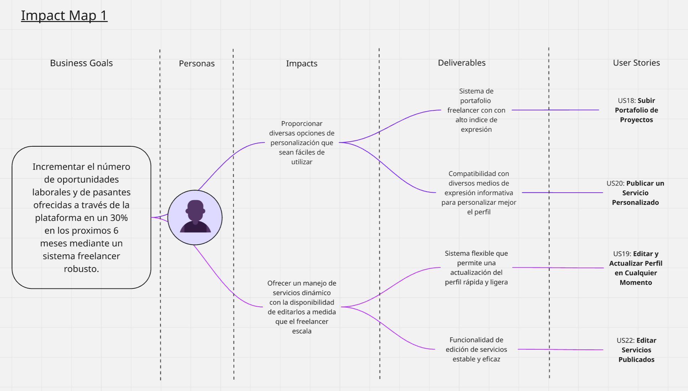

**Impact Map Segmento 2:** Personas y Emprendimientos que buscan contratar servicios freelance  
El impact map de GigU para las personas y emprendimientos que buscan contratar servicios freelance busca optimizar el proceso del contratado de freelancers por medio de un sistema de búsqueda completo que permite encontrar al freelancer indicado teniendo en cuenta sus servicios disponibles, la media de costos que propone y su nivel de experiencia.  
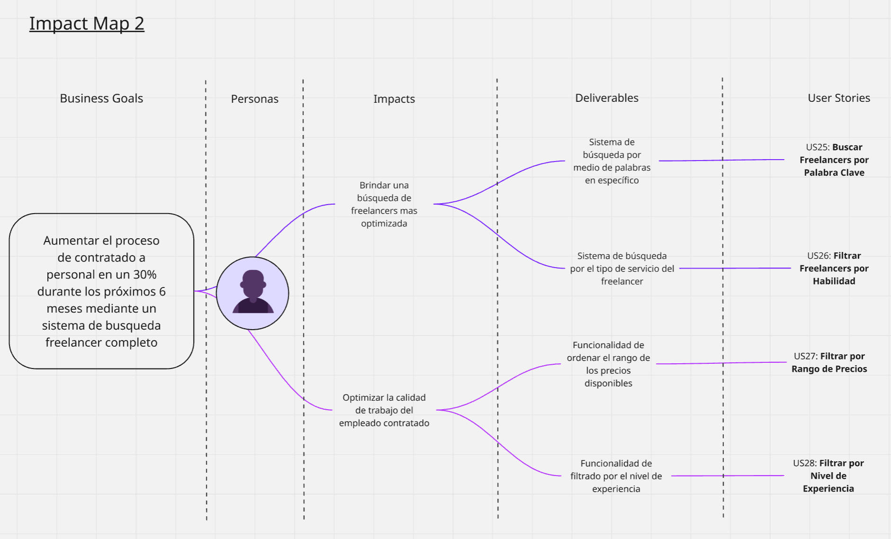


## 3.4. Product Backlog
Se utilizó la escala Fibonacci para la estimación de los Story Points. En total se tuvieron **197** Story Points.

**Tablero del Product Backlog (Notion):** https://www.notion.so/38aff0862f2c8064a987e23cf2b39555?v=38aff0862f2c8116a822000c80166dd1

| # Orden | User Story ID | Título                                                      | Story Points |
| :-----: | :-----------: | ----------------------------------------------------------- | :----------: |
|  **1**  |    **US01**   | Navegación intuitiva en la landing page                     |       3      |
|  **2**  |    **US02**   | Acceso rápido a funcionalidades clave                       |       3      |
|  **3**  |    **US03**   | Registro con correo y contraseña                            |       3      |
|  **4**  |    **US04**   | Iniciar sesión como freelancer o cliente                    |       5      |
|  **5**  |    **US05**   | Registro con Google                                         |       2      |
|  **6**  |    **US06**   | Solicitar recuperación de contraseña                        |       2      |
|  **7**  |    **US07**   | Restablecer contraseña vía correo                           |       2      |
|  **8**  |    **US12**   | Acceso a preguntas frecuentes (FAQ)                         |       3      |
|  **9**  |    **US13**   | Búsqueda dentro de preguntas frecuentes                     |       3      |
|  **10** |    **US14**   | Envío de ticket de soporte                                  |       3      |
|  **11** |    **US08**   | Conocer los beneficios de GigU                              |       1      |
|  **12** |    **US11**   | Detalles sobre tipos de servicios                           |       5      |
|  **13** |    **US10**   | Experiencias de otros usuarios                              |       5      |
|  **14** |    **US09**   | Diferencias entre roles (Freelancer / Cliente)              |       8      |
|  **15** |    **US25**   | Buscar freelancers por palabra clave                        |       3      |
|  **16** |    **US26**   | Filtrar freelancers por habilidad                           |       3      |
|  **17** |    **US29**   | Ordenar resultados por relevancia o calificación            |       3      |
|  **18** |    **US27**   | Filtrar por rango de precios                                |       5      |
|  **19** |    **US28**   | Filtrar por nivel de experiencia                            |       5      |
|  **20** |    **US30**   | Contratar desde el perfil del freelancer                    |       5      |
|  **21** |    **US31**   | Confirmación de contratación exitosa                        |       3      |
|  **22** |    **US24**   | Añadir imágenes o archivos al servicio (previo a contratar) |       3      |
|  **23** |    **US33**   | Historial de contrataciones realizadas                      |       2      |
|  **24** |    **US34**   | Visualizar proyectos activos                                |       5      |
|  **25** |    **US37**   | Seguimiento del estado del proyecto                         |       5      |
|  **26** |    **US32**   | Aceptar o rechazar una solicitud de contrato                |       3      |
|  **27** |    **US35**   | Gestionar solicitudes recibidas                             |       3      |
|  **28** |    **US36**   | Marcar proyecto como finalizado                             |       3      |
|  **29** |    **US38**   | Calificar al freelancer al finalizar el proyecto            |       3      |
|  **30** |    **US39**   | Ver calificaciones en perfil de freelancer                  |       5      |
|  **31** |    **US41**   | Calificar al cliente                                        |       5      |
|  **32** |    **US40**   | Editar calificación después del proyecto                    |       5      |
|  **33** |    **US42**   | Enviar mensaje a usuario desde perfil                       |       3      |
|  **34** |    **US43**   | Ver historial de conversaciones                             |       2      |
|  **35** |    **US44**   | Notificaciones de nuevos mensajes                           |       1      |
|  **36** |    **US45**   | Bloquear o reportar usuario desde chat                      |       2      |
|  **37** |    **US15**   | Creación de perfil freelance                                |       5      |
|  **38** |    **US16**   | Añadir habilidades y descripción personal                   |       8      |
|  **39** |    **US17**   | Establecer tarifas por servicio                             |       8      |
|  **40** |    **US18**   | Subir portafolio de proyectos                               |       5      |
|  **41** |    **US19**   | Editar y actualizar perfil en cualquier momento             |       3      |
|  **42** |    **US20**   | Publicar un servicio personalizado                          |       5      |
|  **43** |    **US21**   | Establecer plazos de entrega                                |       5      |
|  **44** |    **US22**   | Editar servicios publicados                                 |       5      |
|  **45** |    **US23**   | Pausar o eliminar servicios publicados                      |       5      |
|  **46** |    **US46**   | Sugerencia de precio inteligente                            |       8      |
|  **47** |    **US47**   | Ajuste manual sobre precio sugerido                         |       5      |
|  **48** |    **US48**   | Detalle del cálculo del precio sugerido                     |       5      |
|  **49** |    **US49**   | Comparación entre propuesta y oferta                        |       3      |
|  **50** |    **US50**   | Historial de precios de servicios similares                 |       2      |


<div style="page-break-before: always;"></div>

# Capítulo IV: Product Architecture Design

## 4.1. Design Concepts, ViewPoints & ER Diagrams

Esta sección presenta los conceptos de diseño, principios, estilos arquitectónicos, patrones, vistas y tácticas que guían la arquitectura de GigU. La propuesta se alinea con el objetivo del curso de construir una arquitectura empresarial basada en microservicios, Domain-Driven Design y arquitectura cloud native, aplicando decisiones de diseño justificables mediante ADD v3.

GigU es una plataforma que conecta estudiantes universitarios freelancers con clientes o emprendimientos que requieren contratar servicios. La solución permite publicar servicios, definir tarifas, gestionar solicitudes de contratación, coordinar proyectos, comunicarse dentro de la plataforma y consultar calificaciones para aumentar la confianza entre las partes (GigU, 2026).

### 4.1.1. Principles Statements

#### Domain-Driven Design como principio rector

La arquitectura de GigU se organizará alrededor de las capacidades centrales del dominio freelance universitario. Cada microservicio representará un límite funcional coherente del negocio, evitando dividir el sistema por capas técnicas aisladas. Esta decisión permite que el modelo de software refleje conceptos propios del dominio, tales como perfil freelance, servicio publicado, solicitud de contratación, proyecto, conversación, calificación y sugerencia de precio.

| Principio                   | Aplicación en GigU                                                                                                                                                |
| --------------------------- | ----------------------------------------------------------------------------------------------------------------------------------------------------------------- |
| Lenguaje ubicuo             | El equipo utilizará términos consistentes como freelancer, cliente, servicio, solicitud, acuerdo, proyecto, tarifa, reseña, conversación y portafolio.            |
| Bounded contexts            | El sistema se dividirá en contextos delimitados: acceso/perfiles, marketplace, contratación/proyectos y chat/notificaciones.                                      |
| Modelo de dominio explícito | Las reglas principales no estarán dispersas en controladores o consultas SQL, sino encapsuladas en entidades, value objects, servicios de dominio y casos de uso. |
| Alta cohesión               | Cada microservicio concentrará reglas relacionadas con una capacidad de negocio específica.                                                                       |

#### Clean Architecture por microservicio

Cada microservicio de GigU aplicará Clean Architecture para separar reglas de negocio, casos de uso, adaptadores de entrada/salida e infraestructura. El objetivo es que el dominio no dependa del framework, de la base de datos, del routing público, de servicios de mensajería ni de proveedores externos. Esta separación permite mantener reglas de negocio testeables, reemplazar adaptadores de infraestructura sin afectar el núcleo del sistema y desplegar cada microservicio de forma independiente.

| Capa | Responsabilidad |
| --- | --- |
| Domain Layer | Define entidades, value objects, reglas de negocio, invariantes y eventos de dominio. |
| Application Layer | Orquesta casos de uso, comandos, consultas y puertos hacia repositorios, clientes externos, publicadores de eventos y storage. |
| Interface Layer | Expone controladores REST, DTOs de entrada/salida, validaciones de contrato y filtros de seguridad. |
| Infrastructure Layer | Implementa persistencia en Supabase PostgreSQL, integración con Google Cloud Run, clientes HTTP entre microservicios, adaptadores futuros de Google Cloud Pub/Sub, adaptadores futuros de storage y servicios externos. |

#### API First y contratos explícitos

Las APIs REST de GigU se diseñarán con contratos claros, versionados y documentados. Cada microservicio expondrá endpoints bajo `/api/v1`, utilizando DTOs específicos para evitar exponer directamente entidades del dominio. OpenAPI se utilizará para documentar formalmente la superficie de las APIs HTTP, facilitando comprensión, pruebas y consumo por parte del frontend (OpenAPI Initiative, s. f.).

| Principio             | Aplicación en GigU                                                                        |
| --------------------- | ----------------------------------------------------------------------------------------- |
| Contratos versionados | Los endpoints públicos se publicarán bajo `/api/v1`.                                      |
| DTOs explícitos       | Los modelos internos no serán expuestos directamente en la API.                           |
| Documentación viva    | Cada microservicio tendrá documentación OpenAPI/Swagger.                                  |
| Compatibilidad        | Los cambios incompatibles deberán manejarse mediante nuevos DTOs o versiones de endpoint. |

#### Autonomía de servicios y ownership de datos

Cada microservicio será responsable de sus propios datos y reglas. Aunque Supabase PostgreSQL será la base de datos administrada utilizada por el proyecto, la propiedad lógica de los datos se mantendrá separada por esquemas y por límites de microservicio. El enfoque de microservicios propone servicios pequeños, ejecutados en procesos independientes, organizados alrededor de capacidades de negocio y comunicados mediante mecanismos ligeros, usualmente APIs HTTP (Lewis & Fowler, 2014).

| Microservicio           | Ownership principal                                                                       |
| ----------------------- | ----------------------------------------------------------------------------------------- |
| AccessProfileService    | Usuarios, roles, perfiles, habilidades, portafolio y verificación académica.              |
| GigMarketplaceService   | Servicios publicados, categorías, filtros, tarifas base y archivos asociados al servicio. |
| PullEngagementService   | Solicitudes, acuerdos, proyectos, estados, reseñas y sugerencias de precio.               |
| ChatNotificationService | Conversaciones, mensajes, notificaciones, reportes y tickets.                             |

#### Seguridad por diseño

GigU gestionará información de usuarios, perfiles públicos, conversaciones, solicitudes y acuerdos. Por ello, la seguridad se incorporará desde la arquitectura y no como una extensión posterior. Spring Security se utilizará para autenticación, autorización y protección de endpoints en los microservicios Spring Boot (Spring, s. f.-a).

| Principio     | Aplicación en GigU                                                                    |
| ------------- | ------------------------------------------------------------------------------------- |
| Autenticación | Inicio de sesión con JWT emitido por el backend.                                      |
| Autorización  | Control de acceso por roles: visitante, freelancer, cliente y administrador.          |
| Ownership     | Un usuario solo podrá modificar recursos de su propiedad.                             |
| Auditoría     | Los cambios relevantes de contratación, proyecto, reseña y bloqueo serán registrados. |
| Validación    | Las entradas serán validadas en API y en casos de uso.                                |


#### Comunicación asíncrona para eventos secundarios

Las operaciones críticas se resolverán mediante REST cuando el usuario requiera respuesta inmediata. Las operaciones secundarias, como notificaciones internas, eventos de cambio de estado, actualización de vistas derivadas o avisos de nuevos mensajes, se diseñarán para integrarse mediante Google Cloud Pub/Sub como servicio administrado de mensajería asíncrona dentro de GCP. Esta decisión reemplaza la alternativa previa basada en RabbitMQ.

En el estado actual del proyecto, la mensajería asíncrona con Google Cloud Pub/Sub se mantiene como una decisión arquitectónica seleccionada, pero pendiente de implementación. Por ello, no debe presentarse como evidencia de despliegue finalizado. El backend actualmente prioriza APIs REST entre microservicios y deja la publicación/consumo de eventos como extensión de infraestructura para una siguiente fase.

| Evento | Publicador previsto | Consumidor previsto | Estado |
| --- | --- | --- | --- |
| `UserRegistered` | AccessProfileService | ChatNotificationService | Diseñado / pendiente de implementación con Pub/Sub |
| `FreelancerProfileUpdated` | AccessProfileService | GigMarketplaceService | Diseñado / pendiente de implementación con Pub/Sub |
| `ServicePublished` | GigMarketplaceService | ChatNotificationService | Diseñado / pendiente de implementación con Pub/Sub |
| `ProjectRequestCreated` | PullEngagementService | ChatNotificationService | Diseñado / pendiente de implementación con Pub/Sub |
| `ProjectStatusChanged` | PullEngagementService | ChatNotificationService | Diseñado / pendiente de implementación con Pub/Sub |
| `MessageSent` | ChatNotificationService | ChatNotificationService | Diseñado / pendiente de implementación con Pub/Sub |
| `ReviewCreated` | PullEngagementService | GigMarketplaceService | Diseñado / pendiente de implementación con Pub/Sub |


#### Despliegue reproducible

Los servicios backend se despliegan en Google Cloud Run como microservicios independientes. Cada microservicio cuenta con un workflow manual de GitHub Actions basado en `workflow_dispatch`, lo que permite desplegar un servicio específico sin redeployar todo el backend. Esta decisión reemplaza la alternativa previa basada en Docker Compose sobre una VM de Oracle Cloud Always Free.

El despliegue backend actual utiliza Google Cloud Run en el proyecto `dosys-rest-api` y la región `us-central1`. Los workflows autentican contra Google Cloud, configuran `gcloud` y ejecutan `gcloud run deploy --source` para desplegar el código fuente del microservicio correspondiente. Además, el repositorio backend conserva scripts PowerShell en la carpeta `gcloud` como alternativa manual local para despliegues controlados desde una estación de desarrollo.

| Mecanismo | Estado | Propósito |
| --- | --- | --- |
| GitHub Actions manuales por microservicio | Implementado | Desplegar cada microservicio a Google Cloud Run desde GitHub mediante `workflow_dispatch`. |
| Scripts PowerShell en `/gcloud` | Implementado | Permitir despliegue local manual con `gcloud run deploy --source`. |
| Docker Compose en VM | Reemplazado | Ya no representa el modelo de despliegue vigente del backend. |
| Oracle Cloud Always Free | Reemplazado | Ya no representa el hosting vigente del backend. |

### 4.1.2. Approaches Statements: Architectural Styles & Patterns

#### Approaches Statements

| Enfoque | Aplicación en GigU |
| --- | --- |
| Domain-Driven Design | Se utilizará para definir bounded contexts alineados con capacidades de negocio: acceso/perfiles, marketplace, contratación/proyectos y chat/notificaciones. |
| Clean Architecture | Se aplicará dentro de cada microservicio para separar dominio, casos de uso, interfaces e infraestructura. |
| API First | Se diseñarán contratos REST claros y versionados antes de acoplar el frontend al backend. |
| Event-Driven Integration | Se utilizarán eventos asíncronos para notificaciones, cambios de estado y actualización de vistas derivadas. La tecnología seleccionada para esta capacidad es Google Cloud Pub/Sub, pero su implementación queda pendiente. |
| Cloud Native Deployment | El frontend y la landing page se alojan en Vercel. Los microservicios backend se despliegan en Google Cloud Run mediante workflows manuales de GitHub Actions y scripts locales `gcloud`. |

#### Architectural Styles

| Estilo arquitectónico | Aplicación en GigU | Justificación |
| --- | --- | --- |
| Microservices Architecture | El backend se divide en servicios independientes por capacidad de negocio. | Permite modularidad, despliegue separado, testabilidad y alineación con DDD. |
| Client-Server | El frontend Vue consume APIs REST expuestas por el backend. | Separa experiencia de usuario de lógica de negocio. |
| Layered / Clean Architecture | Cada microservicio se organiza en capas internas con dependencias hacia el dominio. | Reduce acoplamiento, facilita pruebas y evita que el dominio dependa de frameworks o proveedores externos. |
| Event-Driven Architecture | Google Cloud Pub/Sub queda seleccionado para soportar eventos secundarios entre microservicios. | Reduce dependencia temporal entre servicios, aunque su implementación queda pendiente. |
| Cloud Native Deployment | La solución se despliega con frontend, backend y base de datos distribuidos en servicios cloud administrados. | Permite acceso público, despliegue independiente por microservicio y validación académica incremental. |

#### Architectural Patterns

| Patrón arquitectónico | Aplicación en GigU |
| --- | --- |
| Vercel Rewrites as Public API Routing | Vercel Rewrites actúa como capa pública de enrutamiento para que el frontend consuma rutas relativas `/api/*` y estas sean reenviadas a los microservicios desplegados en Google Cloud Run. |
| Database per Service lógico | Supabase PostgreSQL contendrá esquemas separados por microservicio. |
| Managed Messaging with Google Cloud Pub/Sub | Google Cloud Pub/Sub queda seleccionado como servicio de mensajería asíncrona administrada para eventos internos, reemplazando la alternativa previa basada en RabbitMQ. Su implementación queda pendiente. |
| Independent Cloud Run Deployment | Cada microservicio backend se despliega de forma independiente en Google Cloud Run. |
| Backend for Frontend parcial | Vercel Rewrites expone rutas estables para el frontend sin exponer directamente la topología interna completa. |
| RESTful API | Los microservicios exponen recursos mediante APIs HTTP documentadas con OpenAPI. |
| Domain Events | Cambios relevantes del negocio serán modelados como eventos internos para su publicación futura mediante Google Cloud Pub/Sub. |

#### Servicios externos seleccionados

| Servicio externo | Uso arquitectónico | Estado |
| --- | --- | --- |
| Vercel | Alojamiento de la landing page, frontend Vue + Vite y routing público mediante Vercel Rewrites. | Implementado |
| Google Cloud Run | Alojamiento de los microservicios backend como servicios independientes. | Implementado |
| GitHub Actions | Despliegue manual por microservicio hacia Google Cloud Run mediante `workflow_dispatch`. | Implementado |
| Supabase PostgreSQL | Base de datos relacional administrada con esquemas lógicos por microservicio. | Implementado |
| Google Cloud Pub/Sub | Servicio administrado de mensajería asíncrona para eventos secundarios. | Seleccionado / pendiente de implementación |
| Storage | Capacidad para almacenar binarios de portafolio, imágenes y adjuntos. | Pendiente de implementación |

### 4.1.3. Context Diagram

El diagrama de contexto representa a GigU como sistema de software y muestra su relación con los usuarios principales y servicios externos. El proyecto identifica como actores principales al estudiante universitario freelancer, al cliente o emprendimiento que contrata servicios y al administrador de plataforma. Las funcionalidades principales incluyen creación de perfil, publicación de servicios, búsqueda, contratación, gestión de proyectos, calificaciones, mensajería y sugerencia de precios (GigU, 2026).

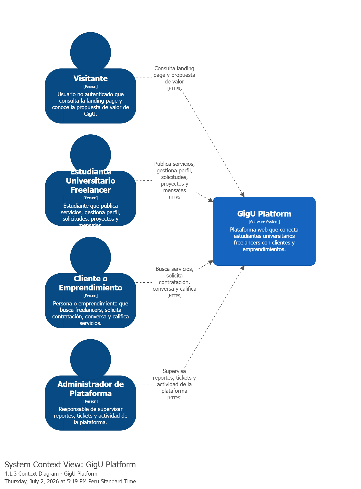

### 4.1.4. Approach-driven ViewPoints Diagrams

Para comunicar la arquitectura de GigU se utilizarán vistas C4 y UML. El C4 Model permite representar el sistema en distintos niveles de abstracción: contexto, contenedores, componentes y código. Para este punto se incluyen vistas de contexto, contenedores, componentes, actividad, estado y clases, coherentes con la estructura solicitada para el capítulo.

#### Viewpoint 01: Container View

La vista de contenedores muestra los elementos ejecutables principales de GigU: frontend, gateway, microservicios backend, broker de eventos, base de datos y almacenamiento. Esta vista permite observar la distribución de responsabilidades en tiempo de ejecución.

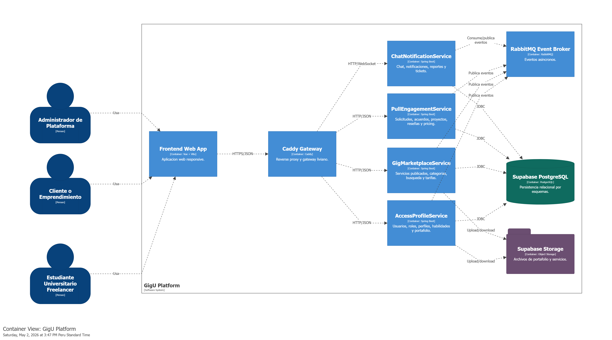

#### Viewpoint 02: Component View - PullEngagementService

El PullEngagementService concentra las reglas transaccionales más relevantes de GigU: solicitudes de contratación, acuerdos, proyectos, cambios de estado, reseñas y sugerencias de precio. Este servicio refleja historias críticas del producto, como contratar desde el perfil del freelancer, aceptar o rechazar solicitudes, visualizar proyectos activos, marcar proyectos como finalizados y registrar calificaciones (GigU, 2026).

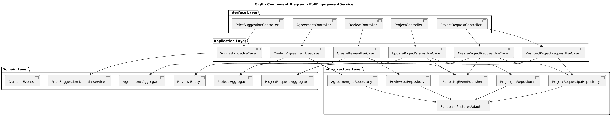

#### Viewpoint 03: Activity Diagram - contratación de servicio

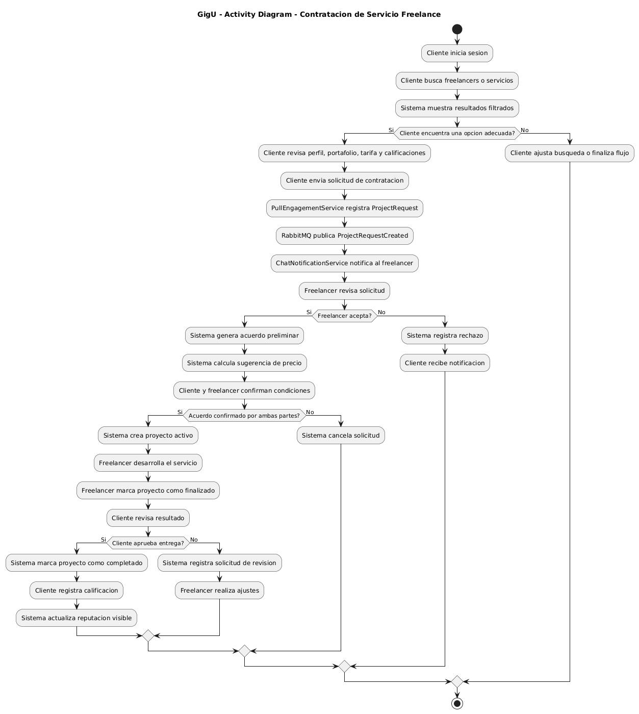

#### Viewpoint 04: State Diagram - ciclo de vida de proyecto

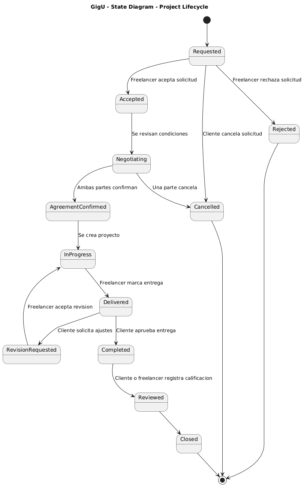

#### Viewpoint 05: Domain Class Diagram

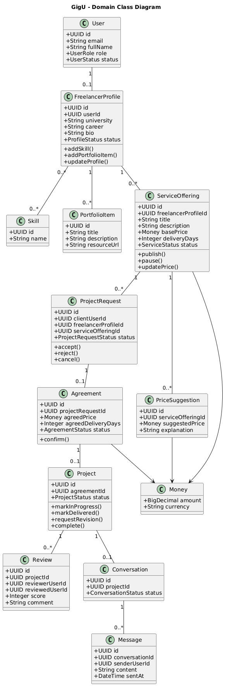

### 4.1.5. Relational/Non-Relational Database Diagram

GigU utilizará una base de datos relacional administrada con PostgreSQL en Supabase. La separación lógica se realizará mediante esquemas por microservicio para preservar ownership de datos y evitar acoplamiento directo entre contextos. Las relaciones internas de cada esquema se podrán implementar con claves foráneas, mientras que las referencias hacia datos de otros microservicios se representarán mediante identificadores externos controlados por contrato.

| Esquema                    | Microservicio propietario | Tablas principales                                                                                           |
| -------------------------- | ------------------------- | ------------------------------------------------------------------------------------------------------------ |
| `access_profile_schema`    | AccessProfileService      | `users`, `roles`, `user_roles`, `freelancer_profiles`, `skills`, `freelancer_skills`, `portfolio_items`      |
| `marketplace_schema`       | GigMarketplaceService     | `service_categories`, `service_offerings`, `service_media`                                                   |
| `engagement_schema`        | PullEngagementService     | `project_requests`, `agreements`, `projects`, `project_status_history`, `reviews`, `price_suggestions`       |
| `chat_notification_schema` | ChatNotificationService   | `conversations`, `conversation_participants`, `messages`, `notifications`, `user_reports`, `support_tickets` |

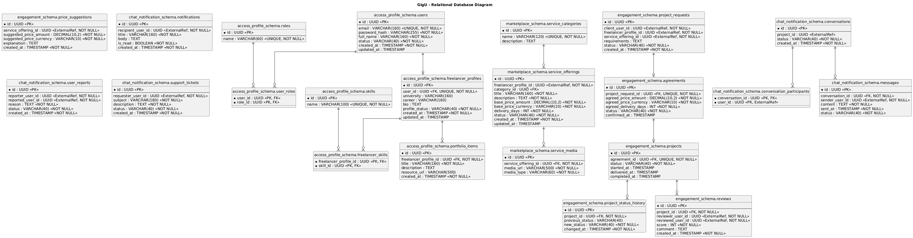

### 4.1.6. Design Patterns

| Design Pattern        | Aplicación en GigU                                                                                                                                  | Beneficio arquitectónico                                                     |
| --------------------- | --------------------------------------------------------------------------------------------------------------------------------------------------- | ---------------------------------------------------------------------------- |
| Repository Pattern    | Cada microservicio tendrá repositorios para abstraer acceso a PostgreSQL.                                                                           | Reduce acoplamiento con persistencia y facilita pruebas.                     |
| DTO Pattern           | Los controllers recibirán y devolverán DTOs, no entidades de dominio.                                                                               | Protege el modelo interno y estabiliza contratos.                            |
| Mapper Pattern        | Se convertirán DTOs, comandos, entidades y respuestas mediante mappers.                                                                             | Evita lógica de transformación dispersa.                                     |
| Factory Method        | Se crearán objetos complejos como `ProjectRequest`, `Agreement`, `Project` y `ServiceOffering` mediante fábricas o métodos de creación controlados. | Centraliza invariantes de construcción.                                      |
| Strategy Pattern      | La sugerencia de precios podrá usar estrategias por tipo de servicio, complejidad, urgencia o experiencia.                                          | Permite extender reglas de pricing sin modificar el caso de uso principal.   |
| Specification Pattern | Los filtros de búsqueda podrán componerse por habilidad, categoría, precio, disponibilidad y reputación.                                            | Evita consultas rígidas y mejora mantenibilidad.                             |
| Domain Events         | Eventos como `ProjectRequestCreated`, `ProjectStatusChanged`, `ReviewCreated` y `MessageSent` representarán cambios relevantes del dominio.         | Desacopla microservicios y facilita reacciones asíncronas.                   |
| Outbox Pattern | Los eventos críticos podrán registrarse junto con la transacción local antes de publicarse en Google Cloud Pub/Sub cuando la mensajería asíncrona sea implementada. | Reduce riesgo de pérdida de eventos y permite reintentos controlados sin bloquear operaciones principales. |
| Adapter Pattern | Integraciones con Supabase PostgreSQL, Google Cloud Pub/Sub, storage pendiente y clientes HTTP entre microservicios se encapsularán como adaptadores. | Mantiene el dominio independiente de proveedores externos y facilita sustitución de infraestructura. |
| Dependency Injection  | Los casos de uso dependerán de interfaces y no de implementaciones concretas.                                                                       | Facilita pruebas unitarias y sustitución de infraestructura.                 |
| API Gateway Pattern   | Caddy centralizará el ingreso HTTP y enrutará hacia microservicios.                                                                                 | Oculta la topología interna y simplifica el consumo del frontend.            |
| CQRS Lite             | Se separarán comandos y queries en casos de uso relevantes, como búsqueda, contratación y mensajería.                                               | Mejora claridad de responsabilidades sin introducir complejidad innecesaria. |

### 4.1.7. Tactics

Las tácticas seleccionadas responden a los atributos de calidad más relevantes para GigU: seguridad, modificabilidad, interoperabilidad, disponibilidad, performance y capacidad de prueba. El material del curso clasifica tácticas para disponibilidad, interoperabilidad, modificabilidad, performance, seguridad, capacidad de prueba y usabilidad; por ello, la selección se mantiene enfocada en los atributos que más influyen en la arquitectura del sistema.

| Atributo de calidad | Táctica                         | Aplicación en GigU                                                                                                                                                                                                             |
| ------------------- | ------------------------------- | ------------------------------------------------------------------------------------------------------------------------------------------------------------------------------------------------------------------------------ |
| Seguridad           | Authenticate Actors             | Los usuarios se autentican mediante Spring Security y JWT.                                                                                                                                                                     |
| Seguridad           | Authorize Actors                | Los endpoints validan roles y ownership antes de permitir operaciones sobre perfiles, servicios, solicitudes, proyectos, reseñas o conversaciones.                                                                             |
| Seguridad           | Maintain Audit Trail            | Se registran acciones relevantes: creación de solicitud, aceptación/rechazo, cambio de estado de proyecto, calificación, bloqueo y reporte.                                                                                    |
| Seguridad           | Validate Inputs                 | Los DTOs y casos de uso validan entradas antes de ejecutar reglas de negocio.                                                                                                                                                  |
| Modificabilidad     | Increase Semantic Coherence     | Cada microservicio agrupa responsabilidades de un bounded context específico.                                                                                                                                                  |
| Modificabilidad     | Encapsulate                     | Reglas de perfil, marketplace, contratación y chat se encapsulan en sus respectivos servicios.                                                                                                                                 |
| Modificabilidad     | Restrict Dependencies           | Los microservicios no consultan directamente tablas de otros contextos; usan IDs externos, APIs o eventos.                                                                                                                     |
| Modificabilidad     | Use an Intermediary             | RabbitMQ desacopla eventos secundarios entre microservicios.                                                                                                                                                                   |
| Interoperabilidad   | Tailor Interface                | Cada microservicio expone contratos REST específicos para su contexto.                                                                                                                                                         |
| Interoperabilidad   | Orchestrate                     | PullEngagementService coordina el flujo de solicitud, acuerdo, proyecto, entrega y reseña.                                                                                                                                     |
| Interoperabilidad   | Maintain Contract Documentation | OpenAPI documenta endpoints, requests, responses y errores esperados.                                                                                                                                                          |
| Disponibilidad      | Ping/Echo                       | Cada microservicio expondrá endpoint de health check para validar disponibilidad.                                                                                                                                              |
| Disponibilidad      | Exception Handling              | Fallas de notificación, correo o evento no deben interrumpir la operación principal de contratación.                                                                                                                           |
| Disponibilidad      | Retry                           | Publicación de eventos y envío de notificaciones podrán reintentarse de forma controlada.                                                                                                                                      |
| Disponibilidad      | Graceful Degradation            | Si falla la notificación externa, el proyecto y la contratación seguirán funcionando y se mantendrá notificación interna.                                                                                                      |
| Performance         | Manage Resources                | Las búsquedas usarán paginación, filtros e índices en campos como habilidad, categoría, estado, precio y fecha.                                                                                                                |
| Performance         | Reduce Overhead                 | El frontend consumirá DTOs ligeros en listados de servicios, perfiles y conversaciones.                                                                                                                                        |
| Performance         | Asynchronous Processing         | Notificaciones y eventos secundarios se procesarán fuera del flujo principal.                                                                                                                                                  |
| Capacidad de prueba | Specialized Interfaces          | Los casos de uso dependerán de interfaces, permitiendo mocks en pruebas unitarias.                                                                                                                                             |
| Capacidad de prueba | Record/Playback                 | Los eventos y respuestas externas podrán simularse en pruebas automatizadas.                                                                                                                                                   |
| Capacidad de prueba | Test with Real Dependencies     | Testcontainers permitirá ejecutar pruebas de integración con servicios reales en contenedores. Spring Boot documenta Testcontainers como mecanismo para levantar servicios reales durante pruebas de integración (Spring, s. f.-b). |
| Usabilidad          | Feedback                        | El sistema mostrará confirmaciones para registro, publicación, contratación, envío de mensaje, cambio de estado y calificación.                                                                                                |
| Usabilidad          | Maintain Task Model             | Los flujos del sistema seguirán las tareas reales identificadas: publicar servicios, cotizar precios, negociar, establecer acuerdos y comunicarse dentro de la plataforma (GigU, 2026).                                       |

## 4.2. Architectural Drivers

La arquitectura de GigU se diseña siguiendo el método Attribute-Driven Design, debido a que el Product Architecture Design del proyecto exige aplicar ADD v3 para relacionar el propósito de diseño, la funcionalidad principal, los atributos de calidad, las restricciones y las preocupaciones arquitectónicas con decisiones concretas de arquitectura. El project statement establece que la solución debe evidenciar una arquitectura empresarial basada en microservicios, Domain-Driven Design y cloud native architecture, además de un RESTful API accesible desde internet.

ADD considera como entradas principales del diseño el design purpose, primary functionality, quality attributes, architectural concerns y constraints. A partir de estas entradas, el diseño se ejecuta mediante iteraciones donde se seleccionan drivers, se refinan elementos del sistema, se eligen conceptos de diseño, se asignan responsabilidades, se definen interfaces y se registran decisiones arquitectónicas.

| Driver            | Prioridad  | Justificación                                                                                                                                               |
| ----------------- | ---------- | ----------------------------------------------------------------------------------------------------------------------------------------------------------- |
| Modificabilidad   | Alta       | GigU debe poder evolucionar por nuevas categorías de servicios, reglas de contratación, flujos de proyectos, reputación, pricing y funcionalidades de chat. |
| Seguridad         | Alta       | La plataforma gestiona cuentas, perfiles, portafolios, conversaciones, solicitudes, acuerdos, reseñas y reportes.                                           |
| Testabilidad      | Alta       | El curso exige evidencias de testing, implementación de microservicios y validación técnica por sprint.                                                     |
| Interoperabilidad | Media-Alta | El sistema integra frontend, gateway, microservicios, base de datos administrada, storage y mensajería asíncrona.                                           |
| Disponibilidad    | Media      | La plataforma debe estar accesible durante la validación académica, considerando las limitaciones de servicios gratuitos.                                   |
| Performance       | Media      | La búsqueda de servicios, perfiles, mensajes y proyectos debe responder de forma fluida para el volumen esperado de validación académica.                   |

### 4.2.1. Design Purpose

El propósito del diseño arquitectónico de GigU es definir una estructura técnica coherente, modular y verificable para implementar una plataforma web que conecte estudiantes universitarios freelancers con clientes y emprendimientos. La arquitectura debe permitir que los estudiantes publiquen servicios, construyan reputación profesional, gestionen proyectos y se comuniquen con clientes dentro de un entorno formal, seguro y alineado a sus habilidades.

GigU será diseñado como una aplicación empresarial basada en microservicios, aplicando Domain-Driven Design para separar capacidades de negocio y Clean Architecture dentro de cada microservicio. El frontend y la landing page se despliegan en Vercel, el routing público de la API se resuelve mediante Vercel Rewrites, los microservicios backend se ejecutan en Google Cloud Run y la base de datos principal se gestiona mediante Supabase PostgreSQL.

La arquitectura anterior basada en Caddy, RabbitMQ, Docker Compose y Oracle Cloud Always Free fue reemplazada por una estrategia cloud native alineada con el estado actual del desarrollo. El deployment backend ya cuenta con workflows manuales de GitHub Actions por microservicio y con scripts PowerShell locales en la carpeta `gcloud`. Google Cloud Pub/Sub queda seleccionado como servicio de mensajería asíncrona administrada, pero su implementación todavía está pendiente. La capacidad de storage también permanece pendiente de implementación y no debe tratarse como evidencia completada.

| Categoría | Detalle |
| --- | --- |
| Tipo de sistema | Plataforma web de servicios freelance universitarios. |
| Propósito de negocio | Facilitar que estudiantes universitarios consigan experiencia profesional e ingresos mediante servicios freelance formales y verificables. |
| Propósito arquitectónico | Definir una arquitectura modular, desplegable, testeable y preparada para evolución incremental mediante microservicios. |
| Enfoque de arquitectura | Microservices Architecture, Domain-Driven Design y Clean Architecture. |
| Modelo de despliegue | Landing page y frontend en Vercel; routing público mediante Vercel Rewrites; backend en Google Cloud Run; base de datos en Supabase PostgreSQL. |
| Deployment backend | Workflows manuales de GitHub Actions por microservicio y scripts PowerShell locales en `/gcloud`. |
| Mensajería asíncrona | Google Cloud Pub/Sub seleccionado como decisión arquitectónica pendiente de implementación. |
| Storage | Capacidad pendiente de implementación. |
| Alcance funcional principal | Perfiles, portafolios, publicación de servicios, búsqueda, solicitudes, acuerdos, proyectos, chat, notificaciones y reseñas. |
| Alcance técnico principal | RESTful API documentada, microservicios independientes, persistencia relacional por ownership lógico, despliegue independiente en Cloud Run, CI/CD manual con GitHub Actions y mensajería asíncrona pendiente. |
| Limitación inicial | El sistema modelará acuerdos y estados de pago para validación académica; la integración con una pasarela de pagos real queda fuera del primer alcance implementable. |

La decisión de utilizar Google Cloud Run responde a la necesidad de desplegar microservicios backend de forma independiente, pública y verificable sin administrar una máquina virtual propia. Vercel Rewrites reemplaza a Caddy como mecanismo de routing público para el frontend, permitiendo que las rutas relativas `/api/*` sean reenviadas hacia los servicios backend correspondientes. GitHub Actions permite ejecutar despliegues manuales por microservicio mediante `workflow_dispatch`, manteniendo control sobre cuándo se despliega cada servicio.

### 4.2.2. Primary Functionality: Primary User Stories

Las funcionalidades primarias seleccionadas son aquellas que afectan directamente la estructura de la aplicación, la asignación de responsabilidades entre microservicios y los principales escenarios de calidad. No se listan todas las historias del Product Backlog, sino aquellas que influyen de forma significativa en las decisiones arquitectónicas del sistema.

Para mantener trazabilidad entre los drivers arquitectónicos y el Product Backlog, cada Primary User Story se relaciona con las User Stories originales del Capítulo III. Asimismo, la funcionalidad de portafolio se integra dentro de la gestión del perfil freelancer, debido a que no constituye un flujo arquitectónico independiente, sino una extensión natural del perfil público del estudiante.

| ID | Primary User Story | Descripción | User Stories relacionadas | Impacto arquitectónico | Microservicio principal |
| ------ | -------------------------------- | -------------------------------------------------------------------------------------------------------------------------------------------- | -------------------------------- | --------------------------------------------------------------------------------------------------------------- | ----------------------- |
| PUS-01 | Gestión de cuenta y acceso | Como usuario, deseo registrarme, iniciar sesión y recuperar mi acceso para utilizar de forma segura las funcionalidades de GigU. | US03, US04, US05, US06, US07 | Requiere autenticación, autorización, roles, JWT, recuperación de credenciales y control de ownership. | AccessProfileService |
| PUS-02 | Gestión de perfil y portafolio freelancer | Como estudiante freelancer, deseo crear y actualizar mi perfil profesional, registrar habilidades y mostrar evidencias de trabajos previos para generar confianza ante clientes potenciales. | US15, US16, US18, US19 | Define el bounded context de perfiles, habilidades, descripción profesional, actualización de información pública e integración con storage para evidencias de portafolio. | AccessProfileService |
| PUS-03 | Publicación de servicios | Como estudiante freelancer, deseo publicar servicios con descripción, categoría, tarifa, archivos y tiempo estimado para ofrecerlos en la plataforma. | US17, US20, US21, US22, US23, US24 | Define el núcleo del marketplace, la persistencia de servicios publicados, la gestión de tarifas, plazos, archivos asociados y estados de publicación. | GigMarketplaceService |
| PUS-04 | Búsqueda y filtrado de servicios | Como cliente, deseo buscar servicios por palabra clave, habilidad, precio, experiencia, relevancia o calificación para encontrar freelancers adecuados. | US25, US26, US27, US28, US29 | Requiere consultas optimizadas, filtros combinables, paginación, ordenamiento e índices sobre campos frecuentes de búsqueda. | GigMarketplaceService |
| PUS-05 | Solicitud de contratación | Como cliente, deseo enviar una solicitud de contratación a un freelancer y consultar el historial de contrataciones realizadas para iniciar y revisar posibles proyectos. | US30, US31, US33 | Inicia el flujo transaccional de engagement, registra solicitudes, confirma contrataciones y genera eventos de notificación. | PullEngagementService |
| PUS-06 | Negociación y acuerdo | Como cliente y freelancer, deseamos aceptar, rechazar o gestionar solicitudes de contrato para formalizar condiciones de trabajo. | US32, US35 | Requiere modelar solicitud, aceptación, rechazo, acuerdo, precio, plazo, estados y reglas de transición entre las partes. | PullEngagementService |
| PUS-07 | Gestión de proyecto | Como freelancer o cliente, deseo visualizar proyectos activos, actualizar su estado y marcar proyectos como finalizados. | US34, US36, US37 | Requiere ciclo de vida de proyecto, historial de estados, reglas de transición, control de finalización y visibilidad del avance. | PullEngagementService |
| PUS-08 | Chat de coordinación | Como cliente o freelancer, deseo comunicarme dentro de la plataforma, consultar conversaciones, recibir notificaciones y reportar problemas desde el chat. | US42, US43, US44, US45 | Requiere conversaciones, mensajes, historial, notificaciones, reportes y comunicación en tiempo real mediante WebSocket o Server-Sent Events. | ChatNotificationService |
| PUS-09 | Calificaciones y reseñas | Como cliente o freelancer, deseo calificar a la contraparte, editar calificaciones permitidas y consultar reputación visible en perfiles. | US38, US39, US40, US41 | Requiere reseñas vinculadas a proyectos finalizados, reglas de edición, cálculo de reputación y actualización de métricas visibles. | PullEngagementService |
| PUS-10 | Reportes y soporte | Como usuario, deseo consultar ayuda, buscar preguntas frecuentes, enviar tickets de soporte y reportar conductas inadecuadas. | US12, US13, US14, US45 | Requiere FAQ, búsqueda de ayuda, tickets, reportes, moderación y soporte administrativo. | ChatNotificationService |
| PUS-11 | Sugerencia de precio | Como freelancer, deseo recibir una sugerencia de precio, ajustarla manualmente, revisar su cálculo y compararla con servicios similares. | US46, US47, US48, US49, US50 | Requiere reglas de pricing desacopladas, historial de precios, explicación del cálculo y capacidad de evolución del algoritmo. | PullEngagementService |

### 4.2.3. Quality Attribute Scenarios

Los escenarios de atributos de calidad se redactan como requisitos medibles. El project statement indica que un escenario de atributo de calidad debe considerar fuente de estímulo, estímulo, medioambiente, artefacto, respuesta y medida de respuesta.

| ID    | Atributo de calidad | Fuente del estímulo                           | Estímulo                                                                                   | Ambiente                                            | Artefacto                                                            | Respuesta                                                                                                                                       | Medida de respuesta                                                                                                                                                         |
| ----- | ------------------- | --------------------------------------------- | ------------------------------------------------------------------------------------------ | --------------------------------------------------- | -------------------------------------------------------------------- | ----------------------------------------------------------------------------------------------------------------------------------------------- | --------------------------------------------------------------------------------------------------------------------------------------------------------------------------- |
| QA-01 | Seguridad           | Usuario no autenticado o usuario sin permisos | Intenta crear, modificar o consultar un recurso protegido                                  | Operación normal del sistema                        | Caddy Gateway, microservicio correspondiente, endpoints REST         | El sistema valida JWT, rol y ownership antes de ejecutar el caso de uso; si la solicitud no cumple, la rechaza y registra el intento relevante. | El 100% de endpoints protegidos rechaza solicitudes sin token válido o sin permisos; las operaciones críticas quedan registradas en auditoría.                              |
| QA-02 | Modificabilidad     | Equipo de desarrollo                          | Solicita agregar una nueva categoría de servicio o una nueva regla de sugerencia de precio | Sprint de evolución funcional                       | GigMarketplaceService y PullEngagementService                        | El cambio se implementa dentro del microservicio dueño del contexto sin modificar otros microservicios ni romper contratos existentes.          | El cambio afecta como máximo un microservicio principal y sus pruebas asociadas; las APIs existentes mantienen compatibilidad.                                              |
| QA-03 | Testabilidad        | Desarrollador backend                         | Agrega o modifica una regla de negocio de solicitud, acuerdo, proyecto o reseña            | Desarrollo local o pipeline de integración continua | Domain Layer y Application Layer del microservicio afectado          | El sistema permite probar la regla mediante pruebas unitarias y pruebas de integración del endpoint correspondiente.                            | Las reglas críticas del dominio tienen pruebas unitarias; los endpoints principales tienen pruebas de integración automatizadas.                                            |
| QA-04 | Interoperabilidad | Frontend web o consumidor API | Consume funcionalidades de perfil, marketplace, engagement o chat | Operación normal desde navegador | RESTful API, Vercel Rewrites y microservicios backend en Google Cloud Run | El sistema expone contratos HTTP consistentes, versionados y documentados con OpenAPI; Vercel Rewrites enruta las solicitudes `/api/*` hacia los servicios Cloud Run correspondientes. | El 100% de endpoints públicos principales se documenta con OpenAPI y responde usando DTOs JSON estandarizados. |
| QA-05 | Disponibilidad | Usuario final o sistema de monitoreo | Un microservicio o componente secundario falla temporalmente | Validación académica en servicios cloud administrados | Frontend en Vercel, microservicios en Google Cloud Run y Supabase PostgreSQL | El sistema mantiene disponibles las funcionalidades no dependientes del componente fallido y permite redeploy independiente del microservicio afectado mediante GitHub Actions o scripts `gcloud`. | Las operaciones críticas de perfil, marketplace y engagement no dependen de mensajería asíncrona pendiente; cada microservicio puede ser redesplegado de forma independiente. |
| QA-06 | Performance         | Cliente o freelancer                          | Realiza búsqueda de servicios, perfiles o conversaciones                                   | Dataset de validación académica y operación normal  | GigMarketplaceService, ChatNotificationService y Supabase PostgreSQL | El sistema responde con paginación, filtros e índices en campos de búsqueda frecuentes.                                                         | Las consultas principales devuelven resultados paginados y evitan cargar datasets completos en una sola respuesta.                                                          |
| QA-07 | Usabilidad          | Cliente o freelancer                          | Completa un flujo de publicación, solicitud, acuerdo, chat o calificación                  | Uso normal desde navegador web                      | Frontend Web App y API backend                                       | El sistema entrega confirmaciones claras y mantiene el estado visible de servicios, solicitudes, proyectos y mensajes.                          | Cada operación principal retorna estado explícito de éxito, error o pendiente; el usuario puede reconocer el estado actual de sus proyectos y conversaciones.               |

### 4.2.4. Constraints

Las restricciones representan decisiones con bajo o nulo grado de libertad para la arquitectura. Estas limitan las opciones de implementación y deben ser consideradas como drivers arquitectónicos.

| ID | Restricción | Tipo | Impacto arquitectónico |
| --- | --- | --- | --- |
| CON-01 | El frontend se desarrollará con Vue + Vite y se desplegará en Vercel. | Tecnológica / despliegue | Se separa el frontend del backend y se consume la API mediante rutas públicas estables. |
| CON-02 | El backend se desarrollará con Java y Spring Boot. | Tecnológica | Los microservicios, controladores REST, seguridad y pruebas backend se implementan en el ecosistema Spring. |
| CON-03 | Cada microservicio aplicará Clean Architecture. | Arquitectónica | Las reglas de dominio no dependerán de frameworks, persistencia, routing público o servicios externos. |
| CON-04 | El backend se organizará en cuatro microservicios principales: AccessProfileService, GigMarketplaceService, PullEngagementService y ChatNotificationService. | Arquitectónica | Se evita sobredimensionar la arquitectura y se mantiene una separación coherente por bounded context. |
| CON-05 | Vercel Rewrites funcionará como routing público de API para el frontend. | Infraestructura | Las rutas `/api/*` se centralizan desde el frontend sin mantener un gateway propio con Caddy. |
| CON-06 | Los microservicios backend se desplegarán en Google Cloud Run. | Despliegue | Cada microservicio puede desplegarse y validarse de forma independiente. |
| CON-07 | La persistencia principal se realizará con Supabase PostgreSQL. | Datos | Se adopta una base relacional administrada con esquemas lógicos por microservicio. |
| CON-08 | La capacidad de storage para portafolio, imágenes y adjuntos queda pendiente de implementación. | Datos / almacenamiento | Los binarios no deben presentarse como capacidad implementada hasta que exista integración real. |
| CON-09 | La autenticación y autorización se implementarán con Spring Security y JWT. | Seguridad | Cada microservicio validará acceso a operaciones protegidas y ownership de recursos. |
| CON-10 | La mensajería asíncrona se diseñará sobre Google Cloud Pub/Sub, pero queda pendiente de implementación. | Integración | Las notificaciones, cambios de estado y eventos secundarios se desacoplarán del flujo principal cuando la infraestructura de eventos sea implementada. |
| CON-11 | Las APIs REST serán documentadas con OpenAPI/Swagger. | Documentación / interoperabilidad | Se asegura trazabilidad de contratos, endpoints y DTOs. |
| CON-12 | El proyecto deberá mantenerse en servicios gratuitos o free tier durante la validación académica. | Económica / despliegue | Se priorizan Vercel, Google Cloud Run, Supabase y herramientas cloud administradas compatibles con validación académica. |
| CON-13 | No se integrará una pasarela de pagos real en la primera versión implementable. | Alcance | El sistema modelará acuerdos y estados relacionados al pago, pero la integración financiera real queda como extensión futura. |
| CON-14 | El equipo deberá producir evidencias de implementación, testing, documentación de microservicios y despliegue. | Académica | La arquitectura debe ser demostrable mediante repositorio, pruebas, Swagger, GitHub Actions, Cloud Run y ejecución cloud. |

Supabase se mantiene como plataforma administrada de PostgreSQL para reducir carga operativa en el equipo. El despliegue backend se realiza en Google Cloud Run y se automatiza mediante workflows manuales de GitHub Actions por microservicio. La mensajería con Google Cloud Pub/Sub y la capacidad de storage quedan documentadas como decisiones o capacidades pendientes, no como evidencia implementada.

### 4.2.5. Architectural Concerns

| ID     | Architectural Concern                     | Descripción                                                                                                                                          | Decisión relacionada                                                                                           |
| ------ | ----------------------------------------- | ---------------------------------------------------------------------------------------------------------------------------------------------------- | -------------------------------------------------------------------------------------------------------------- |
| CRN-01 | Delimitación correcta de bounded contexts | Existe riesgo de mezclar responsabilidades de perfil, marketplace, contratación y chat en un mismo módulo.                                           | Separar el backend en cuatro microservicios alineados al dominio.                                              |
| CRN-02 | Evitar sobrearquitectura                  | Una cantidad excesiva de microservicios aumentaría la complejidad operativa y reduciría la probabilidad de completar el proyecto.                    | Mantener cuatro microservicios principales y evitar servicios adicionales no esenciales.                       |
| CRN-03 | Consistencia entre servicios              | Las solicitudes, proyectos, reseñas y notificaciones cruzan límites de microservicios.                                                               | Usar identificadores externos, contratos REST y eventos RabbitMQ para sincronización eventual.                 |
| CRN-04 | Seguridad y ownership                     | Los usuarios deben acceder solo a recursos propios o permitidos por rol.                                                                             | Implementar Spring Security, JWT, roles y validación de ownership en casos de uso.                             |
| CRN-05 | Gestión del chat                          | El chat debe funcionar sin depender de servicios externos pagos ni introducir complejidad excesiva.                                                  | Implementar ChatNotificationService con REST para historial y WebSocket/SSE para actualización en tiempo real. |
| CRN-06 | Persistencia relacional por microservicio | Usar una sola base administrada podría generar acoplamiento si los servicios comparten tablas indiscriminadamente.                                   | Separar esquemas y ownership lógico por microservicio en Supabase PostgreSQL.                                  |
| CRN-07 | Despliegue gratuito sostenible            | El backend debe estar disponible para validación sin depender de plataformas que duermen servicios o expiran bases de datos rápidamente.             | Alojar backend en Oracle Cloud Always Free y delegar base de datos a Supabase.                                 |
| CRN-08 | Testabilidad de reglas de negocio         | Las reglas de contratación, estados, reseñas y pricing deben ser comprobables sin levantar todo el sistema.                                          | Aplicar Clean Architecture, interfaces, mocks, pruebas unitarias y pruebas de integración.                     |
| CRN-09 | Trazabilidad para evaluación académica    | El curso exige evidencias de arquitectura, testing, microservicios, despliegue y documentación.                                                      | Usar GitHub, GitHub Actions, Swagger, commits por microservicio y documentación técnica por sprint.            |
| CRN-10 | Evolución hacia pagos reales              | La solución contempla acuerdos y pagos seguros como parte del dominio, pero la integración con pasarelas reales puede aumentar riesgo y complejidad. | Modelar estados de acuerdo/pago en la primera versión y dejar pasarela real como extensión posterior.          |
| CRN-11 | Dependencia de proveedores externos       | Vercel, Oracle Cloud y Supabase facilitan el despliegue, pero no deben contaminar el dominio.                                                        | Encapsular integraciones en Infrastructure Layer mediante adapters.                                            |
| CRN-12 | Performance en búsquedas                  | La búsqueda de servicios y freelancers puede degradarse al crecer el catálogo.                                                                       | Usar paginación, filtros, índices y DTOs ligeros en GigMarketplaceService.                                     |

#### Resumen de drivers por decisión arquitectónica

| Decisión arquitectónica                       | Drivers que satisface                                                         |
| --------------------------------------------- | ----------------------------------------------------------------------------- |
| Microservicios por bounded context            | Modificabilidad, testabilidad, escalabilidad organizacional y mantenibilidad. |
| Clean Architecture por microservicio          | Testabilidad, modificabilidad e independencia tecnológica.                    |
| Caddy como gateway liviano                    | Interoperabilidad, simplicidad operativa y disponibilidad.                    |
| Supabase PostgreSQL con esquemas por servicio | Persistencia relacional, ownership de datos y mantenibilidad.                 |
| RabbitMQ para eventos internos                | Modificabilidad, disponibilidad parcial y desacoplamiento.                    |
| Spring Security + JWT                         | Seguridad, control de acceso y auditoría.                                     |
| Docker Compose en Oracle Cloud                | Despliegue reproducible, evidencia cloud y control operativo.                 |
| OpenAPI/Swagger                               | Interoperabilidad, documentación, pruebas manuales y automatizadas.           |
| GitHub Actions                                | Testabilidad, trazabilidad y evidencia de calidad.                            |

## 4.3. ADD Iterations

El diseño arquitectónico de GigU se desarrolla aplicando ADD v3 sobre los dos microservicios de mayor impacto del backend: `PullEngagementService` (Iteración 1) y `GigMarketplaceService` (Iteración 2).

Cada iteración aplica los siete pasos del método sobre un foco acotado del sistema y se gestiona como un Kanban de diseño en Notion, en el que cada tarjeta representa un driver, una decisión arquitectónica (ADR) o una vista a producir. El siguiente cronograma resume los Epics de producto cubiertos por ambas iteraciones, importados a las bases de datos de Notion del proyecto GigU.

La funcionalidad de portafolio ya no se modela como un Epic independiente dentro de este capítulo, porque fue integrada dentro de la gestión del perfil freelancer en `AccessProfileService`. Por ello, no se refina como una iteración separada de ADD.

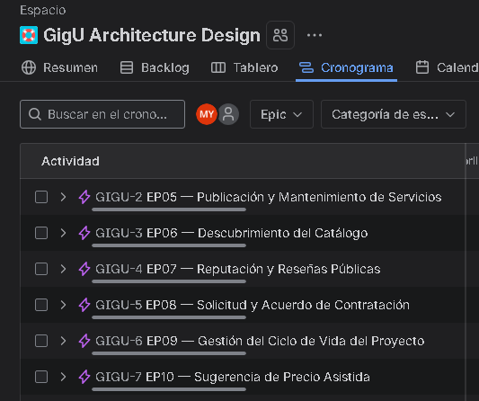

### 4.3.1. Iteration 1: PullEngagementService — Transactional Core

Esta primera iteración aplica el método ADD v3 sobre el microservicio que concentra el mayor riesgo arquitectónico de GigU: `PullEngagementService`.

Este servicio gestiona el flujo transaccional completo entre un cliente y un freelancer, incluyendo solicitud, acuerdo, proyecto, entrega, finalización, calificación y sugerencia de precio. Además, integra a los otros microservicios mediante referencias por identificador y eventos asíncronos. El project statement establece que la solución debe ser implementada como una arquitectura empresarial basada en microservicios con Domain-Driven Design, lo cual exige resolver primero el bounded context con mayor cohesión transaccional.

La selección de `PullEngagementService` como foco inicial responde a tres razones objetivas:

- Es el bounded context que aloja el mayor número de Primary User Stories (5 de 11: PUS-05, PUS-06, PUS-07, PUS-09 y PUS-11).
- Es el microservicio cuya máquina de estados, relacionada con solicitudes, acuerdos, proyectos, finalización, reseñas y pricing, tiene mayor probabilidad de inducir refactors costosos si se diseña tarde.
- Es el integrador natural entre `AccessProfileService`, `GigMarketplaceService` y `ChatNotificationService`, por lo que sus contratos deben quedar definidos antes de iterar sobre los demás.

#### 4.3.1.1. Architectural Design Backlog 1

El backlog de diseño selecciona los drivers funcionales, de calidad y restricciones que afectan directamente a la estructura interna de `PullEngagementService` y a sus interfaces con el resto de la plataforma.

| ID | Tipo | Descripción | Prioridad |
| ------- | ------------------- | ---------------------------------------------------------------------------------------------------------------------------------------- | --------- |
| PUS-05 | Funcional | Como cliente, deseo enviar una solicitud de contratación a un freelancer y consultar el historial de contrataciones realizadas para iniciar y revisar posibles proyectos. | Alta |
| PUS-06 | Funcional | Como cliente y freelancer, deseamos aceptar, rechazar o gestionar solicitudes de contrato para formalizar condiciones de trabajo. | Alta |
| PUS-07 | Funcional | Como freelancer o cliente, deseo visualizar proyectos activos, actualizar su estado y marcar proyectos como finalizados. | Alta |
| PUS-09 | Funcional | Como cliente o freelancer, deseo calificar a la contraparte, editar calificaciones permitidas y consultar reputación visible en perfiles. | Alta |
| PUS-11 | Funcional | Como freelancer, deseo recibir una sugerencia de precio, ajustarla manualmente, revisar su cálculo y compararla con servicios similares. | Media |
| QA-01 | Atributo de calidad | Seguridad: solo el cliente o freelancer dueño del proyecto puede modificar su estado o registrar reseñas. | Alta |
| QA-02 | Atributo de calidad | Modificabilidad: nuevas estrategias de pricing o reglas de transición de estado se agregan sin modificar otros microservicios. | Alta |
| QA-03 | Atributo de calidad | Testabilidad: las reglas del ciclo de vida del proyecto se prueban unitariamente sin levantar persistencia, gateway ni broker. | Alta |
| QA-05 | Atributo de calidad | Disponibilidad: una falla del envío de notificación no debe bloquear la creación de la solicitud o la actualización del proyecto. | Media |
| CON-02 | Restricción | El microservicio se implementa con Java + Spring Boot. | Fija |
| CON-03 | Restricción | Aplica Clean Architecture (Domain → Application → Interface → Infrastructure). | Fija |
| CON-09 | Restricción | Autenticación con Spring Security + JWT y validación de ownership en cada caso de uso. | Fija |
| CON-10 | Restricción | Eventos relevantes (`ProjectRequestCreated`, `AgreementSigned`, `ProjectStatusChanged`, `ReviewCreated`) se diseñan para publicación futura mediante Google Cloud Pub/Sub. | Fija / pendiente de implementación |
| CRN-03 | Concern | Consistencia entre microservicios: las referencias a usuario y servicio publicado son IDs externos, no joins. | Alta |
| CRN-08 | Concern | Testabilidad de reglas de negocio sin levantar todo el sistema. | Alta |

#### 4.3.1.2. Establish Iteration Goal by Selecting Drivers

**Meta de la iteración:** definir la estructura interna de `PullEngagementService` y sus contratos de entrada/salida de modo que el flujo solicitud → acuerdo → proyecto → reseña, junto con la sugerencia de precio, pueda implementarse, probarse y desplegarse de forma independiente del resto de microservicios.

**Drivers seleccionados como guía principal de las decisiones:**

| Driver | Por qué guía esta iteración |
| --------------------------------- | ------------------------------------------------------------------------------------------------------------------------------------------------------ |
| QA-02 Modificabilidad | El pricing y las reglas de transición de estado son los puntos del dominio con mayor probabilidad de cambio durante los sprints siguientes. |
| QA-03 Testabilidad | El ciclo de vida del proyecto contiene invariantes que deben ser verificables sin infraestructura levantada. |
| QA-01 Seguridad | Cada operación expone recursos transaccionales sensibles, como solicitudes, acuerdos, proyectos, calificaciones y sugerencias de precio. |
| PUS-05, PUS-06, PUS-07, PUS-09, PUS-11 | Estas cinco historias definen el flujo end-to-end de contratación, gestión del proyecto, reputación y pricing que la iteración debe soportar. |
| CON-03, CON-09, CON-10 | Restricciones tecnológicas que enmarcan toda decisión de implementación: Clean Architecture, seguridad con Spring Security/JWT y diseño de eventos preparados para una futura integración con Google Cloud Pub/Sub. |

Quedan fuera del foco de esta iteración: el dominio interno de Marketplace, que se aborda en la Iteración 2; la mensajería en tiempo real del chat; la operación administrativa; y la gestión de perfil y portafolio, que pertenece a `AccessProfileService`.

#### 4.3.1.3. Choose One or More Elements of the System to Refine

Partiendo del Container Diagram presentado en 4.1.4, el elemento a refinar en esta iteración es el contenedor `PullEngagementService`.

La iteración descompone este contenedor en sus componentes internos siguiendo Clean Architecture y formaliza las interfaces que lo conectan con el resto del sistema.

| Elemento a refinar | Tipo | Razón |
| ------------------------ | ------------------- | ---------------------------------------------------------------------------------------------------------------------------------- |
| `PullEngagementService` | Contenedor | Centro transaccional del dominio y mayor concentración de drivers seleccionados. |
| Esquema `engagement_schema` | Componente de datos | Soporta el modelo agregado de solicitud, acuerdo, proyecto, historial, reseña y sugerencia de precio. |
| Contrato REST `/api/v1/engagement/*` | Interfaz pública | Punto de acoplamiento para el frontend Vue mediante Vercel Rewrites y para los consumidores HTTP del backend. |
| Eventos diseñados para Google Cloud Pub/Sub | Interfaz asíncrona futura | Punto de acoplamiento eventual hacia `ChatNotificationService` y `GigMarketplaceService`, pendiente de implementación. |

No se refinan en esta iteración los componentes internos de los otros microservicios: solo se acuerda la forma de los contratos que `PullEngagementService` consume o produce.

#### 4.3.1.4. Choose One or More Design Concepts That Satisfy the Selected Drivers

Las decisiones de diseño se seleccionan a partir del catálogo definido en 4.1 (Approaches, Patterns y Tactics) y se justifican contra los drivers de la iteración.

| Driver atendido | Concepto de diseño seleccionado | Justificación contra el driver |
| ------------------------- | ---------------------------------------------------------------------------------------------------------- | ------------------------------------------------------------------------------------------------------------------------------- |
| QA-02 Modificabilidad | Clean Architecture con separación Domain, Application, Interface e Infrastructure. | Aísla reglas de negocio de frameworks, persistencia, gateway y broker, reduciendo impacto ante cambios funcionales. |
| QA-02 Modificabilidad | Strategy Pattern para `PriceSuggestionPolicy` y `ProjectStatusPolicy`. | Permite agregar nuevas reglas de pricing o transición de estados sin modificar los casos de uso principales. |
| QA-03 | Testabilidad | Puertos explícitos para repositorios, clientes externos y publicador de eventos. | Habilita pruebas unitarias sin Spring, sin Postgres y sin Google Cloud Pub/Sub. |
| QA-03 Testabilidad | Specialized Interfaces sobre `ProjectRepository`, `EventPublisher`, `ProfileLookupClient` y `ServiceLookupClient`. | Permite mockear cada dependencia externa por separado y enfocar pruebas por regla de negocio. |
| QA-01 Seguridad | Authenticate Actors + Authorize Actors mediante Spring Security y filtro JWT por endpoint. | Cada controller exige token válido y cada caso de uso valida que el `userId` autenticado sea propietario o participante del recurso solicitado. |
| QA-01 Seguridad | Maintain Audit Trail mediante tabla `project_status_history`. | Toda transición queda registrada con autor y timestamp, atendiendo trazabilidad académica y de negocio. |
| QA-05 | Disponibilidad | Outbox Pattern para `ProjectRequestCreated`, `AgreementSigned`, `ProjectStatusChanged` y `ReviewCreated`. | El evento se persiste en la misma transacción que la operación de dominio; el envío futuro a Google Cloud Pub/Sub podrá reintentarse de forma controlada. |
| QA-05 | Disponibilidad | Exception Handling + Graceful Degradation en el publisher de eventos. | Una falla en la infraestructura futura de mensajería no debe romper la operación principal; el outbox permitiría recuperación posterior. |
| PUS-05, PUS-06, PUS-07, PUS-09 | Domain Events (`ProjectRequestCreated`, `AgreementSigned`, `ProjectStatusChanged`, `ReviewCreated`). | Modela el flujo end-to-end como cambios significativos del dominio que otros servicios pueden consumir asíncronamente. |
| PUS-11 | Strategy Pattern para `PriceSuggestionPolicy`. | Desacopla las reglas de sugerencia de precio y permite evolucionar el algoritmo sin afectar contratación, proyectos o reseñas. |

#### 4.3.1.5. Instantiate Architectural Elements, Allocate Responsibilities, and Define Interfaces

##### Componentes internos de `PullEngagementService`

| Componente | Capa Clean Architecture | Responsabilidad |
| -------------------------------- | ----------------------- | ------------------------------------------------------------------------------------------------ |
| `EngagementController` | Interface | Expone REST `/api/v1/engagement/*`, valida DTOs de entrada y mapea a comandos. |
| `JwtAuthenticationFilter` | Interface | Valida el token emitido por `AccessProfileService` e inyecta el `userId` autenticado. |
| `RequestProjectUseCase` | Application | Orquesta la creación de `ProjectRequest` y la publicación del evento `ProjectRequestCreated`. |
| `RespondProjectRequestUseCase` | Application | Aplica la transición aceptado/rechazado y emite `AgreementSigned` cuando corresponde. |
| `UpdateProjectStatusUseCase` | Application | Aplica la regla de transición sobre `Project` y emite `ProjectStatusChanged`. |
| `SubmitReviewUseCase` | Application | Crea la reseña sobre un proyecto finalizado y emite `ReviewCreated`. |
| `SuggestPriceUseCase` | Application | Coordina `PriceSuggestionPolicy` para devolver el precio sugerido. |
| `ProjectRequest`, `Agreement`, `Project`, `Review`, `PriceSuggestion` | Domain | Entidades agregadas con invariantes y eventos de dominio. |
| `ProjectStatusPolicy`, `PriceSuggestionPolicy` | Domain | Estrategias de transición de estado y cálculo de sugerencia de precio. |
| `ProjectRepository`, `RequestRepository`, `ReviewRepository` | Application (puerto) | Abstracciones para persistencia. |
| `EventPublisher` | Application (puerto) | Abstracción para publicar eventos de dominio. |
| `ProfileLookupClient`, `ServiceLookupClient` | Application (puerto) | Abstracciones para validar existencia de freelancer y servicio antes de iniciar engagement. |
| `JpaProjectRepository`, `JpaRequestRepository`, `JpaReviewRepository` | Infrastructure | Implementan los puertos sobre Supabase PostgreSQL. |
| `PubSubEventPublisher` + `OutboxScheduler` | Infrastructure | Adaptador futuro para publicar eventos desde el patrón Outbox hacia Google Cloud Pub/Sub cuando la mensajería asíncrona sea implementada. |
| `RestProfileLookupClient`, `RestServiceLookupClient` | Infrastructure | Adaptadores HTTP hacia los otros microservicios. |

##### Interfaces (contratos REST principales)

| Endpoint | Método | Driver atendido | Descripción |
| ----------------------------------------------------------------- | ------ | ------------------------ | -------------------------------------------------------------------- |
| `POST /api/v1/engagement/requests` | POST | PUS-05, QA-01 | Cliente crea una solicitud sobre un servicio publicado. |
| `PATCH /api/v1/engagement/requests/{id}` | PATCH | PUS-06, QA-01 | Freelancer acepta o rechaza la solicitud. |
| `GET /api/v1/engagement/projects/{id}` | GET | PUS-07, QA-01 | Consultar proyecto y su historial de estados. |
| `PATCH /api/v1/engagement/projects/{id}/status` | PATCH | PUS-07, QA-01, QA-02 | Avanzar el estado del proyecto según la máquina de estados. |
| `POST /api/v1/engagement/projects/{id}/reviews` | POST | PUS-09, QA-01 | Cliente o freelancer registra reseña al finalizar el proyecto. |
| `POST /api/v1/engagement/price-suggestions` | POST | PUS-11, QA-02 | Devuelve sugerencia de precio según parámetros del servicio. |

##### Eventos de dominio publicados

| Evento | Disparador | Consumidor previsto |
| ------------------------- | -------------------------------------------------- | ------------------------------------------------ |
| `ProjectRequestCreated` | Cliente envía nueva solicitud | `ChatNotificationService` |
| `AgreementSigned` | Freelancer acepta la solicitud | `ChatNotificationService` |
| `ProjectStatusChanged` | Cambio de estado en `Project` | `ChatNotificationService` |
| `ReviewCreated` | Cliente o freelancer registra reseña | `GigMarketplaceService`, `ChatNotificationService` |

#### 4.3.1.6. Sketch Views: C4 & UML, and Record Design Decisions

Para esta iteración se generaron cuatro vistas que sustentan las decisiones tomadas: una vista de componentes C4 del microservicio, una vista de secuencia UML para el flujo de aceptación de solicitud, una vista de máquina de estados UML del agregado `Project` y una vista de clases UML del modelo de dominio. Las fuentes en formato PlantUML están versionadas en `imgs/add/src/` y se exportan a PNG en `imgs/add/`.

##### Viewpoint 01: Component View — PullEngagementService (C4 nivel 3)

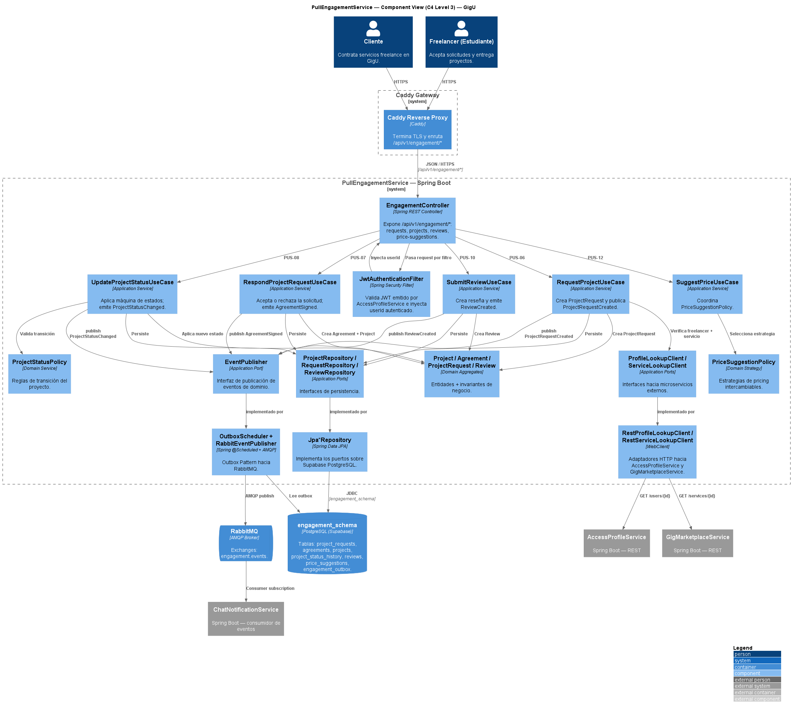

##### Viewpoint 02: Sequence Diagram — Aceptar solicitud y crear proyecto

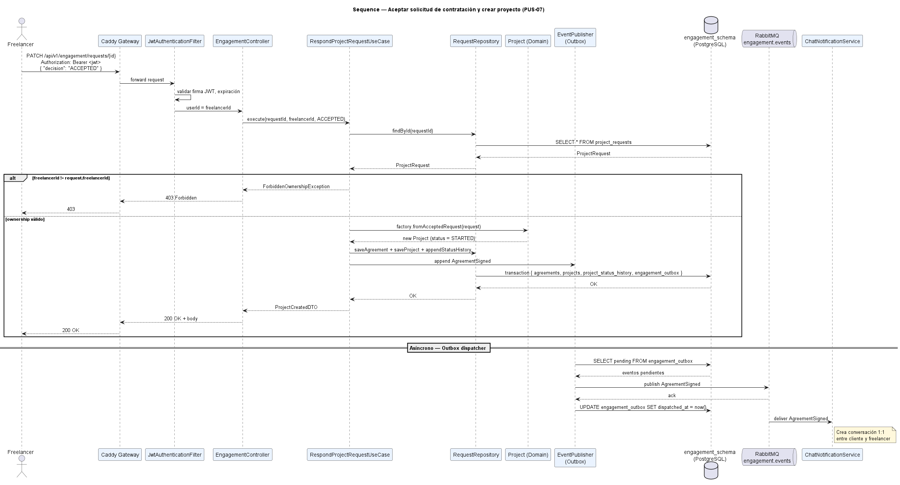

##### Viewpoint 03: State Diagram — Ciclo de vida del agregado `Project`

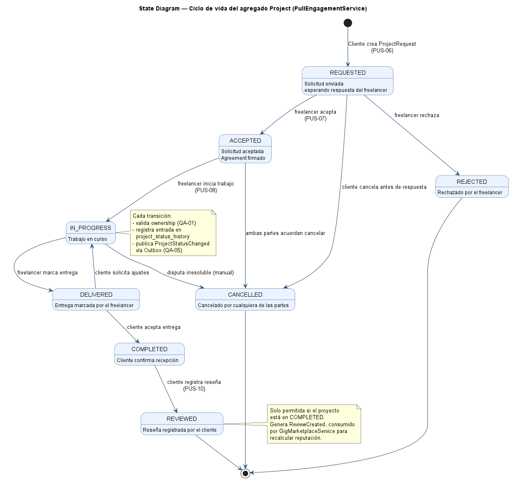

##### Viewpoint 04: Domain Class Diagram — Engagement bounded context

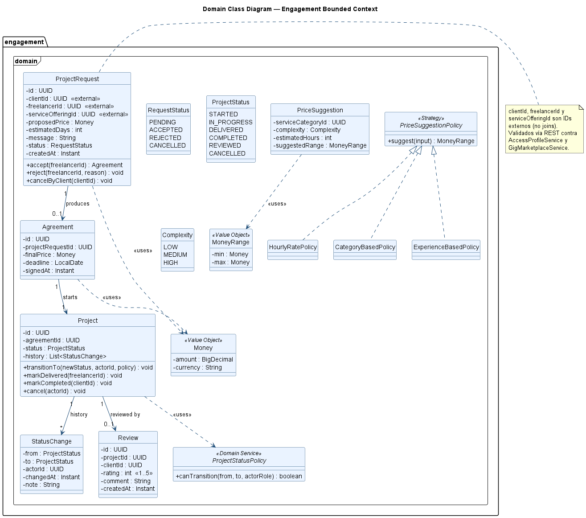

##### Architecture Decision Records de la iteración

| ADR | Decisión | Estado | Driver principal | Consecuencia |
| ------- | ----------------------------------------------------------------------------------------------------- | --------- | ---------------- | ------------------------------------------------------------------------------------------------------- |
| ADR-001 | Aplicar Clean Architecture en cuatro capas dentro de `PullEngagementService`. | Aceptada | QA-03 | Reglas de dominio testeables sin Spring; mayor número de archivos y mappers explícitos. |
| ADR-002 | Usar Strategy Pattern para `PriceSuggestionPolicy` y `ProjectStatusPolicy`. | Aceptada | QA-02 | Permite agregar reglas sin modificar casos de uso; introduce una interfaz adicional por política. |
| ADR-003 | Validar ownership en cada caso de uso, no en el controller. | Aceptada | QA-01 | El controller queda fino; las pruebas unitarias del caso de uso cubren el caso "usuario no dueño". |
| ADR-004 | Publicar eventos de dominio mediante Outbox Pattern (`engagement_outbox`) + worker hacia RabbitMQ. | Aceptada | QA-05 | Garantía at-least-once incluso ante caída del broker; requiere tabla adicional y un scheduler. |
| ADR-005 | Acceder a perfil y a servicio publicado mediante REST, no mediante lectura directa de tablas externas. | Aceptada | CRN-03 | Mantiene ownership de datos; introduce dependencia de red y obliga a manejar timeouts y reintentos. |
| ADR-006 | No introducir CQRS completo; se usa CQRS Lite separando comandos y queries solo en casos relevantes. | Aceptada | Simplicidad | Reduce complejidad para el alcance académico; queries y comandos comparten modelo de persistencia. |

#### 4.3.1.7. Analysis of Current Design and Review Iteration Goal: Kanban Board

El tablero Kanban de la Iteración 1 se gestiona en Notion (base de datos `sprint-1-backlog`). Cada tarjeta representa un driver, una decisión arquitectónica (ADR) o una vista a producir, agrupada bajo el Epic de producto al que afecta. La siguiente captura muestra las tarjetas filtradas por la etiqueta de iteración correspondiente.

**Tablero (Notion):** https://www.notion.so/38aff0862f2c80a19670ecc018555760?v=38aff0862f2c8176bd1d000cba93e333

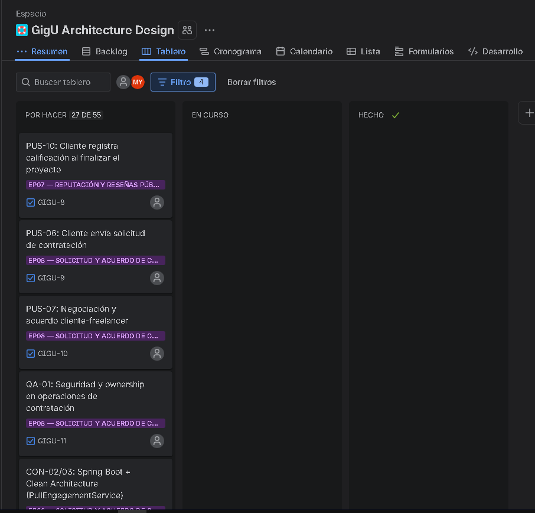

**Análisis de cumplimiento de drivers — Iteración 1**

| Driver de la iteración | Cobertura alcanzada |
| ---------------------- | ------------------------------------------------------------------------------------------------------------------------------------ |
| QA-02 Modificabilidad | Resuelto vía Strategy Pattern para reglas de pricing y transición de estados, junto con separación de bounded context. |
| QA-03 Testabilidad | Resuelto vía Clean Architecture en cuatro capas y puertos especializados para repositorios, clientes externos y publisher de eventos. |
| QA-01 Seguridad | Resuelto vía Spring Security + JWT y validación de ownership en cada caso de uso; auditoría en `project_status_history`. |
| QA-05 Disponibilidad | Resuelto vía Outbox Pattern; el envío de eventos no bloquea las operaciones principales de contratación. |
| PUS-05, PUS-06, PUS-07, PUS-09, PUS-11 | Cubiertos por contratos REST `/api/v1/engagement/*` y por las cuatro vistas C4/UML producidas en 4.3.1.6. |

Los pendientes identificados durante la iteración, como políticas de pricing adicionales más allá de Strategy básica, integración con pasarela de pagos real y métricas avanzadas de reputación, se consideran fuera del alcance académico actual y quedan documentados como extensiones futuras.

### 4.3.2. Iteration 2: GigMarketplaceService — Catalog & Discovery

Esta segunda iteración aplica ADD v3 sobre el segundo microservicio de mayor impacto arquitectónico: `GigMarketplaceService`. Este servicio es el catálogo de la plataforma: aloja la oferta de servicios publicados por los freelancers, los expone al cliente mediante búsqueda y filtros, y mantiene métricas visibles como reputación promedio.

Una vez cerrada la Iteración 1, donde quedaron definidos los contratos transaccionales que `PullEngagementService` consume desde Marketplace, esta iteración formaliza la estructura interna del catálogo y los contratos REST que el frontend utilizará para descubrir servicios. `GigMarketplaceService` se selecciona como segundo foco por tres razones objetivas:

- Es el bounded context que materializa la propuesta de valor visible para el cliente: sin un catálogo navegable no hay marketplace.
- Concentra los drivers de calidad de **performance** mediante búsquedas paginadas, filtros e índices, y de **modificabilidad** mediante nuevas categorías y nuevos atributos de servicio.
- Recibe eventos producidos por `PullEngagementService`, como `ReviewCreated`, que afectan vistas derivadas como reputación promedio, lo que convierte a este microservicio en el primer caso real de proyección eventual de la plataforma.

#### 4.3.2.1. Architectural Design Backlog 2

| ID | Tipo | Descripción | Prioridad |
| ------- | ------------------- | ---------------------------------------------------------------------------------------------------------------------------------------- | --------- |
| PUS-03 | Funcional | Como estudiante freelancer, deseo publicar servicios con descripción, categoría, tarifa, tiempo estimado y media asociada para ofrecerlos en la plataforma. | Alta |
| PUS-04 | Funcional | Como cliente, deseo buscar servicios por palabra clave, habilidad, precio, experiencia, relevancia o calificación para encontrar freelancers adecuados. | Alta |
| QA-02 | Atributo de calidad | Modificabilidad: agregar una nueva categoría de servicio o un nuevo atributo no debe forzar cambios en otros microservicios. | Alta |
| QA-04 | Atributo de calidad | Interoperabilidad: el catálogo se consume por el frontend mediante REST documentado con OpenAPI y DTOs estables. | Alta |
| QA-06 | Atributo de calidad | Performance: la búsqueda paginada de servicios responde de forma fluida sobre el dataset de validación académica. | Alta |
| QA-01 | Atributo de calidad | Seguridad: solo el freelancer dueño del servicio puede editarlo o despublicarlo; visitantes no autenticados pueden consultarlo. | Alta |
| CON-02 | Restricción | El microservicio se implementa con Java + Spring Boot. | Fija |
| CON-03 | Restricción | Aplica Clean Architecture en cuatro capas. | Fija |
| CON-07 | Restricción | Persistencia con Supabase PostgreSQL bajo el esquema `marketplace_schema`. | Fija |
| CON-08 | Restricción | La capacidad de storage para binarios de portafolio y media de servicios queda pendiente de implementación; en el diseño se mantiene un puerto de almacenamiento para evitar acoplamiento con un proveedor específico. | Pendiente |
| CRN-11 | Concern | Encapsular dependencias futuras de storage en adaptadores, no en el dominio. | Media |
| CRN-12 | Concern | Performance en búsquedas: la búsqueda puede degradarse al crecer el catálogo. | Alta |
| CRN-03 | Concern | Consistencia entre microservicios: la reputación promedio se actualiza por eventos, no por joins. | Alta |
| CRN-11 | Concern | Encapsular dependencias de Supabase Storage en adaptadores, no en el dominio. | Media |

#### 4.3.2.2. Establish Iteration Goal by Selecting Drivers

**Meta de la iteración:** definir la estructura interna de `GigMarketplaceService` y sus contratos REST de manera que el catálogo soporte publicación de servicios, búsqueda paginada con filtros, metadatos de media y proyección de reputación a partir de eventos diseñados para una futura integración con Google Cloud Pub/Sub. La capacidad de storage de binarios queda pendiente de implementación, por lo que el diseño conserva un puerto de almacenamiento sin tratarlo como evidencia completada.

| Driver | Por qué guía esta iteración |
| --- | --- |
| QA-06 Performance | El catálogo es el endpoint con mayor volumen de lecturas: requiere paginación, filtros indexados y DTOs ligeros. |
| QA-02 Modificabilidad | La taxonomía de categorías y los criterios de búsqueda evolucionarán durante los sprints siguientes. |
| QA-04 Interoperabilidad | El frontend consume directamente este microservicio mediante Vercel Rewrites y contratos REST: los contratos deben quedar estables y documentados antes de iniciar la UI. |
| QA-01 Seguridad | Endpoints públicos para visitantes coexisten con endpoints protegidos para el dueño del servicio: requiere segregación clara. |
| PUS-03, PUS-04 | Estas dos historias definen el ciclo publicar servicio con media → buscar y consultar catálogo. |
| CON-07, CON-08 | Restricciones que definen dónde vive cada tipo de dato: base relacional para metadatos y storage de binarios como capacidad pendiente. |

Quedan fuera del foco: la lógica transaccional de contratación, resuelta en la Iteración 1; el chat en tiempo real; la operación administrativa; la implementación real de Google Cloud Pub/Sub; la implementación real de storage; y la gestión de perfil y portafolio, que pertenece a `AccessProfileService`.

#### 4.3.2.3. Choose One or More Elements of the System to Refine

| Elemento a refinar | Tipo | Razón |
| ------------------------------- | ------------------- | ---------------------------------------------------------------------------------------------------------------------------------- |
| `GigMarketplaceService` | Contenedor | Foco principal de la iteración y mayor concentración de drivers de catálogo, búsqueda y publicación de servicios. |
| Esquema `marketplace_schema` | Componente de datos | Aloja `service_offerings`, `service_categories`, `service_media` y la vista derivada `freelancer_reputation`. |
| Contrato REST `/api/v1/marketplace/*` | Interfaz pública | Punto de acoplamiento del frontend Vue para listado, detalle, publicación, edición y despublicación de servicios. |
| Consumidor de eventos `ReviewCreated` | Interfaz asíncrona futura | Punto de entrada diseñado para mantener actualizada la proyección de reputación promedio cuando Google Cloud Pub/Sub sea implementado. |
| Puerto de storage de media | Adaptador externo futuro | Permite diseñar el almacenamiento de archivos asociados a servicios sin guardar binarios dentro de la base de datos relacional; la implementación real queda pendiente. |

#### 4.3.2.4. Choose One or More Design Concepts That Satisfy the Selected Drivers

| Driver atendido | Concepto de diseño seleccionado | Justificación contra el driver |
| ------------------------- | ---------------------------------------------------------------------------------------------------------- | ------------------------------------------------------------------------------------------------------------------------------- |
| QA-06 Performance | Specification Pattern para componer filtros por categoría, precio, reputación, habilidades y palabra clave. | Permite construir consultas dinámicas sin métodos `findByXandYandZ`; deja al motor SQL aprovechar índices. |
| QA-06 Performance | Manage Resources: paginación obligatoria e índices en `category_id`, `price`, `avg_rating` y campos de búsqueda frecuente. | Evita cargar el catálogo completo y mantiene tiempos de respuesta acotados al crecer el volumen. |
| QA-06 Performance | Reduce Overhead: `ServiceCardDTO` ligero para listados y `ServiceDetailDTO` enriquecido solo para detalle. | Reduce ancho de banda y evita serializar campos innecesarios en consultas masivas. |
| QA-02 Modificabilidad | Repository + Specification: nuevas dimensiones de filtro se agregan implementando `Specification`. | Aísla cambios al dominio sin tocar controllers ni queries JPA rígidas. |
| QA-02 Modificabilidad | Encapsulate: la taxonomía de categorías es un agregado independiente de `ServiceOffering`. | Permite agregar o renombrar categorías sin modificar la entidad principal. |
| QA-04 Interoperabilidad | API First + DTOs explícitos + OpenAPI/Swagger. | El frontend consume contratos versionados y validables; la entidad de dominio nunca se expone directamente. |
| QA-01 Seguridad | Authorize Actors: endpoints `GET` públicos, endpoints `POST/PATCH/DELETE` protegidos por JWT + ownership. | Visitantes pueden navegar el catálogo; solo el dueño del servicio puede modificarlo. |
| PUS-03 | Adapter Pattern para `MediaStoragePort`. | Mantiene el dominio agnóstico al proveedor de storage; permite implementar Supabase Storage, Google Cloud Storage u otro proveedor sin tocar reglas de negocio. La implementación real queda pendiente. |
| PUS-04 | Specification Pattern + DTOs de lectura. | Permite que la búsqueda y visualización del catálogo evolucionen sin afectar publicación, contratación ni perfil. |
| ReviewCreated consumer | Event Handler + Materialized Read Model `freelancer_reputation`. | Calcular el promedio de reseñas en cada lectura sería costoso; mantener una proyección actualizada por evento sirve a QA-06. La integración asíncrona queda diseñada para Google Cloud Pub/Sub, pendiente de implementación. |
| CRN-11 | Hexagonal ports/adapters dentro del microservicio. | Separa storage futuro, Supabase PostgreSQL y Google Cloud Pub/Sub del dominio. |

#### 4.3.2.5. Instantiate Architectural Elements, Allocate Responsibilities, and Define Interfaces

##### Componentes internos de `GigMarketplaceService`

| Componente | Capa Clean Architecture | Responsabilidad |
| ----------------------------------- | ----------------------- | ------------------------------------------------------------------------------------------------ |
| `MarketplaceController` | Interface | Expone REST `/api/v1/marketplace/*` para listado, detalle, creación, edición y despublicación de servicios. |
| `JwtAuthenticationFilter` | Interface | Valida JWT en endpoints protegidos; permite paso libre a endpoints públicos de lectura. |
| `PublishServiceUseCase` | Application | Crea `ServiceOffering` validando categoría y dueño; sube media a través de `MediaStoragePort`. |
| `UpdateServiceUseCase` | Application | Aplica cambios respetando ownership. |
| `UnpublishServiceUseCase` | Application | Marca el servicio como retirado sin borrarlo físicamente. |
| `SearchServicesUseCase` | Application | Compone `ServiceSpecification` a partir de filtros y devuelve página de `ServiceCardDTO`. |
| `GetServiceDetailUseCase` | Application | Devuelve `ServiceDetailDTO` enriquecido con media, reputación y datos básicos del freelancer. |
| `OnReviewCreatedHandler` | Application | Consume `ReviewCreated` y actualiza `freelancer_reputation`. |
| `ServiceOffering`, `ServiceCategory`, `ServiceMedia`, `FreelancerReputation` | Domain | Entidades agregadas con invariantes del catálogo. |
| `ServiceSpecification` | Domain | Compone predicados de búsqueda. |
| `ServiceRepository`, `CategoryRepository`, `ReputationRepository` | Application (puerto) | Abstracciones de persistencia. |
| `MediaStoragePort` | Application (puerto) | Abstracción de almacenamiento de binarios para una capacidad de storage futura. |
| `EventConsumer` | Application (puerto) | Abstracción de consumo de eventos desde Google Cloud Pub/Sub cuando la mensajería asíncrona sea implementada. |
| `JpaServiceRepository` | Infrastructure | Implementa el puerto de persistencia sobre Supabase PostgreSQL. |
| `StorageAdapter` | Infrastructure | Adaptador futuro para implementar `MediaStoragePort` con el proveedor de storage seleccionado. |
| `PubSubReviewConsumer` | Infrastructure | Consumidor futuro de eventos `ReviewCreated` desde Google Cloud Pub/Sub para delegar en `OnReviewCreatedHandler`. |

##### Interfaces (contratos REST principales)

| Endpoint | Método | Driver atendido | Auth | Descripción |
| --------------------------------------------------------- | ------- | --------------------- | -------- | ---------------------------------------------------------------- |
| `GET /api/v1/marketplace/services` | GET | PUS-04, QA-06 | Pública | Listado paginado + filtros (`category`, `priceMin`, `priceMax`, `minRating`, `q`). |
| `GET /api/v1/marketplace/services/{id}` | GET | PUS-04, QA-04 | Pública | Detalle con media y reputación del freelancer. |
| `POST /api/v1/marketplace/services` | POST | PUS-03, QA-01 | JWT | Freelancer publica un nuevo servicio. |
| `PATCH /api/v1/marketplace/services/{id}` | PATCH | PUS-03, QA-01 | JWT | Edita un servicio propio. |
| `DELETE /api/v1/marketplace/services/{id}` | DELETE | PUS-03, QA-01 | JWT | Despublica un servicio mediante soft delete. |
| `POST /api/v1/marketplace/services/{id}/media` | POST | PUS-03, QA-01 | JWT | Sube archivo asociado al servicio publicado. |
| `GET /api/v1/marketplace/categories` | GET | QA-02, QA-04 | Pública | Lista la taxonomía de categorías para alimentar filtros del frontend. |

##### Eventos consumidos

| Evento | Origen | Acción |
| ----------------- | ----------------------- | --------------------------------------------------------------------------------- |
| `ReviewCreated` | `PullEngagementService` | `OnReviewCreatedHandler` actualiza `freelancer_reputation` (`avg_rating`, `count`). |

#### 4.3.2.6. Sketch Views: C4 & UML, and Record Design Decisions

Para esta iteración se generaron cuatro vistas que sustentan las decisiones tomadas: una vista de componentes C4 del microservicio, una vista de secuencia UML para la búsqueda paginada con filtros, una vista de secuencia UML para la proyección de reputación por evento `ReviewCreated` y una vista de clases UML del modelo de dominio.

##### Viewpoint 01: Component View — GigMarketplaceService (C4 nivel 3)

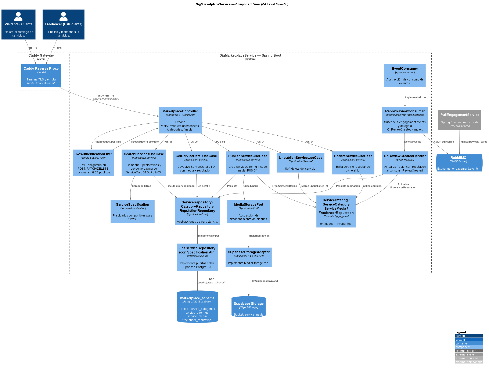

##### Viewpoint 02: Sequence Diagram — Búsqueda paginada con filtros

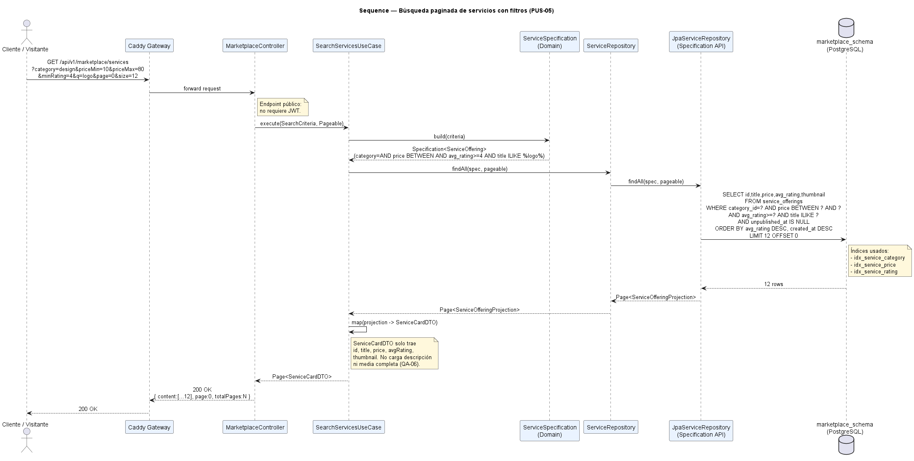

##### Viewpoint 03: Sequence Diagram — Proyección de reputación por evento `ReviewCreated`

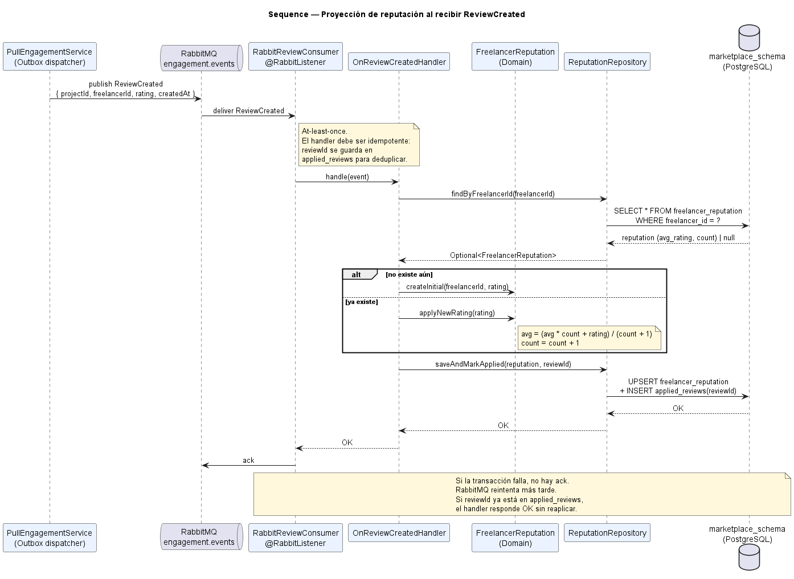

##### Viewpoint 04: Domain Class Diagram — Marketplace bounded context

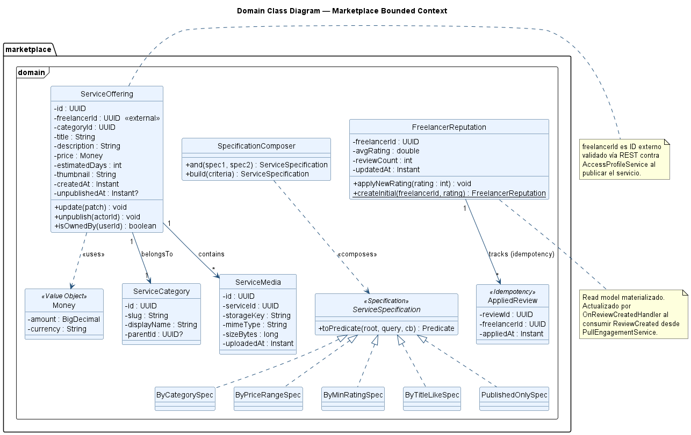

##### Architecture Decision Records de la iteración

| ADR | Decisión | Estado | Driver principal | Consecuencia |
| ------- | ----------------------------------------------------------------------------------------------------- | --------- | ---------------- | ------------------------------------------------------------------------------------------------------- |
| ADR-007 | Aplicar Specification Pattern para componer filtros de búsqueda. | Aceptada | QA-02, QA-06 | Filtros componibles y mantenibles; introduce una abstracción adicional sobre los repositorios. |
| ADR-008 | Separar `ServiceCardDTO` para listado y `ServiceDetailDTO` para detalle. | Aceptada | QA-06 | Listados ligeros y rápidos; el equipo debe mantener dos DTOs sincronizados con el modelo de dominio. |
| ADR-009 | Mantener un read model materializado `freelancer_reputation` actualizado por `ReviewCreated`. | Aceptada | QA-06 | Lecturas O(1) sin agregaciones; introduce consistencia eventual y un consumer adicional. |
| ADR-010 | Aplicar soft delete mediante `unpublished_at` en lugar de borrado físico de servicios. | Aceptada | CRN-03 | Permite preservar referencias históricas desde proyectos cerrados; requiere filtrar en cada query. |
| ADR-011 | Exponer endpoints `GET` públicos sin JWT y proteger `POST/PATCH/DELETE` con JWT + ownership. | Aceptada | QA-01, QA-04 | Visitantes pueden explorar el catálogo; requiere configuración granular en Spring Security. |
| ADR-012 | Mantener `MediaStoragePort` como puerto de almacenamiento sin fijar implementación concreta en esta fase. | Aceptada | CRN-11 | El dominio queda agnóstico al proveedor; permite implementar Supabase Storage, Google Cloud Storage u otro proveedor posteriormente sin tocar reglas de negocio. |

#### 4.3.2.7. Analysis of Current Design and Review Iteration Goal: Kanban Board

El tablero Kanban de la Iteración 2 se gestiona en Notion (base de datos `sprint-1-backlog`), filtrado para mostrar las tarjetas correspondientes a `GigMarketplaceService`. Cada tarjeta se agrupa bajo el Epic de producto al que afecta dentro del catálogo y descubrimiento de servicios.

**Tablero (Notion):** https://www.notion.so/38aff0862f2c80a19670ecc018555760?v=38aff0862f2c8176bd1d000cba93e333

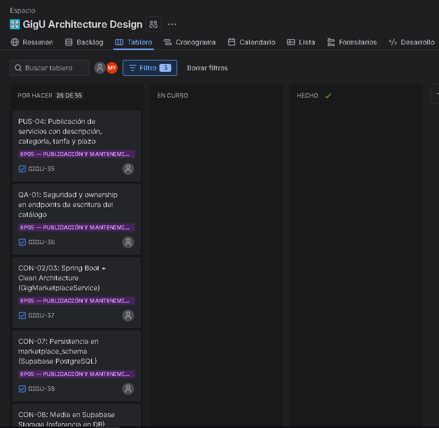

**Análisis de cumplimiento de drivers — Iteración 2**

| Driver de la iteración | Cobertura alcanzada |
| ------------------------- | -------------------------------------------------------------------------------------------------------------------------------------------------- |
| QA-06 Performance | Resuelto vía Specification Pattern, paginación obligatoria e índices sobre campos frecuentes de búsqueda. |
| QA-02 Modificabilidad | Resuelto vía Specifications componibles para nuevos filtros y desacoplamiento de `ServiceCategory` como agregado independiente. |
| QA-04 Interoperabilidad | Resuelto vía contratos REST `/api/v1/marketplace/*` documentados con OpenAPI y DTOs estables (`ServiceCardDTO`, `ServiceDetailDTO`). |
| QA-01 Seguridad | Resuelto vía endpoints públicos `GET` y endpoints protegidos `POST/PATCH/DELETE` con JWT + ownership. |
| Consistencia eventual | Resuelto vía read model materializado `freelancer_reputation` actualizado por `ReviewCreated`, con idempotencia mediante `applied_reviews`. |
| PUS-03, PUS-04 | Cubiertos por contratos REST, endpoint de media bajo PUS-03, esquema `marketplace_schema` con índices y las cuatro vistas C4/UML producidas en 4.3.2.6. |

Los pendientes identificados durante la iteración, como recomendación de servicios por similitud, métricas de tendencia del catálogo y búsqueda full-text avanzada, se consideran fuera del alcance académico actual y quedan documentados como extensiones para futuras iteraciones de ADD.

# Capítulo V: Product Implementation, Validation & Deployment

## 5.1. Testing Suites & General Patterns

Esta sección describe la estrategia de pruebas adoptada para el backend de GigU y los patrones generales que estructuran cada microservicio. La solución backend está compuesta por cuatro microservicios Spring Boot (`access-profile-service`, `gig-marketplace-service`, `pulls-service` y `chat-notification-service`) que comparten una misma estructura interna basada en Clean Architecture y un mismo conjunto de herramientas de prueba.

### 5.1.1. Backend Application Core Testing Suite

El núcleo de pruebas del backend se apoya en el stack de testing de Spring Boot. Cada microservicio declara en su `pom.xml` las dependencias necesarias para pruebas unitarias y de integración, y aplica un umbral mínimo de cobertura mediante JaCoCo.

| Tipo de prueba | Herramienta | Propósito |
| --- | --- | --- |
| Unit Testing | JUnit 5 + Mockito | Verificar reglas de negocio y servicios de aplicación de forma aislada. |
| Application / Security Testing | spring-boot-starter-test + spring-security-test | Validar el comportamiento de la capa de aplicación y la seguridad basada en JWT. |
| Integration Testing | Testcontainers (PostgreSQL) | Levantar una base de datos PostgreSQL real en contenedor para validar la persistencia y los flujos de extremo a extremo. |
| Code Coverage | JaCoCo | Aplicar un umbral mínimo de 85% de cobertura de instrucciones, excluyendo modelos de dominio y DTOs. |

**Estado actual de la suite:** `access-profile-service` cuenta con una prueba unitaria del servicio de aplicación (`AccessProfileApplicationServiceTest`) y una prueba de integración basada en Testcontainers (`AccessIntegrationTest`). Los microservicios `gig-marketplace-service`, `pulls-service` y `chat-notification-service` ya tienen la infraestructura de pruebas configurada (dependencias y JaCoCo), pero la implementación de sus casos de prueba queda pendiente para el siguiente Sprint. Los archivos `.feature` de BDD (Gherkin) para Integration/Acceptance Tests también quedan pendientes y se registran como deuda de testing en la sección 5.3.1.3.

### 5.1.2. Pattern Based Backend Application(s)

Los cuatro microservicios siguen un mismo patrón arquitectónico de aplicación basado en Clean Architecture / Hexagonal Architecture (Ports & Adapters). La estructura interna de paquetes es consistente entre servicios, como se evidencia en `access-profile-service`:

| Capa | Paquete | Responsabilidad | Patrones aplicados |
| --- | --- | --- | --- |
| Domain | `domain.model`, `domain.valueobject` | Entidades y value objects con reglas de negocio puras, sin dependencias de framework. | Domain Model, Value Object |
| Application | `application.service`, `application.port.out`, `application.dto`, `application.exception` | Casos de uso, puertos de salida y comandos. Orquesta el dominio sin conocer detalles de infraestructura. | Use Case, Ports & Adapters, Command, jerarquía de excepciones de negocio |
| Infrastructure | `infrastructure.persistence`, `infrastructure.security`, `infrastructure.storage`, `infrastructure.config` | Adaptadores concretos: repositorios JPA, proveedor JWT, almacenamiento Supabase, configuración de seguridad y OpenAPI. | Adapter, Repository, Data Mapper |
| Interfaces | `interfaces.rest` | Controladores REST, DTOs de request y manejo centralizado de errores. | REST Controller, DTO, Exception Handler |

Este patrón se replica en `gig-marketplace-service`, `pulls-service` y `chat-notification-service`, lo que garantiza que el dominio nunca dependa de frameworks o proveedores externos y que cada adaptador (PostgreSQL, JWT, Supabase Storage) pueda sustituirse sin afectar la lógica de negocio.

### 5.1.3. Pattern Based Custom Software Library

Actualmente la solución no cuenta con una librería de software compartida extraída como artefacto independiente; cada microservicio es autónomo y empaqueta su propia copia de los componentes transversales. Sin embargo, se identifican patrones repetidos entre los cuatro servicios que son candidatos naturales a ser extraídos como librería común:

| Componente transversal | Descripción | Servicios donde se repite |
| --- | --- | --- |
| Jerarquía de excepciones de negocio | `BusinessRuleViolationException`, `ResourceNotFoundException`, `DuplicatedResourceException`, `UnauthorizedActionException`, entre otras. | Los 4 microservicios |
| `RestExceptionHandler` | Manejo centralizado y uniforme de errores HTTP. | Los 4 microservicios |
| `OpenApiConfig` | Configuración estándar de documentación OpenAPI/Swagger. | Los 4 microservicios |
| Seguridad JWT | `JwtAuthenticationFilter`, `JwtTokenProviderAdapter`, `SecurityConfig`. | Los 4 microservicios |

La extracción de estos componentes a una librería `gigu-platform-commons` se registra como recomendación de refactoring para próximos Sprints (ver sección 5.1.4).

### 5.1.4. Framework Pattern Driven Refactoring Report

Durante la implementación se realizaron varios refactorings orientados a consolidar patrones y estabilizar la solución. Los principales se resumen a continuación:

| Refactoring | Motivación | Evidencia (commit) |
| --- | --- | --- |
| Eliminación de servicio de engagement duplicado | Existía un microservicio legacy duplicado; se consolidó en `pulls-service`. | `4af6f86` refactor(pulls): remove legacy engagement service duplicate |
| Canonicalización de endpoints de autenticación | Se conservaron únicamente los endpoints canónicos de acceso, eliminando rutas redundantes. | `213a2ed` fix(access): keep only canonical auth endpoints |
| Normalización de CORS | Se unificó la configuración CORS para servicios cloud autenticados. | `afa5097` fix(security): normalize CORS for authenticated cloud services |
| Migración de plataforma de despliegue | Se migró el despliegue de los microservicios de Render a Google Cloud Run. | `d92410c` chore(cloud): migrate microservices deployment to Google Cloud Run |
| Soporte de esquema HTTPS reenviado en Swagger | Se ajustó la configuración para respetar el esquema HTTPS detrás del proxy de Cloud Run. | `c6ba4eb` fix(cloud): honor forwarded https scheme in swagger |

Refactoring pendiente recomendado: extracción de los componentes transversales descritos en 5.1.3 a una librería compartida `gigu-platform-commons`, e implementación de las suites de prueba faltantes en los tres microservicios que aún no las tienen.

## 5.2. Software Configuration Management

### 5.2.1. Software Development Environment Configuration

En esta sección se especifican los productos de software que utilizan los miembros del equipo durante el ciclo de vida del producto digital, organizados por tipo de actividad. Para herramientas SaaS se indica la ruta de referencia; para productos que se ejecutan localmente se indica la ruta de descarga.

| Actividad | Herramienta | Tipo | Ruta de referencia / descarga |
| --- | --- | --- | --- |
| Project Management | Trello | SaaS | https://trello.com |
| Requirements Management | Trello + GitHub | SaaS | https://trello.com — https://github.com |
| Product Design (UX/UI) | Figma | SaaS | https://www.figma.com |
| Modelado UML / C4 | diagrams.net (draw.io) | SaaS | https://app.diagrams.net |
| Software Development (Backend) | IntelliJ IDEA Community | Descarga local | https://www.jetbrains.com/idea/download |
| Software Development (Frontend) | Visual Studio Code | Descarga local | https://code.visualstudio.com/download |
| Plataforma Backend | JDK 21 + Apache Maven | Descarga local | https://adoptium.net — https://maven.apache.org/download.cgi |
| Plataforma Frontend | Node.js + npm | Descarga local | https://nodejs.org/en/download |
| Control de versiones | Git | Descarga local | https://git-scm.com/downloads |
| Software Testing | JUnit 5, Mockito, Testcontainers | Dependencias Maven | Gestionadas vía `pom.xml` |
| Software Testing (API manual) | Postman | Descarga local | https://www.postman.com/downloads |
| Software Deployment (Backend) | Google Cloud SDK (`gcloud` CLI) | Descarga local | https://cloud.google.com/sdk/docs/install |
| Software Deployment (CI) | GitHub Actions | SaaS | https://github.com/features/actions |
| Software Deployment (Frontend) | Vercel | SaaS | https://vercel.com |
| Software Documentation (API) | springdoc-openapi / Swagger UI | Dependencia Maven | https://springdoc.org |
| Software Documentation (Informe) | GitHub (Markdown) | SaaS | https://github.com |

### 5.2.2. Source Code Management

El equipo utiliza **GitHub** como plataforma y sistema de control de versiones. La solución se organiza en repositorios independientes por producto digital:

| Producto digital | Repositorio |
| --- | --- |
| Web Services (backend de microservicios) | https://github.com/1ASI0657-2610-7940-Final-Project/backend-microservices |
| Frontend Web App | https://github.com/1ASI0657-2610-7940-Final-Project/frontend |
| Landing Page | https://github.com/1ASI0657-2610-7940-Final-Project/landing-page |
| Documentación del proyecto | https://github.com/1ASI0657-2610-7940-Final-Project/docs |

En el caso de Web Services, el repositorio `backend-microservices` incluye tanto el proyecto de los cuatro microservicios como sus archivos de pruebas. Las pruebas unitarias e integración se ubican en `services/<microservicio>/src/test/java`; los archivos `.feature` de BDD se incorporarán en `services/<microservicio>/src/test/resources` (pendiente, ver 5.3.1.3).

**Workflow de control de versiones — GitFlow.** El equipo adopta el modelo *GitFlow* descrito por Vincent Driessen. Las ramas que se mantienen son:

| Rama | Propósito | Convención de nombre |
| --- | --- | --- |
| `main` | Rama principal; contiene el código estable y desplegable. | `main` |
| `develop` | Rama de integración donde convergen las features completadas. | `develop` |
| Feature branches | Una rama por funcionalidad o por microservicio en desarrollo. | `feature/<descripcion-en-kebab-case>` (ej. `feature/access-profile-service`, `feature/gig-marketplace-service`, `feature/main-app-logic`) |
| Release branches | Preparación de una versión para publicación. | `release/<version-semver>` (ej. `release/1.0.0`) |
| Hotfix branches | Corrección urgente sobre producción. | `hotfix/<version-semver>` (ej. `hotfix/1.0.1`) |

Durante el Sprint 1, el repositorio backend trabajó con feature branches por microservicio (`feature/access-profile-service`, `feature/chat-notification-service`, `feature/gig-marketplace-service`, `feature/pull-engagement-service`) que se integraron en `feature/main-app-logic`, rama desde la cual se ejecutan los despliegues a Google Cloud Run.

**Semantic Versioning.** Los releases se nombran siguiendo *Semantic Versioning 2.0.0* con el formato `MAJOR.MINOR.PATCH` (ej. `1.0.0`): se incrementa `MAJOR` ante cambios incompatibles de API, `MINOR` ante funcionalidad nueva retrocompatible y `PATCH` ante correcciones retrocompatibles.

**Conventional Commits.** Los mensajes de commit siguen la especificación *Conventional Commits*, con el formato `<tipo>(<alcance>): <descripción>`. Los tipos utilizados por el equipo son `feat`, `fix`, `chore`, `docs`, `ci`, `refactor` y `merge`. Ejemplos reales del repositorio backend:

- `feat(access): add access profile service`
- `feat(marketplace): add gig marketplace service`
- `fix(security): normalize CORS for authenticated cloud services`
- `ci(cloud): add manual deploy workflows per microservice`
- `refactor(pulls): remove legacy engagement service duplicate`

### 5.2.3. Source Code Style Guide & Conventions

El equipo adopta las siguientes referencias de estilo y convenciones de codificación. Para todos los lenguajes se aplica nomenclatura en inglés.

| Lenguaje / artefacto | Referencia de estilo | Convenciones principales |
| --- | --- | --- |
| Java (microservicios backend) | Google Java Style Guide | Clases en `PascalCase`, métodos y variables en `camelCase`, constantes en `UPPER_SNAKE_CASE`, paquetes en minúsculas. Organización por capas de Clean Architecture (`domain`, `application`, `infrastructure`, `interfaces`). |
| TypeScript / Vue (frontend y landing) | Google TypeScript Style Guide | Variables y funciones en `camelCase`, clases y componentes en `PascalCase`, archivos de componentes Vue en `PascalCase.vue`, indentación de 2 espacios, comillas simples. |
| Gherkin (archivos `.feature`) | Gherkin Conventions for Readable Specifications | Un `Feature` por archivo, escenarios declarativos en tercera persona, pasos `Given/When/Then` concisos y reutilizables, uso de `Scenario Outline` con `Examples` para casos parametrizados. |
| Endpoints REST | API First / OpenAPI 3.0 | Rutas en minúsculas y plural (`/api/v1/marketplace/services`), versionado por path (`/api/v1`), verbos HTTP semánticos (`GET`, `POST`, `PUT`, `PATCH`, `DELETE`). |
| Commits y ramas | Conventional Commits + GitFlow | Ver convenciones de la sección 5.2.2. |

### 5.2.4. Software Deployment Configuration

La configuración de despliegue del proyecto se organiza separando frontend, backend, base de datos y capacidades pendientes de infraestructura. El frontend y la landing page se despliegan en Vercel. El backend se despliega en Google Cloud Run mediante workflows manuales de GitHub Actions por microservicio. La base de datos principal se mantiene en Supabase PostgreSQL.

| Componente | Tecnología / servicio | Estado | Descripción |
| --- | --- | --- | --- |
| Landing Page | Vercel | Implementado | Sitio público de presentación del producto. |
| Frontend Web App | Vercel | Implementado | Aplicación Vue + Vite consumida por usuarios finales. |
| Public API Routing | Vercel Rewrites | Implementado | Reenvía rutas relativas `/api/*` hacia los microservicios backend en Cloud Run. |
| Backend Runtime | Google Cloud Run | Implementado | Ejecuta los microservicios Spring Boot como servicios cloud independientes. |
| Backend Deployment | GitHub Actions manuales por microservicio | Implementado | Cada workflow se ejecuta mediante `workflow_dispatch` y despliega un servicio específico. |
| Local Deployment Support | Scripts PowerShell en `/gcloud` | Implementado | Permiten desplegar manualmente desde una estación local usando `gcloud run deploy --source`. |
| Database | Supabase PostgreSQL | Implementado | Base de datos relacional administrada con esquemas lógicos por microservicio. |
| Asynchronous Messaging | Google Cloud Pub/Sub | Seleccionado / pendiente | Servicio elegido para eventos asíncronos entre microservicios; aún no implementado. |
| Storage | Por definir | Pendiente | Capacidad futura para binarios de portafolio, imágenes y adjuntos. |

Los workflows de despliegue backend se encuentran en el repositorio `backend-microservices` bajo `.github/workflows`:

| Workflow | Microservicio | Servicio Cloud Run |
| --- | --- | --- |
| `deploy-access-profile-service.yml` | AccessProfileService | `gigu-access-profile-service` |
| `deploy-gig-marketplace-service.yml` | GigMarketplaceService | `gigu-gig-marketplace-service` |
| `deploy-pulls-service.yml` | PullEngagementService | `gigu-pulls-service` |
| `deploy-chat-notification-service.yml` | ChatNotificationService | `gigu-chat-notification-service` |

Cada workflow valida que el despliegue se ejecute desde la rama `feature/main-app-logic`, autentica contra Google Cloud mediante `google-github-actions/auth`, configura el CLI con `google-github-actions/setup-gcloud` y ejecuta `gcloud run deploy --source` para desplegar el microservicio correspondiente en la región `us-central1` del proyecto `dosys-rest-api`.

Los scripts locales de soporte se encuentran en la carpeta `gcloud` del repositorio backend:

| Script | Propósito |
| --- | --- |
| `gcloud/deploy-access-profile-service.ps1` | Despliegue local manual de AccessProfileService. |
| `gcloud/deploy-gig-marketplace-service.ps1` | Despliegue local manual de GigMarketplaceService. |
| `gcloud/deploy-pulls-service.ps1` | Despliegue local manual de PullEngagementService. |
| `gcloud/deploy-chat-notification-service.ps1` | Despliegue local manual de ChatNotificationService. |
| `gcloud/deploy-all.ps1` | Orquestación local para desplegar todos los microservicios. |

Los secrets requeridos para despliegue desde GitHub Actions son:

| Secret / variable | Uso |
| --- | --- |
| `GCP_SA_KEY` | Credenciales de la cuenta de servicio de Google Cloud. |
| `SPRING_DATASOURCE_URL` | URL JDBC de Supabase PostgreSQL. |
| `SPRING_DATASOURCE_USERNAME` | Usuario de base de datos. |
| `SPRING_DATASOURCE_PASSWORD` | Contraseña de base de datos. |
| `SUPABASE_URL` | URL del proyecto Supabase. |
| `SUPABASE_SERVICE_ROLE_KEY` | Llave de servicio de Supabase. |
| `JWT_SECRET` | Secreto para emisión/validación de JWT. |
| `INTERNAL_SERVICE_TOKEN` | Token interno para comunicación entre microservicios. |
| `CORS_ALLOWED_ORIGINS` | Variable recomendada para configurar orígenes permitidos de frontend. |

## 5.3. Microservices Implementation

### 5.3.1. Sprint 1

#### 5.3.1.1. Sprint Backlog 1

El objetivo principal del Sprint 1 fue **implementar y desplegar el backbone funcional de la solución GigU**: los cuatro microservicios REST del backend (AccessProfileService, GigMarketplaceService, PullEngagementService y ChatNotificationService), la aplicación frontend y la landing page, junto con su configuración de despliegue en la nube (Google Cloud Run y Vercel).

Siguiendo el enfoque Attribute-Driven Design, el **tablero Kanban del ADD** se desarrolla durante este Sprint: la base de datos de Notion `sprint-1-backlog` contiene los work-items resultantes de las iteraciones ADD del Capítulo IV —Primary User Stories (PUS), drivers de calidad (QA), restricciones (CON), concerns (CRN), Architecture Decision Records (ADR), Sketch Views y definición de contratos y esquemas—, agrupados bajo el Epic de producto al que afectan. Las 54 tarjetas (GIGU-8 a GIGU-61) constituyen el Sprint Backlog 1 y se ejecutan, prueban y despliegan en este Sprint.

**Board del Sprint 1 (Notion):** https://www.notion.so/38aff0862f2c80a19670ecc018555760?v=38aff0862f2c8176bd1d000cba93e333

El backlog del Sprint 1 en Notion, filtrado por estado al cierre del Sprint:

_Tareas por hacer (To-do) — 4 actividades:_

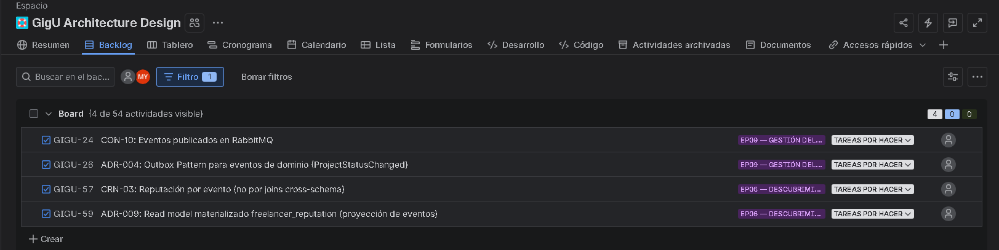

_Tareas en curso (In-Process) — 5 actividades:_

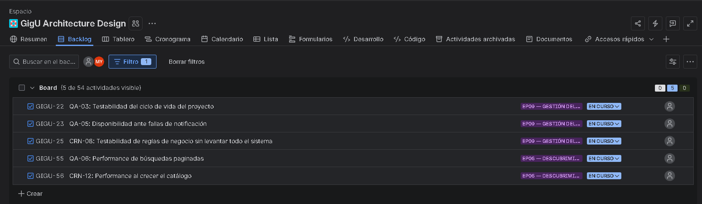

_Tareas finalizadas (Done) — 45 actividades:_

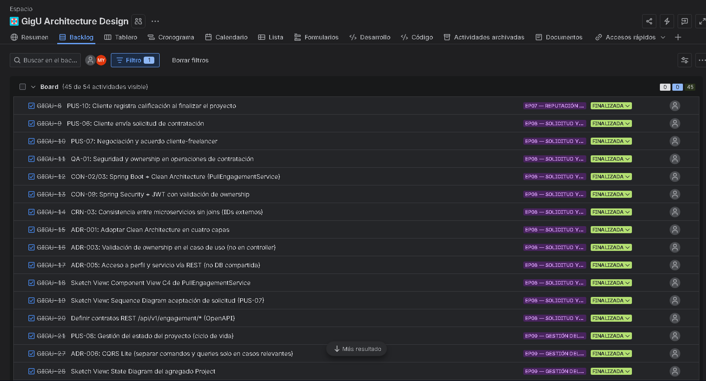

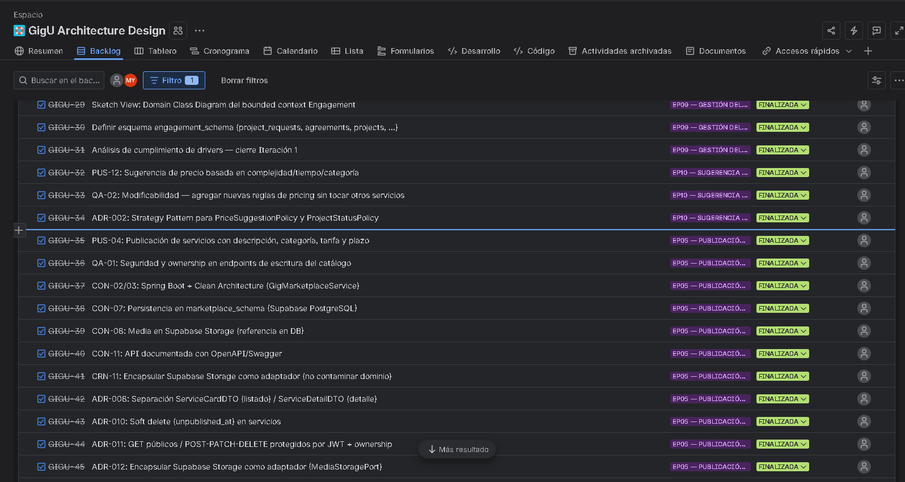

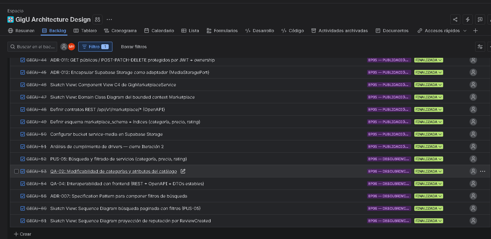

| Sprint # | Sprint 1 | | | | | | |
| --- | --- | --- | --- | --- | --- | --- | --- |
| **User Story / Epic** | | **Work-Item / Task** | | | | | |
| **Id** | **Title** | **Id** | **Title** | **Description** | **Estimation (h)** | **Assigned To** | **Status** |
| EP07 | Reputación y Reseñas Públicas | GIGU-8 | PUS-10: Cliente registra calificación al finalizar el proyecto | Endpoints de reseñas del proyecto (`GET`/`POST /projects/{id}/reviews`). | 5 | Oblitas Davila, Mariano | Done |
| EP08 | Solicitud y Acuerdo de Contratación | GIGU-9 | PUS-06: Cliente envía solicitud de contratación | `POST /api/v1/engagement/requests`. | 6 | Oblitas Davila, Mariano | Done |
| EP08 | Solicitud y Acuerdo de Contratación | GIGU-10 | PUS-07: Negociación y acuerdo cliente-freelancer | `PATCH /requests/{id}/decision` y creación del proyecto. | 5 | Oblitas Davila, Mariano | Done |
| EP08 | Solicitud y Acuerdo de Contratación | GIGU-11 | QA-01: Seguridad y ownership en operaciones de contratación | Validación JWT + ownership en los endpoints de escritura. | 3 | Mio Mejia, Andy | Done |
| EP08 | Solicitud y Acuerdo de Contratación | GIGU-12 | CON-02/03: Spring Boot + Clean Architecture (PullEngagementService) | Estructura del microservicio en cuatro capas. | 6 | Oblitas Davila, Mariano | Done |
| EP08 | Solicitud y Acuerdo de Contratación | GIGU-13 | CON-09: Spring Security + JWT con validación de ownership | Filtro JWT y configuración de seguridad. | 4 | Ybañez Esquerre, Miguel | Done |
| EP08 | Solicitud y Acuerdo de Contratación | GIGU-14 | CRN-03: Consistencia entre microservicios sin joins (IDs externos) | Referencias por ID externo, sin joins cross-schema. | 2 | Mio Mejia, Andy | Done |
| EP08 | Solicitud y Acuerdo de Contratación | GIGU-15 | ADR-001: Adoptar Clean Architecture en cuatro capas | Decisión arquitectónica documentada y aplicada. | 2 | Oblitas Davila, Mariano | Done |
| EP08 | Solicitud y Acuerdo de Contratación | GIGU-16 | ADR-003: Validación de ownership en el caso de uso | Ownership validado en el application service, no en el controller. | 2 | Ybañez Esquerre, Miguel | Done |
| EP08 | Solicitud y Acuerdo de Contratación | GIGU-17 | ADR-005: Acceso a perfil y servicio vía REST (no DB compartida) | Comunicación REST entre microservicios. | 2 | Mio Mejia, Andy | Done |
| EP08 | Solicitud y Acuerdo de Contratación | GIGU-18 | Sketch View: Component View C4 de PullEngagementService | Diagrama C4 nivel 3 (sección 4.3.1.6). | 3 | Ybañez Esquerre, Miguel | Done |
| EP08 | Solicitud y Acuerdo de Contratación | GIGU-19 | Sketch View: Sequence Diagram aceptación de solicitud (PUS-07) | Diagrama de secuencia (sección 4.3.1.6). | 3 | Ybañez Esquerre, Miguel | Done |
| EP08 | Solicitud y Acuerdo de Contratación | GIGU-20 | Definir contratos REST `/api/v1/engagement/*` (OpenAPI) | Contratos OpenAPI del microservicio. | 3 | Mio Mejia, Andy | Done |
| EP09 | Gestión del Ciclo de Vida del Proyecto | GIGU-21 | PUS-08: Gestión del estado del proyecto (ciclo de vida) | `PATCH /projects/{id}/status` y `GET /projects`. | 5 | Oblitas Davila, Mariano | Done |
| EP09 | Gestión del Ciclo de Vida del Proyecto | GIGU-22 | QA-03: Testabilidad del ciclo de vida del proyecto | Pruebas unitarias del ciclo de vida; aún pendiente en pulls-service. | 3 | Ybañez Esquerre, Miguel | In-Process |
| EP09 | Gestión del Ciclo de Vida del Proyecto | GIGU-23 | QA-05: Disponibilidad ante fallas de notificación | El fallo de notificación no bloquea la operación principal; depende de la mensajería asíncrona. | 3 | Mio Mejia, Andy | In-Process |
| EP09 | Gestión del Ciclo de Vida del Proyecto | GIGU-24 | CON-10: Eventos publicados en RabbitMQ | Publicación de eventos de dominio; reemplazado por Google Cloud Pub/Sub, no implementado. | 5 | Oblitas Davila, Mariano | To-do |
| EP09 | Gestión del Ciclo de Vida del Proyecto | GIGU-25 | CRN-08: Testabilidad de reglas de negocio sin levantar todo el sistema | Tests aislados de reglas de negocio; parcialmente cubierto. | 3 | Ybañez Esquerre, Miguel | In-Process |
| EP09 | Gestión del Ciclo de Vida del Proyecto | GIGU-26 | ADR-004: Outbox Pattern para eventos de dominio (`ProjectStatusChanged`) | Patrón Outbox; pendiente de implementación. | 4 | Oblitas Davila, Mariano | To-do |
| EP09 | Gestión del Ciclo de Vida del Proyecto | GIGU-27 | ADR-006: CQRS Lite (separar comandos y queries en casos relevantes) | Decisión documentada y aplicada en los DTOs de comando/consulta. | 2 | Mio Mejia, Andy | Done |
| EP09 | Gestión del Ciclo de Vida del Proyecto | GIGU-28 | Sketch View: State Diagram del agregado Project | Diagrama de estados (sección 4.3.1.6). | 3 | Mio Mejia, Andy | Done |
| EP09 | Gestión del Ciclo de Vida del Proyecto | GIGU-29 | Sketch View: Domain Class Diagram del bounded context Engagement | Diagrama de clases de dominio (sección 4.3.1.6). | 3 | Ybañez Esquerre, Miguel | Done |
| EP09 | Gestión del Ciclo de Vida del Proyecto | GIGU-30 | Definir esquema `engagement_schema` (project_requests, agreements, projects, ...) | Modelo de datos del bounded context. | 3 | Oblitas Davila, Mariano | Done |
| EP09 | Gestión del Ciclo de Vida del Proyecto | GIGU-31 | Análisis de cumplimiento de drivers — cierre Iteración 1 | Revisión de drivers de la iteración (sección 4.3.1.7). | 2 | Oblitas Davila, Mariano | Done |
| EP10 | Sugerencia de Precio Asistida | GIGU-32 | PUS-12: Sugerencia de precio basada en complejidad/tiempo/categoría | `POST /engagement/price-suggestions`. | 6 | Oblitas Davila, Mariano | Done |
| EP10 | Sugerencia de Precio Asistida | GIGU-33 | QA-02: Modificabilidad — agregar reglas de pricing sin tocar otros servicios | Aislamiento de las reglas de pricing. | 3 | Ybañez Esquerre, Miguel | Done |
| EP10 | Sugerencia de Precio Asistida | GIGU-34 | ADR-002: Strategy Pattern para `PriceSuggestionPolicy` y `ProjectStatusPolicy` | Patrón Strategy aplicado. | 3 | Mio Mejia, Andy | Done |
| EP05 | Publicación y Mantenimiento de Servicios | GIGU-35 | PUS-04: Publicación de servicios con descripción, categoría, tarifa y plazo | `POST /marketplace/services`. | 6 | Mio Mejia, Andy | Done |
| EP05 | Publicación y Mantenimiento de Servicios | GIGU-36 | QA-01: Seguridad y ownership en endpoints de escritura del catálogo | JWT + ownership en `POST`/`PATCH`/`DELETE`. | 3 | Oblitas Davila, Mariano | Done |
| EP05 | Publicación y Mantenimiento de Servicios | GIGU-37 | CON-02/03: Spring Boot + Clean Architecture (GigMarketplaceService) | Estructura del microservicio en cuatro capas. | 6 | Oblitas Davila, Mariano | Done |
| EP05 | Publicación y Mantenimiento de Servicios | GIGU-38 | CON-07: Persistencia en `marketplace_schema` (Supabase PostgreSQL) | Persistencia JPA del catálogo. | 3 | Mio Mejia, Andy | Done |
| EP05 | Publicación y Mantenimiento de Servicios | GIGU-39 | CON-08: Media en Supabase Storage (referencia en DB) | `POST /services/{id}/media`. | 4 | Mio Mejia, Andy | Done |
| EP05 | Publicación y Mantenimiento de Servicios | GIGU-40 | CON-11: API documentada con OpenAPI/Swagger | Swagger UI desplegado. | 2 | Ybañez Esquerre, Miguel | Done |
| EP05 | Publicación y Mantenimiento de Servicios | GIGU-41 | CRN-11: Encapsular Supabase Storage como adaptador | Adaptador de storage sin contaminar el dominio. | 3 | Oblitas Davila, Mariano | Done |
| EP05 | Publicación y Mantenimiento de Servicios | GIGU-42 | ADR-008: Separación `ServiceCardDTO` (listado) / `ServiceDetailDTO` (detalle) | DTOs diferenciados para listado y detalle. | 2 | Ybañez Esquerre, Miguel | Done |
| EP05 | Publicación y Mantenimiento de Servicios | GIGU-43 | ADR-010: Soft delete (`unpublished_at`) en servicios | Baja lógica de servicios. | 2 | Mio Mejia, Andy | Done |
| EP05 | Publicación y Mantenimiento de Servicios | GIGU-44 | ADR-011: `GET` públicos / `POST`-`PATCH`-`DELETE` protegidos por JWT + ownership | Política de acceso del catálogo. | 2 | Oblitas Davila, Mariano | Done |
| EP05 | Publicación y Mantenimiento de Servicios | GIGU-45 | ADR-012: Encapsular Supabase Storage como adaptador (`MediaStoragePort`) | Puerto de almacenamiento de media. | 2 | Ybañez Esquerre, Miguel | Done |
| EP05 | Publicación y Mantenimiento de Servicios | GIGU-46 | Sketch View: Component View C4 de GigMarketplaceService | Diagrama C4 nivel 3 (sección 4.3.2.6). | 3 | Ybañez Esquerre, Miguel | Done |
| EP05 | Publicación y Mantenimiento de Servicios | GIGU-47 | Sketch View: Domain Class Diagram del bounded context Marketplace | Diagrama de clases de dominio (sección 4.3.2.6). | 3 | Ybañez Esquerre, Miguel | Done |
| EP05 | Publicación y Mantenimiento de Servicios | GIGU-48 | Definir contratos REST `/api/v1/marketplace/*` (OpenAPI) | Contratos OpenAPI del microservicio. | 3 | Mio Mejia, Andy | Done |
| EP05 | Publicación y Mantenimiento de Servicios | GIGU-49 | Definir esquema `marketplace_schema` + índices (categoría, precio, rating) | Modelo de datos e índices del catálogo. | 3 | Oblitas Davila, Mariano | Done |
| EP05 | Publicación y Mantenimiento de Servicios | GIGU-50 | Configurar bucket `service-media` en Supabase Storage | Bucket de almacenamiento de media. | 2 | Mio Mejia, Andy | Done |
| EP05 | Publicación y Mantenimiento de Servicios | GIGU-51 | Análisis de cumplimiento de drivers — cierre Iteración 2 | Revisión de drivers de la iteración (sección 4.3.2.7). | 2 | Oblitas Davila, Mariano | Done |
| EP06 | Descubrimiento del Catálogo | GIGU-52 | PUS-05: Búsqueda y filtrado de servicios (categoría, precio, rating) | `GET /marketplace/services` con filtros y `GET /categories`. | 5 | Mio Mejia, Andy | Done |
| EP06 | Descubrimiento del Catálogo | GIGU-53 | QA-02: Modificabilidad de categorías y atributos del catálogo | Atributos del catálogo extensibles. | 2 | Oblitas Davila, Mariano | Done |
| EP06 | Descubrimiento del Catálogo | GIGU-54 | QA-04: Interoperabilidad con frontend (REST + OpenAPI + DTOs estables) | El frontend desplegado consume la API. | 3 | Ybañez Esquerre, Miguel | Done |
| EP06 | Descubrimiento del Catálogo | GIGU-55 | QA-06: Performance de búsquedas paginadas | Paginación implementada; performance aún no medida. | 3 | Mio Mejia, Andy | In-Process |
| EP06 | Descubrimiento del Catálogo | GIGU-56 | CRN-12: Performance al crecer el catálogo | Índices definidos; validación de performance pendiente. | 3 | Ybañez Esquerre, Miguel | In-Process |
| EP06 | Descubrimiento del Catálogo | GIGU-57 | CRN-03: Reputación por evento (no por joins cross-schema) | Proyección de reputación por evento; depende de la mensajería asíncrona. | 4 | Oblitas Davila, Mariano | To-do |
| EP06 | Descubrimiento del Catálogo | GIGU-58 | ADR-007: Specification Pattern para componer filtros de búsqueda | Patrón Specification aplicado en los filtros. | 3 | Mio Mejia, Andy | Done |
| EP06 | Descubrimiento del Catálogo | GIGU-59 | ADR-009: Read model materializado `freelancer_reputation` (proyección de eventos) | Read model materializado; pendiente de implementación. | 4 | Oblitas Davila, Mariano | To-do |
| EP06 | Descubrimiento del Catálogo | GIGU-60 | Sketch View: Sequence Diagram búsqueda paginada con filtros (PUS-05) | Diagrama de secuencia (sección 4.3.2.6). | 3 | Ybañez Esquerre, Miguel | Done |
| EP06 | Descubrimiento del Catálogo | GIGU-61 | Sketch View: Sequence Diagram proyección de reputación por `ReviewCreated` | Diagrama de secuencia (sección 4.3.2.6). | 3 | Ybañez Esquerre, Miguel | Done |

**Tareas adicionales del Sprint** (no asociadas a una tarjeta del tablero ADD; corresponden a microservicios de soporte y constraints generales que también se implementaron y desplegaron en este Sprint):

| Id | Title | Description | Estimation (h) | Assigned To | Status |
| --- | --- | --- | --- | --- | --- |
| T-A1 | AccessProfileService — acceso y perfil freelance | Microservicio de acceso: `sign-up`, `login`, `me`, perfiles freelance y portafolio. | 10 | Oblitas Davila, Mariano | Done |
| T-A2 | ChatNotificationService — chat y notificaciones | Microservicio de chat: conversaciones, mensajes, notificaciones, tickets y reportes. | 10 | Oblitas Davila, Mariano | Done |
| T-A3 | Integración frontend (Vue 3 + Vite) | Shell de la app y flujos de acceso, marketplace, engagement y chat. | 12 | Ybañez Esquerre, Miguel | Done |
| T-A4 | Landing page | Maquetación y publicación de la landing page. | 6 | Mio Mejia, Andy | Done |
| T-A5 | Despliegue backend en Google Cloud Run | Workflows de GitHub Actions y scripts `gcloud` para los cuatro microservicios. | 5 | Ybañez Esquerre, Miguel | Done |
| T-A6 | Despliegue frontend y landing en Vercel | Configuración de los proyectos en Vercel y routing de Vercel Rewrites hacia Cloud Run. | 3 | Mio Mejia, Andy | Done |

#### 5.3.1.2. Development Evidence for Sprint Review

Durante el Sprint 1 se implementó la totalidad del backbone de la solución. En el repositorio `backend-microservices` se desarrollaron los cuatro microservicios Spring Boot con arquitectura Clean Architecture, se estandarizó la configuración de errores, Swagger y CI, y se migró el despliegue a Google Cloud Run. En el repositorio `frontend` se construyó la aplicación Vue 3 + Vite con sus vistas de acceso, marketplace, engagement y chat. En el repositorio `landing-page` se publicó la landing page del producto.

| Repository | Branch | Commit Id | Commit Message | Commit Message Body | Committed on |
| --- | --- | --- | --- | --- | --- |
| 1ASI0657-2610-7940-Final-Project/backend-microservices | feature/access-profile-service | dce079e | feat(access): add access profile service | Implementación inicial del microservicio de acceso y perfiles. | 10/05/2026 |
| 1ASI0657-2610-7940-Final-Project/backend-microservices | feature/gig-marketplace-service | b1c902c | feat(marketplace): add gig marketplace service | Implementación inicial del microservicio de marketplace. | 10/05/2026 |
| 1ASI0657-2610-7940-Final-Project/backend-microservices | feature/pull-engagement-service | 9ceba60 | feat(engagement): add pull engagement service | Implementación inicial del microservicio de contratación y proyectos. | 10/05/2026 |
| 1ASI0657-2610-7940-Final-Project/backend-microservices | feature/chat-notification-service | 4640c70 | feat(chat): add chat notification service | Implementación inicial del microservicio de chat y notificaciones. | 10/05/2026 |
| 1ASI0657-2610-7940-Final-Project/backend-microservices | feature/access-profile-service | c630518 | feat(access): stabilize profile service authentication | Estabilización de la autenticación JWT y flujo de perfil. | 10/05/2026 |
| 1ASI0657-2610-7940-Final-Project/backend-microservices | feature/gig-marketplace-service | 25c5f4f | feat(marketplace): stabilize gig service workflow | Estabilización del flujo de publicación y búsqueda de servicios. | 10/05/2026 |
| 1ASI0657-2610-7940-Final-Project/backend-microservices | feature/pull-engagement-service | 452877a | feat(pulls): stabilize request and project workflow | Estabilización del flujo de solicitudes y proyectos. | 10/05/2026 |
| 1ASI0657-2610-7940-Final-Project/backend-microservices | feature/chat-notification-service | c9bb7bc | feat(chat): stabilize notifications and messaging | Estabilización de mensajería y notificaciones. | 10/05/2026 |
| 1ASI0657-2610-7940-Final-Project/backend-microservices | feature/main-app-logic | 8e60ed4 | chore(platform): standardize errors swagger and ci | Estandarización transversal de manejo de errores, Swagger y CI. | 10/05/2026 |
| 1ASI0657-2610-7940-Final-Project/backend-microservices | feature/main-app-logic | 213a2ed | fix(access): keep only canonical auth endpoints | Canonicalización de los endpoints de autenticación. | 12/05/2026 |
| 1ASI0657-2610-7940-Final-Project/backend-microservices | feature/main-app-logic | d92410c | chore(cloud): migrate microservices deployment to Google Cloud Run | Migración del despliegue de Render a Google Cloud Run. | 11/05/2026 |
| 1ASI0657-2610-7940-Final-Project/backend-microservices | feature/main-app-logic | 1467a77 | ci(cloud): add manual deploy workflows per microservice | Workflows de despliegue manual por microservicio. | 13/05/2026 |
| 1ASI0657-2610-7940-Final-Project/frontend | feature/main-app | b572372 | chore(frontend): add project baseline | Base del proyecto frontend Vue 3 + Vite. | 12/05/2026 |
| 1ASI0657-2610-7940-Final-Project/frontend | feature/main-app | ad2f8ec | feat(ui): add application shell and shared components | Shell de la aplicación y componentes compartidos. | 12/05/2026 |
| 1ASI0657-2610-7940-Final-Project/frontend | feature/main-app | 6d2e663 | feat(access): add authentication views and state | Vistas de autenticación y manejo de estado. | 12/05/2026 |
| 1ASI0657-2610-7940-Final-Project/frontend | feature/main-app | 27e5b7c | feat(marketplace): add gig marketplace flow | Flujo de marketplace en el frontend. | 12/05/2026 |
| 1ASI0657-2610-7940-Final-Project/frontend | feature/main-app | 46a3f30 | feat(engagement): add pulls engagement flow | Flujo de contratación y proyectos en el frontend. | 12/05/2026 |
| 1ASI0657-2610-7940-Final-Project/frontend | feature/main-app | 8f95416 | feat(chat): add chat and notification flow | Flujo de chat y notificaciones en el frontend. | 12/05/2026 |
| 1ASI0657-2610-7940-Final-Project/landing-page | main | dfaf8e8 | chore: main landing web | Implementación de la landing page. | 12/05/2026 |
| 1ASI0657-2610-7940-Final-Project/landing-page | main | e17bfb9 | chore: clean project and prepare vercel deployment | Limpieza y preparación del despliegue en Vercel. | 12/05/2026 |

#### 5.3.1.3. Testing Suite Evidence for Sprint Review

Durante el Sprint 1 se estableció la infraestructura de pruebas en los cuatro microservicios (dependencias `spring-boot-starter-test`, `spring-security-test`, `mockito-core`, `testcontainers` y verificación de cobertura con JaCoCo al 85%). Se implementaron los primeros casos de prueba en el microservicio `access-profile-service`:

| Archivo de prueba | Tipo | Descripción | User Stories relacionados |
| --- | --- | --- | --- |
| `AccessProfileApplicationServiceTest` | Unit Test (JUnit 5 + Mockito) | Verifica las reglas de negocio del servicio de aplicación de acceso y perfiles (registro, login, actualización de perfil). | US03, US04, US15, US16 |
| `AccessIntegrationTest` | Integration Test (Testcontainers + PostgreSQL) | Levanta una base PostgreSQL en contenedor y valida los flujos de registro, autenticación y perfil de extremo a extremo. | US03, US04, US19 |

| Repository | Branch | Commit Id | Commit Message | Commit Message Body | Committed on |
| --- | --- | --- | --- | --- | --- |
| 1ASI0657-2610-7940-Final-Project/backend-microservices | feature/access-profile-service | c630518 | feat(access): stabilize profile service authentication | Incluye las pruebas unitaria e integración del servicio de acceso. | 10/05/2026 |
| 1ASI0657-2610-7940-Final-Project/backend-microservices | feature/main-app-logic | 8e60ed4 | chore(platform): standardize errors swagger and ci | Estandariza la configuración de testing y CI entre microservicios. | 10/05/2026 |

#### 5.3.1.4. Execution Evidence for Sprint Review

En el Sprint 1 se logró desplegar y poner en funcionamiento la solución completa de extremo a extremo: la landing page y la aplicación frontend en Vercel consumen los cuatro microservicios desplegados en Google Cloud Run a través de Vercel Rewrites. A continuación se muestra evidencia de la solución en ejecución.

**Landing page en producción** (`https://landing-page-nine-beryl-19.vercel.app/`):

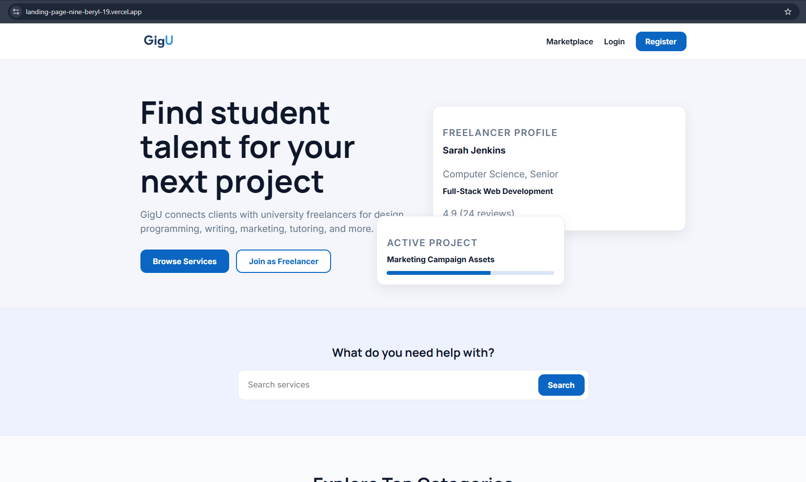

**Aplicación frontend en producción — registro de cuenta** (`https://gigu-ivory.vercel.app/`):

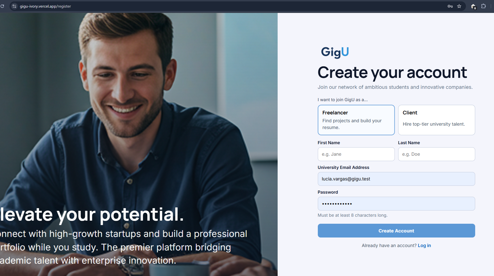

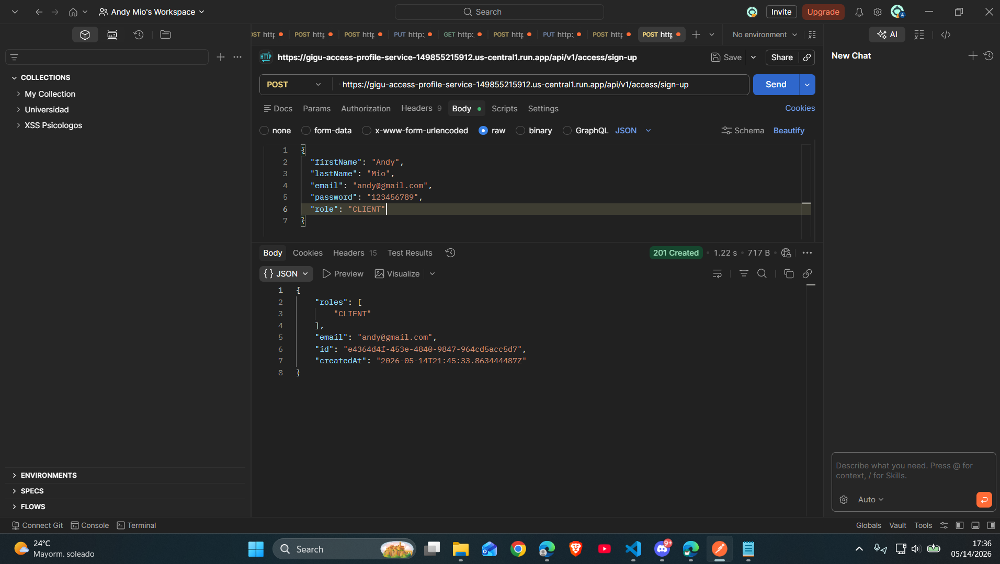
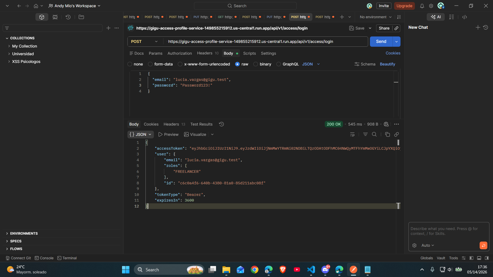


#### 5.3.1.5. Microservices Documentation Evidence for Sprint Review

Durante el Sprint 1 se documentaron con OpenAPI 3.0 (springdoc) los endpoints de los cuatro microservicios. Cada microservicio expone su documentación interactiva mediante Swagger UI en la ruta `/swagger-ui/index.html` de su despliegue en Google Cloud Run.

**AccessProfileService** — `https://gigu-access-profile-service-149855215912.us-central1.run.app/swagger-ui/index.html`

| Endpoint | Verbo HTTP | Acción |
| --- | --- | --- |
| `/api/v1/access/sign-up` | POST | Registrar un nuevo usuario (correo y contraseña) y emitir JWT. |
| `/api/v1/access/login` | POST | Autenticar credenciales y devolver el token de acceso. |
| `/api/v1/access/me` | GET | Obtener el perfil del usuario autenticado. |
| `/api/v1/access/freelancer-profiles/me` | PATCH | Actualizar habilidades, descripción y datos del perfil freelance propio. |
| `/api/v1/access/freelancer-profiles/{userId}` | GET | Consultar el perfil freelance público de un usuario. |
| `/api/v1/access/freelancer-profiles/me/portfolio-items` | POST | Añadir un ítem al portafolio del freelancer. |
| `/api/v1/access/freelancer-profiles/me/portfolio-items/{itemId}` | DELETE | Eliminar un ítem del portafolio del freelancer. |

Ejemplo de uso — `POST /api/v1/access/login`:
```json
// Request body
{ "email": "lucia.vargas@gigu.test", "password": "Passw0rd!" }
// Response 200 OK
{ "token": "eyJhbGciOiJIUzI1NiJ9...", "userId": "a1b2c3", "role": "FREELANCER" }
```
El response devuelve el JWT que debe enviarse en la cabecera `Authorization: Bearer <token>` para los endpoints protegidos.

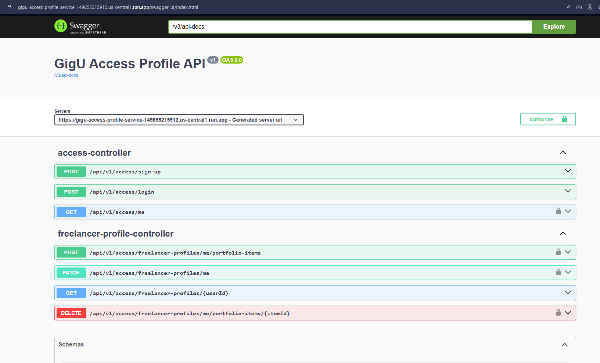

**GigMarketplaceService** — `https://gigu-gig-marketplace-service-149855215912.us-central1.run.app/swagger-ui/index.html`

| Endpoint | Verbo HTTP | Acción |
| --- | --- | --- |
| `/api/v1/marketplace/services` | GET | Listar/buscar servicios publicados (búsqueda paginada con filtros). |
| `/api/v1/marketplace/services` | POST | Publicar un nuevo servicio. |
| `/api/v1/marketplace/services/{id}` | GET | Obtener el detalle de un servicio. |
| `/api/v1/marketplace/services/{id}` | PATCH | Editar un servicio propio. |
| `/api/v1/marketplace/services/{id}` | DELETE | Eliminar o pausar un servicio propio. |
| `/api/v1/marketplace/services/mine` | GET | Listar los servicios del usuario autenticado. |
| `/api/v1/marketplace/services/{id}/media` | POST | Adjuntar imágenes o archivos a un servicio. |
| `/api/v1/marketplace/services/{id}/media/{mediaId}` | DELETE | Eliminar un archivo multimedia de un servicio. |
| `/api/v1/marketplace/categories` | GET | Listar las categorías de servicios disponibles. |

Ejemplo de uso — `GET /api/v1/marketplace/services?keyword=figma&page=0&size=10`: devuelve una página de servicios cuyo título o descripción coincide con la palabra clave, con metadatos de paginación (`totalElements`, `totalPages`).

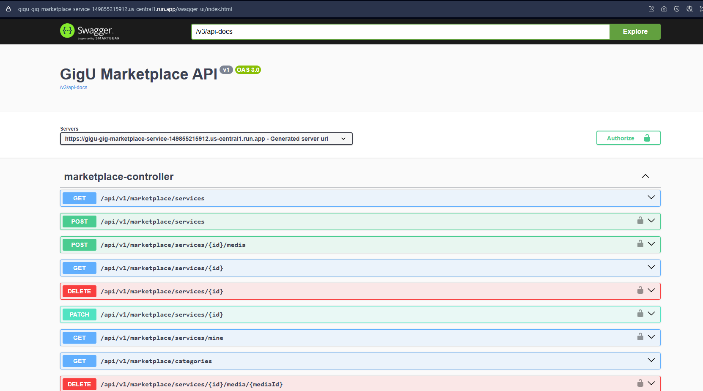

**PullEngagementService** — `https://gigu-pulls-service-149855215912.us-central1.run.app/swagger-ui/index.html`

| Endpoint | Verbo HTTP | Acción |
| --- | --- | --- |
| `/api/v1/engagement/requests` | POST | Crear una solicitud de contratación desde el perfil de un freelancer. |
| `/api/v1/engagement/requests/incoming` | GET | Listar las solicitudes de contratación recibidas. |
| `/api/v1/engagement/requests/outgoing` | GET | Listar las solicitudes de contratación enviadas. |
| `/api/v1/engagement/requests/{id}/decision` | PATCH | Aceptar o rechazar una solicitud de contratación. |
| `/api/v1/engagement/projects` | GET | Listar los proyectos activos del usuario. |
| `/api/v1/engagement/projects/{id}/status` | PATCH | Actualizar el estado del proyecto (seguimiento / finalización). |
| `/api/v1/engagement/projects/{id}/reviews` | GET | Consultar las reseñas de un proyecto. |
| `/api/v1/engagement/projects/{id}/reviews` | POST | Calificar al freelancer o al cliente al finalizar el proyecto. |
| `/api/v1/engagement/price-suggestions` | POST | Obtener una sugerencia de precio inteligente para un servicio. |

Ejemplo de uso — `PATCH /api/v1/engagement/requests/{id}/decision` con body `{ "decision": "ACCEPTED" }`: al aceptar una solicitud se crea el proyecto asociado y se devuelve su identificador y estado inicial.

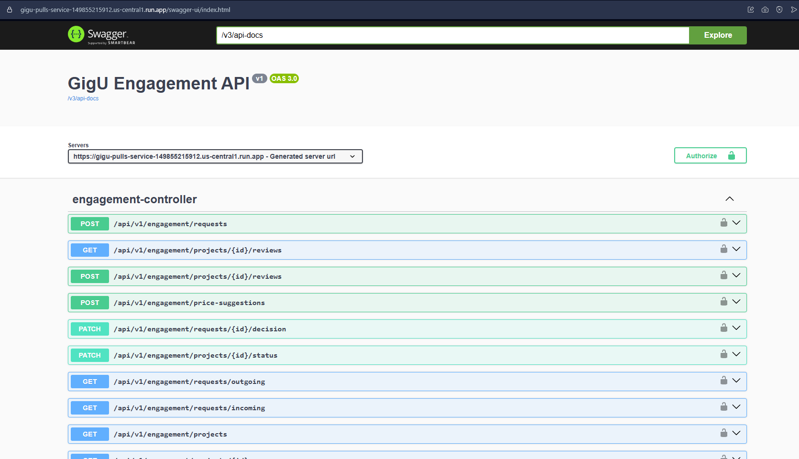

**ChatNotificationService** — `https://gigu-chat-notification-service-149855215912.us-central1.run.app/swagger-ui/index.html`

| Endpoint | Verbo HTTP | Acción |
| --- | --- | --- |
| `/api/v1/chat/conversations` | GET | Listar las conversaciones del usuario autenticado. |
| `/api/v1/chat/conversations` | POST | Crear una nueva conversación con otro usuario. |
| `/api/v1/chat/conversations/{id}/messages` | GET | Obtener los mensajes de una conversación. |
| `/api/v1/chat/conversations/{id}/messages` | POST | Enviar un mensaje dentro de una conversación. |
| `/api/v1/chat/notifications/{id}/read` | PATCH | Marcar una notificación como leída. |
| `/api/v1/chat/notifications/read-all` | PATCH | Marcar todas las notificaciones como leídas. |
| `/api/v1/chat/support-tickets` | POST | Crear un ticket de soporte. |
| `/api/v1/chat/reports` | POST | Reportar a un usuario desde el chat. |
| `/api/v1/chat/internal/notifications` | POST | Endpoint interno para que otros microservicios generen notificaciones. |

Ejemplo de uso — `POST /api/v1/chat/conversations/{id}/messages` con body `{ "content": "Hola, ¿sigues disponible?" }`: registra el mensaje y genera una notificación para el destinatario.

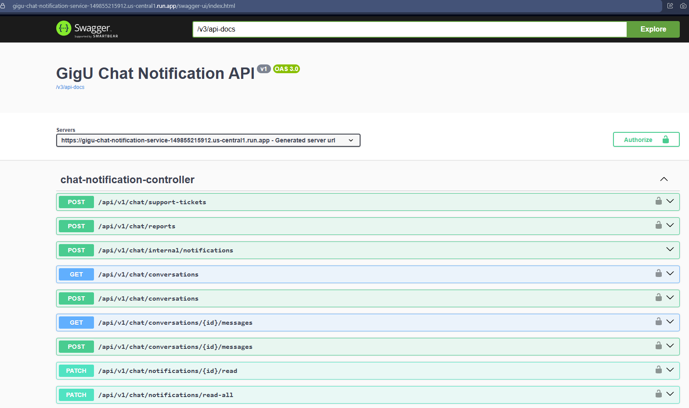

Repositorio de Web Services: `https://github.com/1ASI0657-2610-7940-Final-Project/backend-microservices`. Commits relacionados con documentación: `8e60ed4` (chore(platform): standardize errors swagger and ci) y `c6ba4eb` (fix(cloud): honor forwarded https scheme in swagger).

#### 5.3.1.6. Software Deployment Evidence for Sprint Review

Durante el Sprint 1 el equipo configuró y ejecutó el despliegue completo de la solución. Para el backend se creó el proyecto en Google Cloud, se configuró la cuenta de servicio y los secrets, se crearon los workflows de GitHub Actions de despliegue manual por microservicio y los scripts `gcloud` de soporte local, y se desplegaron los cuatro microservicios en Cloud Run (región `us-central1`). Para el frontend y la landing page se configuraron dos proyectos en Vercel con Vercel Rewrites apuntando a los microservicios de Cloud Run.

**Microservicios desplegados en Google Cloud Run:**

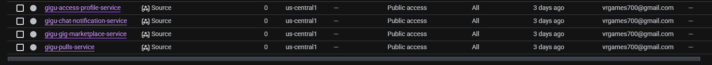

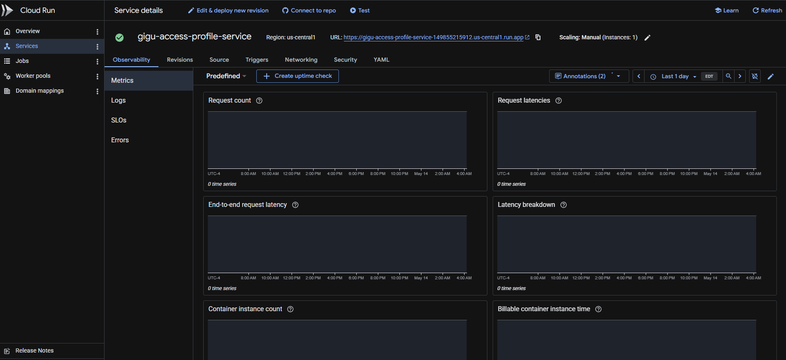

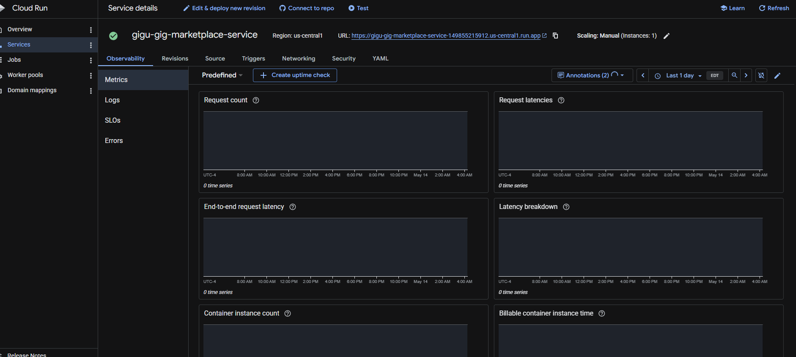

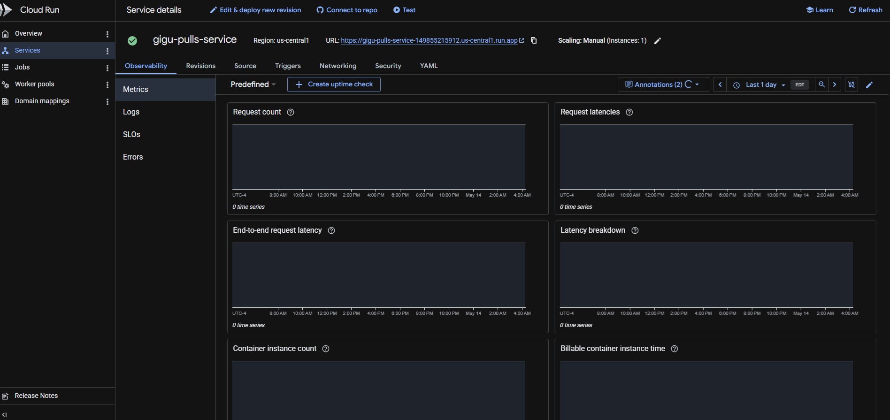

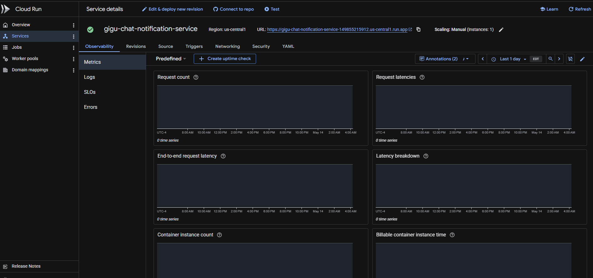

**Frontend y landing page desplegados en Vercel:**

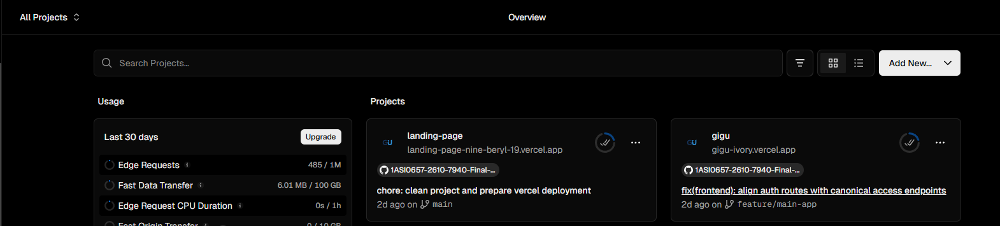

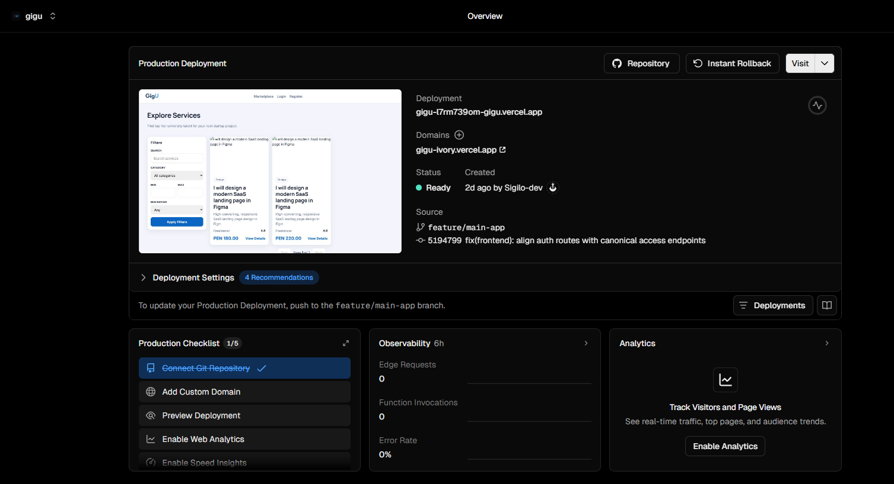

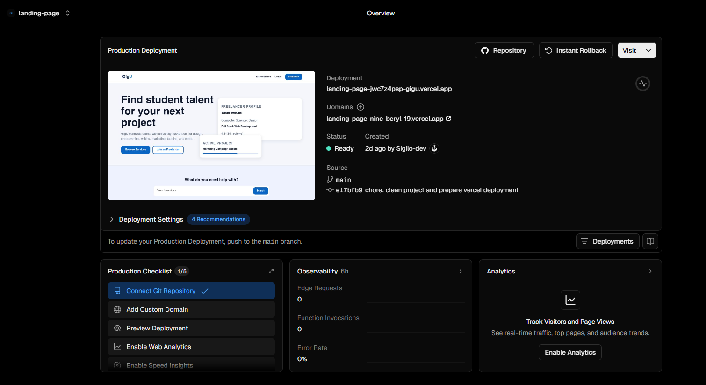

Commits relacionados con despliegue: `d92410c` (migración a Cloud Run), `1467a77` (workflows de despliegue manual), `ffbae30` (scripts `gcloud`), `b394402` (documentación del despliegue manual), `ce24716` y `aae960d` (configuración de routing de Vercel hacia Cloud Run).

#### 5.3.1.7. Team Collaboration Insights during Sprint

El trabajo del Sprint 1 se distribuyó entre los tres integrantes del equipo, con participación de todos en la implementación de los productos. La implementación del backend de microservicios y la lógica de contratación, chat y perfiles se concentró en los repositorios `backend-microservices`; el frontend y la integración con los servicios cloud, junto con la configuración de despliegue; y la landing page del producto.

| Integrante | Usuario GitHub | Principales aportes en el Sprint 1 |
| --- | --- | --- |
| Oblitas Davila, Mariano Moises | `Sigilo-dev` / `vr700` | Implementación de los cuatro microservicios backend, estandarización de errores/Swagger/CI, migración a Cloud Run y workflows de despliegue. |
| Ybañez Esquerre, Miguel Angel | `Miguel080902` | Integración del frontend con los microservicios, configuración de routing de Vercel hacia Cloud Run y configuración de despliegue. |
| Mio Mejia, Andy Alejandro | `AndyMio17` | Implementación del shell de la aplicación frontend, vistas de dashboard y flujo de marketplace. |


**Pendiente:** Incluir los screenshots de los analíticos de colaboración y commits de GitHub (pestaña *Insights → Contributors*) de cada repositorio del Sprint 1.

**Analisis de colaboracion y commits de GitHub del Reporte**

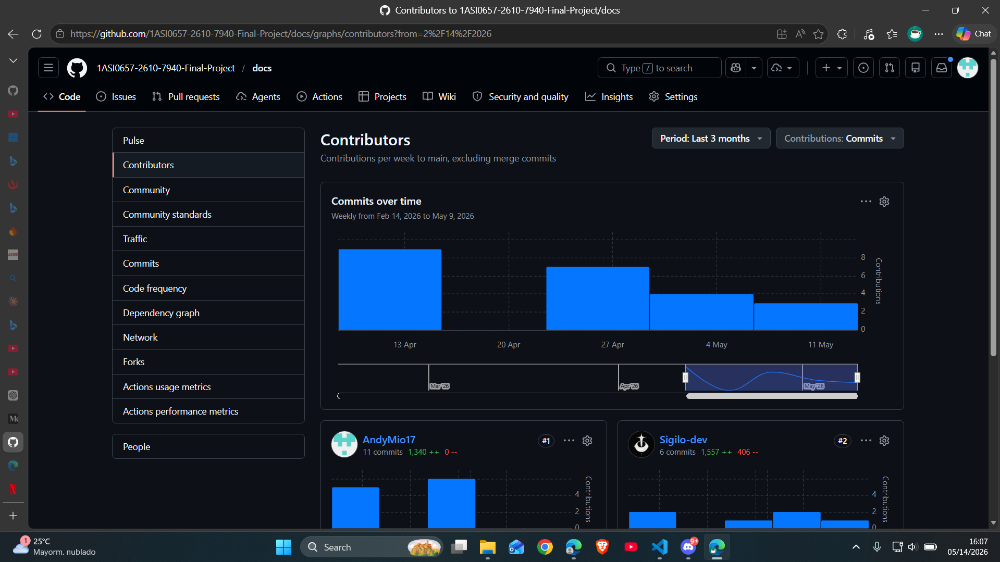

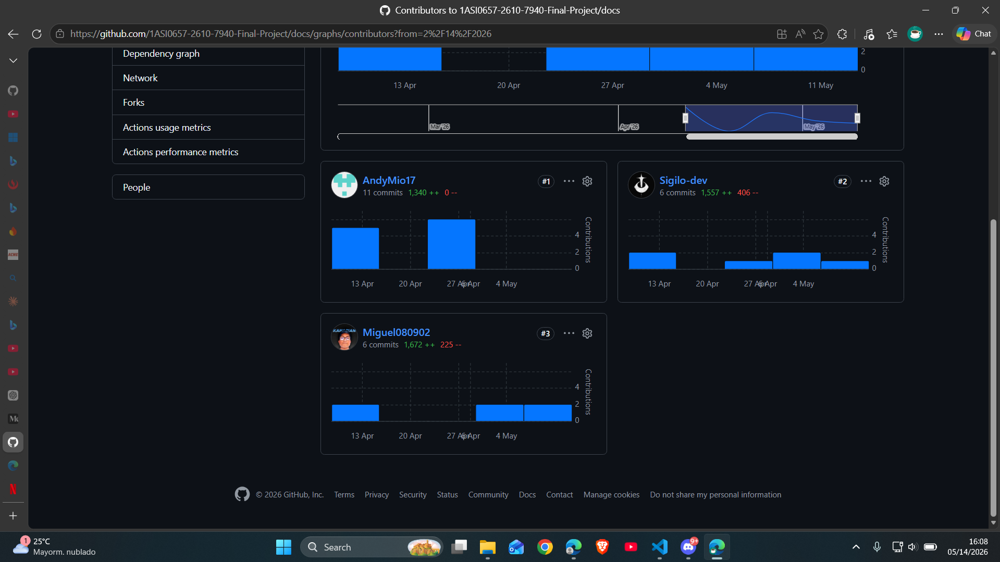

**Analisis de colaboracion y commits de GitHub del BackendMicroservicios**

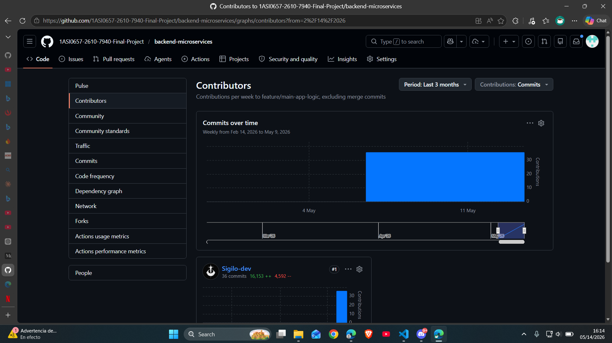

**Analisis de colaboracion y commits de GitHub del Lading Page**

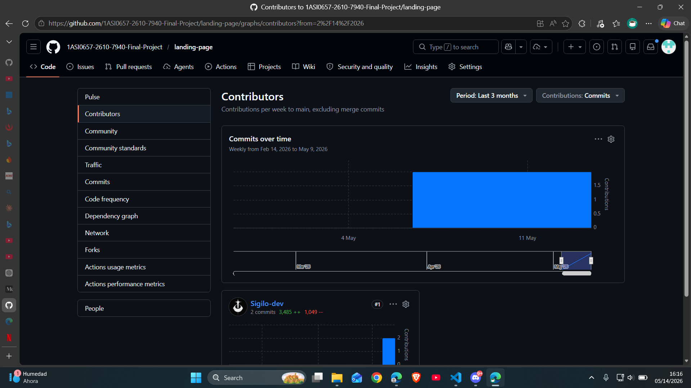

**Analisis de colaboracion y commits de GitHub del Frontend**

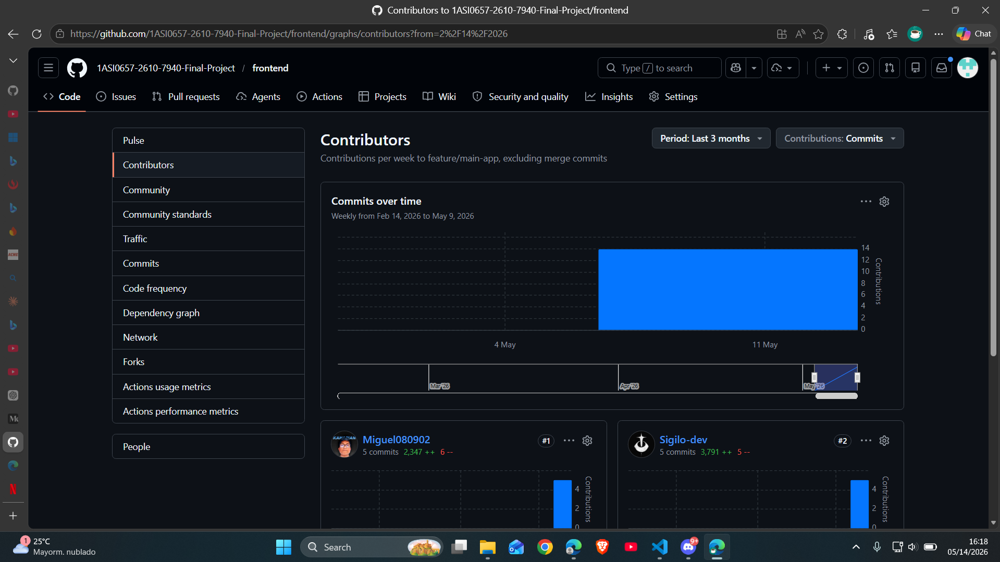
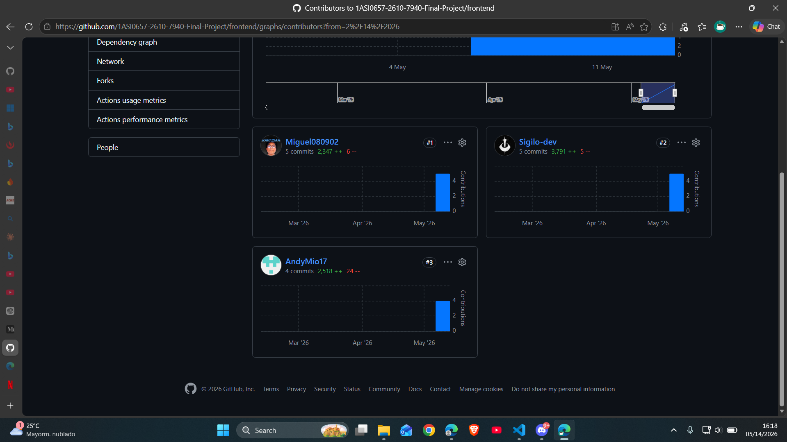

#### 5.3.1.8. Kanban Board

El tablero Kanban del Sprint 1 se gestiona en Notion (base de datos `sprint-1-backlog`), en una vista *Board* agrupada por estado, con las columnas **Por Hacer**, **En Curso** y **Hecho**. Al cierre del Sprint, el avance de las 54 tarjetas (GIGU-8 a GIGU-61) es el siguiente:

| Estado | Cantidad | Tarjetas |
| --- | --- | --- |
| Hecho (Done) | 45 | GIGU-8 a GIGU-21, GIGU-27 a GIGU-54, GIGU-58, GIGU-60, GIGU-61 |
| En Curso (In-Process) | 5 | GIGU-22, GIGU-23, GIGU-25, GIGU-55, GIGU-56 |
| Por Hacer (To-do) | 4 | GIGU-24, GIGU-26, GIGU-57, GIGU-59 |

Las tarjetas en **En Curso** corresponden a testabilidad parcial (solo `access-profile-service` tiene pruebas implementadas) y a métricas de performance aún no medidas. Las tarjetas en **Por Hacer** corresponden a la mensajería asíncrona de eventos de dominio y a las proyecciones de reputación que dependen de ella; su implementación queda planificada para el Sprint 2.

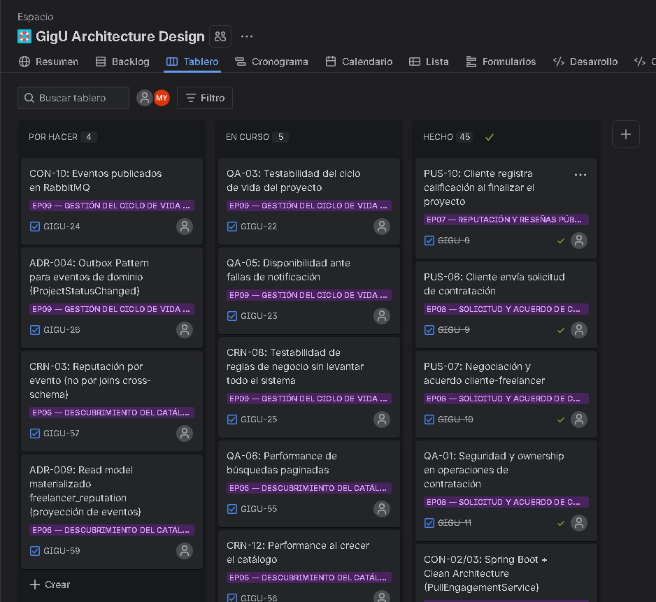

URL del tablero (Notion): https://www.notion.so/38aff0862f2c80a19670ecc018555760?v=38aff0862f2c8176bd1d000cba93e333

### 5.3.2. Sprint 2

#### 5.3.2.1. Sprint Backlog 2

El objetivo principal del Sprint 2 fue **cerrar la mensajería asíncrona y la comunicación en tiempo real de la solución GigU**, completando los work-items que habían quedado en estado *En Curso* y *Por Hacer* al cierre del Sprint 1 (mensajería de eventos de dominio y proyecciones que dependían de ella). En concreto, se implementó y desplegó el flujo de **notificaciones en tiempo real** y la base del **chat por eventos** entre los microservicios desplegados en Google Cloud Run, usando **Google Cloud Pub/Sub** (entrega push mediante webhook), **WebSocket + STOMP** (Spring Boot) y un **webhook interno** entre `PullEngagementService` y `ChatNotificationService`. Adicionalmente, se corrigió un defecto en el botón de envío de solicitudes (*Send Request*) del portal del cliente.

El flujo de notificación en tiempo real implementado en este Sprint es el siguiente:

```text
1. El cliente abre un servicio en el frontend.
2. Hace click en "Send Request".
3. El frontend envía la solicitud al microservicio de Pulls (PullEngagementService).
4. Pulls crea la request en base de datos (Supabase PostgreSQL).
5. Pulls llama internamente a Chat/Notifications mediante un webhook interno.
6. Chat/Notifications guarda la notificación.
7. Chat/Notifications emite la notificación en tiempo real usando WebSocket (STOMP).
8. El frontend, suscrito al WebSocket, actualiza las notificaciones del usuario.
```

**Board del Sprint 2 (Notion):** https://www.notion.so/38aff0862f2c8003a48fe4e04ad6e4e0?v=38aff0862f2c814091b6000c19f27ab5

El Sprint Backlog 2 está compuesto por (a) los work-items arrastrados del Sprint 1 que dependían de la mensajería asíncrona, ahora resueltos, y (b) las 10 nuevas tarjetas de tiempo real y corrección de defectos (GIGU-63 a GIGU-65 y GIGU-67 a GIGU-73).

**Work-items arrastrados del Sprint 1 (resueltos en el Sprint 2):**

| Sprint # | Sprint 2 | | | | | | |
| --- | --- | --- | --- | --- | --- | --- | --- |
| **User Story / Epic** | | **Work-Item / Task** | | | | | |
| **Id** | **Title** | **Id** | **Title** | **Description** | **Estimation (h)** | **Assigned To** | **Status** |
| EP09 | Gestión del Ciclo de Vida del Proyecto | GIGU-22 | QA-03: Testabilidad del ciclo de vida del proyecto | Pruebas unitarias del ciclo de vida en `pulls-service`. | 3 | Ybañez Esquerre, Miguel | Done |
| EP09 | Gestión del Ciclo de Vida del Proyecto | GIGU-23 | QA-05: Disponibilidad ante fallas de notificación | El fallo de notificación ya no bloquea la operación principal; el webhook a Chat se ejecuta de forma desacoplada. | 3 | Mio Mejia, Andy | Done |
| EP09 | Gestión del Ciclo de Vida del Proyecto | GIGU-24 | CON-10: Eventos publicados en mensajería asíncrona | Publicación de eventos de dominio mediante Google Cloud Pub/Sub (reemplaza a RabbitMQ). | 5 | Oblitas Davila, Mariano | Done |
| EP09 | Gestión del Ciclo de Vida del Proyecto | GIGU-25 | CRN-08: Testabilidad de reglas de negocio sin levantar todo el sistema | Tests aislados de reglas de negocio en los servicios de aplicación. | 3 | Ybañez Esquerre, Miguel | Done |
| EP09 | Gestión del Ciclo de Vida del Proyecto | GIGU-26 | ADR-004: Publicación de eventos de dominio (`ProjectStatusChanged`) | Publicación de eventos vía Pub/Sub al cambiar el estado del proyecto. | 4 | Oblitas Davila, Mariano | Done |
| EP06 | Descubrimiento del Catálogo | GIGU-55 | QA-06: Performance de búsquedas paginadas | Paginación validada con índices del catálogo. | 3 | Mio Mejia, Andy | Done |
| EP06 | Descubrimiento del Catálogo | GIGU-56 | CRN-12: Performance al crecer el catálogo | Validación de performance de búsquedas con índices. | 3 | Ybañez Esquerre, Miguel | Done |
| EP06 | Descubrimiento del Catálogo | GIGU-57 | CRN-03: Reputación/notificación por evento (no por joins cross-schema) | Eventos de chat/notificación entregados por Pub/Sub push, sin joins cross-schema. | 4 | Oblitas Davila, Mariano | Done |
| EP06 | Descubrimiento del Catálogo | GIGU-59 | ADR-009: Consumo de eventos de dominio vía suscripción push | Suscripción push `gigu-chat-events-push-chat` consumida por el endpoint de eventos de chat. | 4 | Oblitas Davila, Mariano | Done |

**Nuevas tarjetas del Sprint 2 (tiempo real y corrección de defectos):**

| Sprint # | Sprint 2 | | | | | | |
| --- | --- | --- | --- | --- | --- | --- | --- |
| **User Story / Epic** | | **Work-Item / Task** | | | | | |
| **Id** | **Title** | **Id** | **Title** | **Description** | **Estimation (h)** | **Assigned To** | **Status** |
| EP08 | Solicitud y Acuerdo de Contratación | GIGU-63 | PUS-06: Notificación al freelancer al recibir una solicitud | Al crear la request, Pulls notifica al freelancer en tiempo real. | 5 | Oblitas Davila, Mariano | Done |
| EP08 | Solicitud y Acuerdo de Contratación | GIGU-64 | Webhook interno Pulls → Chat (`POST /api/v1/chat/internal/notifications`) | Llamada interna desde Pulls a Chat para crear la notificación. | 4 | Oblitas Davila, Mariano | Done |
| EP11 | Mensajería Coordinada Cliente-Freelancer | GIGU-65 | CON-10: Topic Pub/Sub `gigu-chat-events` + suscripción push | Configuración del topic y la suscripción push en Google Cloud Pub/Sub. | 4 | Oblitas Davila, Mariano | Done |
| EP11 | Mensajería Coordinada Cliente-Freelancer | GIGU-67 | Endpoint Pub/Sub push `POST /internal/pubsub/chat-events` | Recepción de eventos de chat por push, validados con token. | 3 | Oblitas Davila, Mariano | Done |
| EP11 | Mensajería Coordinada Cliente-Freelancer | GIGU-68 | WebSocket + STOMP en ChatNotificationService (`/ws`) | Endpoint WebSocket y topics STOMP de conversaciones y notificaciones. | 5 | Oblitas Davila, Mariano | Done |
| EP11 | Mensajería Coordinada Cliente-Freelancer | GIGU-69 | Suscripción del frontend al WebSocket de notificaciones | El frontend escucha `/topic/notifications/{userId}` y actualiza en tiempo real. | 4 | Ybañez Esquerre, Miguel | Done |
| EP11 | Mensajería Coordinada Cliente-Freelancer | GIGU-70 | Chat en tiempo real (`/topic/conversations/{conversationId}`) | Mensajes de una conversación entregados en tiempo real por STOMP. | 4 | Ybañez Esquerre, Miguel | Done |
| EP08 | Solicitud y Acuerdo de Contratación | GIGU-71 | Fix botón *Send Request* del cliente (ruta API y envío) | Corrección del envío de solicitudes del portal del cliente y de la ruta API. | 3 | Ybañez Esquerre, Miguel | Done |
| EP11 | Mensajería Coordinada Cliente-Freelancer | GIGU-72 | Configuración de rewrites y variables de entorno en Vercel | Rewrites `/api/*` por microservicio y `VITE_CHAT_WS_URL` para el WebSocket. | 3 | Ybañez Esquerre, Miguel | Done |
| EP11 | Mensajería Coordinada Cliente-Freelancer | GIGU-73 | Despliegue de ChatNotificationService con trigger Pub/Sub | Redepliegue en Cloud Run con la suscripción push apuntando a `/internal/pubsub/chat-events`. | 3 | Mio Mejia, Andy | Done |

El backlog del Sprint 2 en Notion, al cierre del Sprint (todas las tarjetas en estado *Hecho*):

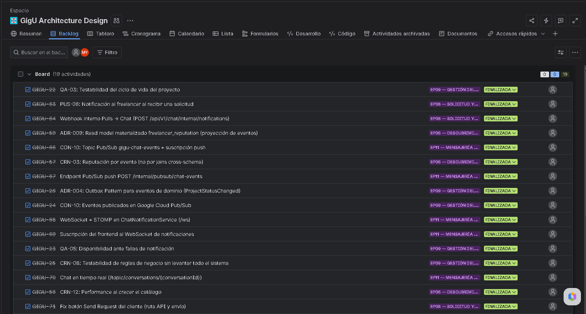

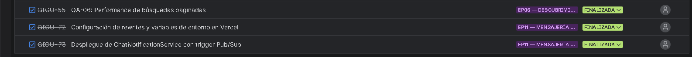

#### 5.3.2.2. Development Evidence for Sprint Review

Durante el Sprint 2 el trabajo se concentró en `ChatNotificationService` (WebSocket + STOMP, endpoint Pub/Sub push y webhook interno de notificaciones), en `PullEngagementService` (publicación de la notificación vía webhook al crear una solicitud) y en el `frontend` (suscripción al WebSocket, actualización en tiempo real de las notificaciones y corrección del botón *Send Request* del cliente, junto con la corrección de las rutas de API).

| Repository | Branch | Commit Id | Commit Message | Commit Message Body | Committed on |
| --- | --- | --- | --- | --- | --- |
| 1ASI0657-2610-7940-Final-Project/backend-microservices | feature/chat-notification-service | 40c9d57 | feat(chat): add Pub/Sub events and websocket broadcasting | Eventos de chat por Google Cloud Pub/Sub y difusión por WebSocket. | 06/06/2026 |
| 1ASI0657-2610-7940-Final-Project/backend-microservices | feature/chat-notification-service | 58b347e | chore(gcloud): add chat Pub/Sub setup scripts | Scripts de configuración del topic y la suscripción push de Pub/Sub. | 06/06/2026 |
| 1ASI0657-2610-7940-Final-Project/backend-microservices | feature/chat-notification-service | 246a7ba | feat(chat): harden pubsub webhook handling | Robustez del manejo del webhook Pub/Sub push (`/internal/pubsub/chat-events`). | 06/06/2026 |
| 1ASI0657-2610-7940-Final-Project/backend-microservices | feature/chat-notification-service | fa7d3e3 | feat(chat): broadcast notifications over websocket | Difusión de notificaciones a los clientes por WebSocket/STOMP. | 06/06/2026 |
| 1ASI0657-2610-7940-Final-Project/backend-microservices | feature/chat-notification-service | 38e7dab | fix(pulls): enrich notification webhook payload | Enriquecimiento del payload del webhook de notificación enviado desde Pulls. | 06/06/2026 |
| 1ASI0657-2610-7940-Final-Project/backend-microservices | feature/chat-notification-service | c5078fe | fix(chat): make conversation responses null-safe | Respuestas de conversación null-safe. | 06/06/2026 |
| 1ASI0657-2610-7940-Final-Project/backend-microservices | feature/main-app-logic | e3b32fe | Merge branch 'feature/chat-notification-service' into feature/main-app-logic | Integración del Sprint 2 (chat/notificaciones en tiempo real) a la rama de despliegue. | 06/06/2026 |
| 1ASI0657-2610-7940-Final-Project/frontend | feature/main-app | 39282ef | feat(chat): connect chat screen to websocket events | Conexión de la pantalla de chat a los eventos WebSocket. | 06/06/2026 |
| 1ASI0657-2610-7940-Final-Project/frontend | feature/main-app | e607b9c | feat(chat): align chat APIs with direct service URLs | Alineación de las APIs de chat con las URLs directas del servicio (WebSocket sin rewrite). | 06/06/2026 |
| 1ASI0657-2610-7940-Final-Project/frontend | feature/main-app | a34a13f | fix(pulls): route engagement requests through vercel rewrites | Enrutamiento de las solicitudes de contratación mediante Vercel Rewrites. | 06/06/2026 |
| 1ASI0657-2610-7940-Final-Project/frontend | feature/main-app | 064c401 | fix(pulls): make request submission reliable | Corrección del envío de solicitudes (botón *Send Request* del cliente). | 06/06/2026 |
| 1ASI0657-2610-7940-Final-Project/frontend | feature/main-app | 732b5af | fix(pulls): show request form validation errors | Muestra de los errores de validación del formulario de solicitud. | 06/06/2026 |
| 1ASI0657-2610-7940-Final-Project/frontend | feature/main-app | 96aa11d | fix(notifications): add websocket updates and correct api routes | Actualizaciones por WebSocket de notificaciones y corrección de las rutas de API. | 06/06/2026 |

#### 5.3.2.3. Testing Suite Evidence for Sprint Review

Durante el Sprint 2 se ampliaron las pruebas hacia el flujo de contratación y notificación, cubriendo los work-items de testabilidad (`QA-03`, `CRN-08`) que habían quedado *En Curso* en el Sprint 1. Se incorporaron pruebas del flujo de creación de solicitudes y del webhook interno de notificaciones, así como del consumo de eventos de chat por Pub/Sub push.

| Archivo de prueba | Tipo | Descripción | User Stories relacionados |
| --- | --- | --- | --- |
| `EngagementApplicationServiceTest` | Unit Test (JUnit 5 + Mockito) | Verifica la creación de solicitudes y la decisión (aceptar/rechazar), incluyendo la invocación del webhook de notificación hacia Chat. | US06, US07, US08 |
| `ChatNotificationApplicationServiceTest` | Unit Test (JUnit 5 + Mockito) | Verifica las reglas de negocio de conversaciones, mensajes y notificaciones. | US06, US20 |
| `ChatNotificationControllerTest` | Integration Test (MockMvc) | Valida los endpoints REST de chat, incluyendo `POST /api/v1/chat/internal/notifications` y `POST /internal/pubsub/chat-events` (rechazo de peticiones sin token válido). | US20 |
| `ChatNotificationIntegrationTest` | Integration Test (Testcontainers + PostgreSQL) | Levanta PostgreSQL en contenedor y valida la persistencia de notificaciones y el flujo de chat de extremo a extremo. | US06, US20 |

| Repository | Branch | Commit Id | Commit Message | Commit Message Body | Committed on |
| --- | --- | --- | --- | --- | --- |
| 1ASI0657-2610-7940-Final-Project/backend-microservices | feature/chat-notification-service | 246a7ba | feat(chat): harden pubsub webhook handling | Incluye las pruebas del manejo del webhook Pub/Sub push del servicio de chat. | 06/06/2026 |
| 1ASI0657-2610-7940-Final-Project/backend-microservices | feature/chat-notification-service | a1b75fa | chore(gcloud): make chat pubsub test deterministic | Hace determinista la prueba del flujo de eventos Pub/Sub de chat. | 06/06/2026 |

#### 5.3.2.4. Execution Evidence for Sprint Review

En el Sprint 2 se puso en funcionamiento el flujo de notificaciones en tiempo real de extremo a extremo: el cliente envía una solicitud desde el frontend, el freelancer recibe la notificación en tiempo real y el chat entrega los mensajes de cada conversación mediante WebSocket. A continuación se muestra evidencia de la solución en ejecución.

**Envío de solicitud de contratación desde el portal del cliente** (modal *Send Request* con sugerencia de precio; corrección del botón aplicada — estado *Sending...*):

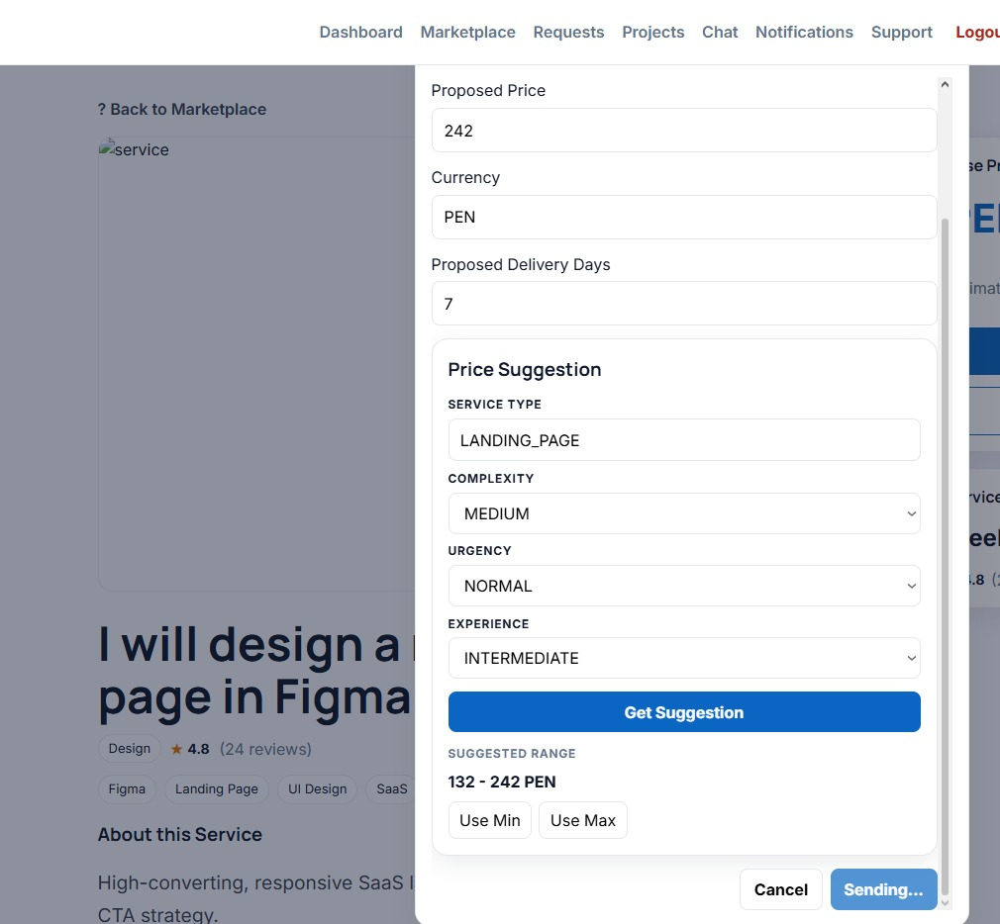

**Seguimiento de solicitudes del cliente** (*My Requests*, con estados `ACCEPTED`, `REJECTED` y `PENDING`):

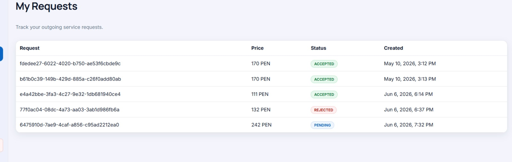

**Chat en tiempo real** (vista *Messaging*; los mensajes y notificaciones se entregan por WebSocket sin recargar la página):

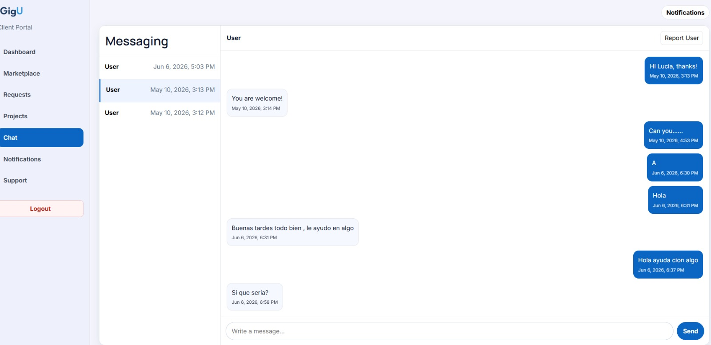

La conexión WebSocket del frontend se establece directamente contra el backend de chat (`wss://gigu-chat-notification-service-149855215912.us-central1.run.app/ws`) y se suscribe a los topics `/topic/notifications/{userId}` (notificaciones del usuario) y `/topic/conversations/{conversationId}` (mensajes de la conversación). Esto puede verificarse en el navegador desde *DevTools → Network → WS*.

#### 5.3.2.5. Microservices Documentation Evidence for Sprint Review

Durante el Sprint 2 se documentaron en `ChatNotificationService` los nuevos endpoints de integración asíncrona y en tiempo real: el endpoint de recepción de eventos Pub/Sub push, el webhook interno de notificaciones y el canal WebSocket. La documentación interactiva se mantiene en Swagger UI (`/swagger-ui/index.html`) del despliegue en Google Cloud Run.

**ChatNotificationService** — `https://gigu-chat-notification-service-149855215912.us-central1.run.app/swagger-ui/index.html`

| Endpoint | Verbo HTTP | Acción |
| --- | --- | --- |
| `/internal/pubsub/chat-events` | POST | Recibir eventos de chat entregados por Google Cloud Pub/Sub (push), validados con `token`. |
| `/api/v1/chat/internal/notifications` | POST | Endpoint interno usado por `PullEngagementService` para crear notificaciones. |
| `/api/v1/chat/conversations/{id}/messages` | POST | Enviar un mensaje; se propaga en tiempo real por `/topic/conversations/{id}`. |
| `/api/v1/chat/notifications` | GET | Listar las notificaciones del usuario autenticado. |
| `/ws` | WS (STOMP) | Canal WebSocket; topics `/topic/notifications/{userId}` y `/topic/conversations/{conversationId}`. |

Ejemplo de uso — `POST /api/engagement/requests` (reescrito por Vercel hacia `https://gigu-pulls-service-149855215912.us-central1.run.app/api/v1/engagement/requests`):
```json
// Request body
{
  "serviceId": "id-del-servicio",
  "freelancerId": "id-del-freelancer",
  "message": "mensaje del cliente",
  "proposedPrice": 111.00,
  "currency": "PEN",
  "proposedDeliveryDays": 1
}
```
Al crear la solicitud, `PullEngagementService` invoca internamente el webhook `POST /api/v1/chat/internal/notifications`, que persiste la notificación y la emite por WebSocket al destinatario.

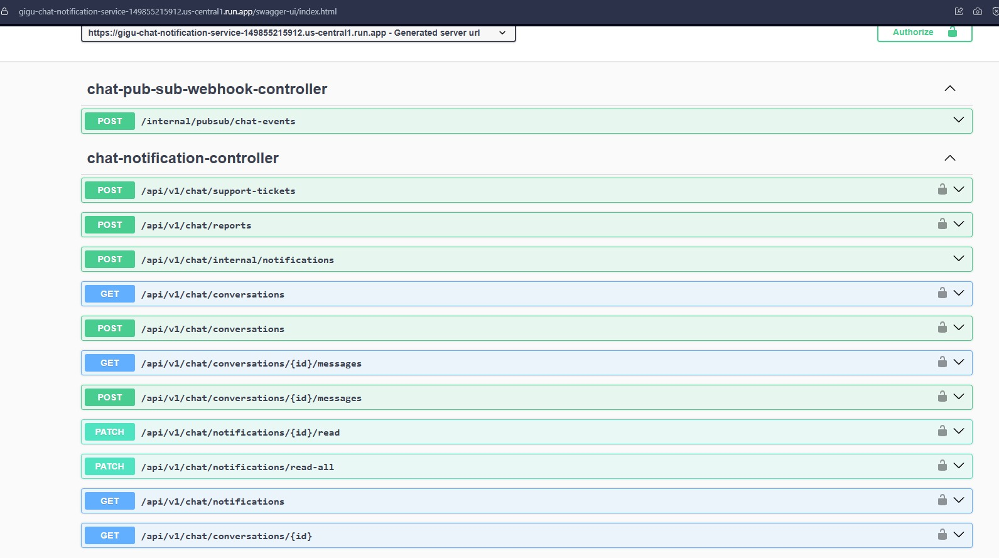

#### 5.3.2.6. Software Deployment Evidence for Sprint Review

Durante el Sprint 2 se redesplegaron los microservicios afectados en Google Cloud Run, se configuró el topic y la suscripción push de Google Cloud Pub/Sub para los eventos de chat, y se actualizó el frontend en Vercel (rewrites por microservicio y variable `VITE_CHAT_WS_URL` para el WebSocket).

**Microservicios desplegados en Google Cloud Run** (redepliegue reciente de `gigu-chat-notification-service`, `gigu-pulls-service`, `gigu-access-profile-service` y `gigu-gig-marketplace-service`):

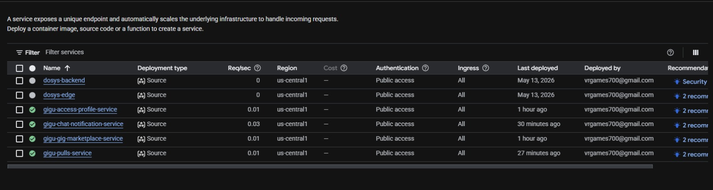

**Trigger de Google Cloud Pub/Sub (suscripción push hacia el servicio de chat):** topic `gigu-chat-events`, suscripción `gigu-chat-events-push-chat`, entrega *Push* hacia `/internal/pubsub/chat-events`:

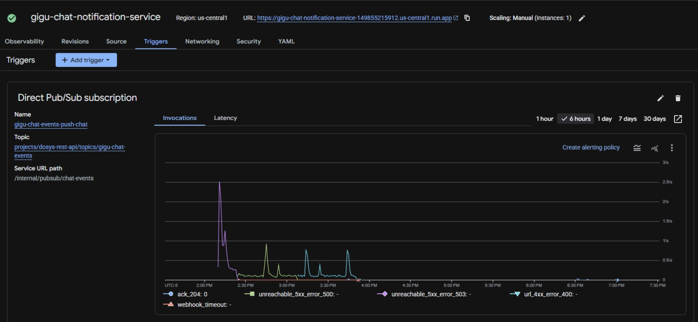

**Frontend desplegado en Vercel** (despliegue de producción con el commit `fix(notifications): add websocket updates and correct api routes`):

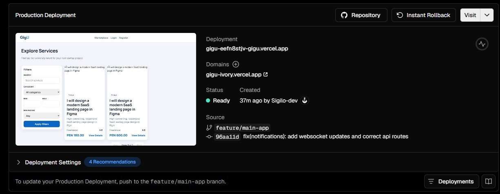

**Variables de entorno en Vercel** (URLs de los microservicios y `VITE_CHAT_WS_URL` para el WebSocket):

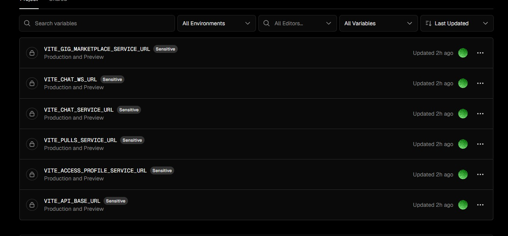

El frontend consume el backend mediante **Vercel Rewrites** para REST (rutas relativas `/api/access`, `/api/profile`, `/api/marketplace`, `/api/engagement`, `/api/chat`, `/api/notifications` reenviadas al microservicio correspondiente en Cloud Run) y se conecta **directamente** al WebSocket (`wss://gigu-chat-notification-service-149855215912.us-central1.run.app/ws`, sin rewrite) mediante la variable `VITE_CHAT_WS_URL`. La evidencia adicional puede revisarse en los logs de Cloud Run de `gigu-chat-notification-service` (peticiones a `/api/v1/chat/internal/notifications`, `/internal/pubsub/chat-events` y `/ws`) y en Google Cloud Pub/Sub (topic `gigu-chat-events`, suscripción push `gigu-chat-events-push-chat`).

Commits relacionados con el despliegue del Sprint 2: `58b347e` (scripts de configuración de Pub/Sub para chat) y `a1b75fa` (determinismo de la prueba de Pub/Sub) en `backend-microservices`; `a34a13f` (enrutamiento de solicitudes por Vercel Rewrites) y `96aa11d` (actualizaciones por WebSocket y corrección de rutas de API) en `frontend`.

#### 5.3.2.7. Team Collaboration Insights during Sprint

El trabajo del Sprint 2 se distribuyó entre los tres integrantes del equipo. La implementación de la mensajería asíncrona y el tiempo real (Pub/Sub, WebSocket + STOMP y webhook interno) se concentró en el backend; la integración del frontend con el WebSocket, los rewrites y la corrección del botón de solicitud del cliente; y la configuración del despliegue del trigger de Pub/Sub.

| Integrante | Usuario GitHub | Principales aportes en el Sprint 2 |
| --- | --- | --- |
| Oblitas Davila, Mariano Moises | `Sigilo-dev` / `vr700` | WebSocket + STOMP y endpoint Pub/Sub push en `ChatNotificationService`, webhook interno de notificaciones y publicación de la notificación desde `PullEngagementService`. |
| Ybañez Esquerre, Miguel Angel | `Miguel080902` | Suscripción del frontend al WebSocket, actualización en tiempo real de notificaciones y chat, corrección del botón *Send Request* del cliente y configuración de rewrites/variables en Vercel. |
| Mio Mejia, Andy Alejandro | `AndyMio17` | Configuración del topic y la suscripción push de Pub/Sub, redepliegue del servicio de chat en Cloud Run y verificación del flujo de extremo a extremo. |

**Análisis de colaboración y commits de GitHub (Sprint 2).** Las estadísticas de contribución de GitHub (*Insights → Contributors*, rama principal de cada repositorio, excluyendo merge commits) son las siguientes:

| Repositorio | Rama | Contribuidor (GitHub) | Commits |
| --- | --- | --- | --- |
| backend-microservices | `feature/main-app-logic` | `Sigilo-dev` (Oblitas Davila, Mariano) | 43 |
| frontend | `feature/main-app` | `Sigilo-dev` (Oblitas Davila, Mariano) | 13 |
| frontend | `feature/main-app` | `Miguel080902` (Ybañez Esquerre, Miguel) | 5 |
| frontend | `feature/main-app` | `AndyMio17` (Mio Mejia, Andy) | 4 |

Durante el Sprint 2, la implementación de la mensajería en tiempo real (Google Cloud Pub/Sub, WebSocket + STOMP y webhook interno) se integró principalmente a través de la cuenta `Sigilo-dev`, mientras que la verificación funcional de extremo a extremo, las pruebas y la documentación de la evidencia se realizaron de forma colaborativa por el equipo.

**Análisis de colaboración y commits de GitHub del Backend (`backend-microservices`):**

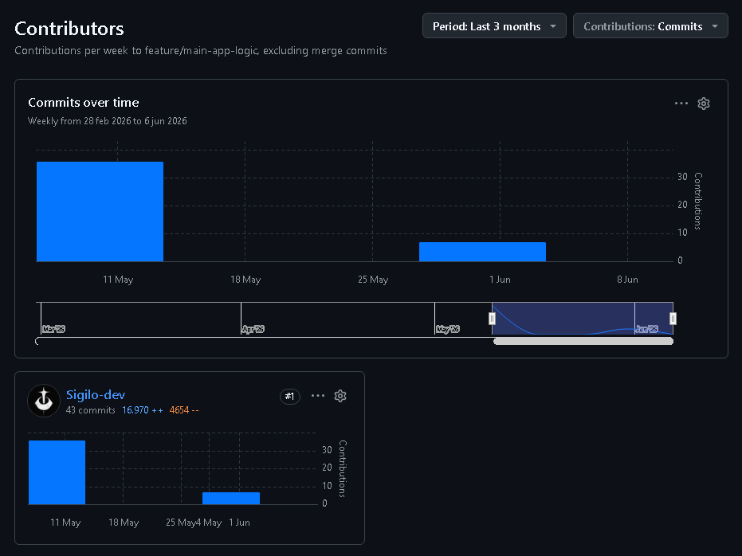

**Análisis de colaboración y commits de GitHub del Frontend (`frontend`):**

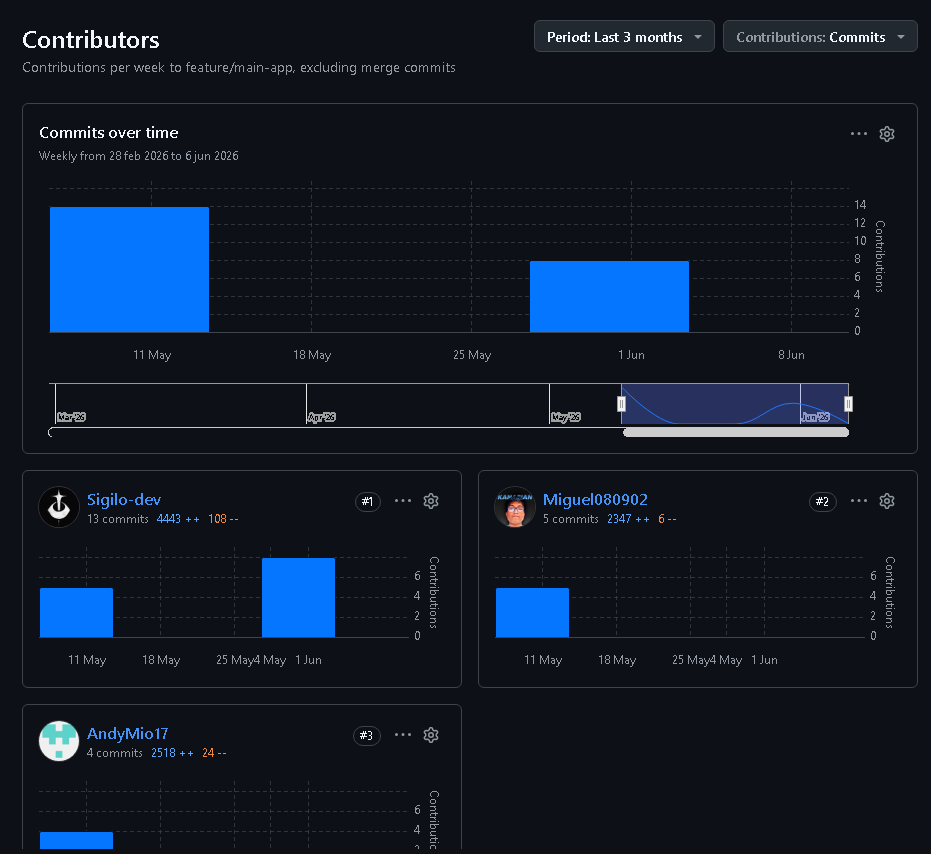

#### 5.3.2.8. Kanban Board

El tablero Kanban del Sprint 2 se gestiona en Notion (base de datos `sprint-2-backlog`), con las columnas **Por Hacer**, **En Curso** y **Hecho**. El tablero del Sprint 2 agrupa las **19 tarjetas del alcance del Sprint** —las 9 arrastradas del Sprint 1 (GIGU-22, GIGU-23, GIGU-24, GIGU-25, GIGU-26, GIGU-55, GIGU-56, GIGU-57, GIGU-59) y las 10 nuevas (GIGU-63 a GIGU-65 y GIGU-67 a GIGU-73)—, todas en estado **Hecho** al cierre:

| Estado | Cantidad | Tarjetas |
| --- | --- | --- |
| Hecho (Done) | 19 | 9 arrastradas (GIGU-22, 23, 24, 25, 26, 55, 56, 57, 59) + 10 nuevas (GIGU-63–65, GIGU-67–73) |
| En Curso (In-Process) | 0 | — |
| Por Hacer (To-do) | 0 | — |

Sumando las 45 tarjetas ya finalizadas durante el Sprint 1, las **64 tarjetas** del proyecto quedan en estado **Hecho** al cierre del Sprint 2.

Con el cierre del Sprint 2, todas las tarjetas derivadas de las iteraciones ADD y de la implementación de la solución quedan en estado **Hecho**: se completó la mensajería asíncrona de eventos de dominio (Google Cloud Pub/Sub), la comunicación en tiempo real (WebSocket + STOMP) y el webhook interno de notificaciones, además de la corrección del defecto del botón de solicitud del cliente.

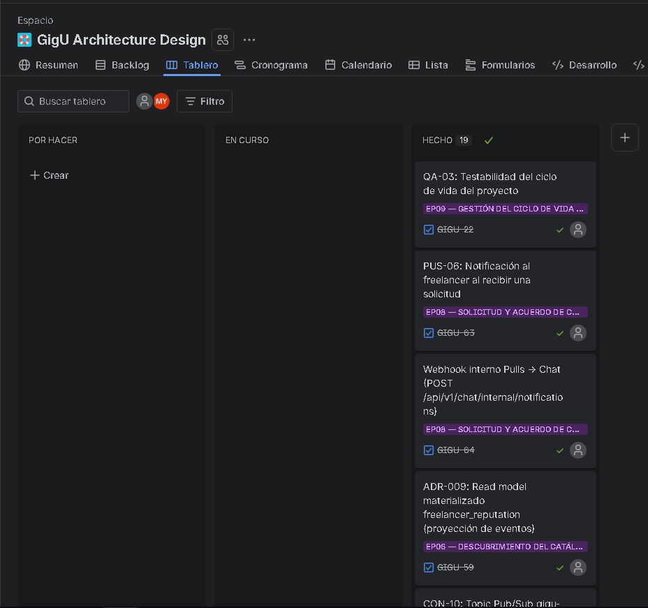

URL del tablero (Notion): https://www.notion.so/38aff0862f2c8003a48fe4e04ad6e4e0?v=38aff0862f2c814091b6000c19f27ab5

### 5.3.3. Sprint 3

#### 5.3.3.1. Sprint Backlog 3

El objetivo principal del Sprint 3 fue **endurecer técnicamente la solución GigU y completar el almacenamiento de imágenes**, una vez que la funcionalidad de cara al usuario había quedado cerrada en los Sprints 1 y 2. En concreto se implementó: (a) el **almacenamiento de imágenes** en **Supabase Storage** mediante un puerto/adaptador hexagonal (`StoragePort` + `SupabaseStorageAdapter`) para el portafolio del freelancer (bucket `portfolio`) y la media de los servicios del marketplace (bucket `gig-media`), con subida binaria real y persistencia de la URL pública en base de datos; (b) **resiliencia ante fallos de servicios externos** con **Resilience4j** (Circuit Breaker en `gig-marketplace-service` hacia Supabase Storage y en `pulls-service` hacia la notificación de Chat); (c) la **externalización de la configuración de Pub/Sub** a un archivo JSON alojado en Cloud Storage (`ExternalEdaConfigLoader`); (d) el **rediseño y pulido del frontend** (vista de mensajes, páginas de dashboard y perfil del freelancer, flujo de subida de media del gig) buscando fidelidad con el Figma; y (e) la **migración del tablero Kanban a Notion** (product backlog y sprints).

A diferencia de los Sprints 1 y 2, el Sprint 3 **no cierra al 100%**: dos work-items quedan en estado *En Curso* al cierre del Sprint —los **tests basados en contratos** entre microservicios (SP10) y la **optimización de velocidad del frontend** (SP13, lazy-loading/code-splitting/debounce)—, y su finalización se planifica para una iteración posterior.

**Board del Sprint 3 (Notion):** https://www.notion.so/38aff0862f2c806bb608c55f679d64f6?v=38aff0862f2c81f2a7d0000cdfffa458

El Sprint Backlog 3 está compuesto por **11 tarjetas nuevas** (GIGU-74 a GIGU-84); no hay tarjetas arrastradas, ya que el Sprint 2 cerró todos sus work-items.

| Sprint # | Sprint 3 | | | | | | |
| --- | --- | --- | --- | --- | --- | --- | --- |
| **User Story / Epic** | | **Work-Item / Task** | | | | | |
| **Id** | **Title** | **Id** | **Title** | **Description** | **Estimation (h)** | **Assigned To** | **Status** |
| EP05 | Publicación y Mantenimiento de Servicios | GIGU-74 | SP12: Storage de imágenes en Supabase (`StoragePort` + `SupabaseStorageAdapter`) | Puerto y adaptador hexagonal de almacenamiento; subida binaria a Supabase Storage y persistencia de la URL pública en BD. | 6 | Oblitas Davila, Mariano | Done |
| EP05 | Publicación y Mantenimiento de Servicios | GIGU-75 | US51: Soporte de media en el marketplace (subir, principal, eliminar) | Endpoints multipart `POST`/`DELETE` de media del servicio (hasta 5 imágenes, máx 5MB, imagen principal). | 5 | Oblitas Davila, Mariano | Done |
| EP04 | Portafolio y Evidencias del Freelancer | GIGU-76 | US52: Storage de imágenes del portafolio freelance (bucket `portfolio`) | Subida de imágenes de portafolio a Supabase Storage en `access-profile-service` y persistencia de metadatos. | 4 | Oblitas Davila, Mariano | Done |
| EP05 | Publicación y Mantenimiento de Servicios | GIGU-77 | SP09: Circuit Breaker (Resilience4j) en marketplace → Supabase Storage | `@CircuitBreaker` sobre `upload`/`delete` de storage con fallback; instancia `supabaseStorage` (50%, 15s). | 3 | Oblitas Davila, Mariano | Done |
| EP09 | Gestión del Ciclo de Vida del Proyecto | GIGU-78 | SP09: Circuit Breaker (Resilience4j) en pulls → chat (notification client) | `@CircuitBreaker` sobre la notificación best-effort hacia Chat con fallback; instancia `chatNotificationService` (50%, 10s). | 3 | Oblitas Davila, Mariano | Done |
| EP11 | Mensajería Coordinada Cliente-Freelancer | GIGU-79 | SP11: Externalización de config Pub/Sub (JSON en Cloud Storage) | `ExternalEdaConfigLoader` carga `gs://gigu-external-config/prod/eda-pubsub-config.json` (project, topics, subs, webhook, estrategia de credenciales) al arranque. | 5 | Oblitas Davila, Mariano | Done |
| EP06 | Descubrimiento del Catálogo | GIGU-80 | Frontend: rediseño de chat y páginas de dashboard/perfil (fidelidad Figma) | Rediseño de la vista de mensajes y páginas de dashboard y perfil del freelancer alineadas al Figma. | 6 | Mio Mejia, Andy | Done |
| EP05 | Publicación y Mantenimiento de Servicios | GIGU-81 | US51: Mejora del flujo de subida de media del gig (preview, principal, eliminar) | `GigMediaManager`: previsualización con blob URL, marcado de imagen principal y eliminación. | 4 | Mio Mejia, Andy | Done |
| EP06 | Descubrimiento del Catálogo | GIGU-82 | Migración y actualización del Kanban a Notion (product backlog + sprints) | Migración de los tableros de Jira a Notion (`product-backlog`, `sprint-1`, `sprint-2`) y actualización de enlaces en el informe. | 4 | Ybañez Esquerre, Miguel | Done |
| EP06 | Descubrimiento del Catálogo | GIGU-83 | SP13: Optimización de velocidad del frontend (lazy-loading, code-splitting, debounce) | Lazy-loading de rutas, code-splitting (`manualChunks`), `loading="lazy"` en imágenes y debounce en búsqueda; pendiente de implementar. | 4 | Mio Mejia, Andy | In-Process |
| EP08 | Solicitud y Acuerdo de Contratación | GIGU-84 | SP10: Tests basados en contratos entre microservicios (Spring Cloud Contract) | Contratos consumidor/productor entre microservicios; aún no implementado en el repositorio. | 5 | Ybañez Esquerre, Miguel | In-Process |

#### 5.3.3.2. Development Evidence for Sprint Review

Durante el Sprint 3 el trabajo se concentró en `gig-marketplace-service` y `access-profile-service` (almacenamiento de imágenes en Supabase Storage y circuit breaker sobre el storage), en `pulls-service` (circuit breaker sobre la notificación a Chat), en `chat-notification-service` (carga de la configuración EDA/Pub/Sub desde Cloud Storage) y en el `frontend` (rediseño de la vista de chat, páginas de dashboard/perfil y mejora del flujo de subida de media del gig).

| Repository | Branch | Commit Id | Commit Message | Commit Message Body | Committed on |
| --- | --- | --- | --- | --- | --- |
| 1ASI0657-2610-7940-Final-Project/backend-microservices | feature/main-app-logic | bed24da | feat(marketplace): add Supabase storage media support | Soporte de media en el marketplace con almacenamiento en Supabase Storage. | 18/06/2026 |
| 1ASI0657-2610-7940-Final-Project/backend-microservices | feature/main-app-logic | 0003c54 | fix(marketplace): correct Supabase storage upload request | Corrección de la petición de subida a Supabase Storage. | 18/06/2026 |
| 1ASI0657-2610-7940-Final-Project/backend-microservices | feature/main-app-logic | 6a199a1 | fix(marketplace): wire Supabase storage adapter constructor | Cableado del constructor del adaptador de Supabase Storage. | 18/06/2026 |
| 1ASI0657-2610-7940-Final-Project/backend-microservices | feature/main-app-logic | 1cfa93d | feat(marketplace): add circuit breaker for storage uploads | Circuit Breaker (Resilience4j) sobre las subidas a storage. | 18/06/2026 |
| 1ASI0657-2610-7940-Final-Project/backend-microservices | feature/main-app-logic | 0cde3a6 | feat(pulls): add circuit breaker for notification client | Circuit Breaker sobre el cliente de notificaciones hacia Chat. | 18/06/2026 |
| 1ASI0657-2610-7940-Final-Project/backend-microservices | feature/main-app-logic | 64bbe47 | feat(chat): load EDA config from Cloud Storage | Carga de la configuración EDA/Pub/Sub desde Cloud Storage (JSON). | 18/06/2026 |
| 1ASI0657-2610-7940-Final-Project/backend-microservices | feature/main-app-logic | 7dd2f87 | fix(chat): resolve real participant display names | Resolución de los nombres reales de los participantes de la conversación. | 20/06/2026 |
| 1ASI0657-2610-7940-Final-Project/backend-microservices | feature/main-app-logic | 38e5792 | merge: feature/chat-notification-service into feature/main-app-logic | Integración del Sprint 3 a la rama de despliegue. | 20/06/2026 |
| 1ASI0657-2610-7940-Final-Project/frontend | feature/main-app | 5e6a379 | feat(marketplace): improve gig media upload flow | Mejora del flujo de subida de media del gig (preview, principal, eliminar). | 18/06/2026 |
| 1ASI0657-2610-7940-Final-Project/frontend | feature/main-app | d87b8c9 | feat(ui): implement messages chat redesign and freelancer profile dashboard pages | Rediseño de la vista de mensajes y páginas de dashboard/perfil del freelancer. | 19/06/2026 |
| 1ASI0657-2610-7940-Final-Project/frontend | feature/main-app | be02deb | fix(chat): make thread viewport responsive and sticky-bottom | Viewport del hilo de chat responsive y anclado al fondo. | 19/06/2026 |
| 1ASI0657-2610-7940-Final-Project/frontend | feature/main-app | 5f527f9 | fix(build): sync npm lockfile for Vercel | Sincronización del lockfile de npm para el build de Vercel. | 19/06/2026 |
| 1ASI0657-2610-7940-Final-Project/frontend | feature/main-app | 364c838 | fix(chat): select conversation counterpart display name | Selección del nombre de la contraparte en la conversación. | 20/06/2026 |

#### 5.3.3.3. Testing Suite Evidence for Sprint Review

Durante el Sprint 3, el aseguramiento de calidad se apoyó en las suites de pruebas existentes de los microservicios (unitarias e integración con Testcontainers) ampliadas en los Sprints 1 y 2, complementadas con la validación manual de los nuevos flujos de subida de imágenes. La introducción de **pruebas basadas en contratos** (`SP10`, *Spring Cloud Contract*) entre microservicios quedó **planificada pero no implementada** en el repositorio al cierre del Sprint, por lo que la tarjeta `GIGU-84` permanece en estado *En Curso*.

| Archivo de prueba | Tipo | Descripción | User Stories relacionados |
| --- | --- | --- | --- |
| `MarketplaceApplicationServiceTest` | Unit Test (JUnit 5 + Mockito) | Verifica las reglas de publicación y de gestión de media del servicio (límite de 5 imágenes, tipos permitidos, imagen principal), invocando el `StoragePort` mockeado. | US51, US24 |
| `AccessProfileApplicationServiceTest` | Unit Test (JUnit 5 + Mockito) | Verifica la carga de imágenes de portafolio y la persistencia de metadatos sobre el `StoragePort` mockeado. | US52, US18 |
| _Contract tests (Spring Cloud Contract)_ | _Planificado_ | Contratos consumidor/productor entre microservicios; **no implementado** al cierre del Sprint 3. | SP10 |

> Nota: las pruebas basadas en contratos (`SP10`) son el trabajo pendiente más relevante del Sprint 3; su tarjeta queda explícitamente *En Curso* para no sobre-reportar el avance.

#### 5.3.3.4. Execution Evidence for Sprint Review

En el Sprint 3 se puso en funcionamiento el **almacenamiento de imágenes de extremo a extremo**: el freelancer sube imágenes a su servicio o a su portafolio desde el frontend, el backend las almacena en **Supabase Storage** (subida binaria) y persiste la **URL pública** en base de datos, y las imágenes se muestran en el catálogo y en el detalle del servicio. La resiliencia se valida observando que, ante un fallo del storage o de la notificación, el **Circuit Breaker** abre el circuito y aplica el `fallback` sin tumbar la operación principal.

**Subida de media del servicio (`GigMediaManager`)** — previsualización, marcado de imagen principal y eliminación (hasta 5 imágenes; JPEG/PNG/WebP):

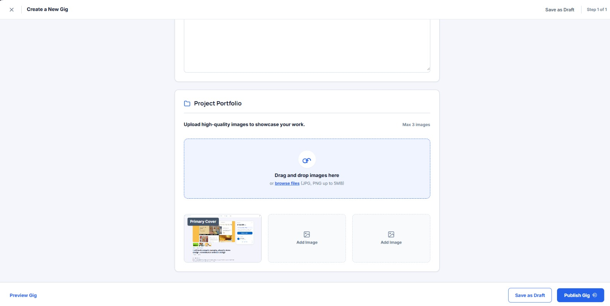

**Imágenes del servicio en el catálogo y detalle** (servidas desde Supabase Storage vía URL pública):

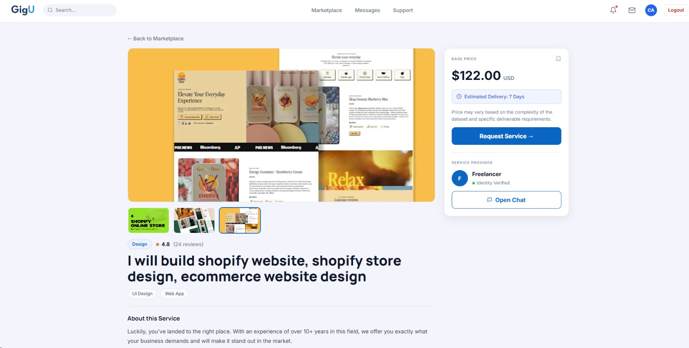

**Subida de imágenes de evidencia al portafolio del freelancer** (bucket `portfolio`):


Las imágenes se almacenan bajo rutas determinísticas (`services/{serviceId}/{uuid}-{archivo}` y `freelancers/{userId}/{uuid}-{archivo}`) y se sirven mediante la URL pública `{SUPABASE_URL}/storage/v1/object/public/{bucket}/{objectPath}`.

#### 5.3.3.5. Microservices Documentation Evidence for Sprint Review

Durante el Sprint 3 se documentaron en `gig-marketplace-service` y `access-profile-service` los nuevos endpoints de gestión de imágenes (multipart), que se mantienen en Swagger UI (`/swagger-ui/index.html`) de cada despliegue en Google Cloud Run.

**GigMarketplaceService** — endpoints de media del servicio:

| Endpoint | Verbo HTTP | Acción |
| --- | --- | --- |
| `/api/v1/marketplace/services/{id}/media` | POST | Subir una imagen del servicio (multipart; `file`, `primary`). Máx. 5 imágenes, 5MB, tipos `jpeg`/`png`/`webp`. |
| `/api/v1/marketplace/services/{id}/media/{mediaId}` | DELETE | Eliminar una imagen del servicio y su objeto en Supabase Storage. |

**AccessProfileService** — endpoint de media del portafolio:

| Endpoint | Verbo HTTP | Acción |
| --- | --- | --- |
| `/api/v1/access/freelancer-profiles/me/portfolio-items` | POST | Subir un ítem de portafolio con imagen (multipart; `title`, `description`, `file`). Tipos `jpeg`/`png`. |

Ejemplo de uso — `POST /api/v1/marketplace/services/{id}/media` (multipart/form-data):
```text
file=<binary image/png|jpeg|webp>
primary=true
```
La respuesta incluye el `mediaId` y la `publicUrl` del objeto almacenado en Supabase Storage; los metadatos (`bucket`, `objectPath`, `contentType`, `sizeBytes`, `primary`, `sortOrder`) quedan persistidos en `marketplace_schema.service_media`.

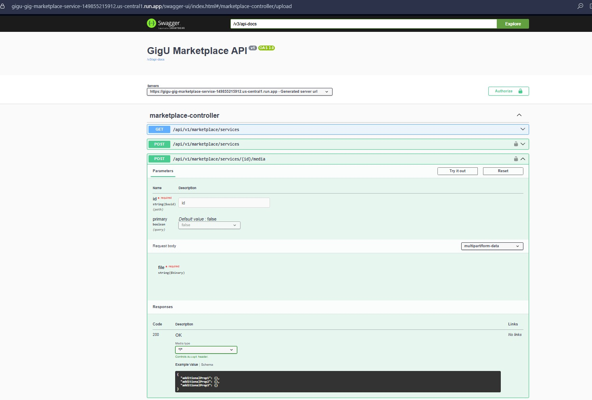

#### 5.3.3.6. Software Deployment Evidence for Sprint Review

Durante el Sprint 3 se redesplegaron en Google Cloud Run los microservicios afectados (`gigu-gig-marketplace-service`, `gigu-access-profile-service`, `gigu-pulls-service` y `gigu-chat-notification-service`), se configuraron los buckets de **Supabase Storage** (`portfolio` y `gig-media`) y se externalizó la configuración de Pub/Sub a un objeto JSON en **Google Cloud Storage** (`gs://gigu-external-config/prod/eda-pubsub-config.json`), cargado al arranque por `ExternalEdaConfigLoader`.

**Configuración de almacenamiento (Supabase Storage):** buckets `portfolio` (portafolio del freelancer) y `gig-media` (media de los servicios), con credenciales `SUPABASE_URL` y `SUPABASE_SERVICE_ROLE_KEY` provistas como variables de entorno en Cloud Run.

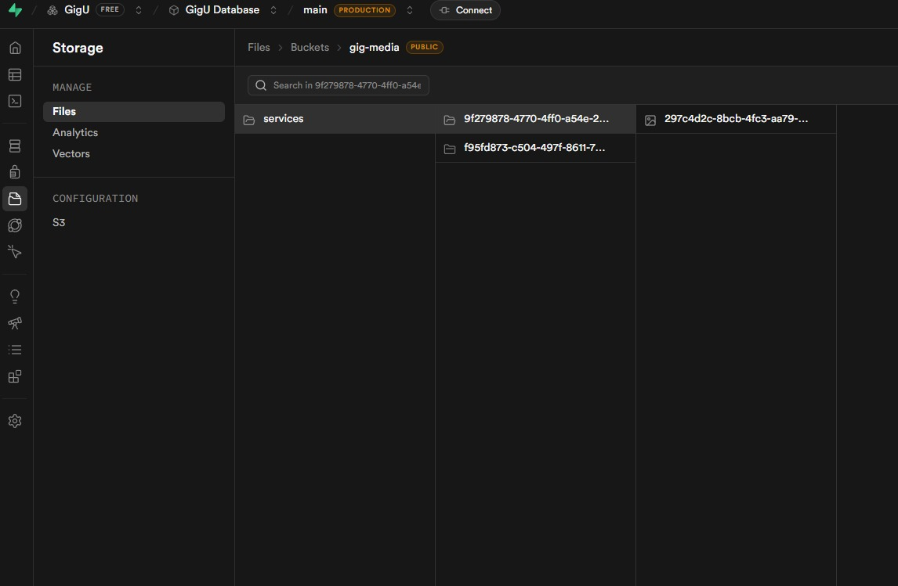

**Externalización de la configuración de Pub/Sub:** el objeto `eda-pubsub-config.json` (project, topic `gigu-chat-events`, suscripción `gigu-chat-events-push-chat`, webhook y `credentialsStrategy: cloud-run-service-account`) se aloja en el bucket `gigu-external-config` de Google Cloud Storage y se carga al arranque. El log de Cloud Run de `gigu-chat-notification-service` confirma la carga: `c.g.c.i.eda.ExternalEdaConfigLoader : Loaded external EDA config from gs://gigu-external-config/prod/eda-pubsub-config.json`:

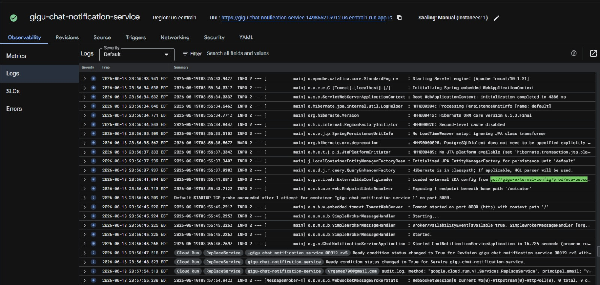

Commits relacionados con el despliegue del Sprint 3: `64bbe47` (carga de la config EDA desde Cloud Storage), `1cfa93d` y `0cde3a6` (circuit breakers) y `bed24da` (soporte de media en Supabase Storage) en `backend-microservices`; `5f527f9` (sincronización del lockfile para el build de Vercel) en `frontend`.

#### 5.3.3.7. Team Collaboration Insights during Sprint

El trabajo del Sprint 3 se distribuyó entre los tres integrantes del equipo. El almacenamiento de imágenes, la resiliencia (Circuit Breaker) y la externalización de la configuración de Pub/Sub se concentraron en el backend; el rediseño y pulido del frontend (fidelidad con el Figma) y la mejora del flujo de subida de media; y la migración del tablero Kanban a Notion.

| Integrante | Usuario GitHub | Principales aportes en el Sprint 3 |
| --- | --- | --- |
| Oblitas Davila, Mariano Moises | `Sigilo-dev` / `vr700` | Almacenamiento de imágenes en Supabase Storage (`StoragePort`/`SupabaseStorageAdapter`) para portafolio y marketplace, Circuit Breaker (Resilience4j) en marketplace y pulls, y externalización de la configuración de Pub/Sub a un JSON en Cloud Storage. |
| Mio Mejia, Andy Alejandro | `AndyMio17` / `AndyMio` | Rediseño de la vista de mensajes y de las páginas de dashboard/perfil del freelancer (fidelidad con el Figma) y mejora del flujo de subida de media del gig. |
| Ybañez Esquerre, Miguel Angel | `Miguel080902` | Migración y actualización del tablero Kanban a Notion (product backlog y sprints). Los tests basados en contratos (`SP10`) quedan a su cargo, **en curso** al cierre del Sprint. |

**Análisis de colaboración y commits de GitHub (Sprint 3).** Las estadísticas de contribución de GitHub (*Insights → Contributors*, rama principal de cada repositorio, ventana del Sprint 3 — 18 al 20 de junio de 2026, excluyendo merge commits) son las siguientes:

| Repositorio | Rama | Contribuidor (GitHub) | Commits |
| --- | --- | --- | --- |
| backend-microservices | `feature/main-app-logic` | `vr700` / `Sigilo-dev` (Oblitas Davila, Mariano) | 11 |
| frontend | `feature/main-app` | `vr700` / `Sigilo-dev` (Oblitas Davila, Mariano) | 8 |
| frontend | `feature/main-app` | `AndyMio` (Mio Mejia, Andy) | 1 |

Durante el Sprint 3, la implementación del backend (storage, resiliencia y configuración externalizada) se integró principalmente a través de la cuenta `vr700`/`Sigilo-dev`, mientras que el rediseño del frontend y la migración del Kanban a Notion se realizaron de forma colaborativa por el equipo. La verificación funcional de la subida de imágenes y del comportamiento del Circuit Breaker se realizó sobre los despliegues en Google Cloud Run.

#### 5.3.3.8. Kanban Board

El tablero Kanban del Sprint 3 se gestiona en Notion (base de datos `sprint-3-backlog`), con las columnas **Por Hacer**, **En Curso** y **Hecho**. El tablero del Sprint 3 agrupa las **11 tarjetas nuevas del alcance del Sprint** (GIGU-74 a GIGU-84); a diferencia de los Sprints 1 y 2, **no cierra al 100%**: dos tarjetas quedan en estado *En Curso* al cierre.

| Estado | Cantidad | Tarjetas |
| --- | --- | --- |
| Hecho (Done) | 9 | GIGU-74, GIGU-75, GIGU-76, GIGU-77, GIGU-78, GIGU-79, GIGU-80, GIGU-81, GIGU-82 |
| En Curso (In-Process) | 2 | GIGU-83 (optimización de velocidad del frontend), GIGU-84 (tests basados en contratos) |
| Por Hacer (To-do) | 0 | — |

Sumando las 64 tarjetas finalizadas en los Sprints 1 y 2, el proyecto acumula **73 tarjetas en estado *Hecho*** al cierre del Sprint 3, con 2 tarjetas en curso (`GIGU-83` y `GIGU-84`) planificadas para una iteración posterior.

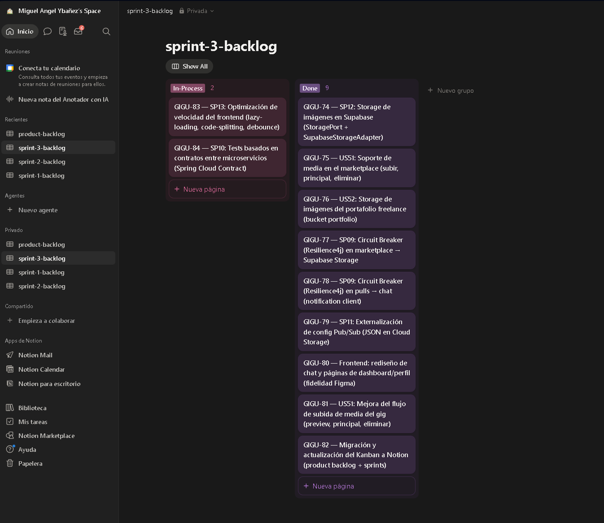

URL del tablero (Notion): https://www.notion.so/38aff0862f2c806bb608c55f679d64f6?v=38aff0862f2c81f2a7d0000cdfffa458

## 5.4. Microservices Deployment

### 5.4.1. Cloud Architecture Diagram

La arquitectura cloud actual de GigU distribuye la aplicación en servicios administrados para reducir carga operativa y permitir despliegues independientes. Vercel aloja la landing page y la aplicación frontend. Vercel Rewrites funciona como capa pública de routing para reenviar solicitudes `/api/*` hacia los microservicios backend desplegados en Google Cloud Run. Supabase PostgreSQL se utiliza como base de datos relacional administrada.

```text
Usuario
  |
  | HTTPS
  v
Vercel
  |-- Landing Page
  |-- Frontend Web App
  |
  | /api/* mediante Vercel Rewrites
  v
Google Cloud Run
  |-- gigu-access-profile-service
  |-- gigu-gig-marketplace-service
  |-- gigu-pulls-service
  |-- gigu-chat-notification-service
  |
  v
Supabase PostgreSQL

Capacidades pendientes:
  |-- Google Cloud Pub/Sub para mensajería asíncrona
  |-- Storage para binarios de portafolio, imágenes y adjuntos

  | Elemento               | Tecnología           | Estado                      |
| ---------------------- | -------------------- | --------------------------- |
| Landing page           | Vercel               | Implementado                |
| Frontend web app       | Vercel               | Implementado                |
| API routing            | Vercel Rewrites      | Implementado                |
| Backend microservices  | Google Cloud Run     | Implementado                |
| Database               | Supabase PostgreSQL  | Implementado                |
| Asynchronous messaging | Google Cloud Pub/Sub | Pendiente de implementación |
| Storage                | Por definir          | Pendiente de implementación |

```

### 5.4.2. Cloud Architecture Deployment

El despliegue backend se realiza sobre Google Cloud Run mediante workflows manuales de GitHub Actions, uno por microservicio. Esta configuración permite desplegar un servicio sin afectar a los demás, lo cual reduce riesgo operacional y mejora la mantenibilidad del sistema durante la validación académica.

| Microservicio | Ruta de código fuente | Workflow de despliegue | Servicio Cloud Run | URL |
| --- | --- | --- | --- | --- |
| AccessProfileService | `services/access-profile-service` | `deploy-access-profile-service.yml` | `gigu-access-profile-service` | `https://gigu-access-profile-service-149855215912.us-central1.run.app` |
| GigMarketplaceService | `services/gig-marketplace-service` | `deploy-gig-marketplace-service.yml` | `gigu-gig-marketplace-service` | `https://gigu-gig-marketplace-service-149855215912.us-central1.run.app` |
| PullEngagementService | `services/pulls-service` | `deploy-pulls-service.yml` | `gigu-pulls-service` | `https://gigu-pulls-service-149855215912.us-central1.run.app` |
| ChatNotificationService | `services/chat-notification-service` | `deploy-chat-notification-service.yml` | `gigu-chat-notification-service` | `https://gigu-chat-notification-service-149855215912.us-central1.run.app` |

El procedimiento de despliegue desde GitHub Actions es manual:

1. Ingresar al repositorio `backend-microservices`.
2. Abrir la pestaña **Actions**.
3. Seleccionar el workflow del microservicio a desplegar.
4. Ejecutar **Run workflow**.
5. Seleccionar la rama `feature/main-app-logic`.
6. Confirmar la ejecución.
7. Verificar al final del job la URL real impresa por `gcloud run services describe`.

Los workflows actuales no realizan despliegue automático ante cada `push`. El despliegue es intencionalmente manual mediante `workflow_dispatch`, lo que permite controlar cuándo se publica cada microservicio.

Como alternativa local, el equipo mantiene scripts PowerShell en la carpeta `gcloud`. El orden recomendado de despliegue local es:

1. `./gcloud/deploy-access-profile-service.ps1`
2. `./gcloud/deploy-gig-marketplace-service.ps1`
3. `./gcloud/deploy-chat-notification-service.ps1`
4. Actualizar `_local-gcloud-config/pulls-service.env.yaml` con las URLs reales de Cloud Run.
5. `./gcloud/deploy-pulls-service.ps1`

También puede utilizarse:
./gcloud/deploy-all.ps1

<div style="page-break-before: always;"></div>

# Conclusiones y recomendaciones

**Resultados frente a los Problem Statements.** El problema central identificado fue la ausencia de plataformas efectivas y especializadas que conecten a estudiantes universitarios peruanos con oportunidades laborales formales, flexibles y alineadas a sus carreras. Al cierre de este avance, GigU cuenta con el backbone funcional que ataca directamente ese problema: cuatro microservicios REST desplegados en producción que soportan los procesos core del negocio —acceso y perfiles freelance verificables, publicación y búsqueda de servicios, contratación y gestión de proyectos, y mensajería con notificaciones—, además de procesos de soporte como tickets de ayuda, reportes de usuarios y sugerencia inteligente de precios. La solución ya es accesible públicamente a través de la landing page y la aplicación frontend, lo que constituye una base concreta sobre la cual validar la propuesta de valor con usuarios reales. Con el Sprint 2, además, la solución incorpora **notificaciones y chat en tiempo real** mediante Google Cloud Pub/Sub (entrega push por webhook), WebSocket + STOMP y un webhook interno entre microservicios, completando la mensajería asíncrona que en el avance anterior solo estaba modelada y reforzando la experiencia de comunicación entre cliente y freelancer.

**Assumptions frente al comportamiento real de los segmentos.** Los assumptions del proceso Lean UX —que el usuario es el estudiante universitario que busca ingresos y experiencia compatibles con sus horarios, y que valora perfiles con historial académico y de proyectos, oportunidades verificadas y un sistema de reputación— guiaron el modelado del dominio y la priorización del Product Backlog. Estos assumptions se reflejan hoy en capacidades implementadas (perfil freelance con portafolio, calificaciones y reseñas por proyecto, chat seguro). Sin embargo, al tratarse de un avance académico sin tráfico real, el contraste de estos assumptos contra el comportamiento efectivo de los segmentos aún no puede realizarse y queda como trabajo de validación posterior al despliegue abierto.

**Hypothesis Statements y criterios de éxito.** Las tres hipótesis Lean UX establecieron criterios de éxito medibles: más del 50% de usuarios activos completando una tarea remunerada en su primer mes, un tiempo de uso semanal superior a 45 minutos, y al menos un 70% de usuarios calificando como alta la relevancia de las recomendaciones. Estos criterios aún no son medibles porque dependen de la operación con usuarios reales; lo alcanzado en este avance es la **condición habilitante** para medirlos: los flujos de contratación, gamificación incipiente (reputación y reseñas) y recomendación de precios ya están desplegados. La instrumentación de métricas (analítica de uso, embudos de conversión, encuestas de relevancia) queda como paso siguiente para poder confirmar o refutar las hipótesis.

**Recomendaciones y siguientes pasos del Roadmap.**

- **Completar la cobertura de pruebas:** implementar los archivos `.feature` de BDD en Gherkin y las suites de prueba de `gig-marketplace-service`, `pulls-service` y `chat-notification-service`, alcanzando el umbral de cobertura del 85% en los cuatro microservicios.
- **Extender la mensajería asíncrona:** sobre la base de Google Cloud Pub/Sub ya desplegada en el Sprint 2 para notificaciones y eventos de chat (entrega push por webhook, WebSocket + STOMP), ampliar la publicación de eventos de dominio hacia las proyecciones de reputación y otros consumidores.
- **Resolver el almacenamiento de binarios:** consolidar el adaptador de Supabase Storage para portafolios, imágenes de servicios y adjuntos en todos los microservicios que lo requieran.
- **Extraer la librería compartida `gigu-platform-commons:`** centralizar los componentes transversales (jerarquía de excepciones, `RestExceptionHandler`, `OpenApiConfig`, seguridad JWT) para reducir duplicación.
- **Instrumentar métricas de producto:** incorporar analítica de uso y embudos de conversión para poder evaluar los criterios de éxito de las hipótesis Lean UX.
- **Evolucionar las capacidades diferenciales:** avanzar hacia el emparejamiento inteligente tarea-habilidad, los badges de gamificación y la integración con LinkedIn/portafolios, que constituyen el siguiente bloque de valor del Product Backlog.
- **Automatizar el despliegue:** evolucionar los workflows manuales de GitHub Actions hacia un pipeline CI/CD con despliegue automático y validación previa por pruebas.

<div style="page-break-before: always;"></div>

# Video About-The-Team

<div style="page-break-before: always;"></div>

# Referencias bibliográficas

Banco Mundial. (2023). [*Working without borders: The promise and peril of online gig work*](https://openknowledge.worldbank.org/entities/publication/ebc4a7e2-85c6-467b-8713-e2d77e954c6c). World Bank.

Banco Mundial. (2024). [*Four ways local online gig platforms connect young people to jobs*](https://blogs.worldbank.org/en/jobs/four-ways-local-online-gig-platforms-connect-young-people-jobs). World Bank Blogs.

GigU. (2026). [*Documentación del proyecto GigU*](https://github.com/1ASI0657-2610-7940-Final-Project/docs). GitHub.

GitHub. (s. f.). [*GitHub Actions documentation*](https://docs.github.com/en/actions). GitHub Docs.

Google Cloud. (s. f.-a). [*Cloud Run documentation*](https://cloud.google.com/run/docs). Google Cloud Documentation.

Google Cloud. (s. f.-b). [*Deploy services from source code*](https://cloud.google.com/run/docs/deploying-source-code). Google Cloud Documentation.

Google Cloud. (s. f.-c). [*What is Pub/Sub?*](https://cloud.google.com/pubsub/docs/overview). Google Cloud Documentation.

Google GitHub Actions. (s. f.-a). [*Authenticate to Google Cloud*](https://github.com/google-github-actions/auth). GitHub.

Google GitHub Actions. (s. f.-b). [*Set up gcloud Cloud SDK environment*](https://github.com/google-github-actions/setup-gcloud). GitHub.

Instituto Nacional de Estadística e Informática. (2025a). [*Perú: Comportamiento de los indicadores del mercado laboral a nivel nacional y en 27 ciudades. Primer trimestre 2025*](https://www.inei.gob.pe/media/MenuRecursivo/boletines/informe-tecnico_empleonacional_1.pdf). INEI.

Instituto Nacional de Estadística e Informática. (2025b). [*Perú: Comportamiento de los indicadores del mercado laboral a nivel nacional y en 27 ciudades. Segundo trimestre 2025*](https://m.inei.gob.pe/media/MenuRecursivo/boletines/informe-tecnico_empleonacional_2.pdf). INEI.

Lewis, J., & Fowler, M. (2014). [*Microservices: A definition of this new architectural term*](https://martinfowler.com/articles/microservices.html). Martin Fowler.

Ministerio de Educación del Perú. (2021). [*Encuesta Nacional de Estudiantes de Educación Superior Universitaria 2019: principales resultados*](https://repositorio.minedu.gob.pe/handle/20.500.12799/7745). MINEDU.

Ministerio de Educación del Perú. (2023). [*La universidad en cifras*](https://repositorio.minedu.gob.pe/bitstream/handle/20.500.12799/9077/La%20Universidad%20en%20Cifras.pdf). MINEDU.

Ministerio de Educación del Perú. (2024). [*Reporte nacional de seguimiento al Proyecto Educativo Nacional: Análisis de indicadores al 2023*](https://repositorio.minedu.gob.pe/bitstream/handle/20.500.12799/10653/Reporte%20nacional%20de%20seguimiento%20al%20Proyecto%20Educativo%20Nacional%20an%C3%A1lisis%20de%20indicadores%20al%202023.pdf). MINEDU.

OpenAPI Initiative. (s. f.). [*OpenAPI Specification*](https://swagger.io/specification/). Swagger.

Organización Internacional del Trabajo. (2021). [*World Employment and Social Outlook 2021: The role of digital labour platforms in transforming the world of work*](https://www.ilo.org/publications/flagship-reports/role-digital-labour-platforms-transforming-world-work). OIT.

Organización Internacional del Trabajo. (2025). [*Jóvenes en el mercado laboral: entre la informalidad y la falta de oportunidades*](https://www.ilo.org/es/resource/news/jovenes-entre-informalidad-y-falta-de-oportunidades). OIT.

Spring. (s. f.-a). [*Production-ready features*](https://docs.spring.io/spring-boot/reference/actuator/index.html). Spring Boot.

Spring. (s. f.-b). [*Spring Security reference*](https://docs.spring.io/spring-security/reference/index.html). Spring.

Spring. (s. f.-c). [*Testcontainers support in Spring Boot*](https://docs.spring.io/spring-boot/reference/testing/testcontainers.html). Spring Boot.

Supabase. (s. f.-a). [*The Postgres development platform*](https://supabase.com/). Supabase.

Supabase. (s. f.-b). [*Pricing & Fees*](https://supabase.com/pricing). Supabase.

Supabase. (s. f.-c). [*About billing on Supabase*](https://supabase.com/docs/guides/platform/billing-on-supabase). Supabase.

Universidad Peruana de Ciencias Aplicadas. (2025a). *Attribute-Driven Design: SI657 Fundamentos de Arquitectura de Software*. Material del curso.

Universidad Peruana de Ciencias Aplicadas. (2025b). *Final Project Statement: Fundamentos de Arquitectura de Software*. Material del curso.

Vercel. (s. f.-a). [*Rewrites on Vercel*](https://vercel.com/docs/routing/rewrites). Vercel Documentation.

Vercel. (s. f.-b). [*Vercel Hobby Plan*](https://vercel.com/docs/plans/hobby). Vercel Documentation.

# Anexos

<div style="page-break-before: always;"></div>

# Links

**Repositorios GitHub**

- Backend de microservicios: https://github.com/1ASI0657-2610-7940-Final-Project/backend-microservices
- Frontend Web App: https://github.com/1ASI0657-2610-7940-Final-Project/frontend
- Landing Page: https://github.com/1ASI0657-2610-7940-Final-Project/landing-page

**Despliegues en producción**

- Landing Page (Vercel): https://landing-page-nine-beryl-19.vercel.app/
- Frontend Web App (Vercel): https://gigu-ivory.vercel.app/
- AccessProfileService (Swagger UI): https://gigu-access-profile-service-149855215912.us-central1.run.app/swagger-ui/index.html
- GigMarketplaceService (Swagger UI): https://gigu-gig-marketplace-service-149855215912.us-central1.run.app/swagger-ui/index.html
- PullEngagementService (Swagger UI): https://gigu-pulls-service-149855215912.us-central1.run.app/swagger-ui/index.html
- ChatNotificationService (Swagger UI): https://gigu-chat-notification-service-149855215912.us-central1.run.app/swagger-ui/index.html
